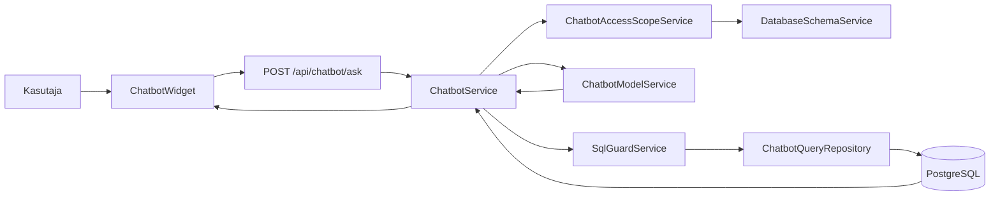
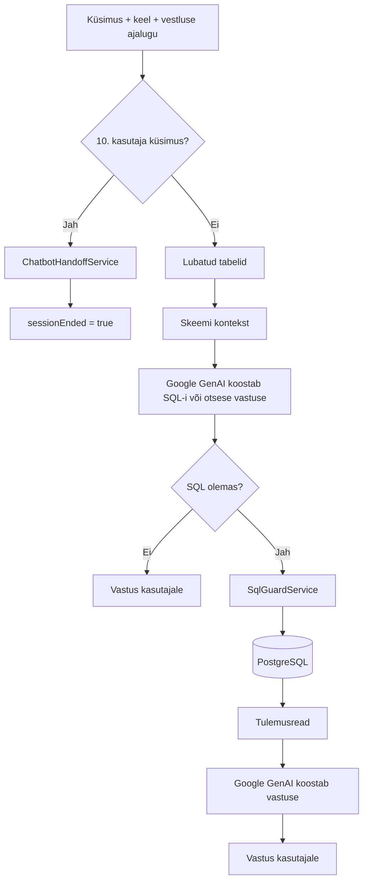

```markdown
# BCS Koolitused chatbot

Spring Boot · Java 21 · PostgreSQL · Spring AI Google GenAI · Vue 3

BCS Koolituste chatbot vastab kasutajale loomulikus keeles. Vajaduse korral koostab mudel BCS Koolituste andmete leidmiseks SQL-päringu, mille backend enne käivitamist kontrollib. Andmebaasist saadud ridade põhjal koostab mudel kasutajale lõpliku vastuse.

Vastuse keel määratakse rakenduse aktiivse keele järgi: toetatud on `et` ja `en`.

| Osa | Lahendus |
|---|---|
| Keelemudel | Spring AI `ChatClient` Google GenAI teenusega |
| Mudel | `gemini-3.1-flash-lite` |
| Andmebaas | PostgreSQL, skeem `bcs_koolitused` |
| Frontend | Vue 3 vestluskomponent |
| Vestluse ajalugu | frontendist backendile saadetav `user` / `assistant` sõnumite ajalugu |
| SQL ligipääs | `ChatbotAccessScopeService` + `DatabaseSchemaService` + `SqlGuardService` + `ChatbotQueryRepository` |
| Sessiooni piir | 10 kasutaja küsimust |
| Üleandmine teenindajale | tehniline alus olemas, kasutuselevõtt vajab veel seadistamist — vt [TODO](#todo) |

## Seadistus

Google GenAI API võti tuleb anda backendile keskkonnamuutujana:

```text
GEMINI_API_KEY
```

Windows PowerShellis:

```powershell
$env:GEMINI_API_KEY="SINU_API_KEY"
```

API võtit ei salvestata Git-repositooriumisse.

Andmebaas:

```text
andmebaas: vali_it
skeem:    bcs_koolitused
```

Backend:

```powershell
cd backend
.\gradlew.bat bootRun
```

Frontend töötab arenduskeskkonnas aadressil:

```text
http://localhost:8081
```

## Arhitektuur



## Töövoog



Chatbot ei pea iga küsimuse jaoks andmebaasi kasutama. Tervitustele ja muudele küsimustele võib mudel vastata ilma SQL-päringuta.

## SQL turvareeglid

| Reegel | Rakendus |
|---|---|
| Päringu tüüp | ainult `SELECT` või `WITH ... SELECT` |
| Skeem | ainult `bcs_koolitused` |
| Tabelid | ainult `ChatbotAccessScopeService` poolt lubatud tabelid |
| Süsteemiobjektid | `information_schema` ja `pg_catalog` keelatud |
| Kirjutavad käsud | `INSERT`, `UPDATE`, `DELETE`, `DROP`, `ALTER` jne keelatud |
| Kommentaarid / mitu käsku | keelatud |
| Lukustavad SELECT-id | keelatud |
| Tulemiridade piir | maksimaalselt 100 |
| SQL timeout | 5 sekundit |
| Käivitamine | ainult backendi `ChatbotQueryRepository` kaudu |

Praegu kasutab rakendus sama PostgreSQL kasutajat nagu ülejäänud backend. Eraldi ainult `SELECT` õigustega andmebaasikasutaja on soovitatav täiendav kaitse — vt [TODO](#todo).

Chatboti runtime-juhised:

- [AGENT.md](../backend/src/main/resources/chatbot/AGENT.md)
- [SKILL.md](../backend/src/main/resources/chatbot/SKILL.md)

## API

### `POST /api/chatbot/ask`

Näidispäring:

```json
{
  "question": "Millal toimub järgmine Java koolitus?",
  "language": "et",
  "previousMessages": [
    {
      "role": "user",
      "text": "Soovin Java koolitust."
    },
    {
      "role": "assistant",
      "text": "Kas sul on ajavahemiku eelistus?"
    }
  ]
}
```

Reeglid:

- `question` on kohustuslik ja kuni 500 tähemärki;
- `language` peab olema `et` või `en`;
- `previousMessages` on valikuline;
- ajaloo roll võib olla ainult `user` või `assistant`;
- ühe ajaloo sõnumi pikkus võib olla kuni 4000 tähemärki.

Tavaline vastus:

```json
{
  "answer": "...",
  "sessionEnded": false
}
```

Sessiooni lõpetamisel:

```json
{
  "answer": "...",
  "sessionEnded": true
}
```

## Sessiooni piir ja üleandmine

`ChatbotService` loendab `previousMessages` hulgas kasutaja (`user`) sõnumeid.

Kui saabub sessiooni 10. kasutaja küsimus:

1. tavapärast AI/SQL töövoogu enam ei käivitata;
2. kutsutakse `ChatbotHandoffService`;
3. frontend saab vastuse `sessionEnded: true`;
4. frontend saab seejärel alustada uut vestlusseanssi.

Üleandmise e-posti osa ei ole veel kasutuselevõtuks valmis — vt [TODO](#todo).

## Rollid ja andmeulatus

`ChatbotAccessScopeService` sisaldab struktuuri rollidele:

```text
GUEST
USER
PARTICIPANT
ADMIN
```

Praegu ei edasta `ChatbotRequest` serveris kontrollitud kasutajarolli ning `ChatbotService` küsib andmeulatust väärtusega:

```java
getAllowedTables(null)
```

Seetõttu kasutatakse praegu `GUEST` andmeulatust.

Kõik neli rollimeetodit tagastavad hetkel sama piiratud tabelite hulga.

Rollipõhine tegelik juurdepääs on edasine arendus — vt [TODO](#todo).

## Failistruktuur

```text
frontend/
└── src/
    ├── components/
    │   └── ChatbotWidget.vue
    ├── api-services/
    │   └── ChatbotService.js
    └── assets/
        └── 1024x1024rain.png

backend/
└── src/main/
    ├── java/ee/bcskoolitus/
    │   ├── controller/chatbot/
    │   │   ├── ChatbotController.java
    │   │   └── dto/
    │   │       ├── ChatbotRequest.java
    │   │       ├── ChatbotResponse.java
    │   │       ├── ChatbotHistoryMessage.java
    │   │       └── SqlGenerationResult.java
    │   ├── service/
    │   │   ├── ChatbotService.java
    │   │   ├── ChatbotModelService.java
    │   │   ├── ChatbotAccessScopeService.java
    │   │   ├── ChatbotHandoffService.java
    │   │   ├── DatabaseSchemaService.java
    │   │   └── SqlGuardService.java
    │   └── persistance/chatbot/
    │       └── ChatbotQueryRepository.java
    └── resources/
        ├── application.properties
        └── chatbot/
            ├── AGENT.md
            └── SKILL.md

docs/
└── README-chatbot.md
```

## Kontrollitud seis

Praeguse koodi peal on edukalt läbitud:

```powershell
.\gradlew.bat compileJava
.\gradlew.bat test
```

Mõlemad lõpetasid tulemusega:

```text
BUILD SUCCESSFUL
```

Lisatud on:

- Spring AI Google GenAI integratsioon;
- kontrollitud SQL-päringuahel;
- piiratud tabelite scope;
- vestluse ajaloo DTO-d;
- 10 kasutaja küsimuse sessioonipiir;
- `sessionEnded` vastuseväli;
- `ChatbotHandoffService`;
- Spring Mail dependency;
- `@EnableAsync`.

## TODO

Enne chatboti üleandmise funktsiooni kasutuselevõttu tuleb:

1. **SMTP seadistus**
    - määrata SMTP server;
    - saatjakonto ja autentimine;
    - `CHATBOT_HANDOFF_RECIPIENT`;
    - hoida kasutajatunnused ainult keskkonnamuutujates.

2. **Üleandmise töökindlus**
    - e-kirja saatmise vea käsitlemine;
    - mitte teatada kasutajale edukast üleandmisest enne, kui üleandmine on usaldusväärselt registreeritud või saadetud;
    - vajadusel kasutada püsivat järjekorda või outbox-lahendust.

3. **Kasutaja kontaktandmed**
    - otsustada, kuidas kogutakse kasutaja e-post või muu kontakt;
    - praegune `ChatbotRequest` kontaktandmeid ei sisalda.

4. **Serveripoolne sessioon**
    - praegu tuleb ajalugu frontendist;
    - sessioonipiiri saab klient tehniliselt mõjutada;
    - vajadusel lisada serveripoolne sessiooni ID ja loendur.

5. **Andmebaasi täiendav turvakiht**
    - kasutada chatbotipäringute jaoks eraldi PostgreSQL kasutajat;
    - anda sellele ainult vajalikud `SELECT` õigused.

6. **Rollipõhine juurdepääs**
    - siduda backendis kontrollitud kasutajaroll chatbotipäringuga;
    - määrata eraldi lubatud andmeulatus rollidele `GUEST`, `USER`, `PARTICIPANT` ja `ADMIN`.

7. **Frontend**
    - kontrollida `sessionEnded: true` käitumine;
    - näidata kasutajale lõppsõnum;
    - seejärel puhastada vestlus ja alustada uut sessiooni.

8. **Lõplik integratsioonikontroll**
    - käivitada backend;
    - käivitada frontend;
    - kontrollida GenAI päring;
    - kontrollida SQL-päring;
    - kontrollida 10. küsimuse sessioonilõpp;
    - kontrollida SMTP üleandmine pärast selle seadistamist.
```