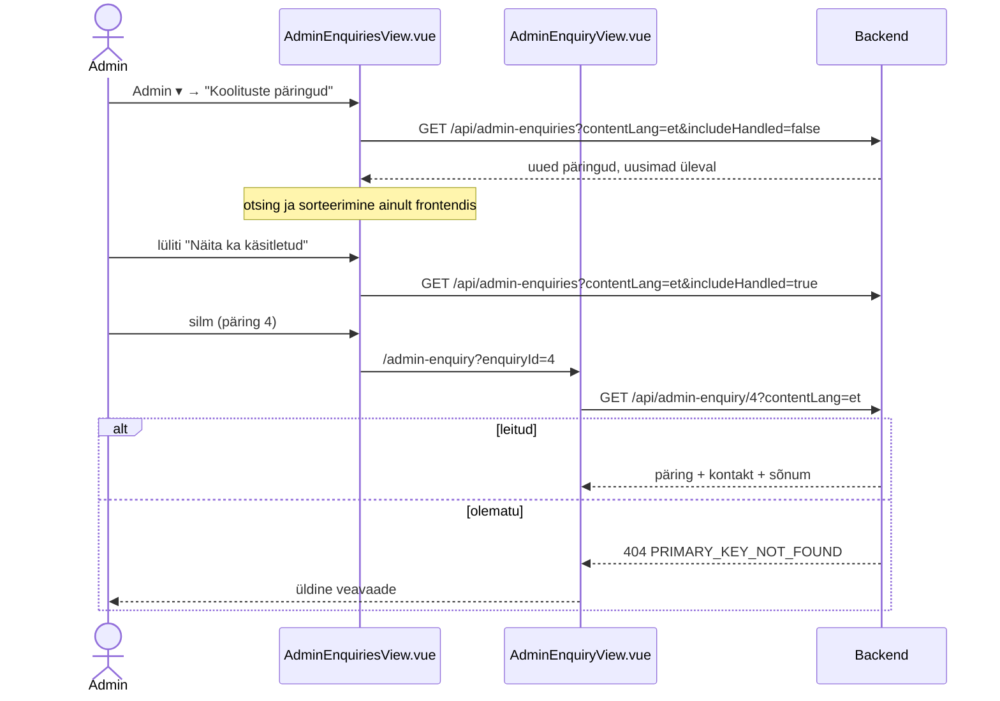
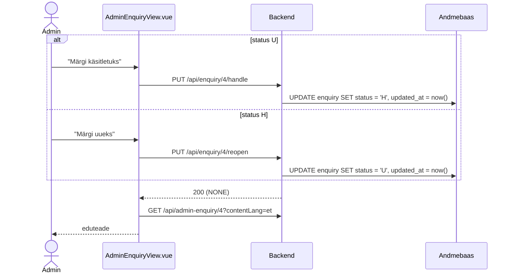

# AdminEnquiriesView.vue ja AdminEnquiryView.vue — skeemid

Huviliste päringute (tabel `enquiry`) haldus: nimekiri (`AdminEnquiriesView.vue`) ja ühe päringu vaade (`AdminEnquiryView.vue`). Selles failis on otsused, andmebaasi ettepanekud ja andmevood skeemidena (Mermaid). Märkmed: `docs/mock-wireframe/markmed/admin-enquiries-view-markmed.md` ja `docs/mock-wireframe/markmed/admin-enquiry-view-markmed.md`. Interaktiivne läbimäng: `admin-enquiries-view-labimang.html`.

Eeskuju: `admin-rooms-view-skeemid.md` (nimekiri, otsing, frontendi sorteerimine, lüliti, tegevusteenused).

## Otsused

- **Vahelehed** (2026-10-01): admini nimekirjavaadete ülaosas vahelehed kõigi admin-menüü linkidega (`AdminTabs.vue` / `NavTabs.vue`), selle vaate vaheleht aktiivne — vt `docs/tasks/frontend/view-tabs.md`.

### Üldine

- **Päring** = huvilise saadetud päring koolituse kohta (tabel `enquiry` + kontaktandmed `profile`). Päringu **loomise** modal on avalikul toimumiskorra lehel (`/course`, vt `courses-view/courses-view-skeemid.md`).
- **Rajad:** `/admin-enquiries` (nimekiri) ja `/admin-enquiry?enquiryId={id}` (üks päring). NB! Õige inglise mitmus on *enquiries* (mitte *enquires*).
- **Navbar → menüü "Admin"** (`App.vue`): koolitusruumide lingi järele eraldaja ja link **"Koolituste päringud"** → `/admin-enquiries` (i18n `navbar.manageEnquiries`; en "Training enquiries").
- **Staatus** (`enquiry.status`, `char(1)`): `U` = uus (`EnquiryStatus.NEW`, seni seed-andmetes kasutusel), `H` = käsitletud (`EnquiryStatus.HANDLED`). Admin muudab staatust päringu vaates. Kustutamist ega admini märkmeid praegu pole.
- **Osalemisvorm eemaldatud (2026-10-01):** tabelid `option`, `option_translation` ja veerg `enquiry.option_id` on kustutatud — päringu vormis osalemisvormi ei küsita (toimumiskorra toimumisviis on teada). Veergu "Vorm" enam pole.
- **Kuvamiskeel:** koolituse nimi tuleb kasutajaliidese keeles (`contentLang`), puuduva tõlke korral põhikeeles. Kontaktandmed ja sõnum ei ole tõlgitavad.

### Päringute nimekiri — `AdminEnquiriesView.vue`

- Roll: Admin. Rada `/admin-enquiries`.
- Päis: pealkiri "Koolituste päringud". Lisamise nuppu pole.
- Otsinguväli "Otsi nime, e-posti, ettevõtte või koolituse järgi…" (frontendis, sisaldab, tõstutundetu) ja lüliti **"Näita ka käsitletud"** (vaikimisi väljas → ainult uued päringud; muutmisel uus päring `includeHandled`).
- Veerud: **Saabunud | Nimi | E-post | Ettevõte | Koolitus | Toimumiskord | Staatus | Tegevused**.
  - **Saabunud** = `created_at` kujul `30/09/2026 14:20` (kasutaja ajavööndis).
  - **Toimumiskord** = valitud toimumiskorra kuupäevad `05/10/2026 – 09/10/2026` või "—" (üldine päring).
  - **Staatus** = märgis "Uus" (sinine) või "Käsitletud" (hall). Uue päringu rida on paksus kirjas.
  - **Tegevused** = silma ikoon "Vaata" → `/admin-enquiry?enquiryId={id}`.
- Vaikimisi järjestus: uusimad üleval (`created_at` kahanevalt, backend). Frontendi sorteerimine (`SortableColumnHeader`, 3 klõpsu nagu `/admin-rooms`): Saabunud, Nimi, Koolitus, Staatus.
- Tabeli all "Kokku N päringut". Tühi tulemus: "Päringuid ei leitud".
- Keele vahetusel laaditakse nimekiri uuesti (koolituse nimi sõltub keelest); otsingusõna ja lüliti jäävad.

### Päringu vaade — `AdminEnquiryView.vue`

- Rada `/admin-enquiry?enquiryId={id}`. Pealkiri "Koolituse päring", paremal kiirnupp "Koolituste päringud" → `/admin-enquiries`.
- **Kaart "Päring"**: Saabunud, Staatus (märgis), Koolitus (link avalikule koolituse lehele `/training?trainingId&trainingTranslationId`), Toimumiskord (kuupäevad või "Toimumiskorda pole valitud"), Ettevõte (või "—"), **Sõnum** (tekst, reavahetused säilivad).
- **Kaart "Kontakt"**: Nimi, E-post (`mailto:` link), Telefon (`tel:` link).
- Nupp olenevalt staatusest:
  - `U` → **"Märgi käsitletuks"** → `PUT /api/enquiry/{enquiryId}/handle` → vaade laaditakse uuesti, eduteade "Päring märgitud käsitletuks";
  - `H` → **"Märgi uueks"** → `PUT /api/enquiry/{enquiryId}/reopen` → eduteade "Päring märgitud uueks".
- Olematu päring → 404 → üldine veavaade. Keele vahetusel laaditakse päring uuesti.

### Uued teenused (ettepanek, URL-ide kokkuleppe järgi)

| Teenus | Põhjendus |
|---|---|
| `GET /api/admin-enquiries?contentLang=&includeHandled=` | admini nimekiri → mitmus, `admin-` eesliide |
| `GET /api/admin-enquiry/{enquiryId}?contentLang=` | ühe päringu admini vaade (sama muster nagu `GET /api/admin-training/{trainingId}`) |
| `PUT /api/enquiry/{enquiryId}/handle` | tegevusteenus: `status = 'H'` |
| `PUT /api/enquiry/{enquiryId}/reopen` | tegevusteenus: `status = 'U'` |

Uusi `Error` väärtusi pole (ainult `404 PRIMARY_KEY_NOT_FOUND ('enquiryId')`). Tegevusteenused on idempotentsed (sama staatus → midagi ei muutu).

---

## 1. Andmebaasi muudatused (ettepanek)

**NB!** Ettepanek; `2_create.sql` ja `3_import.sql` muudetakse backend taski käigus, skripte käivitab kasutaja. Tabelid `enquiry` ja `profile` on olemas ja **ei muutu**.

### View `admin_enquiry_summary`

Üks rida päringu ja tõlkekeele (`content_language_code`) kohta:

```sql
CREATE VIEW admin_enquiry_summary AS
SELECT row_number() OVER (ORDER BY e.id, cl.id)                    AS id,
       e.id                                                        AS enquiry_id,
       cl.code                                                     AS content_language_code,
       e.training_id,
       ats.training_translation_id,
       ats.title                                                   AS training_title,
       e.course_id,
       c.start_date                                                AS course_start_date,
       c.end_date                                                  AS course_end_date,
       p.first_name || ' ' || p.last_name                          AS full_name,
       p.email,
       p.phone,
       e.company_name,
       e.message,
       e.status,
       e.created_at
FROM enquiry e
         CROSS JOIN language cl
         JOIN profile p ON p.id = e.profile_id
         JOIN admin_training_summary ats ON ats.training_id = e.training_id AND ats.content_language_code = cl.code
         LEFT JOIN course c ON c.id = e.course_id
WHERE cl.requires_translation;
```

### Seed-andmed (`3_import.sql`, ettepanek)

Olemasolevad päringud 1–2 jäävad; lisanduvad profiilid 3–4 ja päringud 3 (käsitletud, ettevõttelt) ja 4 (uus, täis toimumiskorrale):

```sql
INSERT INTO profile (id, first_name, last_name, phone, email, created_at, updated_at) VALUES
    ...
    (3, 'Kadri', 'Tamm', '+37255512345', 'kadri.tamm@example.com', '2026-09-20 11:05:00', '2026-09-20 11:05:00'),
    (4, 'Martin', 'Kask', '+37253344556', 'martin.kask@example.com', '2026-09-28 16:40:00', '2026-09-28 16:40:00');

INSERT INTO enquiry (id, training_id, profile_id, course_id, message, company_name, status, created_at, updated_at) VALUES
    ...
    (3, 3, 3, NULL, 'Soovime koolitust kaheksale arendajale meie kontoris, eelistatavalt novembris.', 'AS Tarkvaramaja', 'H', '2026-09-20 11:05:00', '2026-09-22 09:00:00'),
    (4, 1, 4, 5, 'Kas veebis osalejad saavad hiljem ka salvestust vaadata?', NULL, 'U', '2026-09-28 16:40:00', '2026-09-28 16:40:00');
```

---

## 2. Nimekiri ja päringu avamine



## 3. Staatuse muutmine



---

## 4. Päringud

| Vaade | Grupp | Päring | Millal / milleks |
|---|---|---|---|
| nimekiri | Laadimine | `GET /api/admin-enquiries?contentLang={UI keel}&includeHandled=false` | tabel (ka keele vahetusel ja lüliti muutmisel) |
| nimekiri | Navigeerimine | — | silm → `/admin-enquiry?enquiryId={id}` |
| päring | Laadimine | `GET /api/admin-enquiry/{enquiryId}?contentLang={UI keel}` | andmed (ka keele vahetusel ja pärast staatuse muutmist) |
| päring | Tegevus | `PUT /api/enquiry/{enquiryId}/handle` | "Märgi käsitletuks" |
| päring | Tegevus | `PUT /api/enquiry/{enquiryId}/reopen` | "Märgi uueks" |

## 5. Komponendid

| Komponent | Uus / olemas | Kirjeldus |
|---|---|---|
| `views/AdminEnquiriesView.vue` | uus | nimekiri; `enquiries`, `searchText`, `includeHandled`, `sortBy`, `sortDirection` |
| `views/AdminEnquiryView.vue` | uus | üks päring, staatuse nupp |
| `components/common/EnquiryStatusBadge.vue` | uus | märgis "Uus" / "Käsitletud" |
| `App.vue`, `router/index.js`, `NavigationService.js` | muudetakse | menüülink, rajad `adminEnquiriesRoute`, `adminEnquiryRoute` |
| `api-services/EnquiryService.js` | uus | 4 kutset |
| `services/FormatService.js` | muudetakse | `formatDateTime(instant)` → `30/09/2026 14:20` |
| `locales/et.json`, `en.json` | muudetakse | `navbar.manageEnquiries`, `adminEnquiries.*`, `adminEnquiry.*`, `enquiryStatus.*` |

## 6. Lahtised küsimused

- Päringu loomise modal (`POST /api/enquiry`) — vt `courses-view/courses-view-skeemid.md`.
- Admini märkmed päringule, e-kirja teavitus uuest päringust, kustutamine — praegu ei tehta.

## 7. Balsamiq AI käsud

### AdminEnquiriesView

```text
Create a desktop wireframe of an admin page "Koolituste päringud" in a web app.
Top: site navigation bar with logo and links, an open dropdown "Admin ▾" with items "Koolituste päringud" (highlighted), "Registreerumised", a divider, "Koolitused", "Koolituste kalender", a divider, "Koolitajad", "Koolitusruumid", a divider and "Kontod",, a user icon dropdown "👤 ▾" (Minu profiil) and "Logi välja" on the right.
Below the navigation bar: a tab bar "Koolituste päringud | Registreerumised | Koolitused | Koolituste kalender | Koolitajad | Koolitusruumid | Kontod" with "Koolituste päringud" as the active tab.
Header: page title "Koolituste päringud".
Below: a search input "Otsi nime, e-posti, ettevõtte või koolituse järgi…" and a toggle switch "Näita ka käsitletud" (on).
Main area: a data table with columns "Saabunud ▼", "Nimi", "E-post", "Ettevõte", "Koolitus", "Toimumiskord", "Staatus", "Tegevused".
Rows (new ones in bold): "28/09/2026 16:40 | Martin Kask | martin.kask@example.com | — | Java algkursus | 16/11/2026 – 20/11/2026 | badge Uus | eye icon",
"20/09/2026 11:05 | Kadri Tamm | kadri.tamm@example.com | AS Tarkvaramaja | Spring Boot veebiarendus | — | grey badge Käsitletud | eye icon",
"16/09/2026 14:20 | Peeter Mets | peeter.mets@example.com | OÜ Näidisfirma | Projektijuhtimise põhitõed | — | badge Uus | eye icon",
"15/09/2026 08:30 | Anna Saar | anna.saar@example.com | — | Java algkursus | 05/10/2026 – 09/10/2026 | badge Uus | eye icon".
Below the table: text "Kokku 4 päringut".
```

### AdminEnquiryView

```text
Create a desktop wireframe of an admin page "Koolituse päring" in a web app.
Top: site navigation bar with logo, links, a dropdown "Admin ▾", a user icon dropdown "👤 ▾" (Minu profiil) and "Logi välja".
Header row: title "Koolituse päring" and a secondary button "Koolituste päringud" on the right.
Card "Päring" as a two-column list: Saabunud 28/09/2026 16:40; Staatus badge Uus; Koolitus link "Java algkursus"; Toimumiskord 16/11/2026 – 20/11/2026; Ettevõte —; Sõnum "Kas veebis osalejad saavad hiljem ka salvestust vaadata?".
Card "Kontakt": Nimi Martin Kask; E-post link martin.kask@example.com; Telefon link +37253344556.
Bottom: primary button "Märgi käsitletuks".
```


## Vaadetevaheline tagasitee

Detailide ja vormide avamisel antakse kaasa lähtevaate täielik URL `returnTo` parameetrina. Ühine „← Tagasi“ link taastab selle URL-i; otselingi korral kasutatakse vaate varusihti. Peamenüü ja vahelehed tagasiteed ei loo. Oleku- ja tõlkevahetus säilitab senise tagasitee. Kõigi avamiskohtade, erandite ja varusihtide [ühine skeem](../return-to-navigation-skeemid.md).
