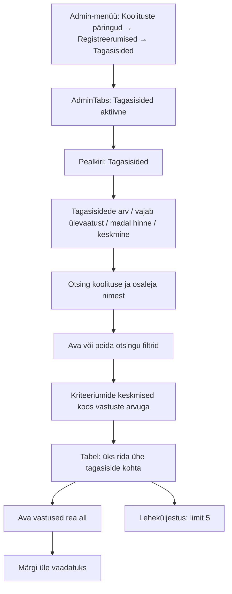
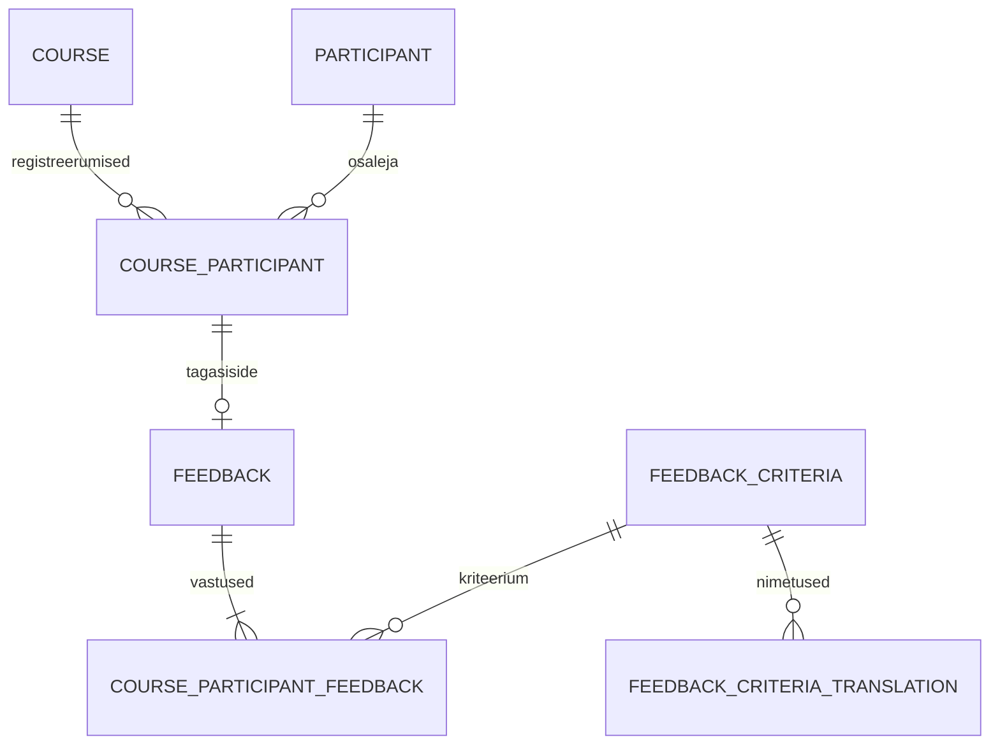
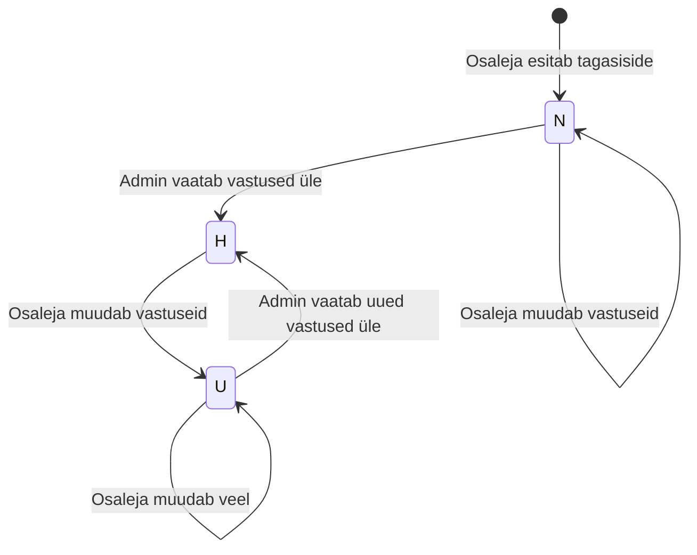

# AdminFeedbacksView.vue — skeemid ja otsused

Rada `/admin-feedbacks`, nimi „Tagasisided”, ainult adminile. Interaktiivne mock: [admin-feedbacks-view-labimang.html](admin-feedbacks-view-labimang.html), avamine ühise kesta kaudu: [index.html](../index.html?role=admin&path=/admin-feedbacks).

Seis (02.10.2026): mock, märkmed ja allpool kirjeldatud API/Vue vaade on implementeeritud. Märkmed: [admin-feedbacks-view-markmed.md](../../markmed/admin-feedbacks-view-markmed.md). Päris vaade, API, menüü ja `AdminTabs.vue` on lisatud; serveripoolne admini autentimine jääb dokumenteeritud kasutuselevõtu sõltuvuseks. Mock ei tee võrgupäringuid ega salvesta andmeid. Eeskuju: `admin-trainings-view-skeemid.md` ja `admin-trainings-view-toode-jarjekord.md`.

## 1. Vaate ülesehitus

- Admin-menüü esimene grupp: „Koolituste päringud”, „Registreerumised”, „Tagasisided”, siis eraldusjoon. Sama järjekord `AdminTabs.vue` vahelehtedel, uue marsruudi nimi `adminFeedbacksRoute`, i18n võti `navbar.manageFeedbacks`.
- Tabeli veerud: Esitatud | Vastuseid muudetud | Koolitus / toimumine | Osaleja | Keskmine | Madalaim | Kommentaarid | Staatus | Tegevused.
- Üks rida = `feedback`, seotud konkreetse registreerumise ja toimumiskorraga. Vaade loeb juba esitatud tagasisidet; tagasisideta registreerumised ei tekita tabelisse ridu. Ajaloolised tagasisided jäävad alles ka koolituse hilisema kustutamise korral.
- Vastused avanevad rea all. Korraga üks avatud rida. Kriteerium, hinne ja kommentaar, järjekord `feedback_criteria.sequence`, võrdsete puhul ID. Hinded 1–10, puuduv kommentaar „—”. Vastatud kustutatud kriteerium jääb nähtavaks.
- „Ava vastused” ei muuda staatust. „Märgi üle vaadatuks” lubatud alles pärast vastuste avamist ning ainult N/U real. H real staatuse nuppu ei näidata. Admin ei muuda osaleja vastuseid.
- Kõik mocki toimumiskorrad, osalejad, registreerumised, tagasisided, kriteeriumid, hinded ja kommentaarid lähtuvad `docs/database/3_import.sql` andmetest. Sama registreerumise ja toimumiskorra leiab lingitud admin-mockide detailidest. Seis: 01.10.2026.

## 2. Otsing, filtrid ja järjestus

| Väli | Vaikimisi | Käitumine |
|---|---|---|
| Otsing | tühi | Koolituse ja osaleja nimi; iga sõna peab esinema, tõstutundetu |
| Toimumiskord | kõik | Möödunud O/F toimumiskorrad, ka ilma vastusteta; järjestus endDate DESC, courseId DESC |
| Staatus | kõik | N, U, H või pending (N/U) |
| Kommentaarid | kõik | yes = vähemalt üks sisukas kommentaar, no = kommentaarita |
| Toimumise vahemik | tühi | from/until kaasavad piirpäeva; toimumiskord kattub vahemikuga |
| Madal hinne | kõik | Vähemalt üks hinne ≤ 3, 5 või 7 |
| Leht | 0 | Limit 5; filter, otsing ja sort alustavad lehelt 0 |
| Järjestus | default | N/U enne H; grupis createdAt DESC, feedbackId DESC |

„Otsi” ja Enter rakendavad otsingu. „Filtreeri” rakendab filtrimustandi; filtri peitmine säilitab valikud. „Tühjenda filtrid” eemaldab otsingu ja filtrid. Veerud sorteeritakse backendis; võrdsuse korral feedbackId DESC. Tühjal tabelil on teade „Tagasisidesid ei leitud. Muuda otsingut või tühjenda filtrid.”

## 3. Koondandmed ja vastuste detail

Koondid käivad kogu filtreeritud hulga kohta: totalElements, needsReviewCount (N/U), lowScoreFeedbackCount (vähemalt üks hinne ≤ 5), overallAverageScore (kõigi vastuste kaalutud keskmine) ning criteriaAverages koos vastuste arvuga. Keskmisi kuvatakse ühe komakohaga; puuduv väärtus on „—”, mitte nullhinne. Lehekülje muutmine koonde ei muuda.

courseResponseRate kuvatakse ainult courseId valimisel. Nimetajas ainult R-registreerumised, lugejas neist tagasiside esitanud; loobunuid ei loeta. Muud filtrid määra ei mõjuta. Ilma registreerunuteta responsePercentage=null. Tagasisideta toimumiskord jääb valikusse.

„Ava vastused” laadib ühe detaili rea alla ja sulgeb eelmise. Detailis kriteeriumi pealkiri, hinne /10 ja kommentaar; kirjelduse välja ei kuvata. Pikk kommentaar säilitab lõiguvahed. Avamine ei muuda staatust. N/U real saab ülevaatamise käivitada ainult edukalt laaditud detailiga. Päringu ajal nupp keelatud; H real nuppu pole.

## 4. Andmemudel

Osaleja nimi tuleb participant.name väljalt; profiil annab kontaktandmed. Koolituse pealkiri on contentLang keeles, puudumisel põhikeeles; kriteeriumid UI keeles sama fallbackiga. Kommentaare ei tõlgita. Ajaloolised vastused jäävad nähtavaks ka koolituse, toimumiskorra või kriteeriumi soft delete korral.

## 5. Teenused ja vead

| Tegevus | API |
|---|---|
| Toimumiskorra valikud | GET /api/admin-feedback-courses?contentLang=et |
| Tabel ja kogu hulga koondid | GET /api/admin-feedbacks koos rakendatud filtrite, sortBy/sortDirection, page/limit ja contentLang parameetritega |
| Vastuste avamine | GET /api/admin-feedback/{feedbackId}?contentLang=et |
| Üle vaadatuks märkimine | PUT /api/admin-feedback/{feedbackId}/review, body puudub, X-Answers-Version header |

400 = vigane filter/sisend; 404 = puuduv ressurss; 409 = avamise järel muutunud vastused. 409 korral laaditakse uus detail ja admin peab selle uuesti üle vaatama; automaatset PUT-i ei tehta. Võrgu-/500 viga kuvatakse veateatena, ebaõnnestunud detail ei võimalda ülevaatamist. Keelevahetus laadib tabeli, valikud ja avatud detaili uuesti, säilitades filtrid/sordi/lehe. Hilinenud päringute vastuseid eiratakse.

## 6. Staatused ja navigeerimine

Koolituse link → /admin-course?courseId=...&returnTo=/admin-feedbacks; osaleja link → /admin-registration?courseParticipantId=...&returnTo=/admin-feedbacks. returnTo antakse Vue Routeri query-objektina. Menüü ja AdminTabs seda ei lisa. Admin ei muuda osaleja vastuseid; muutmata osaleja PUT ei muuda staatust ega vastuste versiooni.

## 7. DML-i ja mocki ühised näited (01.10.2026)

| Toimumiskord | Koolitus | Kuupäevad | R-staatusega registreerumisi | Loobunud | Tagasisidesid | Vastamismäär |
|---|---|---|---|---|---|---|
| 7 | Java algkursus | 2026-06-08 – 2026-06-12 | 1 | 0 | 1 | 100.0% |
| 16 | Vali-IT Noorem AI arendaja | 2026-08-10 – 2026-09-25 | 18 | 0 | 16 | 88.9% |
| 3 | Java algkursus | 2026-09-07 – 2026-09-11 | 3 | 0 | 3 | 100.0% |
| 12 | Agiilne meeskonnajuhtimine | 2026-09-14 – 2026-09-15 | 5 | 1 | 4 | 80.0% |
| 14 | SQL ja andmebaasid | 2026-09-21 – 2026-09-23 | 6 | 1 | 6 | 100.0% |
| 15 | Spring Boot veebiarendus | 2026-09-28 – 2026-09-30 | 2 | 0 | 0 | 0.0% |

| feedback.id | Registreerumine | Osaleja | Toimumiskord | Staatus | Hinded (kriteeriumid 1–5) |
|---|---|---|---|---|---|
| 1 | 10 | Anna Saar | 7 | H | 9, 10, 8, 7, 9 |
| 2 | 2 | Anna Saar | 3 | N | 8, 9, 8, 9, 8 |
| 3 | 11 | Anna Saar | 14 | U | 5, 8, 4, 7, 5 |
| 4 | 12 | Liis Kuusk | 14 | H | 9, 9, 10, 9, 10 |
| 5 | 6 | Liis Kuusk | 12 | N | 9, 10, 9, 8, 9 |
| 6 | 7 | Toomas Rebane | 12 | U | 7, 8, 7, 4, 7 |
| 7 | 13 | Jaan Org | 14 | N | 7, 9, 8, 8, 8 |
| 8 | 14 | Mari Lepp | 14 | H | 10, 9, 9, 10, 10 |
| 9 | 15 | Anna Saar | 12 | H | 6, 8, 7, 3, 6 |
| 10 | 21 | Anna Saar | 16 | H | 8, 9, 10, 8, 9 |
| 11 | 22 | Liis Kuusk | 16 | N | 9, 10, 8, 9, 10 |
| 12 | 23 | Jaan Org | 16 | U | 10, 8, 9, 10, 8 |
| 13 | 24 | Mari Lepp | 16 | N | 8, 9, 10, 8, 9 |
| 14 | 25 | Toomas Rebane | 16 | H | 9, 10, 8, 9, 10 |
| 15 | 26 | Kärt Kivi | 16 | H | 10, 8, 9, 10, 8 |
| 16 | 27 | Rasmus Vaher | 16 | N | 8, 9, 10, 8, 9 |
| 17 | 28 | Laura Põld | 16 | H | 9, 10, 8, 9, 10 |
| 18 | 29 | Kristjan Oja | 16 | U | 10, 8, 9, 10, 8 |
| 19 | 30 | Sandra Teder | 16 | H | 8, 9, 10, 8, 9 |
| 20 | 31 | Markus Lill | 16 | N | 9, 10, 8, 9, 10 |
| 21 | 32 | Helen Aas | 16 | H | 10, 8, 9, 10, 8 |
| 22 | 33 | Taavi Sild | 16 | H | 8, 9, 10, 8, 9 |
| 23 | 34 | Merle Ilves | 16 | N | 9, 10, 8, 9, 10 |
| 24 | 35 | Oliver Kangur | 16 | H | 10, 8, 9, 10, 8 |
| 25 | 36 | Eleri Salu | 16 | H | 8, 9, 10, 8, 9 |
| 26 | 39 | Kristjan Oja | 3 | H | 8, 9, 10, 8, 9 |
| 27 | 40 | Sandra Teder | 3 | N | 9, 10, 5, 9, 10 |
| 28 | 41 | Kärt Kivi | 14 | H | 10, 8, 9, 10, 8 |
| 29 | 42 | Rasmus Vaher | 14 | U | 8, 9, 10, 8, 9 |
| 30 | 43 | Laura Põld | 12 | H | 9, 10, 8, 9, 10 |

Algseisus 30 tagasisidet, 150 vastust; 14 vajab ülevaatust ja 4 sisaldab hinnet ≤ 5. Kõigi vastuste keskmine 8.653333333333334 (kuval 8,7). Vali-IT toimumiskord 16: 18 registreerunut, 16 tagasisidet; 80 vastusest ainult 7 kommentaariga. Neli kommentaari on mitmelõigulised (773–1411 märki), lisaks lühikesed „Aitäh!” ja „Soovitan.”.

Kõik näited on fiktiivsed ja pärinevad `3_import.sql` failist. Lisatud 13 kasutajat; samad osalejad annavad tagasisidet ka mitmel koolitusel. Vali-IT sisu ja kommentaaride teemad lähtuvad `docs/JSON/training-description-sample.html` materjalist ning olemasolevate koolitajate andmetest. Kasutaja viidatud `docs/about-me.md` faili selles töökoopias ei ole. Tagasiside 2 jääb N-staatusesse pärast muutmist; U-staatuses viimase vastuse muutmise aeg ühtib päise ajaga ning H-päise aeg kajastab ülevaatust.

Vastuste tabelis kuvatakse ainult kriteeriumi title (12rem) ja hinne (5rem); kommentaar saab ülejäänud laiuse, säilitab lõiguvahed ning murrab ka pikad sõnad. API description-väli jääb lepingusse. Kommentaari sisendi piir on 10000 märki, andmebaasi veerg `text`; olemasoleva baasi muutmiseks on `docs/database/4_feedback_long_comments.sql`.

Versioonikontrolli täpsustus: detail tagastab `answersVersion` kontrollsumma tegelikest vastustest; ülevaatamise tegevusteenus saab selle kohustusliku `X-Answers-Version` headeriga ning ei vaja request body/DTO-d. Kontrollsumma ei sõltu kuvatud keelest ega staatusest. 409 leping: FEEDBACK_ANSWERS_CHANGED / „Tagasiside vastused on vahepeal muutunud. Vaata vastused uuesti üle.” Kanooniline versioon on fikseeritud backend taskis feedback-review-concurrency.md. API DTO-de väljanimesid ja vastusenäiteid kirjeldab vaate märkmete fail.

Taskid ja sõltuvused: [tööde järjekord](admin-feedbacks-view-toode-jarjekord.md). Täpsustatud nullide sortimine, tundmatu keele fallback ning tühjad filtrid on vaate märkmete lõpu jaotises ja taskides.

## 8. Implementatsiooni kontroll

- Nimekirja koondid ja lehekülg arvutatakse JPQL-iga ühes REPEATABLE_READ hetktõmmises; päringute arv ei kasva tabeliridade arvuga.
- Kriteeriumi DTO asub jagatud `controller/common/dto` paketis, seda kasutab ka olemasolev osaleja teenus.
- Tagasiside kohalike DB ajatemplite Europe/Tallinn → Instant teisendus on mõlema tagasisidetabeli väljade konverteris; LocalDate ei nihku.
- Frontend eristab filtrimustandit rakendatud tingimustest ja eirab aegunud võrgupäringute vastuseid. 409 laadib värsked vastused; uut PUT-i ei tehta automaatselt.
- Automaattestid: backend API/valideerimise testid ja H2 integratsioonitest DML-i näidetega, sh kahe transaktsiooni lukutest; frontendil `npm run test:feedbacks` ja eraldatud build.
