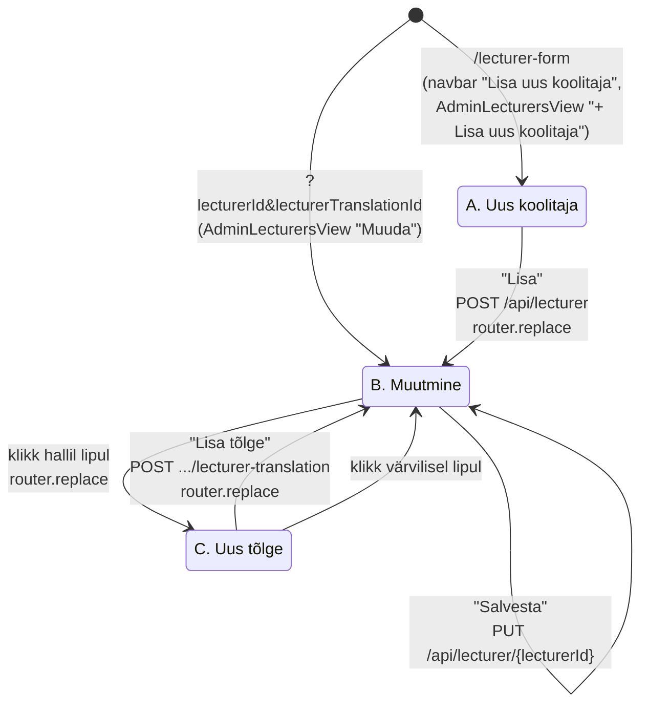
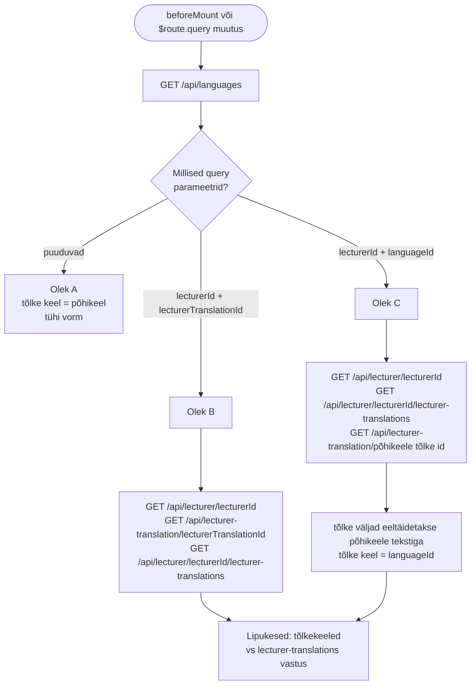
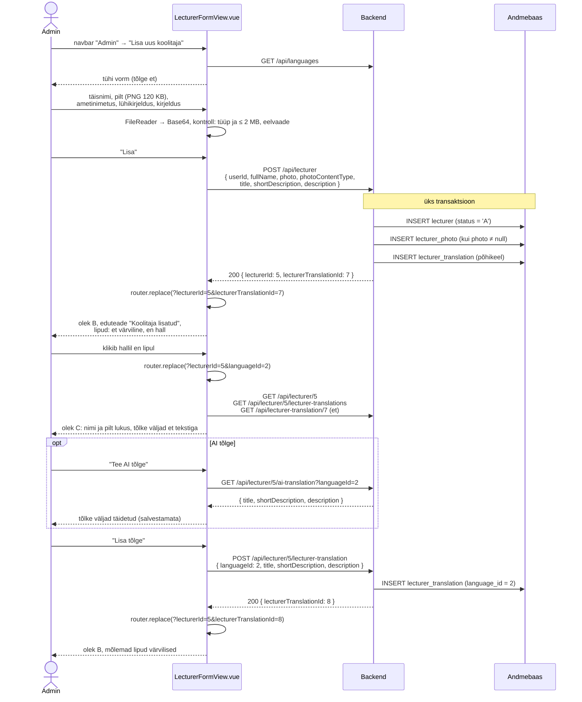
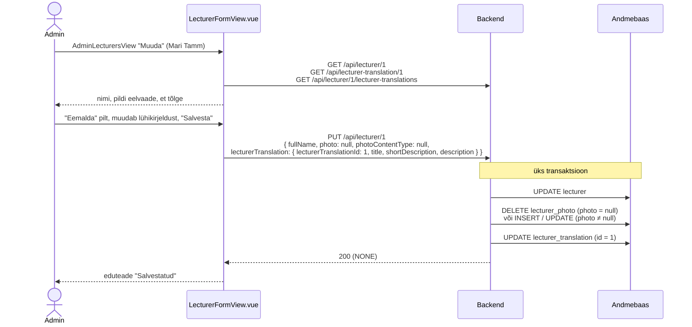
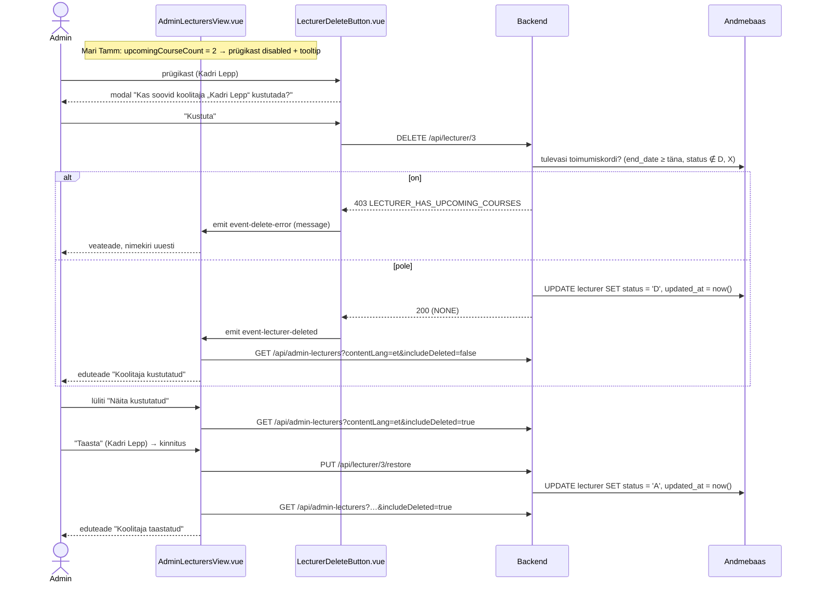

# AdminLecturersView.vue ja LecturerFormView.vue — skeemid

Koolitajate haldus: nimekiri (`AdminLecturersView.vue`), koolitaja lisamise/muutmise vorm (`LecturerFormView.vue`) ja jagatud koolitaja kaart (`LecturerCard.vue`). Selles failis on otsused, andmebaasi ettepanekud ja andmevood skeemidena (Mermaid). Märkmed: `docs/mock-wireframe/markmed/admin-lecturers-view-markmed.md` ja `docs/mock-wireframe/markmed/lecturer-form-view-state-*-markmed.md`. Interaktiivne läbimäng: `admin-lecturers-view-labimang.html`.

Eeskuju:
- vormi olekud ja tõlkeloogika — `docs/mock-wireframe/loo-mock-vaade/form-view/training-form-view-skeemid.md` (TrainingFormView);
- nimekiri, soft delete ja taastamine — `docs/mock-wireframe/loo-mock-vaade/admin-trainings-view/admin-trainings-view-skeemid.md` (AdminTrainingsView);
- koolitaja pilt (`lecturer_photo` tabel) — `docs/mock-wireframe/loo-mock-vaade/training-courses-view/training-courses-view-skeemid.md`, jaotis 1.

## Otsused

### Üldine

- **Termin kasutajaliideses on "koolitaja"** (inglise keeles "Trainer") — kõikjal, ka olemasolevates tekstides: "Vali lektor" → "Vali koolitaja", "Vaikimisi lektor" → "Vaikimisi koolitaja", "— lektor puudub —" → "— koolitaja puudub —", navbari "Lektorid" → "Koolitajad"; en: "Lecturer(s)" → "Trainer(s)". Muutuvad `et.json` / `en.json` võtmed `navbar.lecturers`, `trainingForm.*` ja `trainingForm.lecturerModal.*` (võtmete nimed jäävad). Koodis ja andmebaasis jääb `lecturer`.
- **Navbar → menüü "Admin"** (nähtav ainult adminile, `App.vue`): olemasolevate linkide järele eraldaja ja kaks uut linki:
  - "Lisa uus koolitaja" → `/lecturer-form` (i18n `navbar.addLecturer`);
  - "Koolitajad" → `/admin-lecturers` (i18n `navbar.manageLecturers`).
- **Staatus** (`lecturer.status`, `varchar(1)`): `A` = aktiivne (`LecturerStatus.ACTIVE`), `D` = kustutatud (`LecturerStatus.DELETED`, soft delete). Mustandi/publitseerimise olekut koolitajal pole.

### Koolitaja tõlge — samad väljad nagu koolitusel

`lecturer_translation` tabelis on `bio` asemel samad väljad nagu `training_translation`-il:

| Väli | Vormis | Tähendus | Kus kuvatakse |
|---|---|---|---|
| `title` | "Ametinimetus *" | lühidalt, millega koolitaja tegeleb, nt "Tarkvaraarendaja ja Java koolitaja", "UX-disainer" | koolitaja kaardil nime all, admini nimekirjas |
| `short_description` | "Lühikirjeldus *" | 1–2 lauset | koolitaja kaardil |
| `description` | "Kirjeldus *" (`RichTextEditor`) | pikk tutvustus | tulevikus avalikul koolitajate lehel |

- Kõik kolm on kohustuslikud; `title` ja `short_description` kuni 255 märki (nagu koolitusel).
- Välja "Ametinimetus" sildi kõrval on **küsimärgi ikoon tooltip'iga** (sama muster nagu AdminTrainingsView otsingu selgitus): "Ametinimetus kuvatakse koolitaja kaardil nime all. Kirjuta lühidalt, millega koolitaja tegeleb, nt „Tarkvaraarendaja ja Java koolitaja“ või „UX-disainer“. Iga keele jaoks eraldi tõlge."
- Välja "Lühikirjeldus" all vihje: "Kuvatakse koolitaja kaardil koolituse lehel ja toimumiskorra juures."
- AI tõlge tõlgib kõik kolm välja korraga (nagu koolituse AI tõlge: `title`, `shortDescription`, `description`).

### Koolitaja kaart — `LecturerCard.vue`

- Kuvab: pilt (`LecturerAvatar`), nimi, ametinimetus (`title`), lühikirjeldus (`shortDescription`) — kasutajaliidese keeles (store'i `contentLang`), puuduva tõlke korral põhikeeles.
- Komponent laeb andmed ise: prop `lecturerId`, päring `GET /api/lecturer-summary/{lecturerId}?contentLang=` (ka `lecturerId` või keele muutumisel). `lecturerId = null` → kaarti ei kuvata.
- Kustutatud või olematu koolitaja → 404 → kaarti ei kuvata (üldisele veavaatele ei suunata).
- Kasutavad:
  - `TrainingView.vue` (`/training`) — parema veeru olemasolev kohatäide "Koolitaja" (`trainingView.sidebar.lecturer`): koolituse vaikimisi koolitaja;
  - `TrainingCoursesView.vue` — koolituse kaardil vaikimisi koolitaja;
  - `CourseFormView.vue` — valitud koolitaja kaart "Vali koolitaja" nupu all (toimumiskorra koolitaja).
- Seepärast ei tagasta `GET /api/admin-training/{trainingId}` enam `defaultLecturerPhoto` / `defaultLecturerPhotoContentType` — pilt tuleb ainult `lecturer-summary` teenusest (training-courses-view skeemid ja märkmed on uuendatud).

### Koolitajate nimekiri — `AdminLecturersView.vue`

- Roll: Admin. Rada `/admin-lecturers`.
- Päis: pealkiri "Koolitajad", paremal nupp "+ Lisa uus koolitaja" → `/lecturer-form`.
- **Pilti ei kuvata** (nimekirja päring pilte ei loe).
- Veerud: Nimi | Ametinimetus | Tõlked | Koolitusi | Tulevasi toimumiskordi | Uuendatud | Tegevused.
  - **Ametinimetus** = `title` kasutajaliidese keeles, puudumisel põhikeeles.
  - **Tõlked** = ✓, kui tõlge on olemas igas keeles, mille `requires_translation = true`; muidu ✗, mille tooltip näitab puuduvaid keeli ("Puudub: en") — sama nagu AdminTrainingsView-s.
  - **Koolitusi** = aktiivsed koolitused (`status <> 'D'`), mille vaikimisi koolitaja ta on.
  - **Tulevasi toimumiskordi** = toimumiskorrad, kus ta on koolitaja, `end_date >= täna` ja `status NOT IN ('D', 'X')`.
  - **Uuendatud** = hiliseim `lecturer`, `lecturer_translation` ja `lecturer_photo` `updated_at`, kuvatakse `30/09/2026`.
  - **Tegevused**: "Muuda" (pliiats) → `/lecturer-form?lecturerId={id}&lecturerTranslationId={id}` (kasutajaliidese keele tõlge, puudumisel põhikeele oma) ja "Kustuta" (prügikast, `LecturerDeleteButton.vue`).
- **Kustutamine** (`LecturerDeleteButton.vue`, sama muster nagu `TrainingDeleteButton`): prügikast → kinnituse modal "Kas soovid koolitaja „Kadri Lepp“ kustutada?" → `DELETE /api/lecturer/{lecturerId}` → nimekiri uuesti, eduteade "Koolitaja kustutatud".
  - Kui `upcomingCourseCount > 0`, on prügikast keelatud (`disabled`) ja tooltip ütleb: "Koolitajal on tulevasi toimumiskordi — vali neile enne teine koolitaja". Backend kontrollib sama (`403 LECTURER_HAS_UPCOMING_COURSES`); kui see siiski tuleb (nt teises aknas lisati toimumiskord), näidatakse backendi `message`-it ja laaditakse nimekiri uuesti.
  - Vaikimisi koolitaja roll koolitustel kustutamist ei keela — koolitus jääb seotuks, aga koolitaja kaarti enam ei kuvata.
- **Lüliti "Näita kustutatud"** (vaikimisi väljas) → päring `includeDeleted=true`. Kustutatud read on tuhmimad, märgisega "Kustutatud"; neil on ainult nupp "Taasta" (kinnitusega, `PUT /api/lecturer/{lecturerId}/restore` → `status = 'A'`), "Muuda" ja "Kustuta" on peidus.
- Järjestus nime järgi (A → Õ). Sorteerimist ja leheküljestust pole.
- Otsinguväli "Otsi nime järgi…" filtreerib **frontendis** (sisaldab, tõstutundetu, trükkimise ajal). Tühi tulemus: "Koolitajaid ei leitud".
- Tabeli all "Kokku N koolitajat".
- Keele vahetusel navbaris laaditakse nimekiri uuesti (`title` ja `lecturerTranslationId` sõltuvad keelest), otsingusõna ja lüliti jäävad.

### Kustutatud koolitaja teistes teenustes

Kustutatud koolitaja on nagu olematu → `404 PRIMARY_KEY_NOT_FOUND` (`'lecturerId'`). Muudatus olemasolevatele ja uutele teenustele:
- `GET /api/lecturers` ("Vali koolitaja" modal) tagastab ainult aktiivsed;
- vormi teenused `GET/PUT /api/lecturer/{lecturerId}`, `GET .../lecturer-translations`, `GET /api/lecturer-translation/{id}`, `POST .../lecturer-translation`, `GET .../ai-translation`, `GET /api/lecturer-summary/{lecturerId}`;
- `POST /api/training`, `PUT /api/training/{trainingId}` (`defaultLecturerId`), `POST /api/training/{trainingId}/course`, `PUT /api/course/{courseId}` (`lecturerId`) — kustutatud koolitajat ei saa valida.
- Erandid: `DELETE` (juba kustutatud → midagi ei muutu) ja `restore`.
- Olemasolevad seosed (koolituse vaikimisi koolitaja, toimumiskorra koolitaja) jäävad alles; nimi kuvatakse tabelites edasi.

### Koolitaja vorm — `LecturerFormView.vue`

Sama olekuloogika nagu TrainingFormView-l: olek tuleneb URL-i query parameetritest, pärast iga `router.replace`-i laaditakse andmed uuesti.

| Olek | `state` | URL | Pealkiri | Vormi sisu | Nupud | Lipukesed |
|---|---|---|---|---|---|---|
| **A. Uus koolitaja** | `"new-lecturer"` | `/lecturer-form` | "Lisa uus koolitaja" | tühi vorm, tõlke keel = põhikeel | "Lisa" | — |
| **B. Muutmine** | `"update"` | `/lecturer-form?lecturerId=1&lecturerTranslationId=2` | "Muuda koolitajat" | nimi, pilt ja avatud tõlge täidetud | "Salvesta" (+ "Tee AI tõlge" mitte-põhikeelel) | jah |
| **C. Uus tõlge** | `"new-translation"` | `/lecturer-form?lecturerId=3&languageId=2` | "Lisa koolitaja tõlge" | nimi ja pilt kirjutuskaitstud, tõlke väljad eeltäidetud põhikeele tekstiga | "Lisa tõlge", "Tee AI tõlge" | jah |

- **Kaart "Koolitaja andmed"** (ei ole tõlgitav):
  - **Täisnimi** (`lecturer.full_name`) — kohustuslik, kuni 255 märki.
  - **Pilt** (`lecturer_photo`) — valikuline; "Vali pilt" (PNG, JPEG, WebP, kuni 2 MB), eelvaade (`LecturerAvatar.vue`, suurem) ja "Eemalda". Frontend loeb faili `FileReader`-iga Base64-ks ja kontrollib tüüpi ning suurust enne saatmist ("Lubatud on PNG, JPEG või WebP pilt kuni 2 MB"). Kärpimist ega vähendamist ei tehta.
- **Kaart "Tõlge ({keel})"** (lipp pealkirjas): Ametinimetus (+ "?" tooltip), Lühikirjeldus, Kirjeldus (`RichTextEditor.vue`).
- **Lipukesed** (`TranslationFlags.vue`, olemas): tõlkekeeled vs `GET /api/lecturer/{lecturerId}/lecturer-translations`. Tõlge olemas → värviline lipp (klikk avab selle tõlke), puudub → hall lipp (klikk → olek C). Komponendi prop `trainingTranslations` nimetatakse üldisemaks (`existingTranslations`) ja i18n võtmed `trainingForm.flags.*` → `translationFlags.*`; TrainingFormView kasutab sama komponenti edasi.
- **"Lisa"** (A) → `POST /api/lecturer` (nimi, pilt, põhikeele tõlge; `userId` localStorage'ist) → vastuse järgi `router.replace` → olek B, eduteade "Koolitaja lisatud".
- **"Salvesta"** (B) → `PUT /api/lecturer/{lecturerId}` — nimi, pilt ja avatud tõlge ühes transaktsioonis. Pilt saadetakse alati praegusel kujul: Base64 → lisatakse või asendatakse, `null` → eemaldatakse. Eduteade "Salvestatud".
- **"Lisa tõlge"** (C) → `POST /api/lecturer/{lecturerId}/lecturer-translation` → `router.replace` → olek B.
- **"Tee AI tõlge"** (C ja B mitte-põhikeelel) → `GET /api/lecturer/{lecturerId}/ai-translation?languageId={id}` tõlgib **salvestatud põhikeele tõlke** (kõik kolm välja) ja täidab ainult vormi; salvestamata muudatuste korral küsitakse enne üle kirjutamist kinnitust. Frontend võib alustada mock-vastusega.
- Kiirnupp "Koolitajad" → `/admin-lecturers` (olekutes A, B, C). Kustutamist vormis pole (ainult nimekirjas).
- Kustutatud või olematu koolitaja → 404 → üldine veavaade.
- Frontendi kontroll enne saatmist: täisnimi, ametinimetus, lühikirjeldus ja kirjeldus täidetud ("Täida kõik kohustuslikud väljad"), pildi tüüp ja suurus — `AlertDanger`.

### Uued teenused (ettepanek, URL-ide kokkuleppe järgi)

| Teenus | Põhjendus |
|---|---|
| `GET /api/admin-lecturers?contentLang=&includeDeleted=` | admini nimekiri → mitmus, `admin-` eesliide nagu `GET /api/admin-trainings` |
| `GET /api/lecturer/{lecturerId}` | ühe objekti andmed (nimi + pilt) |
| `GET /api/lecturer/{lecturerId}/lecturer-translations` | ühe objekti alamnimekiri (lipukesed) |
| `GET /api/lecturer-translation/{lecturerTranslationId}` | üks tõlge (sama muster nagu `GET /api/training-translation/{id}`) |
| `POST /api/lecturer` | loob koolitaja koos põhikeele tõlkega |
| `PUT /api/lecturer/{lecturerId}` | muudab koolitajat ja avatud tõlget |
| `POST /api/lecturer/{lecturerId}/lecturer-translation` | lisab tõlke |
| `GET /api/lecturer/{lecturerId}/ai-translation?languageId=` | AI tõlge (sama muster nagu koolitusel) |
| `DELETE /api/lecturer/{lecturerId}` | soft delete (`status = 'D'`) |
| `PUT /api/lecturer/{lecturerId}/restore` | tegevusteenus: taastab (`status = 'A'`) |
| `GET /api/lecturer-summary/{lecturerId}?contentLang=` | koolitaja kaardi andmed (sama nimeloogika nagu `training_summary` / `TrainingSummaryDto`) |
| `GET /api/languages` | **olemas** — lipukesed, põhikeel |
| `GET /api/lecturers?search=` | **olemas, muutub** — ainult aktiivsed; `lecturerPhoto` eemaldatakse DTO-st |

Uued väärtused `Error` enumisse (`403`):
- `PHOTO_TYPE_NOT_ALLOWED("Lubatud on ainult PNG, JPEG või WebP pilt")`;
- `PHOTO_TOO_LARGE("Pilt on liiga suur, lubatud kuni 2 MB")`;
- `LECTURER_HAS_UPCOMING_COURSES("Koolitajal on tulevasi toimumiskordi, vali neile enne teine koolitaja")`.

Olemasolevat `TRANSLATION_EXISTS` kasutatakse ka koolitaja tõlke korral. AI tõlke vead (`MAIN_LANGUAGE_NOT_TRANSLATABLE`, `AI_SERVICE_UNAVAILABLE`) on samad mis koolituse AI tõlkel.

---

## 1. Andmebaasi muudatused (ettepanek)

**NB!** DDL ja seed on ettepanek, andmebaasi vastu pole käivitatud. `2_create.sql` ja `3_import.sql` muudetakse backend taski käigus. Tabel `lecturer_photo` ja `lecturer.photo` veeru eemaldamine: training-courses-view skeemid, jaotis 1.

```sql
-- Table: lecturer (photo veerg eemaldatud, lisandub status)
CREATE TABLE lecturer
(
    id         serial       NOT NULL,
    full_name  varchar(255) NOT NULL,
    status     varchar(1)   NOT NULL,
    created_at timestamp    NOT NULL,
    updated_at timestamp    NOT NULL,
    created_by int          NOT NULL,
    CONSTRAINT lecturer_pk PRIMARY KEY (id)
);

-- Table: lecturer_translation (bio asemel samad väljad nagu training_translation-il)
CREATE TABLE lecturer_translation
(
    id                serial       NOT NULL,
    lecturer_id       int          NOT NULL,
    language_id       int          NOT NULL,
    title             varchar(255) NOT NULL,
    short_description varchar(255) NOT NULL,
    description       text         NOT NULL,
    created_at        timestamp    NOT NULL,
    updated_at        timestamp    NOT NULL,
    CONSTRAINT lecturer_translation_pk PRIMARY KEY (id),
    CONSTRAINT lecturer_translation_uq UNIQUE (lecturer_id, language_id)
);
```

### View `admin_lecturer_summary`

Eeskuju: `admin_training_summary` — rida iga koolitaja ja iga tõlkekeele kohta, et `title` ja `lecturerTranslationId` oleksid kasutajaliidese keeles (puudumisel põhikeeles). Staatuse filter rakendatakse päringus.

```sql
-- Admini koolitajate nimekiri: üks rida koolitaja ja tõlkekeele kohta
CREATE VIEW admin_lecturer_summary AS
SELECT row_number() OVER (ORDER BY l.id, cl.id)                    AS id,
       l.id                                                        AS lecturer_id,
       cl.code                                                     AS content_language_code,
       COALESCE(lt.id, mlt.id)                                     AS lecturer_translation_id,
       l.full_name,
       COALESCE(lt.title, mlt.title)                               AS title,
       l.status,
       mt.missing_translation_language_codes,
       mt.missing_translation_language_codes IS NULL               AS has_all_translations,
       (SELECT count(*)
        FROM training t
        WHERE t.default_lecturer_id = l.id
          AND t.status <> 'D')                                     AS training_count,
       (SELECT count(*)
        FROM course c
        WHERE c.lecturer_id = l.id
          AND c.status NOT IN ('D', 'X')
          AND c.end_date >= current_date)                          AS upcoming_course_count,
       -- GREATEST ignoreerib NULL-e (pilti ei pruugi olla)
       GREATEST(l.updated_at,
                (SELECT MAX(alt.updated_at) FROM lecturer_translation alt WHERE alt.lecturer_id = l.id),
                (SELECT lp.updated_at FROM lecturer_photo lp WHERE lp.lecturer_id = l.id)) AS updated_at
FROM lecturer l
         CROSS JOIN language cl
         JOIN language ml ON ml.is_main_language
         LEFT JOIN lecturer_translation lt ON lt.lecturer_id = l.id AND lt.language_id = cl.id
         LEFT JOIN lecturer_translation mlt ON mlt.lecturer_id = l.id AND mlt.language_id = ml.id
         -- string_agg tühjast hulgast annab NULL, seega NULL = kõik tõlked olemas
         CROSS JOIN LATERAL (SELECT string_agg(rl.code, ',' ORDER BY rl.id) AS missing_translation_language_codes
                             FROM language rl
                             WHERE rl.requires_translation
                               AND NOT EXISTS (SELECT 1
                                               FROM lecturer_translation rlt
                                               WHERE rlt.lecturer_id = l.id
                                                 AND rlt.language_id = rl.id)) mt
WHERE cl.requires_translation;
```

| Veerg | Kasutus |
|---|---|
| `content_language_code` | filter `contentLang` järgi (alati) |
| `lecturer_translation_id`, `title` | "Muuda" link, Ametinimetus |
| `full_name` | Nimi, järjestus |
| `status` | filter (`includeDeleted=false` → `status = 'A'`), märgis, "Taasta" |
| `missing_translation_language_codes`, `has_all_translations` | Tõlked ✓/✗ ja tooltip |
| `training_count`, `upcoming_course_count` | veerud (`bigint` → `Long`); `upcoming_course_count > 0` → prügikast keelatud |
| `updated_at` | Uuendatud |

`GET /api/lecturer-summary/{lecturerId}` koostatakse ilma view'ta: `lecturer` (aktiivne) + `lecturer_translation` `contentLang` keeles (puudumisel põhikeeles) + `lecturer_photo`.

### Seed-andmed (`3_import.sql`, ettepanek)

```sql
-- Table: lecturer
INSERT INTO lecturer (id, full_name, status, created_at, updated_at, created_by) VALUES
    (1, 'Mari Tamm', 'A', '2026-07-15 09:00:00', '2026-07-15 09:00:00', 1),
    (2, 'Jaan Kask', 'A', '2026-07-15 09:00:00', '2026-07-15 09:00:00', 1),
    (3, 'Kadri Lepp', 'A', '2026-09-20 10:00:00', '2026-09-20 10:00:00', 1),
    (4, 'Peeter Rebane', 'D', '2026-07-20 09:00:00', '2026-09-01 16:00:00', 1);

-- Table: lecturer_translation
INSERT INTO lecturer_translation (id, lecturer_id, language_id, title, short_description, description, created_at, updated_at) VALUES
    (1, 1, 1, 'Tarkvaraarendaja ja Java koolitaja', 'Üle 10 aasta kogemust tarkvaraarenduse koolitajana.', '<p>Mari on töötanud tarkvaraarendajana panganduses ja telekommunikatsioonis ning koolitab Java ja Spring Booti teemadel alates 2015. aastast.</p>', '2026-07-15 09:00:00', '2026-07-15 09:00:00'),
    (2, 1, 2, 'Software developer and Java trainer', 'Over 10 years of experience as a software development trainer.', '<p>Mari has worked as a software developer in banking and telecommunications and has been teaching Java and Spring Boot since 2015.</p>', '2026-07-15 09:00:00', '2026-07-15 09:00:00'),
    (3, 2, 1, 'IT-projektijuht ja Scrum Master', 'Koolitab meeskonnatöö ja agiilse projektijuhtimise teemadel.', '<p>Jaan on juhtinud IT-projekte üle 12 aasta ning aitab meeskondadel Scrumi ja Kanbani igapäevatöös kasutusele võtta.</p>', '2026-07-15 09:00:00', '2026-07-15 09:00:00'),
    (4, 2, 2, 'IT project manager and Scrum Master', 'Trains teams on teamwork and agile project management.', '<p>Jaan has led IT projects for over 12 years and helps teams adopt Scrum and Kanban in their daily work.</p>', '2026-07-15 09:00:00', '2026-07-15 09:00:00'),
    (5, 3, 1, 'UX-disainer', 'Koolitab kasutajakeskse disaini ja Figma teemadel.', '<p>Kadri on disaininud veebi- ja mobiilirakendusi idufirmadele ning juhendab disainimeeskondi kasutajauuringute läbiviimisel.</p>', '2026-09-20 10:00:00', '2026-09-20 10:00:00'),
    (6, 4, 1, 'Andmeanalüütik', 'Koolitas Exceli ja Power BI teemadel.', '<p>Peeter koolitas andmeanalüüsi ja aruandluse teemadel.</p>', '2026-07-20 09:00:00', '2026-07-20 09:00:00');
```

| Koolitaja | Status | Pilt | Tõlked | Koolitusi | Tulevasi toimumiskordi | Olukord |
|---|---|---|---|---|---|---|
| Jaan Kask | `A` | — | et, en ✓ | 4 (2, 7, 9, 11) | 1 (course 2; course 4 on tühistatud) | prügikast keelatud |
| Kadri Lepp | `A` | — | et ✗ (puudub en) | 0 | 0 | saab kustutada, puuduv tõlge |
| Mari Tamm | `A` | ✓ | et, en ✓ | 6 (1, 3, 4, 8, 10, 13) | 2 (course 1, 5) | prügikast keelatud |
| Peeter Rebane | `D` | — | et ✗ | 0 | 0 | kustutatud, "Näita kustutatud" + "Taasta" |

Toimumiskorrad on training-courses-view seed-andmete ettepanekust.

---

## 2. Koolitaja vormi olekud



---

## 3. Andmete laadimine (beforeMount ja `$route.query` jälgija)



Rippmenüüsid vormis pole, seega keele vahetus navbaris vormi andmeid uuesti ei laadi.

---

## 4. Uue koolitaja lisamine (A → B) ja tõlke lisamine (B → C → B)



---

## 5. Muutmine ja pildi vahetus (olek B)



---

## 6. Kustutamine ja taastamine (nimekiri)



---

## 7. Päringud

| Vaade / olek | Grupp | Päring | Millal / milleks |
|---|---|---|---|
| nimekiri | Laadimine | `GET /api/admin-lecturers?contentLang={UI keel}&includeDeleted=false` | tabel (ka keele vahetusel ja lüliti muutmisel) |
| nimekiri | Tegevus | `DELETE /api/lecturer/{lecturerId}` | prügikast → kinnitus → nimekiri uuesti |
| nimekiri | Tegevus | `PUT /api/lecturer/{lecturerId}/restore` | "Taasta" → kinnitus → nimekiri uuesti |
| nimekiri | Navigeerimine | — | "+ Lisa uus koolitaja" → `/lecturer-form`; "Muuda" → `/lecturer-form?lecturerId&lecturerTranslationId` |
| vorm A, B, C | Laadimine | `GET /api/languages` | põhikeel, tõlkekeeled, lipud |
| vorm B, C | Laadimine | `GET /api/lecturer/{lecturerId}` | nimi ja pilt |
| vorm B, C | Laadimine | `GET /api/lecturer/{lecturerId}/lecturer-translations` | lipukesed, põhikeele tõlke leidmine |
| vorm B | Laadimine | `GET /api/lecturer-translation/{lecturerTranslationId}` | avatud tõlge |
| vorm C | Laadimine | `GET /api/lecturer-translation/{põhikeele tõlke id}` | tõlke väljade eeltäitmine |
| vorm A | Tegevus | `POST /api/lecturer` | "Lisa" → olek B |
| vorm B | Tegevus | `PUT /api/lecturer/{lecturerId}` | "Salvesta" |
| vorm C | Tegevus | `POST /api/lecturer/{lecturerId}/lecturer-translation` | "Lisa tõlge" → olek B |
| vorm B (mitte-põhikeel), C | Tegevus | `GET /api/lecturer/{lecturerId}/ai-translation?languageId={id}` | "Tee AI tõlge" |
| `LecturerCard` (TrainingView, TrainingCoursesView, CourseFormView) | Laadimine | `GET /api/lecturer-summary/{lecturerId}?contentLang={UI keel}` | koolitaja kaart |

Lipule klikkimine päringut ei tee — see teeb `router.replace`-i ja käivitab laadimise uuesti.

---

## 8. Komponendid

| Komponent | Uus / olemas | Kirjeldus |
|---|---|---|
| `views/AdminLecturersView.vue` | uus | nimekiri; hoiab `lecturers`, `searchText`, `includeDeleted`; `computed: filteredLecturers` |
| `views/LecturerFormView.vue` | uus | vorm, olekud `new-lecturer` / `update` / `new-translation` |
| `App.vue` (navbar) | muudetakse | menüüsse "Admin" eraldaja + "Lisa uus koolitaja", "Koolitajad" |
| `router/index.js` | muudetakse | `/admin-lecturers` (`adminLecturersRoute`), `/lecturer-form` (`lecturerFormRoute`) |
| `NavigationService.js` | muudetakse | `navigateToAdminLecturersView()`, `navigateToLecturerFormView(query)` |
| `components/common/LecturerCard.vue` | uus, jagatud | prop `lecturerId`; laeb `GET /api/lecturer-summary/{id}` ise; pilt, nimi, ametinimetus, lühikirjeldus; 404 → ei kuvata. Kasutavad TrainingView, TrainingCoursesView, CourseFormView |
| `components/common/LecturerAvatar.vue` | uus (training-courses-view mockist) | pilt või kohatäide (`PhUserCircle`); prop `size` |
| `components/common/LecturerDeleteButton.vue` | uus | propsid `lecturerId`, `fullName`, `upcomingCourseCount`; `disabled` + tooltip, kui > 0; `ConfirmModal` + `DELETE`; emits `event-lecturer-deleted`, `event-delete-error` |
| `components/common/LecturerRestoreButton.vue` | uus | "Taasta" + `ConfirmModal` + `PUT .../restore`; emit `event-lecturer-restored` (või üks ühine `LecturerStatusButton`, arendaja otsustada) |
| `components/common/TranslationFlags.vue` | olemas, muudetakse | prop `trainingTranslations` → `existingTranslations`, i18n `translationFlags.*` |
| `components/forms/PhotoUpload.vue` | uus | "Vali pilt" (`accept="image/png,image/jpeg,image/webp"`), `FileReader` → Base64, tüübi ja suuruse kontroll, eelvaade, "Eemalda"; emit `event-photo-changed` |
| `components/forms/RichTextEditor.vue` | olemas | "Kirjeldus" |
| `components/common/AlertDanger.vue`, `AlertSuccess.vue`, `ConfirmModal.vue` | olemas | vead, eduteated, kinnitused |
| `api-services/LecturerService.js` | olemas, muudetakse | uued kutsed; AI tõlge esialgu mock |
| `locales/et.json`, `en.json` | muudetakse | "lektor" → "koolitaja", "Lecturer" → "Trainer" + uued võtmed |

---

## 9. Lahtised küsimused

- Avalik koolitajate leht (navbari "Koolitajad" menüüs "Ettevõttest", praegu `href="#"`) — kasutaks `description` välja; eraldi mock hiljem.

---

## 10. Balsamiq AI käsud

### AdminLecturersView

```text
Create a desktop wireframe of an admin page "Koolitajad" in a web app.
Top: site navigation bar with logo and links (Koolitused, Teenused, Ettevõttest, Kontakt), an open dropdown "Admin ▾" with items "Lisa uus koolitus", "Koolituste haldus", a divider, "Lisa uus koolitaja" and "Koolitajad" (highlighted), and "Logi välja" on the right.
Header row: page title "Koolitajad" on the left and a primary button "+ Lisa uus koolitaja" on the right.
Below the header: a search text input "Otsi nime järgi…" and a toggle switch "Näita kustutatud" (on).
Main area: a data table with columns "Nimi", "Ametinimetus", "Tõlked", "Koolitusi", "Tulevasi toimumiskordi", "Uuendatud", "Tegevused". No photos.
Rows: "Jaan Kask | IT-projektijuht ja Scrum Master | green check | 4 | 1 | 15/07/2026 | pencil icon, greyed-out trash icon",
"Kadri Lepp | UX-disainer | red X | 0 | 0 | 20/09/2026 | pencil icon, trash icon",
"Mari Tamm | Tarkvaraarendaja ja Java koolitaja | green check | 6 | 2 | 15/07/2026 | pencil icon, greyed-out trash icon",
and a greyed-out row "Peeter Rebane | Andmeanalüütik | red X | 0 | 0 | 01/09/2026 | badge Kustutatud, button Taasta".
Below the table: text "Kokku 4 koolitajat".
```

### LecturerFormView

```text
Create a desktop wireframe of an admin form page "Muuda koolitajat" in a web app.
Top: site navigation bar with logo and links, a dropdown "Admin ▾" and "Logi välja" on the right.
Header row: page title "Muuda koolitajat" with subtitle "Mari Tamm" on the left and a secondary button "Koolitajad" on the right.
Below the header: a row of small language flag buttons "et" (colored, selected) and "en" (colored).
First card titled "Koolitaja andmed": a text input "Täisnimi *" with value "Mari Tamm"; a field "Pilt" with a round photo preview (80 px), a button "Vali pilt", a button "Eemalda" and a small hint "PNG, JPEG või WebP, kuni 2 MB".
Second card titled "Tõlge (et)" with an Estonian flag:
a text input "Ametinimetus *" with a small round "?" icon next to the label (tooltip), value "Tarkvaraarendaja ja Java koolitaja";
a text input "Lühikirjeldus *" with a small hint below "Kuvatakse koolitaja kaardil koolituse lehel ja toimumiskorra juures";
a rich text editor "Kirjeldus *" with a small toolbar (B, I, list, link) and two lines of text.
Bottom: primary button "Salvesta".
In the "new translation" version the title is "Lisa koolitaja tõlge", name and photo are read-only, the second card is "Tõlge (en)" and there are buttons "Tee AI tõlge" and "Lisa tõlge".
In the "new lecturer" version the title is "Lisa uus koolitaja", there are no flags, the fields are empty and the button is "Lisa".
```

### LecturerCard (koolituse lehel)

```text
Create a small wireframe card titled "Koolitaja" for a right sidebar: a round photo (56 px) on the left; on the right the name "Mari Tamm" in bold, below it a smaller grey line "Tarkvaraarendaja ja Java koolitaja", and below that one sentence "Üle 10 aasta kogemust tarkvaraarenduse koolitajana.".
```
