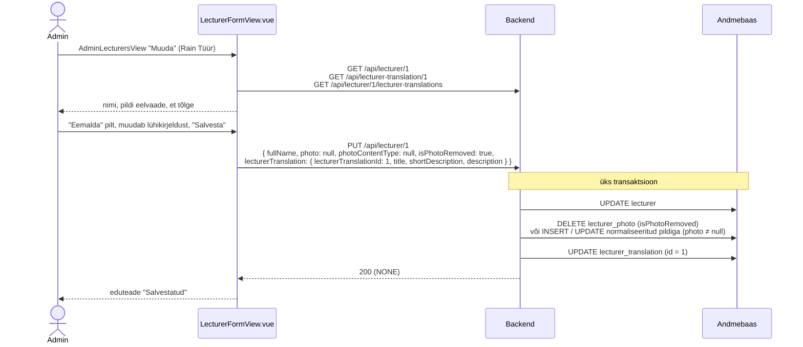
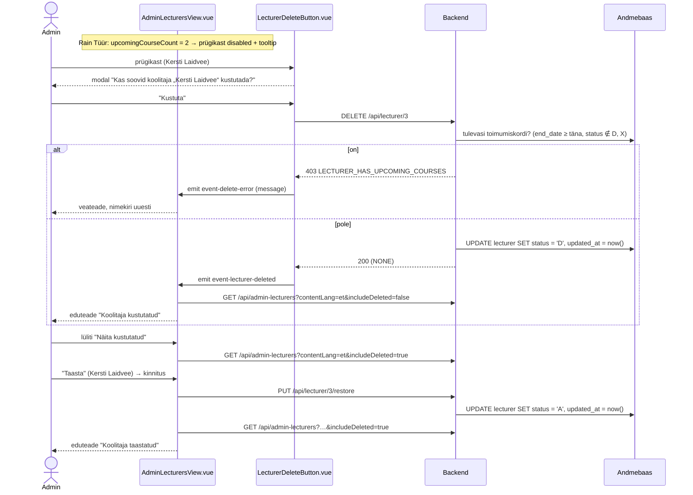

# AdminLecturersView.vue ja LecturerFormView.vue — skeemid

Koolitajate haldus: nimekiri (`AdminLecturersView.vue`), koolitaja lisamise/muutmise vorm (`LecturerFormView.vue`) ja jagatud koolitaja kaart (`LecturerCard.vue`). Selles failis on otsused, andmebaasi ettepanekud ja andmevood skeemidena (Mermaid). Märkmed: `docs/mock-wireframe/markmed/admin-lecturers-view-markmed.md` ja `docs/mock-wireframe/markmed/lecturer-form-view-state-*-markmed.md`. Interaktiivne läbimäng: `admin-lecturers-view-labimang.html`.

Eeskuju:
- vormi olekud ja tõlkeloogika — `docs/mock-wireframe/loo-mock-vaade/form-view/training-form-view-skeemid.md` (TrainingFormView);
- nimekiri, soft delete ja taastamine — `docs/mock-wireframe/loo-mock-vaade/admin-trainings-view/admin-trainings-view-skeemid.md` (AdminTrainingsView);
- koolitaja pilt (`lecturer_photo` tabel) — `docs/mock-wireframe/loo-mock-vaade/admin-training-courses-view/admin-training-courses-view-skeemid.md`, jaotis 1.

## Otsused

### Üldine

- **Termin kasutajaliideses on "koolitaja"** (inglise keeles "Trainer") — kõikjal, ka olemasolevates tekstides: "Vali lektor" → "Vali koolitaja", "Vaikimisi lektor" → "Vaikimisi koolitaja", "— lektor puudub —" → "— koolitaja puudub —", navbari "Lektorid" → "Koolitajad"; en: "Lecturer(s)" → "Trainer(s)". Muutuvad `et.json` / `en.json` võtmed `navbar.lecturers`, `trainingForm.*` ja `trainingForm.lecturerModal.*` (võtmete nimed jäävad). Koodis ja andmebaasis jääb `lecturer`.
- **Navbar → menüü "Admin"** (nähtav ainult adminile, `App.vue`): link "Koolitajad" → `/admin-lecturers` (i18n `navbar.manageLecturers`). Uus koolitaja lisatakse nimekirja nupust "+ Lisa uus koolitaja" (menüüs algselt olnud link "Lisa uus koolitaja" eemaldati). (Admin-menüü uuendatud 2026-10-01: vt `docs/tasks/frontend/admin-menu.md`.)
- **Staatus** (`lecturer.status`, `varchar(1)`): `A` = aktiivne (`LecturerStatus.ACTIVE`), `D` = kustutatud (`LecturerStatus.DELETED`, soft delete). Mustandi/publitseerimise olekut koolitajal pole.

### Mitu koolitajat — `training_lecturer` ja `course_lecturer`

- Koolitusel ja toimumiskorral võib olla **mitu koolitajat** (ka 0). Seostabelid `training_lecturer` ja `course_lecturer` (veerg `sort_order` = kuvamise järjekord, 1 = esimene); eraldi "peakoolitaja" rolli pole. `training.default_lecturer_id` ja `course.lecturer_id` eemaldatakse.
- Koolituse koolitajad on "vaikimisi meeskond": **uue toimumiskorra vorm eeltäidetakse koolituse koolitajatega**; edasi on toimumiskorra koolitajad koolitusest sõltumatud (koolituse koolitajate hilisem muutmine olemasolevaid toimumiskordi ei muuda).
- Vormides (TrainingFormView, CourseFormView) on väli **"Koolitajad"**: valitud koolitajate nimekiri (× eemaldab, ↑ ↓ muudab järjekorda), "+ Lisa koolitaja" avab "Vali koolitaja" modali (juba valitud koolitajaid ei pakuta). API-s `lecturerIds: [1, 8]` (järjekord = `sort_order`) ja vastustes `lecturers: [{ lecturerId, lecturerName }]`.
- Kuvamine: avalikul koolituse lehel (`/training`) on iga koolitaja jaoks `LecturerCard`; admini kalendris (koolituse kaart, tabeli veerg "Koolitajad", toimumiskorra vorm) ainult nimed.
- Kustutatud koolitaja: olemasolevad seosed jäävad; uueks koolitajaks teda lisada ei saa (404), aga juba seotud koolitajaga saab koolitust / toimumiskorda edasi salvestada.
- Koolitajate nimekirja arvud ja kustutamise keeld loetakse seostabelitest (vt view allpool); avaliku profiili "Koolitused" = publitseeritud koolitused `training_lecturer` kaudu.

### Koolitaja tõlge — samad väljad nagu koolitusel

`lecturer_translation` tabelis on `bio` asemel samad väljad nagu `training_translation`-il:

| Väli | Vormis | Tähendus | Kus kuvatakse |
|---|---|---|---|
| `title` | "Ametinimetus *" | lühidalt, millega koolitaja tegeleb, nt "Lektor/konsultant", "Projektijuht/lektor" | koolitaja kaardil nime all, admini nimekirjas |
| `short_description` | "Lühikirjeldus *" | 1–2 lauset | koolitaja kaardil |
| `description` | "Kirjeldus *" (`RichTextEditor`) | pikk tutvustus | tulevikus avalikul koolitajate lehel |

- Kõik kolm on kohustuslikud; `title` ja `short_description` kuni 255 märki (nagu koolitusel).
- Välja "Ametinimetus" sildi kõrval on **küsimärgi ikoon tooltip'iga** (sama muster nagu AdminTrainingsView otsingu selgitus): "Ametinimetus kuvatakse koolitaja kaardil nime all. Kirjuta lühidalt, millega koolitaja tegeleb, nt „Lektor/konsultant“ või „Projektijuht/lektor“. Iga keele jaoks eraldi tõlge."
- Välja "Lühikirjeldus" all vihje: "Kuvatakse koolitaja kaardil koolituse lehel ja toimumiskorra juures."
- AI tõlge tõlgib kõik kolm välja korraga (nagu koolituse AI tõlge: `title`, `shortDescription`, `description`).

### Koolitaja kaart — `LecturerCard.vue`

- Kuvab: pilt (`LecturerAvatar`, pilt pilditeenusest `GET /api/lecturer/{lecturerId}/photo?v={photoVersion}` (vt `lecturers-view-skeemid.md`, "Pildid")), nimi, ametinimetus (`title`), lühikirjeldus (`shortDescription`) — kasutajaliidese keeles (store'i `contentLang`), puuduva tõlke korral põhikeeles.
- Komponent laeb andmed ise: prop `lecturerId`, päring `GET /api/lecturer-summary/{lecturerId}?contentLang=` (ka `lecturerId` või keele muutumisel). `lecturerId = null` → kaarti ei kuvata.
- Kustutatud või olematu koolitaja → 404 → kaarti ei kuvata (üldisele veavaatele ei suunata).
- Kasutab:
  - `TrainingView.vue` (`/training`) — parema veeru olemasolev kohatäide "Koolitaja" (`trainingView.sidebar.lecturer`): koolituse koolitajad (iga koolitaja jaoks oma kaart);
- Seepärast ei tagasta `GET /api/admin-training/{trainingId}` enam `defaultLecturerPhoto` / `defaultLecturerPhotoContentType` — pilt tuleb ainult `lecturer-summary` teenusest (admin-training-courses-view skeemid ja märkmed on uuendatud).

### Koolitajate nimekiri — `AdminLecturersView.vue`

- Roll: Admin. Rada `/admin-lecturers`.
- Päis: pealkiri "Koolitajad", paremal nupp "+ Lisa uus koolitaja" → `/lecturer-form`.
- **Pilti ei kuvata** (nimekirja päring pilte ei loe).
- Veerud: Nimi | Ametinimetus | Tõlked | Koolitusi | Tulevasi toimumiskordi | Uuendatud | Tegevused.
  - **Ametinimetus** = `title` kasutajaliidese keeles, puudumisel põhikeeles.
  - **Tõlked** = ✓, kui tõlge on olemas igas keeles, mille `requires_translation = true`; muidu ✗, mille tooltip näitab puuduvaid keeli ("Puudub: en") — sama nagu AdminTrainingsView-s.
  - **Koolitusi** = aktiivsed koolitused (`status <> 'D'`), mille koolitajate hulgas ta on (`training_lecturer`).
  - **Tulevasi toimumiskordi** = toimumiskorrad, kus ta on koolitaja, `end_date >= täna` ja `status NOT IN ('D', 'X')`.
  - **Uuendatud** = hiliseim `lecturer`, `lecturer_translation` ja `lecturer_photo` `updated_at`, kuvatakse `30/09/2026`.
  - **Tegevused**: "Muuda" (pliiats) → `/lecturer-form?lecturerId={id}&lecturerTranslationId={id}` (kasutajaliidese keele tõlge, puudumisel põhikeele oma) ja "Kustuta" (prügikast, `LecturerDeleteButton.vue`).
- **Kustutamine** (`LecturerDeleteButton.vue`, sama muster nagu `TrainingDeleteButton`): prügikast → kinnituse modal "Kas soovid koolitaja „Kersti Laidvee“ kustutada?" → `DELETE /api/lecturer/{lecturerId}` → nimekiri uuesti, eduteade "Koolitaja kustutatud".
  - Kui `upcomingCourseCount > 0`, on prügikast keelatud (`disabled`) ja tooltip ütleb: "Koolitajal on tulevasi toimumiskordi — vali neile enne teine koolitaja". Backend kontrollib sama (`403 LECTURER_HAS_UPCOMING_COURSES`); kui see siiski tuleb (nt teises aknas lisati toimumiskord), näidatakse backendi `message`-it ja laaditakse nimekiri uuesti.
  - Koolitaja roll koolitustel kustutamist ei keela — koolitus jääb seotuks, aga koolitaja kaarti enam ei kuvata.
- **Lüliti "Näita kustutatud"** (vaikimisi väljas) → päring `includeDeleted=true`. Kustutatud read on tuhmimad, märgisega "Kustutatud"; neil on ainult nupp "Taasta" (kinnitusega, `PUT /api/lecturer/{lecturerId}/restore` → `status = 'A'`), "Muuda" ja "Kustuta" on peidus.
- Järjestus nime järgi (A → Õ). Sorteerimist ja leheküljestust pole.
- Otsinguväli "Otsi nime järgi…" filtreerib **frontendis** (sisaldab, tõstutundetu, trükkimise ajal). Tühi tulemus: "Koolitajaid ei leitud".
- Tabeli all "Kokku N koolitajat".
- Keele vahetusel navbaris laaditakse nimekiri uuesti (`title` ja `lecturerTranslationId` sõltuvad keelest), otsingusõna ja lüliti jäävad.

### Kustutatud koolitaja teistes teenustes

Kustutatud koolitaja on nagu olematu → `404 PRIMARY_KEY_NOT_FOUND` (`'lecturerId'`). Muudatus olemasolevatele ja uutele teenustele:
- `GET /api/lecturers` ("Vali koolitaja" modal) tagastab ainult aktiivsed;
- vormi teenused `GET/PUT /api/lecturer/{lecturerId}`, `GET .../lecturer-translations`, `GET /api/lecturer-translation/{id}`, `POST .../lecturer-translation`, `GET .../ai-translation`, `GET /api/lecturer-summary/{lecturerId}`;
- `POST /api/training`, `PUT /api/training/{trainingId}` (`defaultLecturerId`), `POST /api/training/{trainingId}/course`, `PUT /api/course/{courseId}` (`lecturerId`) — kustutatud koolitajat ei saa valida.
- Erandid: `DELETE` (juba kustutatud → midagi ei muutu) ja `restore`.
- Olemasolevad seosed (`training_lecturer`, `course_lecturer`) jäävad alles; nimi kuvatakse tabelites edasi.

### Koolitaja vorm — `LecturerFormView.vue`

Sama olekuloogika nagu TrainingFormView-l: olek tuleneb URL-i query parameetritest, pärast iga `router.replace`-i laaditakse andmed uuesti.

| Olek | `state` | URL | Pealkiri | Vormi sisu | Nupud | Lipukesed |
|---|---|---|---|---|---|---|
| **A. Uus koolitaja** | `"new-lecturer"` | `/lecturer-form` | "Lisa uus koolitaja" | tühi vorm, tõlke keel = põhikeel | "Lisa" | — |
| **B. Muutmine** | `"update"` | `/lecturer-form?lecturerId=1&lecturerTranslationId=2` | "Muuda koolitajat" | nimi, pilt ja avatud tõlge täidetud | "Salvesta" (+ "Tee AI tõlge" mitte-põhikeelel) | jah |
| **C. Uus tõlge** | `"new-translation"` | `/lecturer-form?lecturerId=3&languageId=2` | "Lisa koolitaja tõlge" | nimi ja pilt kirjutuskaitstud, tõlke väljad eeltäidetud põhikeele tekstiga | "Lisa tõlge", "Tee AI tõlge" | jah |

- **Kaart "Koolitaja andmed"** (ei ole tõlgitav):
  - **Täisnimi** (`lecturer.full_name`) — kohustuslik, kuni 255 märki.
  - **Pilt** (`lecturer_photo`) — valikuline; "Vali pilt" (PNG, JPEG, WebP, kuni 2 MB), eelvaade (`LecturerAvatar.vue`, suurem) ja "Eemalda". Salvestatud pilti näidatakse pilditeenusest (`photoVersion`), uut valitud pilti `FileReader`-i Base64 eelvaatena. Frontend kontrollib tüüpi ning suurust enne saatmist ("Lubatud on PNG, JPEG või WebP pilt kuni 2 MB"). **Backend normaliseerib pildi** (ruut, 400×400, JPEG, EXIF eemaldatud) — vt `lecturers-view-skeemid.md`, "Pildid".
- **Kaart "Tõlge ({keel})"** (lipp pealkirjas): Ametinimetus (+ "?" tooltip), Lühikirjeldus, Kirjeldus (`RichTextEditor.vue`).
- **Lipukesed** (`TranslationFlags.vue`, olemas): tõlkekeeled vs `GET /api/lecturer/{lecturerId}/lecturer-translations`. Tõlge olemas → värviline lipp (klikk avab selle tõlke), puudub → hall lipp (klikk → olek C). Komponendi prop `trainingTranslations` nimetatakse üldisemaks (`existingTranslations`) ja i18n võtmed `trainingForm.flags.*` → `translationFlags.*`; TrainingFormView kasutab sama komponenti edasi.
- **"Lisa"** (A) → `POST /api/lecturer` (nimi, pilt, põhikeele tõlge; `userId` localStorage'ist) → vastuse järgi `router.replace` → olek B, eduteade "Koolitaja lisatud".
- **"Salvesta"** (B) → `PUT /api/lecturer/{lecturerId}` — nimi, pilt ja avatud tõlge ühes transaktsioonis. Pilt: `photo` = **uus** pilt (Base64) → lisatakse või asendatakse (normaliseeritult); `photo = null` → pilti ei muudeta; `isPhotoRemoved: true` → pilt eemaldatakse. Nii ei kodeerita sama pilti igal salvestamisel uuesti. Eduteade "Salvestatud".
- **"Lisa tõlge"** (C) → `POST /api/lecturer/{lecturerId}/lecturer-translation` → `router.replace` → olek B.
- **"Tee AI tõlge"** (C ja B mitte-põhikeelel) → `GET /api/lecturer/{lecturerId}/ai-translation?languageId={id}` tõlgib **salvestatud põhikeele tõlke** (kõik kolm välja) ja täidab ainult vormi; salvestamata muudatuste korral küsitakse enne üle kirjutamist kinnitust. Frontend võib alustada mock-vastusega.
- Kiirnupp "Koolitajad" → `/admin-lecturers` (olekutes A, B, C). Kustutamist vormis pole (ainult nimekirjas).
- Kustutatud või olematu koolitaja → 404 → üldine veavaade.
- Frontendi kontroll enne saatmist: täisnimi, ametinimetus, lühikirjeldus ja kirjeldus täidetud ("Täida kõik kohustuslikud väljad"), pildi tüüp ja suurus — `AlertDanger`.

### Uued teenused (ettepanek, URL-ide kokkuleppe järgi)

| Teenus | Põhjendus |
|---|---|
| `GET /api/admin-lecturers?contentLang=&includeDeleted=` | admini nimekiri → mitmus, `admin-` eesliide nagu `GET /api/admin-trainings` |
| `GET /api/lecturer/{lecturerId}` | ühe objekti andmed (nimi + pilt) |
| `GET /api/lecturer/{lecturerId}/lecturer-translations` | ühe objekti alamnimekiri (lipukesed) |
| `GET /api/lecturer-translation/{lecturerTranslationId}` | üks tõlge (sama muster nagu `GET /api/training-translation/{id}`) |
| `POST /api/lecturer` | loob koolitaja koos põhikeele tõlkega |
| `PUT /api/lecturer/{lecturerId}` | muudab koolitajat ja avatud tõlget |
| `POST /api/lecturer/{lecturerId}/lecturer-translation` | lisab tõlke |
| `GET /api/lecturer/{lecturerId}/ai-translation?languageId=` | AI tõlge (sama muster nagu koolitusel) |
| `DELETE /api/lecturer/{lecturerId}` | soft delete (`status = 'D'`) |
| `PUT /api/lecturer/{lecturerId}/restore` | tegevusteenus: taastab (`status = 'A'`) |
| `GET /api/lecturer-summary/{lecturerId}?contentLang=` | koolitaja kaardi andmed (sama nimeloogika nagu `training_summary` / `TrainingSummaryDto`) |
| `GET /api/lecturer/{lecturerId}/photo` | pildi baidid ``-i jaoks — defineeritud `lecturers-view-skeemid.md`-s |
| `GET /api/languages` | **olemas** — lipukesed, põhikeel |
| `GET /api/lecturers?search=` | **olemas, muutub** — ainult aktiivsed; `lecturerPhoto` eemaldatakse DTO-st |

Uued väärtused `Error` enumisse (`403`):
- `PHOTO_TYPE_NOT_ALLOWED("Lubatud on ainult PNG, JPEG või WebP pilt")`;
- `PHOTO_TOO_LARGE("Pilt on liiga suur, lubatud kuni 2 MB")`;
- `LECTURER_HAS_UPCOMING_COURSES("Koolitajal on tulevasi toimumiskordi, vali neile enne teine koolitaja")`.

Olemasolevat `TRANSLATION_EXISTS` kasutatakse ka koolitaja tõlke korral. AI tõlke vead (`MAIN_LANGUAGE_NOT_TRANSLATABLE`, `AI_SERVICE_UNAVAILABLE`) on samad mis koolituse AI tõlkel.

---

## 1. Andmebaasi muudatused (ettepanek)

**NB!** DDL ja seed on ettepanek, andmebaasi vastu pole käivitatud. `2_create.sql` ja `3_import.sql` muudetakse backend taski käigus. Tabel `lecturer_photo` ja `lecturer.photo` veeru eemaldamine: admin-training-courses-view skeemid, jaotis 1.

```sql
-- Table: lecturer (photo veerg eemaldatud, lisandub status)
CREATE TABLE lecturer
(
    id         serial       NOT NULL,
    full_name  varchar(255) NOT NULL,
    status     varchar(1)   NOT NULL,
    created_at timestamp    NOT NULL,
    updated_at timestamp    NOT NULL,
    created_by int          NOT NULL,
    CONSTRAINT lecturer_pk PRIMARY KEY (id)
);

-- Table: lecturer_translation (bio asemel samad väljad nagu training_translation-il)
CREATE TABLE lecturer_translation
(
    id                serial       NOT NULL,
    lecturer_id       int          NOT NULL,
    language_id       int          NOT NULL,
    title             varchar(255) NOT NULL,
    short_description varchar(255) NOT NULL,
    description       text         NOT NULL,
    created_at        timestamp    NOT NULL,
    updated_at        timestamp    NOT NULL,
    CONSTRAINT lecturer_translation_pk PRIMARY KEY (id),
    CONSTRAINT lecturer_translation_uq UNIQUE (lecturer_id, language_id)
);

-- Table: training_lecturer (koolituse koolitajad; asendab training.default_lecturer_id)
CREATE TABLE training_lecturer
(
    id          serial NOT NULL,
    training_id int    NOT NULL,
    lecturer_id int    NOT NULL,
    sort_order  int    NOT NULL,
    CONSTRAINT training_lecturer_pk PRIMARY KEY (id),
    CONSTRAINT training_lecturer_uq UNIQUE (training_id, lecturer_id)
);

-- Table: course_lecturer (toimumiskorra koolitajad; asendab course.lecturer_id)
CREATE TABLE course_lecturer
(
    id          serial NOT NULL,
    course_id   int    NOT NULL,
    lecturer_id int    NOT NULL,
    sort_order  int    NOT NULL,
    CONSTRAINT course_lecturer_pk PRIMARY KEY (id),
    CONSTRAINT course_lecturer_uq UNIQUE (course_id, lecturer_id)
);

-- + välisvõtmed: training_lecturer_training → training(id), training_lecturer_lecturer → lecturer(id),
--   course_lecturer_course → course(id), course_lecturer_lecturer → lecturer(id)
-- Eemaldatakse: training.default_lecturer_id (FK course_default_lecturer / vastav), course.lecturer_id (FK course_timetable_lecturer)
```

### View `admin_lecturer_summary`

Eeskuju: `admin_training_summary` — rida iga koolitaja ja iga tõlkekeele kohta, et `title` ja `lecturerTranslationId` oleksid kasutajaliidese keeles (puudumisel põhikeeles). Staatuse filter rakendatakse päringus.

```sql
-- Admini koolitajate nimekiri: üks rida koolitaja ja tõlkekeele kohta
CREATE VIEW admin_lecturer_summary AS
SELECT row_number() OVER (ORDER BY l.id, cl.id)                    AS id,
       l.id                                                        AS lecturer_id,
       cl.code                                                     AS content_language_code,
       COALESCE(lt.id, mlt.id)                                     AS lecturer_translation_id,
       l.full_name,
       COALESCE(lt.title, mlt.title)                               AS title,
       l.status,
       mt.missing_translation_language_codes,
       mt.missing_translation_language_codes IS NULL               AS has_all_translations,
       (SELECT count(*)
        FROM training_lecturer trl
                 JOIN training t ON t.id = trl.training_id
        WHERE trl.lecturer_id = l.id
          AND t.status <> 'D')                                     AS training_count,
       (SELECT count(*)
        FROM course_lecturer crl
                 JOIN course c ON c.id = crl.course_id
        WHERE crl.lecturer_id = l.id
          AND c.status NOT IN ('D', 'X')
          AND c.end_date >= current_date)                          AS upcoming_course_count,
       -- GREATEST ignoreerib NULL-e (pilti ei pruugi olla)
       GREATEST(l.updated_at,
                (SELECT MAX(alt.updated_at) FROM lecturer_translation alt WHERE alt.lecturer_id = l.id),
                (SELECT lp.updated_at FROM lecturer_photo lp WHERE lp.lecturer_id = l.id)) AS updated_at
FROM lecturer l
         CROSS JOIN language cl
         JOIN language ml ON ml.is_main_language
         LEFT JOIN lecturer_translation lt ON lt.lecturer_id = l.id AND lt.language_id = cl.id
         LEFT JOIN lecturer_translation mlt ON mlt.lecturer_id = l.id AND mlt.language_id = ml.id
         -- string_agg tühjast hulgast annab NULL, seega NULL = kõik tõlked olemas
         CROSS JOIN LATERAL (SELECT string_agg(rl.code, ',' ORDER BY rl.id) AS missing_translation_language_codes
                             FROM language rl
                             WHERE rl.requires_translation
                               AND NOT EXISTS (SELECT 1
                                               FROM lecturer_translation rlt
                                               WHERE rlt.lecturer_id = l.id
                                                 AND rlt.language_id = rl.id)) mt
WHERE cl.requires_translation;
```

| Veerg | Kasutus |
|---|---|
| `content_language_code` | filter `contentLang` järgi (alati) |
| `lecturer_translation_id`, `title` | "Muuda" link, Ametinimetus |
| `full_name` | Nimi, järjestus |
| `status` | filter (`includeDeleted=false` → `status = 'A'`), märgis, "Taasta" |
| `missing_translation_language_codes`, `has_all_translations` | Tõlked ✓/✗ ja tooltip |
| `training_count`, `upcoming_course_count` | veerud (`bigint` → `Long`); `upcoming_course_count > 0` → prügikast keelatud |
| `updated_at` | Uuendatud |

`GET /api/lecturer-summary/{lecturerId}` koostatakse ilma view'ta: `lecturer` (aktiivne) + `lecturer_translation` `contentLang` keeles (puudumisel põhikeeles) + `lecturer_photo`.

### Seed-andmed (`3_import.sql`, ettepanek)

```sql
-- Table: lecturer
INSERT INTO lecturer (id, full_name, status, created_at, updated_at, created_by) VALUES
    (1, 'Rain Tüür', 'A', '2026-07-15 09:00:00', '2026-07-15 09:00:00', 1),
    (2, 'Merje Vaide', 'A', '2026-07-15 09:00:00', '2026-07-15 09:00:00', 1),
    (3, 'Kersti Laidvee', 'A', '2026-09-20 10:00:00', '2026-09-20 10:00:00', 1),
    (4, 'Virve Räni', 'D', '2026-07-20 09:00:00', '2026-09-01 16:00:00', 1),
    (5, 'Tarmo Rosenfeldt', 'A', '2026-07-15 09:00:00', '2026-07-15 09:00:00', 1),
    (6, 'Margus Sakk', 'A', '2026-07-15 09:00:00', '2026-07-15 09:00:00', 1),
    (7, 'Andres Liitmaa', 'A', '2026-07-15 09:00:00', '2026-07-15 09:00:00', 1),
    (8, 'Meelis Teern', 'A', '2026-07-15 09:00:00', '2026-07-15 09:00:00', 1),
    (9, 'Tarmo Kallas', 'A', '2026-09-22 11:00:00', '2026-09-22 11:00:00', 1);

-- Table: lecturer_translation (title = amet, short_description = peamised spetsialiseerumised)
INSERT INTO lecturer_translation (id, lecturer_id, language_id, title, short_description, description, created_at, updated_at) VALUES
    (1, 1, 1, 'Lektor/konsultant', 'Tarkvaraarendus, Java, HTML, CSS, JavaScript, SQL, Git, Spring Boot, REST API, PostgreSQL, JPA (Hibernate), MapStruct, JUnit, Swagger, Gradle, Confluence, Jira. Vali Tarkvaraarendus! programm.', '<p>Tarkvaraarendus, Java, HTML, CSS, JavaScript, SQL, Git, Spring Boot, REST API, PostgreSQL, JPA (Hibernate), MapStruct, JUnit, Swagger, Gradle, Confluence, Jira. Vali Tarkvaraarendus! programm.</p>', '2026-07-15 09:00:00', '2026-07-15 09:00:00'),
    (2, 1, 2, 'Lecturer/consultant', 'Software development, Java, HTML, CSS, JavaScript, SQL, Git, Spring Boot, REST API, PostgreSQL, JPA (Hibernate), MapStruct, JUnit, Swagger, Gradle, Confluence, Jira. Vali Tarkvaraarendus! programme.', '<p>Software development, Java, HTML, CSS, JavaScript, SQL, Git, Spring Boot, REST API, PostgreSQL, JPA (Hibernate), MapStruct, JUnit, Swagger, Gradle, Confluence, Jira. Vali Tarkvaraarendus! programme.</p>', '2026-07-15 09:00:00', '2026-07-15 09:00:00'),
    (3, 2, 1, 'Projektijuht/lektor', 'Microsoft Office rakendused, andmeanalüüs, tarkvaraarendus, veebiarendus. Täiskasvanute koolitaja tase 6.', '<p>Microsoft Office rakendused, andmeanalüüs, tarkvaraarendus, veebiarendus. Täiskasvanute koolitaja tase 6.</p>', '2026-07-15 09:00:00', '2026-07-15 09:00:00'),
    (4, 2, 2, 'Project manager/lecturer', 'Microsoft Office applications, data analysis, software development, web development. Adult educator, level 6.', '<p>Microsoft Office applications, data analysis, software development, web development. Adult educator, level 6.</p>', '2026-07-15 09:00:00', '2026-07-15 09:00:00'),
    (5, 3, 1, 'Lektor/konsultant', 'Adobe Photoshop, Illustrator, InDesign, Acrobat, Canva, Figma, e-turundus, e-õppe disain, Office rakendused.', '<p>Adobe Photoshop, Illustrator, InDesign, Acrobat, Canva, Figma, e-turundus, e-õppe disain, Office rakendused.</p>', '2026-09-20 10:00:00', '2026-09-20 10:00:00'),
    (6, 4, 1, 'Lektor/konsultant', 'Andmeanalüüs, Power BI, SQL, Tableau, SAP BO, Excel, Vali Andmetarkus! programm.', '<p>Andmeanalüüs, Power BI, SQL, Tableau, SAP BO, Excel, Vali Andmetarkus! programm.</p>', '2026-07-20 09:00:00', '2026-07-20 09:00:00'),
    (7, 5, 1, 'Lektor/konsultant', 'Microsoft 365, MS Teams, SharePoint, Planner, Viva Goals, Office rakendused, küberturvalisus. Täiskasvanute koolitaja tase 6.', '<p>Microsoft 365, MS Teams, SharePoint, Planner, Viva Goals, Office rakendused, küberturvalisus. Täiskasvanute koolitaja tase 6.</p>', '2026-07-15 09:00:00', '2026-07-15 09:00:00'),
    (8, 5, 2, 'Lecturer/consultant', 'Microsoft 365, MS Teams, SharePoint, Planner, Viva Goals, Office applications, cybersecurity. Adult educator, level 6.', '<p>Microsoft 365, MS Teams, SharePoint, Planner, Viva Goals, Office applications, cybersecurity. Adult educator, level 6.</p>', '2026-07-15 09:00:00', '2026-07-15 09:00:00'),
    (9, 6, 1, 'Lektor/konsultant', 'Power BI, Bizagi, Power Automate, Access, Visio, Office rakendused, kasutajakoolitused ja andmeanalüüs.', '<p>Power BI, Bizagi, Power Automate, Access, Visio, Office rakendused, kasutajakoolitused ja andmeanalüüs.</p>', '2026-07-15 09:00:00', '2026-07-15 09:00:00'),
    (10, 6, 2, 'Lecturer/consultant', 'Power BI, Bizagi, Power Automate, Access, Visio, Office applications, user training and data analysis.', '<p>Power BI, Bizagi, Power Automate, Access, Visio, Office applications, user training and data analysis.</p>', '2026-07-15 09:00:00', '2026-07-15 09:00:00'),
    (11, 7, 1, 'Spetsialisti valdkonna lektor/konsultant', 'Microsofti ametlikud sertifitseerimiskoolitused (MOC), serverid, pilvetehnoloogiad, Microsoft Certified Trainer.', '<p>Microsofti ametlikud sertifitseerimiskoolitused (MOC), serverid, pilvetehnoloogiad, Microsoft Certified Trainer.</p>', '2026-07-15 09:00:00', '2026-07-15 09:00:00'),
    (12, 7, 2, 'Specialist lecturer/consultant', 'Official Microsoft certification courses (MOC), servers, cloud technologies, Microsoft Certified Trainer.', '<p>Official Microsoft certification courses (MOC), servers, cloud technologies, Microsoft Certified Trainer.</p>', '2026-07-15 09:00:00', '2026-07-15 09:00:00'),
    (13, 8, 1, 'Lektor/konsultant', 'Tarkvaraarendus, Java, JavaScript, HTML, CSS, Vue, Angular, Vali Tarkvaraarendus! programm.', '<p>Tarkvaraarendus, Java, JavaScript, HTML, CSS, Vue, Angular, Vali Tarkvaraarendus! programm.</p>', '2026-07-15 09:00:00', '2026-07-15 09:00:00'),
    (14, 8, 2, 'Lecturer/consultant', 'Software development, Java, JavaScript, HTML, CSS, Vue, Angular, Vali Tarkvaraarendus! programme.', '<p>Software development, Java, JavaScript, HTML, CSS, Vue, Angular, Vali Tarkvaraarendus! programme.</p>', '2026-07-15 09:00:00', '2026-07-15 09:00:00'),
    (15, 9, 1, 'Lektor/konsultant', 'SharePoint, Power Platform, veebiarendus, UX (kasutajakogemus), veebiliideste arendus.', '<p>SharePoint, Power Platform, veebiarendus, UX (kasutajakogemus), veebiliideste arendus.</p>', '2026-09-22 11:00:00', '2026-09-22 11:00:00');

-- Table: lecturer_photo (Rain Tüüri foto docs/mock-wireframe/lecturer-photos/rain-tuur.jpg, 200×200 JPEG; teistel pilti pole)
INSERT INTO lecturer_photo (id, lecturer_id, photo, content_type, created_at, updated_at) VALUES
    (1, 1, decode('/9j/4AAQSkZJRgABAgAAAQABAAD//gAQTGF2YzYwLjMxLjEwMgD/2wBDAAgGBgcGBwgICAgICAkJCQoKCgkJCQkKCgoKCgoMDAwKCgoKCgoKDAwMDA0ODQ0NDA0ODg8PDxISEREVFRUZGR//xACfAAABBQEBAQAAAAAAAAAAAAAEBwUDBgIBAAgBAAMBAQEAAAAAAAAAAAAAAAABAgMEBRAAAQIDBQMIBwUHBQEBAQAAAQIDAAQREiExQQVRYXGhkfATsYEiBtEUwUJSMiNyQxUH4bKC8TMWNWIlJHNTkqI0dBEAAgIBAwQCAgIBBQEAAAAAAAECESExEgNBUWEEcRMyIkKRwbGhgvAUUv/AABEIAMgAyAMBIgACEQADEQD/2gAMAwEAAhEDEQA/AFVRNS4USVCCPXpQe+mKYmQftGriolEg7mtXPDIvsWw6pJp98ckYOuSafeEVf8MUcSrnjqdJ3GHfgMljV5ik0+9EKvNUoMIZhpI+GJBpSfhEAsjgfNrOSVHuiJXm3Y0rmiFOmNj3RGX5eWlUWnKJ3XVVuAg01Cm9GSHzY8r5WVc0RHzNOKwaPJDFNa0w0bKAlOOwqO++GqZ1i0kFTpSnAWbyb+YCM3yq8GsfXk1bdFtV5hnz7oFdpjB1nU3Pls9xrFHRqzTjlEVA+JR5E0NTwwiUuvdchSRcLwrrAlYG0ZAbq1hfd4K/81/yLiZ/Vle8BzxnrtUX97yQLpOs2lpYmaKBuS7jeT7xwHMItaZVOwRrFqSwYzg4OmV2zqSsX1xz1WeVi85Fm9WGyOiXGyGSVkafMnF1znjQ0p04rWe8xZeoGyOhgQxlb/BtpV3kx38ETsMWXqRsjQZ3QsBSK0NFR8MSJ0dHwiLF1IjvVCAKGFOkN/CIkGlI+EQ+dVujoaEADH+FI+ER78LR8MPvVCPdUIAG8sCsdDA2RNQlVIlDKoSdjoGDI2RoMjZBQYVGgwYABeqGyO9WIL6jfHeohhQzahNtaeyXHDT3Uj4lUigatrzilBa71LHhQP2U7AMyYsfn1pZRLttm+il3HA4DsioaXo7s3MJXNkqsfKcuaMOaXQ6fW41SfchTp84+kOFAUpV9PdAyG0x5HlqcmVWngpewWbgNlDWFAl22W0hIQKCDEPNpyEYV5O1JLoJ5/TLzdAEq49D6Yc5Lyw64UghY40p2ReAtpWKR3iNJfbTgAOENR8i/4le/okOI8Lym1ZEAC/miwaU6soMtMCkxLgJXX7xPuup+1nsiT11IzpELzgLzUyj52qWqe82o+JJ27Y0hJReGc/PxOayqodLG6PWN0T9fL0raTQ4Rz1qWHvJ5I6LOIhsR3q90Seuyo99MZOoSo99MGQOdXujvVmMnVZMe+nkiP8bk7/GLjTKAKRP1ZjXVGBDr0l8aecRg+YpIe+nnEAfqH9WY71ZhrV5nkR94nnHpiJXmyRT94nngHaHrqjHuqhgV5xkR7454z/Wcj8YhWLAwN+cmcaiCB51b6VigNShVBrciEJtKNBEpy7FMuX9aJ2Rk+dNiTFVQiW+MRMlEr8Yisix3LCfOa/hVGD5zdyQYY6Sg94R3/aYWhB+wsdx3XqB1dIdcBqmqaR5g2LwNsRtNtstiwtDiVZtqtJCveQaZiC0IIoRGE3ds7+GEo7VJVRK26pRwMGoZCr1GkA+vsSQ8V6jgIb9Q8wTSEWmZcrHTKM6Om8lm6sXeOsdSlNbzWKPK+bVlyy8koVhZhxm/MHUNhdFJr8QMCaHtZaXGkq+WByotkg5xUJPzPOqeFEAoJzoD3Viyt6k1OpCViw4cK4wJ5Il2Yw6lNTrU48ht1YRWqaZAiBfW59X3rnPDvqfVSykLWpBUu6zfaFnM7oETMsHACOqEXKKyeXyLZN4Ai7On7x3nMYJmzi45zmHQOoOCRHi6Mkxf1vuRuXYa+rmT7y//AEY4pl6iaFWdbzjDiX1DBEblSXXKFJvx3QbGG5DT1D2/nMe9WeO2LV6iPhgWZYU2pKUjGF9fkN3gYPU3jtj3qDvSsWBMq5GxKObYewe4rw09yO/hznQRYhJq2iO+pK2jng2IW5jBLyouuiTVpezJLpd4TfDgw1Ske1hv/Yr+yeyBLASYlxL4+8Xzxy2//wBjnOYNLUZLcSRY2zD0wPvXP/RjmnqfenJZCnXKKfaBvOFsV5Inm0ACIpRXUvtOfA4lX/lQJhSVplQ/KLem5F7kUtSD7ct1v1HFqWpu83qUVY4C66kWk/KABDUnTGn5hqf8JUbJoBU0pcsHZDswfHftjjVpV2Pe5dspqV3cbK5qml6q84pTCktV+9XU2R/ijbDIPLM+8+C9qE86M0N1CCaY1PZCpthCgK0pvjzrsswgm64bopYRnWlFB07yo7LvtqeecdsEEJcoSNxNL4tevaMjUdOQhPgUKEKAFQRxrfyQK9r8iwtbjyw2lGRurvvpHP650kJCCsKQR89RSuVDhC7mjUnRTF+S3G3kuLen1GoqoEFC+IAiz6ToczKLSsOqcaBtJC62kGl6RXKHyS1mWdWkVqlaQpCqXFJ2HAw6qmGlpoCIeqIna6aiaefX3JUsPNqIK3Cg7rLeUU5HmKaQfmi3fmOsESjX+bjvdSxCdLajo4bUdTzPcp8z+Ev6RYEebJhON8Eo84rHzAxUS2YyUGNN0jnryXpHnBHhtJIrhXO/EGLZoM318ylspobAVtqFG7khMdSl1L0vTH0VKW2VocIpcrrLq7YUnykOselVFKb5dHiAv93s9sG52gr9ZP4LwGd0BzTA65F0OyBVVnZTlgR2i3UneRzGkWIq2tTjsm+hCCAFXRCJt5Qr1ggPz+tbKUrQaKCoTpPmadaNLQMG5IM5FRL8z/2CPdfNf9ghN0ecZpOIBjf9aP8Awwb0GRWGkUjGtp/2C/snsgpCcIi10f6e59g9kJDloJsGqprGVNQUlFGxAy7QiWjLdQ2agggQAgKGcEau4tKbt0NCZhwHHOFQ1MVLytqjL0khl1wiYaNhKSq5aaeG7OmHdFiQuwawlWmuKbLbwxQoKuzocOaFFRNpWhKgQQRUEb45+WG130Z6nqex9qSesYpBz+p9VdWG93VkukBR8JNOJ2QJM2nVDYTfDdOaI5qD7KW5hbSEm0oJzNKUrGUtDsjJ2Ga0xJaq0lLqEqKcNo77oZZPy3LoVR7xs1uQo1EPg0ORlUj1hh2YUPeW4tXZBDErpbxCRIWhh96e2C1WpotF+xO842JZttsJR1aaN2cqYDhGtP1RxxICwQcx7YG1Hy5LNoQ+yp2XLagrq0qVRQ+FSSdkEtNtBKSjADvhR1InJ0Vnz9MBT0knMNLJ4FQikKXFp82K9Z1JdLw2hKBxAqe2K2WCThHZxpqKPH9h3yz+SC0I4FAKBuuNb9xwiYyp2RqX092ZXYQMsTgOPsisozLNqKGpnR5duXQlAemG7IytrF44Wgd0W/ye2WFMB0pSttiyumVCOhiqMJUrSmmbNFsKZUBsUFkEqGeMWPQgl6cIKilJQ6k7R9OtYzUnuQ+j+E/6FET/AD6giytm7iD+sDISfpk51POqsRTSy21pxQapuBJuqnqq89QDBaG7HUp2ISL+Ebp2QJ/+Yafpgf5QkTjV8K/+YdyB9r2QkriomQ46sELcesRMSY5UwqKs+hkDCI9cH+nufYMTIGERa7/b1/ZPZFoiWjKCE/TEDLRfBwH0xECkwS1MCta2iiRDGE3iLHr6aJEMCU1UOIhJC6ssEk39ARY5VSmZGWd9w20K3FKqCGeTa/244RZpCXt6OhK00tFwiuYtmhEZexiC+Tv9FXyOv/n/ACiFueboNt9I3KziG3qlXdFW1QzEmpVitK5bK5CGRetPgmlRuvxjlabZ6egsjOrt3A2e+ntglOrs1wTyQiY8yTbe8ZgmJB5mnCoFI4iphbH2GuasCuzk63MJUSoUAPLDKmeaZaNVVANbt2XfFKldT1TUnUsteGpBUcqDEndSHdttQTZqVXmp2xfDxOUvBj7HOuOPl6IGnCZh5x1QvWon0QEGfFDqtqIQz4o7kqPMbbywIs3RPIsFCioKoFeEp+IeyCSzHks0RtJN19KEG+vdEzX6sT0Jw6UPhsJuUgg42ai8EHOHbSZiUaU5adBC0FAIyJGZ33i6GFHXNNOkkeFaCCb/AHqEd9Y7IEtzTNoCwqZSQE0pYraIpHJbTTf/AGxJtQvtj/cU5bjjzGhsUIWpVFjZYQQq1+sWBY+qOEVnRpv8W1Coqhth5Sk0uqKKI40Jvi0L/mDhHXCmin0E2/Mo2WrtvsMIwh1a3QK5wsv5m/yu8/smEak02phPGHLVELWQ7lmiAYjsQ4TLdlsQHSKoVsXxOMRa/wD29f2TEqcREOv/ANvX9kwkVL8WUlI8AiKzBCR9McIzZgkYFb8wJ8I4iGFtNVp4iLJr6CpIyGJJuAG0nZFc9bbYFpF5+MjwjgNu83XQ0mCi2y46KGJudlpBS0ptgqcJPupvsI/zV2Vi8TqUBNlACUpASlIwCQLgO6EDem3Uuh5DigsKtJWCQoHbXaYv/l3zymfQiV1BQRMDwodNyHuOxfIqOf2YydVlI9X0J8cLjJU3/LuOGrSgcqaX0inTkkkKPhoYv00pLnfDHPSiV5c0YI7GUz1EZEiDZLS0qWBjfnBbjBbVuh10toOLTSlKwxNDxIyCNOkXngkWg2cr6m72xA034Rwhw1pwsaO5ZuqtpNR/kqKuzrq2adakOo2i5Q3EYUEdHrK4yfk4fctTivA8qbiFLfijbOpSswkFLgTX47q8DhEqACbqGN6OYiLd0SsspdbsGgKVEpO87dsTpatA5bN8QON2QqhoacxwjPkePKFeasb3yQp9pVL21LGV6b6CAnnrK0bVGuyzSl9duUETDiWnG1um6yUX5qwryw3W22npXrSpbajQ0yvKv0HdHLOnaFJ1FLvf+opHkGdS2+uXcqVqQmxdgMey6sX0/wAzuhLPLk41p81OzxS4bZ6uXQLzRNBQfZBJ4woMlPrVRx+iElltYSLykKNBa3mN+BrYl2BvLT7oon5nfJ3nsMJLpzVZlPGFZ/M80SB9r9mEv0lNZoRb1F1Y9zjYCUwFYEOs8i4cIAsGLExbE4iIPMB/09f2TEqcREHmC+QX9mEipfiyooH00wFPajLyA+oaqOCBj37BEWo6qJRsNteJyhvyTdnvirvOq8RX9VRqTW8nM8p5hFqNmceO9Tk/PuzzilOUsn5U32Up3jP4lb6CGaYJR4Dw47BxPvbBdBin2Copqps7FXita478O6IXkhYsruxsqHLTiTSsNmqVDXjntpsO6B1AjCo7RTpjBbjSkkg3cMLhluAiJaLe5WW/dTdGbRaeR30nzfOSFG5isyzhRR+ongs48DzxbJHzBp+pXIfSlR+7c8Cxz3HuhNFNEi8d4x7xEfVnI14ZRlLhT8G8PYnDyhWXpRLmEE6ZKhp0Xwk7OoahL3NzD6BsCyRy1gtPmDWkignHxwpXnsxn9D7my9uHVMVbzi8yxokw0t0Icd6vqx71pKgq4cIoHrCFWQv5HajnvBHA5QyKem51dqYedcripxRJ4CsHgF1iiakovG3jHRwQ+tM5vY5fuldUlgIRMuSTxbd8SDtzBwO4wf8AiDknRbayps4EHk2A7ob0lM9LCv8AMbqk7em8wM08tm00u9B29MY1sxLVKa8480V21VR8wrlw9sEnURNtWkOWFDAGlK792yKM3MGRmK1JaXcr7J274OlJpTa3mia5juvrjsiHGM8NZE4plkcbLq+rUmtKOXHMEGlTvhumZmxOCiahKiCi7/zzZxlidUmylaqpKSKjFF9QoHkiJMqZnW2GjaNtxCa0paJOUcvLwuLXYUs/CYosjpPVyMs+m5TqSutb0eIEq8VE0vAPfF3095E0wX7IAtsteK/wtqGffWKZ5kmKFhtpKUMsNpaANUqKaFJuwoCm/ab4smkUmNFlWrVhDp+ooYpQFm4b7sdkaQe2W2tA1bKl+ZrqXEIWg1SoKUDupcYTjR0n1oQov5mpSgNoTclKSBwAoIomgpCn4t/kiVq15Q8TwpZgKHDUBeIApFtClqLDWhHGK7518wtSDKZRBtPrTUpGKU5E7K+mHDW9UTpEg9NqFooADaT761GiU9xvJ2VhHJqcfm33JiYX1jrhJKjhupuApZGyCKvJcuxp/UHSoq8F+0d3NdGPXEOXKoCa3p37uhgNxyvL3bb8t5zwEAuoViknsu9ie2KtopIc5lpLqSblpv8AEnEXZ7IbS47Imyv6jBOOJTQ48sRNag9LK8V4zrhTafYINDrM0glF9fmQcruXuhWn8jpo9VLoCMa0sKuoofCTxvgdbVk5/p+piIJLSupJ8CqlpWSFZgmDGHRMIIUAlxs2TXbkTwHLBd66hoCqSfmHzDl204YRnqkPi0BRQ+YZwWpnYKEUuzIyHtMDLqy4HE7aHeM4TQyIsFF9TTnjoacpcrkgxQFyhelYqNg2juiBFUqpl0v4mCkI4kKHzmp34ckFMPKRn6OmyIHcdnTpWNJ6bt/EwwCpV7qpynuu3EccKwRMICibhUdL9+yGpxRQpKhkR3Q4uLJKVDBaK+m7shpgCTLQWgjmiKXcILajeU+BW9JwJ7IIUcYC+Vwp+LDKhyrEvuPoOJmFUZNce0GhPCnLD/KvhxSD8rjSgptWdaHPbs3xUUu1U2mourhXbn7IdJaZKV1wvh0ppomSLqrV2ZsNBVsLbB6wFRXbrh/9E3b4d/LepvToW00epZYCiVOE2RS4lIxvtUpFHbcCZlRpVMw0bz7qm/Eo14dsPWiTjUwEpaqPqhPgF16q3GviUdnfHE90OTLusGeVXkefzJcCikdYlZFRUDhFK8vf/oMW/wDMRHVpl0AKFlq8K+YG69W8xVfLyfrEx1LLF/IeNQvUIBsGDp0/WERWhsim6B6jt+Y8ypLcjLg0Spbjqt5QEpT+0qE6ecofb6OYxdvzLUoTUljQMrO6pXQ+zkhPVLrvPT22eWGng0Stm1KJ6YU27h2xm16b7/3jv+ERGVd+7ptN8crmD/HNR9kFlI2ttLgNRz5cdp3QGuXcYVabURTKt4474LS4M6jj28Y3ZtDw07acdphVYAyZgTSShYsuZZVIz47YmZX9RKzivwODatOB3RA8wFm7wLF49BO2Ig6b6iigUlQO0Z/vQspjpDwlVrO8Z5/xMZdQFgkYm6g2jLgIG66iq7b68c/REyF139MOO2KtMRyV8aVtE3i9NezvjC02VjLp2mND6byVj9N5psOAgiZQFX4Z/r3QUDA5m5QNwqBHWlV6bc+JjkyPpoOYuPbeYiZVQwm6YEzybuBpw3cdsFNKtspwqk8m3gMohNFDpzcdsaYVZqNvLw3CGJkihUZ+0DZxOcAzAosH+B/QQfl7fb35QJNJurTps9MElgoEbV9Yk5HKDWVmARctXd2QS0q/oem+JjgGWTT19YkooCqwqzhcpSaX9M4etAl0NWOqJaLBLhUCLCSkUtUOdTdFVk3rChfS/p03w+NTHq6lFNyHEE1FVE1vVdlSMvZi/wBZrQzn08Dx5tdem2kWng7RJK11+agraUdtcoY/L/8AOVDpMfXklhJKwUpGF9CKmsN+iNKZmloUKEUqIfC26sjqOU6Ku3xB1adpgubALt8QWW9pjV1YPUk/M1X+5kxmGF5bXKeyE6Vu6bO3khQvzNunZM5GXXyOH0wnisadKfwPJB0RqjgPTZd7B2x7A4d3YPbHDXpzkdgjfziud9eOZ9kAzNLWz0n9IjtPMqqg7f4mJL+HoyESBSVXKF+3fs4CAZF6224AHUlByUnLeREEwnw2wQql1pOaf8t8GmUDmFFdMYj9QUmpQaHNBzGzjCaYWiC34UHdBDa+PTLjtgImyCjNKyN8TtquHTuhXQ9Qwqz/AIfwEFJNtCc7qcaemAUqqOnNwETsrus8vo45botMlo4+kFtWNx6KMAoND06cIPdvChdeOUZ8NkNlb4mQ0HJXTphuG85mNWhl0/xG6BUq6ewemJUq6ez0w0xPAWlddvs/hHHU2m1cK/qe0xClXDmu/gInQbV232wxjUo0WrLpnBEuhbykoaQpa1fKlAKlHgACYu35eeWZbUnn5+caQ6004G2WnB9NSx86lpOIANL7qmFC0Py9pshqc9PS8uhoOFtCA2kBLZQKudV8Ns2agXeEjOMJcyizp4/UnyRUtExE0JeZWpDqFtrSaKSsEKSd6TDrLOomEdS5gSCFfCrb35j4RFl83Sc15o8xuS2mS4eXLMoQ65aSgFV6vGtRCbgpKRmKkRUH5Sa0yaclpppTTzSrKkq2n/IXUIvtDBNI0hNTjT6mHNxPjk1+ST1LTKPTQShLaWkJvR4/eN1Dj4qilIJkNKnG31POJSSuqjZhnkZta0ixRTiR4AqlCOHH5Ysklra7YYcSlLqfmpenD5U79sRGH1TdnNJPdYDO1DioErDhM1eeUoCt8R9Uv4I0chM5+aLZC9OdyIeTXeCg05YTk49L+grzQrf5lyZf0YPgXyz6VHchfgP/ANFPNCSVqAYaeDZHunf/ABPJGQCneOnaY3Tpvw9JjtP0HddzCpgGdAtjf7cz3R0JBxH8NvExxKacOWmXPEwTXj7fQIYHENkHwmmH6CCk+MUXQnbgd57sIiSkDpzq74lR6P0ENAAapKhKQ8mpvAV7CeGEAoN3TmEWBSA6hSDeFAg9OMV6wWllChekkHu9kRNUNMICunTKJEuU6csC2qdOzdGg5CsGg8qqAenQQ2LNFmDWVWhToIBd+Y8TDk9ARIk9B2CN26dKc26I0ZdObdHlHp0whDJ0udOmEEMr8QptwhvCoMkCVzMugAkqdQBTPxC72wm6scVckLj5a05Gm6Ey3YqtTYNcy46bR5iaDhD/ADM0zomkuvLIDbDKlqJxNBUniTDU0pKUtM1JBqrYaAwP5ilhqkvL6UFqSmZmG1OGtbMuwoOOHbeE0GVSI47zb6nqU1BJdDPkORdldLe1KZZo9qLy5o7UtqJKAa4YqVXYRshNPOOoq1DV35kNLSyo2GFqSQlxtnw1QqlCm1Uk8IWaafbQyzLNEhLpSygJyTZvsj/BAJ4CKl+ZqpX8Jk5VpIUsTCeqSkXoQlCqhIGAvCeaNeKf7/Jlzce7ga025E4kn1pUCK81b+GJUeZMWXS2UKdLyBf8yhW4K2d+MVJCm2iApV9bNLVDylN3ffth50vVW2ZgJtKTlZcutJ/wKilNOFY65U4+Ty34LLNkSqy6DcsC7eYF/EOEYmJtE4p1twi4gpAGCRdAvq8rtMcbu9SJLe7SFH1qT/ENOnJWleuYdQPtFJsnuVSPnxlRSpTasQSR3YiPpBfsV+1Hzcf/ANS+LkdJqTj082fIOWNp39+74vRGMjwV+zEg979/tiwNDmNeX9BEiSOTvp6TEfvH7R/ZjQz/AHYAJbQ6bdnARpKxt6ZnviHZxMaTiPsRQBiCFDDZ3bB3CGbV2ureDowdHKn04w8NZ/bH7MNuufJL/v8AZEz0BajRajNsgxzZGTjGNlhku9RQrtjL1y1ce2ImcRxiWZ+dfd2RXQRtLTiUBZQoIVgog0PfnuiNR6dOgh1f/trHGGpWPPDA4IsPk6U9b1lkn5WEl5XdcBuvvivpi2eQP7nM/wD8p/aERyfizTgzyRFUm9U0fT1/WmUhaRQISStY/dTa5aQxTfnWWbm1PykutxQYLSVuLCAKqCqlIteAkCtSmtBQiK95k/ubsM+Tv/EO1MZ+vxxlrk6fa5p8d7XQ9zXnHU312uuDJAVZ6tNm4ihob1YEitwxBxMMrmqOKPiWupztE2u0cbNYGc93/iX2wKcWfsmOr64w0VHC+SfJ+UmwtyeDgo4Arfj3ppa5K03QC8Qq6pUgXi14rFc0nEdxUk5mOJ+6+yuMH5R/xDtgZKLC0pxbDDxWm8dUs0pUA0rS85C8RL9P/sTyxA1/b2vte0RHHFy/nIy0b+T/2Q==', 'base64'), 'image/jpeg', '2026-07-15 09:00:00', '2026-07-15 09:00:00');
```

```sql
-- Table: training_lecturer (koolituse koolitajad; sort_order = kuvamise järjekord)
INSERT INTO training_lecturer (id, training_id, lecturer_id, sort_order) VALUES
    (1, 1, 1, 1),
    (2, 1, 8, 2),
    (3, 2, 2, 1),
    (4, 3, 1, 1),
    (5, 4, 8, 1),
    (6, 5, 9, 1),
    (7, 6, 3, 1),
    (8, 7, 2, 1),
    (9, 8, 1, 1),
    (10, 9, 6, 1),
    (11, 9, 2, 2),
    (12, 10, 7, 1),
    (13, 11, 8, 1),
    (14, 11, 1, 2),
    (15, 12, 6, 1),
    (16, 13, 5, 1),
    (17, 14, 3, 1);
```

| Koolitaja | Status | Pilt | Tõlked | Koolitusi (`training_lecturer`) | Tulevasi toimumiskordi (`course_lecturer`) | Olukord |
|---|---|---|---|---|---|---|
| Rain Tüür (1) | `A` | ✓ | et, en | 4 (1, 3, 8, 11) | 2 (course 1, 5) | pildiga; prügikast keelatud |
| Merje Vaide (2) | `A` | — | et, en | 3 (2, 7, 9) | 1 (course 2) | prügikast keelatud |
| Kersti Laidvee (3) | `A` | — | et ✗ | 1 (6) | 0 | puuduv en tõlge |
| Virve Räni (4) | `D` | — | et ✗ | 0 | 0 | kustutatud, "Näita kustutatud" + "Taasta" |
| Tarmo Rosenfeldt (5) | `A` | — | et, en | 1 (13) | 0 |  |
| Margus Sakk (6) | `A` | — | et, en | 2 (9, 12) | 0 |  |
| Andres Liitmaa (7) | `A` | — | et, en | 1 (10) | 0 |  |
| Meelis Teern (8) | `A` | — | et, en | 3 (1, 4, 11) | 1 (course 1) | prügikast keelatud |
| Tarmo Kallas (9) | `A` | — | et ✗ | 1 (5) | 0 | puuduv en tõlge, saab kustutada |

Koolituste koolitajad (`training_lecturer`, spetsialiseerumiste järgi; mitu koolitajat: 1, 9, 11): 1 Java algkursus → Rain Tüür, Meelis Teern; 2 Projektijuhtimise põhitõed → Merje Vaide; 3 Spring Boot veebiarendus → Rain Tüür; 4 Vue.js esmaspetsialist → Meelis Teern; 5 UX disaini alused → Tarmo Kallas; 6 Figma praktikum → Kersti Laidvee; 7 Agiilne meeskonnajuhtimine → Merje Vaide; 8 SQL ja andmebaasid → Rain Tüür; 9 Exceli algkursus → Margus Sakk, Merje Vaide; 10 Docker ja konteinerid → Andres Liitmaa; 11 Git ja GitHub → Meelis Teern, Rain Tüür; 12 Python andmeanalüüsiks → Margus Sakk; 13 Tehisaru töövahendid arendajale → Tarmo Rosenfeldt; 14 Photoshopi algkursus → Kersti Laidvee. Toimumiskordade koolitajad (`course_lecturer`) ja toimumiskorrad: `admin-training-courses-view-skeemid.md`, jaotis 2.

Ametid ja spetsialiseerumised on BCS Koolituse lektorite nimekirjast; `description` on esialgu sama tekst `<p>`-s (täiendatakse hiljem). Inglise tõlked on tehtud eestikeelse teksti põhjal.

---

## 2. Koolitaja vormi olekud


---

## 3. Andmete laadimine (beforeMount ja `$route.query` jälgija)


Rippmenüüsid vormis pole, seega keele vahetus navbaris vormi andmeid uuesti ei laadi.

---

## 4. Uue koolitaja lisamine (A → B) ja tõlke lisamine (B → C → B)

```mermaid
sequenceDiagram
    actor Admin
    participant FE as LecturerFormView.vue
    participant BE as Backend
    participant DB as Andmebaas

    Admin->>FE: AdminLecturersView "+ Lisa uus koolitaja"
    FE->>BE: GET /api/languages
    FE-->>Admin: tühi vorm (tõlge et)

    Admin->>FE: täisnimi, pilt (PNG 120 KB),<br/>ametinimetus, lühikirjeldus, kirjeldus
    FE->>FE: FileReader → Base64, kontroll: tüüp ja ≤ 2 MB, eelvaade
    Admin->>FE: "Lisa"
    FE->>BE: POST /api/lecturer<br/>{ userId, fullName, photo, photoContentType,<br/>title, shortDescription, description }
    Note over BE,DB: üks transaktsioon
    BE->>DB: INSERT lecturer (status = 'A')
    BE->>DB: INSERT lecturer_photo (kui photo ≠ null; normaliseeritud 400×400 JPEG)
    BE->>DB: INSERT lecturer_translation (põhikeel)
    BE-->>FE: 200 { lecturerId: 10, lecturerTranslationId: 16 }
    FE->>FE: router.replace(?lecturerId=10&lecturerTranslationId=16)
    FE-->>Admin: olek B, eduteade "Koolitaja lisatud",<br/>lipud: et värviline, en hall

    Admin->>FE: klikib hallil en lipul
    FE->>FE: router.replace(?lecturerId=10&languageId=2)
    FE->>BE: GET /api/lecturer/10<br/>GET /api/lecturer/10/lecturer-translations<br/>GET /api/lecturer-translation/16 (et)
    FE-->>Admin: olek C: nimi ja pilt lukus, tõlke väljad et tekstiga

    opt AI tõlge
        Admin->>FE: "Tee AI tõlge"
        FE->>BE: GET /api/lecturer/10/ai-translation?languageId=2
        BE-->>FE: { title, shortDescription, description }
        FE-->>Admin: tõlke väljad täidetud (salvestamata)
    end

    Admin->>FE: "Lisa tõlge"
    FE->>BE: POST /api/lecturer/10/lecturer-translation<br/>{ languageId: 2, title, shortDescription, description }
    BE->>DB: INSERT lecturer_translation (language_id = 2)
    BE-->>FE: 200 { lecturerTranslationId: 17 }
    FE->>FE: router.replace(?lecturerId=10&lecturerTranslationId=17)
    FE-->>Admin: olek B, mõlemad lipud värvilised
```

---

## 5. Muutmine ja pildi vahetus (olek B)



---

## 6. Kustutamine ja taastamine (nimekiri)



---

## 7. Päringud

| Vaade / olek | Grupp | Päring | Millal / milleks |
|---|---|---|---|
| nimekiri | Laadimine | `GET /api/admin-lecturers?contentLang={UI keel}&includeDeleted=false` | tabel (ka keele vahetusel ja lüliti muutmisel) |
| nimekiri | Tegevus | `DELETE /api/lecturer/{lecturerId}` | prügikast → kinnitus → nimekiri uuesti |
| nimekiri | Tegevus | `PUT /api/lecturer/{lecturerId}/restore` | "Taasta" → kinnitus → nimekiri uuesti |
| nimekiri | Navigeerimine | — | "+ Lisa uus koolitaja" → `/lecturer-form`; "Muuda" → `/lecturer-form?lecturerId&lecturerTranslationId` |
| vorm A, B, C | Laadimine | `GET /api/languages` | põhikeel, tõlkekeeled, lipud |
| vorm B, C | Laadimine | `GET /api/lecturer/{lecturerId}` | nimi ja pilt |
| vorm B, C | Laadimine | `GET /api/lecturer/{lecturerId}/lecturer-translations` | lipukesed, põhikeele tõlke leidmine |
| vorm B | Laadimine | `GET /api/lecturer-translation/{lecturerTranslationId}` | avatud tõlge |
| vorm C | Laadimine | `GET /api/lecturer-translation/{põhikeele tõlke id}` | tõlke väljade eeltäitmine |
| vorm A | Tegevus | `POST /api/lecturer` | "Lisa" → olek B |
| vorm B | Tegevus | `PUT /api/lecturer/{lecturerId}` | "Salvesta" |
| vorm C | Tegevus | `POST /api/lecturer/{lecturerId}/lecturer-translation` | "Lisa tõlge" → olek B |
| vorm B (mitte-põhikeel), C | Tegevus | `GET /api/lecturer/{lecturerId}/ai-translation?languageId={id}` | "Tee AI tõlge" |
| `LecturerCard` (TrainingView) | Laadimine | `GET /api/lecturer-summary/{lecturerId}?contentLang={UI keel}` | koolitaja kaart |

Lipule klikkimine päringut ei tee — see teeb `router.replace`-i ja käivitab laadimise uuesti.

---

## 8. Komponendid

| Komponent | Uus / olemas | Kirjeldus |
|---|---|---|
| `views/AdminLecturersView.vue` | uus | nimekiri; hoiab `lecturers`, `searchText`, `includeDeleted`; `computed: filteredLecturers` |
| `views/LecturerFormView.vue` | uus | vorm, olekud `new-lecturer` / `update` / `new-translation` |
| `App.vue` (navbar) | muudetakse | menüüsse "Admin" link "Koolitajad" |
| `router/index.js` | muudetakse | `/admin-lecturers` (`adminLecturersRoute`), `/lecturer-form` (`lecturerFormRoute`) |
| `NavigationService.js` | muudetakse | `navigateToAdminLecturersView()`, `navigateToLecturerFormView(query)` |
| `components/common/LecturerCard.vue` | uus, jagatud | prop `lecturerId`; laeb `GET /api/lecturer-summary/{id}` ise; pilt, nimi, ametinimetus, lühikirjeldus; 404 → ei kuvata. Kasutab TrainingView (admini kalender näitab ainult nimesid) |
| `components/common/LecturerAvatar.vue` | uus (admin-training-courses-view mockist) | pilt või kohatäide (`PhUserCircle`); prop `size` |
| `components/common/LecturerDeleteButton.vue` | uus | propsid `lecturerId`, `fullName`, `upcomingCourseCount`; `disabled` + tooltip, kui > 0; `ConfirmModal` + `DELETE`; emits `event-lecturer-deleted`, `event-delete-error` |
| `components/common/LecturerRestoreButton.vue` | uus | "Taasta" + `ConfirmModal` + `PUT .../restore`; emit `event-lecturer-restored` (või üks ühine `LecturerStatusButton`, arendaja otsustada) |
| `components/common/TranslationFlags.vue` | olemas, muudetakse | prop `trainingTranslations` → `existingTranslations`, i18n `translationFlags.*` |
| `components/forms/PhotoUpload.vue` | uus | "Vali pilt" (`accept="image/png,image/jpeg,image/webp"`), `FileReader` → Base64, tüübi ja suuruse kontroll, eelvaade, "Eemalda"; emit `event-photo-changed` |
| `components/forms/RichTextEditor.vue` | olemas | "Kirjeldus" |
| `components/common/AlertDanger.vue`, `AlertSuccess.vue`, `ConfirmModal.vue` | olemas | vead, eduteated, kinnitused |
| `api-services/LecturerService.js` | olemas, muudetakse | uued kutsed; AI tõlge esialgu mock |
| `locales/et.json`, `en.json` | muudetakse | "lektor" → "koolitaja", "Lecturer" → "Trainer" + uued võtmed |

---

## 9. Lahtised küsimused

- Avalik koolitajate leht (navbari "Koolitajad" menüüs "Ettevõttest", praegu `href="#"`) — kasutaks `description` välja; eraldi mock hiljem.

---

## 10. Balsamiq AI käsud

### AdminLecturersView

```text
Create a desktop wireframe of an admin page "Koolitajad" in a web app.
Top: site navigation bar with logo and links (Koolitused, Teenused, Ettevõttest, Kontakt), an open dropdown "Admin ▾" with items "Koolituste päringud", "Registreerumised", a divider, "Koolitused", "Koolituste kalender", a divider, "Koolitajad" (highlighted) and "Koolitusruumid", and "Logi välja" on the right.
Header row: page title "Koolitajad" on the left and a primary button "+ Lisa uus koolitaja" on the right.
Below the header: a search text input "Otsi nime järgi…" and a toggle switch "Näita kustutatud" (on).
Main area: a data table with columns "Nimi", "Ametinimetus", "Tõlked", "Koolitusi", "Tulevasi toimumiskordi", "Uuendatud", "Tegevused". No photos.
Rows: "Merje Vaide | Projektijuht/lektor | green check | 3 | 1 | 15/07/2026 | pencil icon, greyed-out trash icon",
"Kersti Laidvee | Lektor/konsultant | red X | 1 | 0 | 20/09/2026 | pencil icon, trash icon",
"Margus Sakk | Lektor/konsultant | green check | 2 | 0 | 15/07/2026 | pencil icon, trash icon",
"Rain Tüür | Lektor/konsultant | green check | 4 | 2 | 15/07/2026 | pencil icon, greyed-out trash icon",
and a greyed-out row "Virve Räni | Lektor/konsultant | red X | 0 | 0 | 01/09/2026 | badge Kustutatud, button Taasta".
Below the table: text "Kokku 9 koolitajat".
```

### LecturerFormView

```text
Create a desktop wireframe of an admin form page "Muuda koolitajat" in a web app.
Top: site navigation bar with logo and links, a dropdown "Admin ▾" and "Logi välja" on the right.
Header row: page title "Muuda koolitajat" with subtitle "Rain Tüür" on the left and a secondary button "Koolitajad" on the right.
Below the header: a row of small language flag buttons "et" (colored, selected) and "en" (colored).
First card titled "Koolitaja andmed": a text input "Täisnimi *" with value "Rain Tüür"; a field "Pilt" with a round photo preview (80 px), a button "Vali pilt", a button "Eemalda" and a small hint "PNG, JPEG või WebP, kuni 2 MB".
Second card titled "Tõlge (et)" with an Estonian flag:
a text input "Ametinimetus *" with a small round "?" icon next to the label (tooltip), value "Lektor/konsultant";
a text input "Lühikirjeldus *" with a small hint below "Kuvatakse koolitaja kaardil koolituse lehel ja toimumiskorra juures";
a rich text editor "Kirjeldus *" with a small toolbar (B, I, list, link) and two lines of text.
Bottom: primary button "Salvesta".
In the "new translation" version the title is "Lisa koolitaja tõlge", name and photo are read-only, the second card is "Tõlge (en)" and there are buttons "Tee AI tõlge" and "Lisa tõlge".
In the "new lecturer" version the title is "Lisa uus koolitaja", there are no flags, the fields are empty and the button is "Lisa".
```

### LecturerCard (koolituse lehel)

```text
Create a small wireframe card titled "Koolitaja" for a right sidebar: a round photo (56 px) on the left; on the right the name "Rain Tüür" in bold, below it a smaller grey line "Lektor/konsultant", and below that one sentence "Tarkvaraarendus, Java, HTML, CSS, JavaScript, SQL, Git, Spring Boot, REST API, PostgreSQL, JPA (Hibernate), MapStruct, JUnit, Swagger, Gradle, Confluence, Jira. Vali Tarkvaraarendus! programm.".
```
