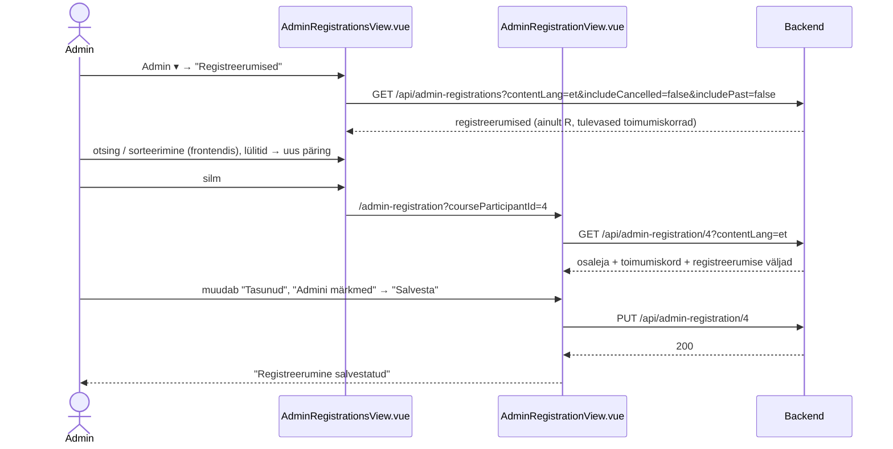
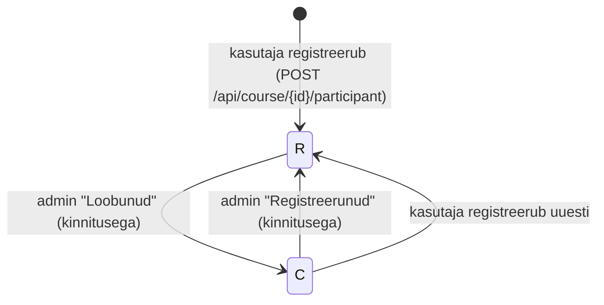
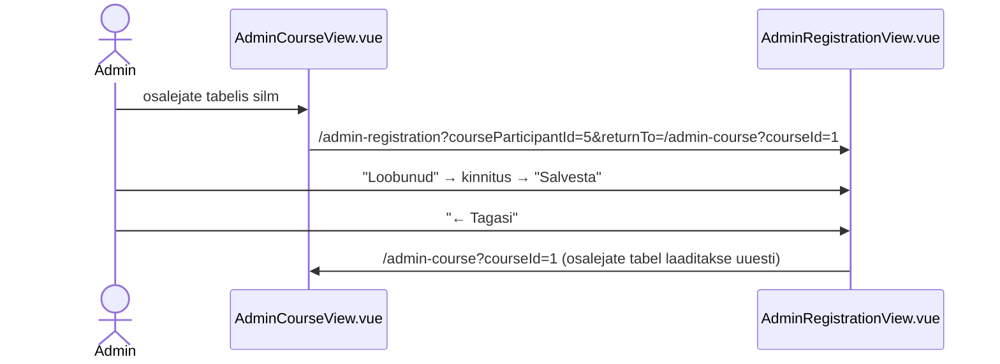

# Registreerumiste haldus (admin) — skeemid

Planeerimisfail uutele vaadetele, mida mockupis veel pole: kõigi registreerumiste nimekiri ja ühe registreerumise vaatamine/muutmine. Järgneb epicule `courses-view` (toimumiskordade vaated ja registreerumine), vt `../courses-view/courses-view-skeemid.md`.

**Seis:** otsused kokku lepitud ja läbimäng tehtud (2026-10-01). Järgmine samm: märkmed (jaotis 7).

Mõisted: **registreerumine** = üks `course_participant` rida (osaleja + toimumiskord: staatus, tasumine, sülearvuti, märkmed). **Osaleja** = inimene (`participant` + `profile`), kellel võib olla mitu registreerumist.

---

## Otsused

### Üldine

- Registreerumisi hallatakse eraldi vaates, mitte `/admin-course` tabeli real (rida jääb ainult lugemiseks).
- Muster nagu "Koolituste päringud": nimekiri `/admin-registrations` + üks kirje `/admin-registration?courseParticipantId={id}`.
- Muuta saab ainult **registreerumise enda välju**: staatus (`R` registreerunud / `C` loobunud), tasunud, vajab sülearvutit, admini märkmed.
- Osaleja kontaktandmed (nimi, e-post, telefon — `profile`) on registreerumise vaates **ainult lugemiseks**, sest profiil on ühine kõigile sama inimese registreerumistele.
- Osaleja enda sisestatud "Lisainfo" (`course_participant.notes`) on ainult lugemiseks; admin kirjutab eraldi väljale **"Admini märkmed"** (uus veerg `admin_notes`).
- Kustutamist pole — loobumine on staatus `C` (ajalugu jääb alles).

### Navbar (`App.vue`)

- Menüü "Admin": uus link **"Registreerumised"** kohe "Koolituste päringud" järel (i18n `navbar.manageRegistrations`, en "Registrations").

### Registreerumiste nimekiri — `AdminRegistrationsView.vue` (`/admin-registrations`)

- Pealkiri "Registreerumised".
- Lüliti **"Näita ka loobunud"** (vaikimisi väljas → ainult `R`).
- Lüliti **"Näita ka toimunud"** (vaikimisi väljas → ainult toimumiskorrad, mille `end_date >= täna`).
- Otsing frontendis: osaleja nimi, e-post, koolituse nimi.
- Tabel (sorteerimine frontendis, vaikimisi registreerumise aeg uusimad eespool): Registreerus | Osaleja | E-post | Koolitus | Toimumisaeg | Tasunud ✓/✗ | Vajab sülearvutit ✓/✗ | Staatus (Registreerunud / Loobunud) | Tegevused.
- Koolituse nimi kasutajaliidese keeles (puudumisel põhikeeles); toimumisaeg on link `/admin-course?courseId={id}`.
- Tegevused: silm → `/admin-registration?courseParticipantId={id}`.
- Loobunu rida tuhmim; all "Kokku N registreerumist".

### Registreerumine — `AdminRegistrationView.vue` (`/admin-registration?courseParticipantId={id}`)

- Pealkiri "Registreerumine", all osaleja nimi.
- Ülal tagasilink: `returnTo` olemasolul "← Tagasi" (nt `/admin-course` vaatest), muidu "← Kõik registreerumised" (`/admin-registrations`). `returnTo` reegel sama mis `LecturerView`-l (`NavigationService.isInternalPath`).
- Kaart **"Osaleja"** (ainult lugemiseks): nimi, e-post (mailto), telefon, konto e-post, kui see erineb.
- Kaart **"Toimumiskord"** (ainult lugemiseks): koolitus, toimumisaeg, staatus (`CourseStatusBadge` + "Toimunud"), link "Ava toimumiskord" → `/admin-course?courseId={id}`.
- Kaart **"Registreerumine"** (vorm):
  - Staatus: raadionupud Registreerunud / Loobunud;
  - lüliti "Tasunud";
  - lüliti "Vajab sülearvutit";
  - "Osaleja lisainfo" — ainult lugemiseks (`notes`, puudumisel "—");
  - "Admini märkmed" — `textarea` (`admin_notes`);
  - registreerumise aeg ja viimase muutmise aeg (`created_at`, `updated_at`).
- Nupud "Salvesta" ja "Tühista" (taastab laaditud väärtused). Edu korral teade "Registreerumine salvestatud" samas vaates.
- Kinnitus (`ConfirmModal`) ainult staatuse muutmisel: "Märgi osaleja loobunuks?" / "Taasta registreerumine?".

### `/admin-course` muudatus

- Osalejate tabelisse viimane veerg silmaikooniga → `/admin-registration?courseParticipantId={id}&returnTo=/admin-course?courseId={id}`.

### Uued teenused (ettepanek)

| Teenus | Kirjeldus |
|---|---|
| `GET /api/admin-registrations?contentLang=&includeCancelled=&includePast=` | nimekiri (`AdminRegistrationSummaryDto` list); otsing ja sorteerimine frontendis |
| `GET /api/admin-registration/{courseParticipantId}?contentLang=` | üks registreerumine koos osaleja ja toimumiskorra infoga (`AdminRegistrationDto`) |
| `PUT /api/admin-registration/{courseParticipantId}` | `AdminRegistrationUpdateRequest`: `status`* (`R`/`C`), `hasPaid`*, `requiresLaptop`*, `adminNotes` (tühi → `null`) |

Olemasolev `GET /api/course/{courseId}/participants` saab vastusesse lisaks `courseParticipantId` (juba olemas) — muudatust pole vaja.

---

## 1. Andmebaasi muudatus (ettepanek)

```sql
-- course_participant: admini märkmed eraldi osaleja enda lisainfost (notes)
CREATE TABLE course_participant
(
    ...
    notes           text       NOT NULL,
    admin_notes     text       NULL,
    ...
);
```

`3_import.sql`: `course_participant` read saavad veeru `admin_notes` (enamasti `NULL`; nt rida 5 "Teatas telefoni teel 25.09.", rida 4 "Arve saadetud 15.09.").

View't pole vaja: nimekiri on üks päring `course_participant` + `participant` + `profile` + `course` + koolituse nimi (`admin_training_summary`, `contentLang`). Kui päring läheb keerukaks, võib lisada view `admin_registration_summary` (nagu `admin_enquiry_summary`).

---

## 2. Nimekiri ja üks registreerumine



## 3. Staatuse muutmine



- Staatuse muutus mõjutab `/admin-all-courses` arve (`participant_count`, `paid_count` loevad ainult `R`).
- Tasumise väärtus jääb loobumisel alles (raha tagastamine on näha).

## 4. `/admin-course` → registreerumine ja tagasi



## 5. Komponendid

| Komponent | Olek | Kasutus |
|---|---|---|
| `AdminRegistrationsView.vue`, `AdminRegistrationView.vue` | uus | vaated |
| `CourseParticipantStatusBadge.vue` | uus (väike) | Registreerunud / Loobunud märgis — kasutavad ka `CourseParticipantsTable` ja nimekiri |
| `SortableColumnHeader`, `SortService`, `CheckMark`, `CourseStatusBadge`, `ConfirmModal`, `InlineAlerts` | olemas | taaskasutus |

## 6. Kokkulepitud otsused (endised lahtised küsimused)

1. **Leheküljestus:** puudub, nagu "Koolituste päringutel". Lülitid piiravad vaikimisi tulevaste `R` ridadeni, otsing ja sorteerimine toimuvad frontendis.
2. **Taastamine täis toimumiskorrale** (`F`): lubatud. Mahutavust veel ei modelleerita ja `COURSE_FULL` kontrolli `PUT /api/admin-registration/{id}` ei tee.
3. **Kontaktandmed:** registreerumise vaates ainult lugemiseks. Profiili muutmine tuleb hiljem osaleja (inimese) vaatesse (vt p 5).
4. **Filter toimumiskorra/koolituse järgi:** eraldi filtrit ei tehta, piisab otsingust koolituse nime järgi. Ühe toimumiskorra osalejad on `/admin-course` vaates.
5. **Hiljem:** osaleja (inimese) vaade kõigi tema registreerumistega (sh kontaktandmete muutmine), osaleja lisamine admini poolt ja e-kirja teavitus staatuse muutusel.

## 7. Järgmised sammud

1. ~~Lahtised küsimused kokku leppida~~ — tehtud (jaotis 6).
2. ~~Läbimäng `admin-registrations-view-labimang.html` + prototüübi kest (`../index.html`, uued vaated "Registreerumised", "Registreerumine")~~ — tehtud; `/admin-course` osalejate tabelis silm (`courses-view/admin-all-courses-view-labimang.html`, `markmed/admin-course-view-markmed.md`).
3. Märkmed `markmed/admin-registrations-view-markmed.md`, `admin-registration-view-markmed.md`.
4. Taskid (`docs/tasks/backend/`, `docs/tasks/frontend/`) ja tööde järjekord.
