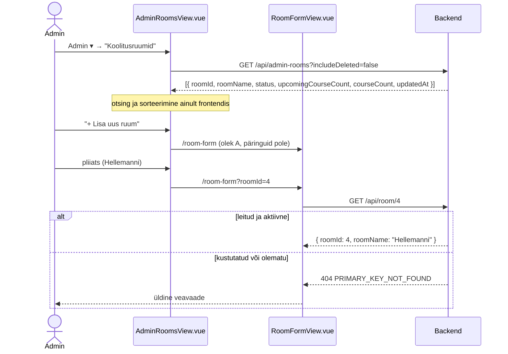
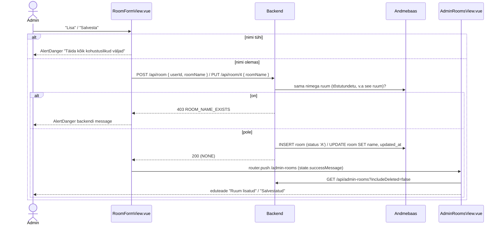
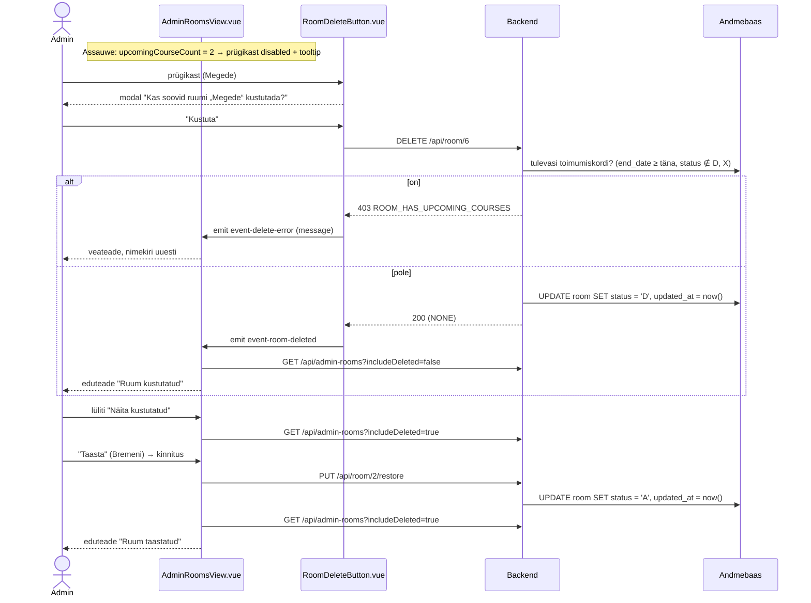

# AdminRoomsView.vue ja RoomFormView.vue — skeemid

Koolitusruumide haldus: nimekiri (`AdminRoomsView.vue`) ja ruumi lisamise/muutmise vorm (`RoomFormView.vue`). Selles failis on otsused, andmebaasi ettepanekud ja andmevood skeemidena (Mermaid). Märkmed: `docs/mock-wireframe/markmed/admin-rooms-view-markmed.md` ja `docs/mock-wireframe/markmed/room-form-view-markmed.md`. Interaktiivne läbimäng: `admin-rooms-view-labimang.html`.

Eeskuju: `docs/mock-wireframe/loo-mock-vaade/admin-lecturers-view/admin-lecturers-view-skeemid.md` (nimekiri, soft delete, taastamine, kustutamise keeld tulevaste toimumiskordade korral). Ruumil tõlkeid ega pilti pole, seega on vorm palju lihtsam.

## Otsused

- **Vahelehed** (2026-10-01): admini nimekirjavaadete ülaosas vahelehed kõigi admin-menüü linkidega (`AdminTabs.vue` / `NavTabs.vue`), selle vaate vaheleht aktiivne — vt `docs/tasks/frontend/view-tabs.md`.

### Üldine

- **Termin kasutajaliideses on "koolitusruum"** (liitsõna; inglise keeles "Training room"). Lühidalt tabelis ja vormis "Ruum" / "Nimi". Koodis ja andmebaasis jääb `room`.
- **Navbar → menüü "Admin"** (`App.vue`): koolitajate linkide järele eraldaja (`<hr class="dropdown-divider" />`) ja üks link **"Koolitusruumid"** → `/admin-rooms` (i18n `navbar.manageRooms`; en "Training rooms"). Eraldi linki "Lisa uus ruum" menüüsse ei tule — lisamine käib nimekirja nupust.
- **Staatus** (`room.status`): senised `VAB` / `KIN` (tähendus oli lahtine) asendatakse ühetäheliste koodidega nagu teistel tabelitel: `A` = aktiivne (`RoomStatus.ACTIVE`), `D` = kustutatud (`RoomStatus.DELETED`, soft delete). Veerg `varchar(3)` → `varchar(1)`.
- **Väljad:** ainult **nimi** (`name`, kohustuslik, kuni 255 märki) + auditiveerud `created_at`, `updated_at`, `created_by` (nagu `lecturer`-il). Mahutavust, asukohta ega kirjeldust praegu ei lisata. Nimi ei ole tõlgitav (pärisnimi).
- **Nimi on unikaalne** (tõstutundetult, ka kustutatud ruumide hulgas — kustutatud ruumi saab taastada): kordus → `403 ROOM_NAME_EXISTS`.

### Koolitusruumide nimekiri — `AdminRoomsView.vue`

- Roll: Admin. Rada `/admin-rooms`.
- Päis: pealkiri "Koolitusruumid", paremal nupp "+ Lisa uus ruum" → `/room-form`.
- Otsinguväli "Otsi nime järgi…" ja lüliti "Näita kustutatud" (vaikimisi väljas) — nagu `/admin-lecturers`.
- Veerud: **Nimi | Tulevasi toimumiskordi | Toimumiskordi kokku | Uuendatud | Tegevused**.
  - **Tulevasi toimumiskordi** = toimumiskorrad selles ruumis, `end_date >= täna` ja `status NOT IN ('D', 'X')`.
  - **Toimumiskordi kokku** = kõik toimumiskorrad selles ruumis, `status <> 'D'` (ka möödunud ja tühistatud) — näitab, kas ruumi on üldse kasutatud.
  - **Uuendatud** = `room.updated_at`, kuvatakse `30/09/2026`.
  - **Tegevused**: "Muuda" (pliiats) → `/room-form?roomId={id}` ja "Kustuta" (prügikast, `RoomDeleteButton.vue`).
- Sorteerimine **frontendis** nagu `/admin-lecturers` (`SortableColumnHeader`): kõik veerud peale "Tegevused"; 1. klõps kasvav → 2. kahanev → 3. vaikimisi järjestus (nime järgi A → Õ, `localeCompare`).
- Otsing filtreerib frontendis (sisaldab, tõstutundetu). Tühi tulemus: "Ruume ei leitud". Tabeli all "Kokku N ruumi".
- **Kustutamine** (`RoomDeleteButton.vue`, sama muster nagu `LecturerDeleteButton`): prügikast → kinnituse modal "Kas soovid ruumi „Bremeni“ kustutada?" → `DELETE /api/room/{roomId}` → nimekiri uuesti, eduteade "Ruum kustutatud".
  - Kui `upcomingCourseCount > 0`, on prügikast keelatud ja tooltip ütleb: "Ruumis on tulevasi toimumiskordi — vali neile enne teine ruum". Backend kontrollib sama (`403 ROOM_HAS_UPCOMING_COURSES`); kui see siiski tuleb, näidatakse backendi `message`-it ja laaditakse nimekiri uuesti.
- **Kustutatud read** (lülitiga): tuhmimad, märgisega "Kustutatud", ainult nupp "Taasta" (kinnitusega, `PUT /api/room/{roomId}/restore` → `status = 'A'`, eduteade "Ruum taastatud").
- Nimekiri ei sõltu keelest (keele vahetusel päringut ei tehta, muutuvad ainult sildid).
- Eduteade vormist tulles (`window.history.state.successMessage`, nagu `AdminTrainingCoursesView`): "Ruum lisatud" / "Salvestatud".

### Ruumi vorm — `RoomFormView.vue`

| Olek | URL | Pealkiri | Vormi sisu | Nupp |
|---|---|---|---|---|
| **A. Uus ruum** | `/room-form` | "Lisa uus ruum" | tühi väli "Nimi *" | "Lisa" |
| **B. Muutmine** | `/room-form?roomId=2` | "Muuda ruumi" | nimi täidetud | "Salvesta" |

- Üks kaart "Ruumi andmed", väli **"Nimi *"** (kuni 255 märki).
- Kiirnupp "Koolitusruumid" → `/admin-rooms` (mõlemas olekus, salvestamata).
- **"Lisa"** (A) → `POST /api/room` (`userId` sessionStorage'ist) → `/admin-rooms` eduteatega "Ruum lisatud".
- **"Salvesta"** (B) → `PUT /api/room/{roomId}` → `/admin-rooms` eduteatega "Salvestatud". (Ühe väljaga vormis pole mõtet muutmise olekusse jääda, erinevalt koolitaja vormist.)
- Kustutatud või olematu ruum → `404` → üldine veavaade. Kustutamist vormis pole (ainult nimekirjas).
- Frontendi kontroll enne saatmist: nimi täidetud ("Täida kõik kohustuslikud väljad") — `AlertDanger`. Backendi `403 ROOM_NAME_EXISTS` → backendi `message` `AlertDanger`-is.

### Kustutatud ruum teistes teenustes

Kustutatud ruum on nagu olematu → `404 PRIMARY_KEY_NOT_FOUND` (`'roomId'`), sama loogika nagu kustutatud koolitajal:
- `GET /api/rooms` (`RoomsDropdown` toimumiskorra vormis) tagastab **ainult aktiivsed** ruumid; `roomStatus` eemaldatakse `RoomDto`-st.
- `POST /api/training/{trainingId}/course` — kustutatud ruumi valida ei saa (404).
- `PUT /api/course/{courseId}` — kustutatud ruumi saab jätta ainult siis, kui see on toimumiskorra **praegune** ruum (samamoodi nagu juba seotud kustutatud koolitaja); uueks ruumiks valida ei saa (404).
- Toimumiskorra vorm: `GET /api/course/{courseId}` (`CourseDto`) saab lisavälja `roomName`. Kui toimumiskorra `roomId` pole `GET /api/rooms` nimekirjas (ruum on kustutatud), lisab `CourseFormView` rippmenüüsse selle ruumi valiku "{roomName} (kustutatud)", et olemasolev valik ei kaoks.
- Tabelites (koolituse kalender, `CourseSummaryDto.roomName`) kuvatakse kustutatud ruumi nimi edasi.
- Erandid: `DELETE` (juba kustutatud → midagi ei muutu) ja `restore`.

### Uued teenused (ettepanek, URL-ide kokkuleppe järgi)

| Teenus | Põhjendus |
|---|---|
| `GET /api/admin-rooms?includeDeleted=` | admini nimekiri → mitmus, `admin-` eesliide nagu `GET /api/admin-lecturers` |
| `GET /api/room/{roomId}` | ühe objekti andmed (vorm B) |
| `POST /api/room` | loob ruumi |
| `PUT /api/room/{roomId}` | muudab ruumi nime |
| `DELETE /api/room/{roomId}` | soft delete (`status = 'D'`) |
| `PUT /api/room/{roomId}/restore` | tegevusteenus: taastab (`status = 'A'`) |
| `GET /api/rooms` | **olemas, muutub** — ainult aktiivsed, `roomStatus` eemaldatakse |
| `GET /api/course/{courseId}` | **olemas, muutub** — `CourseDto`-sse `roomName` |

Uued väärtused `Error` enumisse (`403`):
- `ROOM_HAS_UPCOMING_COURSES("Ruumis on tulevasi toimumiskordi, vali neile enne teine ruum")`;
- `ROOM_NAME_EXISTS("Sellise nimega ruum on juba olemas")`.

---

## 1. Andmebaasi muudatused (ettepanek)

**NB!** DDL ja seed on ettepanek, andmebaasi vastu pole käivitatud. `2_create.sql` ja `3_import.sql` muudetakse backend taski käigus; skripte käivitab kasutaja.

```sql
-- Table: room (status A/D, auditiveerud)
CREATE TABLE room
(
    id         serial       NOT NULL,
    name       varchar(255) NOT NULL,
    status     varchar(1)   NOT NULL,
    created_at timestamp    NOT NULL,
    updated_at timestamp    NOT NULL,
    created_by int          NOT NULL,
    CONSTRAINT room_pk PRIMARY KEY (id)
);

-- Reference: room_created_by (table: room)
ALTER TABLE room
    ADD CONSTRAINT room_created_by
        FOREIGN KEY (created_by)
            REFERENCES "user" (id)
            NOT DEFERRABLE
                INITIALLY IMMEDIATE
;
```

Nime unikaalsust kontrollib backend (tõstutundetult, `existsByNameIgnoreCase`, muutmisel oma ID välja arvatud) — eraldi andmebaasi indeksit ei lisata.

### View `admin_room_summary`

```sql
-- Koolitusruumide nimekiri (admin): toimumiskordade arvud
CREATE VIEW admin_room_summary AS
SELECT r.id                                          AS room_id,
       r.name,
       r.status,
       (SELECT count(*)
        FROM course c
        WHERE c.room_id = r.id
          AND c.status NOT IN ('D', 'X')
          AND c.end_date >= current_date)            AS upcoming_course_count,
       (SELECT count(*)
        FROM course c
        WHERE c.room_id = r.id
          AND c.status <> 'D')                       AS course_count,
       r.updated_at
FROM room r;
```

### Seed-andmed (`3_import.sql`, ettepanek)

```sql
-- Table: room (Bremeni kustutatud — näide "Näita kustutatud" lüliti jaoks)
INSERT INTO room (id, name, status, created_at, updated_at, created_by) VALUES
    (1, 'Assauwe', 'A', '2026-07-15 09:00:00', '2026-07-15 09:00:00', 1),
    (2, 'Bremeni', 'D', '2026-07-15 09:00:00', '2026-09-01 10:00:00', 1),
    (3, 'Eppingi', 'A', '2026-07-15 09:00:00', '2026-07-15 09:00:00', 1),
    (4, 'Hellemanni', 'A', '2026-07-15 09:00:00', '2026-09-20 10:00:00', 1),
    (5, 'Landskrone', 'A', '2026-07-15 09:00:00', '2026-07-15 09:00:00', 1),
    (6, 'Megede', 'A', '2026-07-15 09:00:00', '2026-07-15 09:00:00', 1);
```

Seed-toimumiskordade järgi: Assauwe — 2 tulevast, kokku 3 (prügikast keelatud); Bremeni — 0 tulevast, kokku 2 (kustutatud, ajalugu jääb); teistel toimumiskordi pole.

---

## 2. Andmete laadimine



---

## 3. Lisamine ja muutmine



---

## 4. Kustutamine ja taastamine (nimekiri)



---

## 5. Päringud

| Vaade / olek | Grupp | Päring | Millal / milleks |
|---|---|---|---|
| nimekiri | Laadimine | `GET /api/admin-rooms?includeDeleted=false` | tabel (ka lüliti muutmisel ja pärast kustutamist/taastamist) |
| nimekiri | Tegevus | `DELETE /api/room/{roomId}` | prügikast → kinnitus → nimekiri uuesti |
| nimekiri | Tegevus | `PUT /api/room/{roomId}/restore` | "Taasta" → kinnitus → nimekiri uuesti |
| nimekiri | Navigeerimine | — | "+ Lisa uus ruum" → `/room-form`; pliiats → `/room-form?roomId={id}` |
| vorm B | Laadimine | `GET /api/room/{roomId}` | nime eeltäitmine |
| vorm A | Tegevus | `POST /api/room` | "Lisa" → `/admin-rooms` |
| vorm B | Tegevus | `PUT /api/room/{roomId}` | "Salvesta" → `/admin-rooms` |

---

## 6. Komponendid

| Komponent | Uus / olemas | Kirjeldus |
|---|---|---|
| `views/AdminRoomsView.vue` | uus | nimekiri; `rooms`, `searchText`, `includeDeleted`, `sortBy`, `sortDirection`; `computed: filteredRooms`, `sortedRooms` |
| `views/RoomFormView.vue` | uus | vorm, olekud URL-ist (`roomId` olemas → muutmine) |
| `App.vue` (navbar) | muudetakse | menüüsse "Admin" eraldaja + "Koolitusruumid" |
| `router/index.js` | muudetakse | `/admin-rooms` (`adminRoomsRoute`), `/room-form` (`roomFormRoute`) |
| `NavigationService.js` | muudetakse | `navigateToAdminRoomsView(state)`, `navigateToRoomFormView(query)` |
| `components/common/RoomDeleteButton.vue` | uus | propsid `roomId`, `roomName`, `upcomingCourseCount`; `disabled` + tooltip, kui > 0; `ConfirmModal` + `DELETE`; emits `event-room-deleted`, `event-delete-error` |
| `components/common/RoomRestoreButton.vue` | uus | "Taasta" + `ConfirmModal` + `PUT .../restore`; emit `event-room-restored` |
| `components/common/SortableColumnHeader.vue`, `InlineAlerts.vue`, `AlertDanger.vue`, `ConfirmModal.vue` | olemas | sort, teated, kinnitused |
| `components/forms/RoomsDropdown.vue` | olemas, muutub vähe | kustutatud praeguse ruumi valik tuleb `CourseFormView`-st (`rooms` massiivi lisatud) |
| `views/CourseFormView.vue` | muudetakse | kustutatud praegune ruum rippmenüüsse "(kustutatud)" |
| `api-services/RoomService.js` | olemas, muudetakse | uued kutsed |
| `locales/et.json`, `en.json` | muudetakse | `navbar.manageRooms`, `adminRooms.*`, `roomForm.*` |

---

## 7. Lahtised küsimused

- Mahutavus, asukoht või varustus — kui hiljem vaja, lisatakse veerud ja vormi väljad eraldi taskiga.

---

## 8. Balsamiq AI käsud

### AdminRoomsView

```text
Create a desktop wireframe of an admin page "Koolitusruumid" in a web app.
Top: site navigation bar with logo and links (Koolitused, Teenused, Ettevõttest, Kontakt), an open dropdown "Admin ▾" with items "Koolituste päringud", "Registreerumised", a divider, "Koolitused", "Koolituste kalender", a divider, "Koolitajad" and "Koolitusruumid" (highlighted), and "Logi välja" on the right.
Below the navigation bar: a tab bar "Koolituste päringud | Registreerumised | Koolitused | Koolituste kalender | Koolitajad | Koolitusruumid" with "Koolitusruumid" as the active tab.
Header row: page title "Koolitusruumid" on the left and a primary button "+ Lisa uus ruum" on the right.
Below the header: a search text input "Otsi nime järgi…" and a toggle switch "Näita kustutatud" (on).
Main area: a data table with sortable columns "Nimi ▲", "Tulevasi toimumiskordi", "Toimumiskordi kokku", "Uuendatud" and a column "Tegevused".
Rows: "Assauwe | 2 | 3 | 15/07/2026 | pencil icon, greyed-out trash icon",
a greyed-out row "Bremeni | 0 | 2 | 01/09/2026 | badge Kustutatud, button Taasta",
"Eppingi | 0 | 0 | 15/07/2026 | pencil icon, trash icon",
"Hellemanni | 0 | 0 | 20/09/2026 | pencil icon, trash icon",
"Landskrone | 0 | 0 | 15/07/2026 | pencil icon, trash icon",
"Megede | 0 | 0 | 15/07/2026 | pencil icon, trash icon".
Below the table: text "Kokku 6 ruumi".
```

### RoomFormView

```text
Create a desktop wireframe of an admin form page "Muuda ruumi" in a web app.
Top: site navigation bar with logo and links, a dropdown "Admin ▾" and "Logi välja" on the right.
Header row: page title "Muuda ruumi" on the left and a secondary button "Koolitusruumid" on the right.
One card titled "Ruumi andmed" with a single text input "Nimi *" with value "Hellemanni".
Bottom: primary button "Salvesta".
In the "new room" version the title is "Lisa uus ruum", the field is empty and the button is "Lisa".
```
