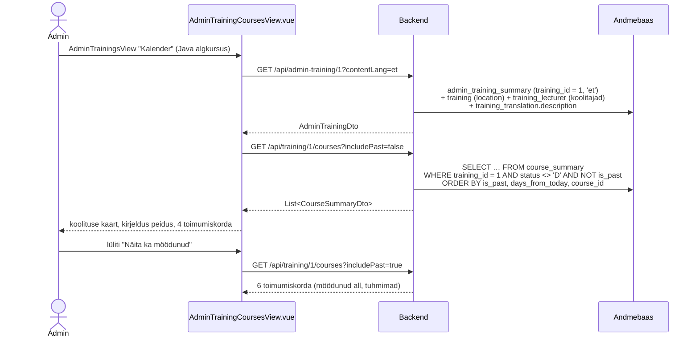
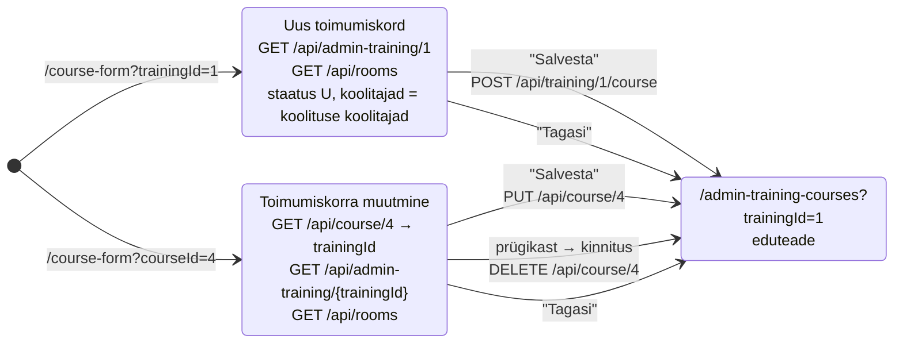
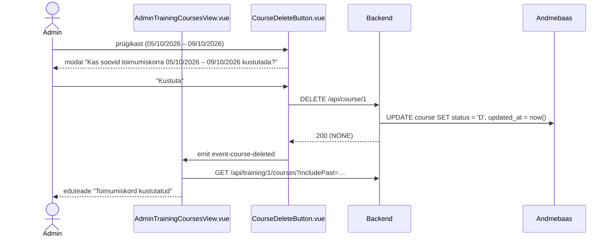

# AdminTrainingCoursesView.vue ja CourseFormView.vue — skeemid

Koolituse kalender (koolituse andmed + toimumiskordade tabel) ja toimumiskorra vorm. Selles failis on otsused, andmebaasi view ettepanek ja andmevood skeemidena (Mermaid). Märkmed: `docs/mock-wireframe/markmed/admin-training-courses-view-markmed.md` ja `docs/mock-wireframe/markmed/course-form-view-markmed.md`. Interaktiivne läbimäng: `admin-training-courses-view-labimang.html`.

Eeskuju: `docs/mock-wireframe/loo-mock-vaade/admin-trainings-view/` (skeemid, läbimäng, tööde järjekord) ja `docs/mock-wireframe/markmed/admin-trainings-view-markmed.md`.

## Otsused

### Koolituse kalender — `AdminTrainingCoursesView.vue`

- Roll: Admin. Rada `/admin-training-courses?trainingId={id}`.
- Avaneb AdminTrainingsView rea uuest ikoonist "Kalender" ja TrainingFormView kiirnupust "Kalender".
- Ülal koolituse andmed (suures pildis nagu `/training`): pealkiri, staatus, kategooria, õppekeel (lipp), toimumiskoht, koolitajad, rahastus, sätted. Koolitajad (`training_lecturer`, `sort_order` järjekorras) kuvatakse **ainult nimedena** komadega (koolitaja kaart `LecturerCard.vue` on avalikul koolituse lehel, mitte admini kalendris). Korduvad osad tehakse komponentideks, mida saab kasutada ka `/training` vaates.
  - Andmed kuvatakse kasutajaliidese keeles (store'i `contentLang`); puuduva tõlke korral põhikeeles (sama reegel nagu AdminTrainingsView-s). Keele vahetusel laaditakse koolituse andmed uuesti.
  - Koolituse kaardil on lingid "Vaata" (`/training?...`) ja "Muuda" (`/training-form?...`) ning kiirnupp "Koolitused" (`/admin-trainings`).
- Kaart "Kirjeldus" (pikk `description`, `RichTextContent`) on **vaikimisi peidus**, avatakse lingiga "▾ Näita kirjeldust" / "▴ Peida kirjeldus" (sama muster nagu AdminTrainingsView filtrikaart).
- Kalendritabel: üks rida iga toimumiskorra (`course`) kohta. Veerud: Algus | Lõpp (`30/09/2026`) | Päevi | Akad. tunde | Hind (€) | Koolitajad | Ruum | Staatus | Osalejaid | Märkmed | Veebilink | Tegevused.
  - `notes` sisu ei kuvata — ainult `hasNotes` (✓/✗). Samamoodi `hasMeetingLink` (✓/✗).
  - Osalejaid = `course_participant` ridade arv.
  - Koolitajad: nimed komadega `sort_order` järjekorras (`course_lecturer`). Koolitajad või ruum puuduvad → "—".
  - Järjestus: tulevased eespool (lähim üleval), möödunud nende all (hiliseim üleval). Leheküljestust pole (toimumiskordi on koolitusel vähe).
  - **Sorteerimine ainult frontendis** (kogu nimekiri on laaditud, backend `sortBy` parameetreid ei saa). Sorteeritavad veerud: Algus, Hind, Staatus, Osalejaid (`SortableColumnHeader.vue`). Klõpsud: 1. kasvav → 2. kahanev → 3. tagasi vaikimisi järjestusse (nool kaob). Sorteeritakse kogu nimekiri (tulevased ja möödunud segamini); võrdsete väärtuste korral jääb vaikimisi järjestus. Staatuse kasvav järjekord: Mustand → Avatud → Täis → Tühistatud. Lüliti "Näita ka möödunud" ja kustutamine sorteerimist ei lähtesta.
  - Lüliti "Näita ka möödunud" (vaikimisi väljas) → päring `includePast=true`.
  - Toimunud (`end_date < täna`) rida on tuhmim ja märgisega "Toimunud" — seda **ei salvestata staatusena**.
  - Kustutatud (`D`) toimumiskordi kalendris ei kuvata.
  - Tegevused: "Muuda" (pliiats → `/course-form?courseId={id}`), "Kustuta" (prügikast, soft delete, kinnitusega — `CourseDeleteButton.vue`, sama muster nagu `TrainingDeleteButton`).
  - Tühi tabel: "Toimumiskordi pole veel lisatud" (lüliti väljas: "Tulevasi toimumiskordi pole").
  - Tabeli all tekst "Kokku N toimumiskorda".
- Pealkirja real paremal nupp "+ Lisa toimuv koolitus" → `/course-form?trainingId={id}`.
- Kustutatud või olematu koolitus → 404 → üldine veavaade.

### Toimumiskorra vorm — `CourseFormView.vue`

- Roll: Admin. Kaks olekut: uus (`/course-form?trainingId={id}`) ja muutmine (`/course-form?courseId={id}`).
- Pealkiri: "Uus toimumiskord" / "Toimumiskorra muutmine", selle all koolituse nimi (`contentLang` keeles). Kiirnupp "Kalender" → `/admin-training-courses?trainingId={id}`.
- Väljad: algus, lõpp (`<input type="date">`), päevi, akadeemilisi tunde, hind (€), **koolitajad** (mitu, `course_lecturer`: valitud koolitajate nimekiri, × eemaldab, ↑ ↓ muudab järjekorda, "+ Lisa koolitaja" avab sama "Vali koolitaja" modali nagu TrainingFormView-s, juba valitud koolitajaid ei pakuta; kuvatakse ainult nimed), ruum (rippmenüü, esimene valik "Ruum puudub"), veebilink, märkmed, staatus.
- Uue toimumiskorra vaikimisi väärtused: staatus `U` (Mustand), **koolitajad = koolituse koolitajad** (`GET /api/admin-training/{trainingId}` → `lecturers`, samas järjekorras), ülejäänud tühjad. Edasi on toimumiskorra koolitajad koolitusest sõltumatud.
- **Päevade arv (eeldus):** kui algus ja lõpp on valitud ja admin pole päevade arvu ise muutnud, täidab vorm selle tööpäevade (E–R) arvuga; admin saab väärtust muuta. Vihje: "Arvutatud tööpäevadest, saad muuta". Backend arvu ei arvuta.
- Staatust muudetakse **vormi rippmenüüst** (U / O / F / X; `D` valikus ei ole). Kustutamine on muutmise olekus eraldi prügikasti ikoon kinnitusega (`CourseDeleteButton.vue`).
- Frontendi kontroll enne saatmist: kohustuslikud algus, lõpp, päevi (≥ 1), akad. tunde (≥ 1), hind (≥ 0), staatus; lõpp ei tohi olla enne algust. Viga → `AlertDanger` ("Täida kõik kohustuslikud väljad" / "Lõppkuupäev ei saa olla varasem kui alguskuupäev").
- "Salvesta" → `POST` / `PUT` → suunatakse kalendrisse (`/admin-training-courses?trainingId={id}`), eduteade "Toimumiskord lisatud" / "Toimumiskord salvestatud". "Tagasi" → kalendrisse ilma salvestamata.
- `created_by` = sisselogitud kasutaja (`userId`), nagu koolituse lisamisel.
- Muutmise olekus avatakse kustutatud või olematu toimumiskord → 404 → üldine veavaade.

### Koolitaja pilt — eraldi tabel `lecturer_photo`

- `lecturer.photo` veerg eemaldatakse; pilt on eraldi 1:1 tabelis `lecturer_photo` (`lecturer_id` unikaalne). Rida puudub = koolitajal pilti pole.
- **Miks:** JPA laeb `bytea` välja entity'ga alati kaasa (laisk laadimine vajaks bytecode enhancement'it). Eraldi tabeliga ei loeta pilte näiteks "Vali koolitaja" otsingus ega teistes koolitajate päringutes. Kaob ka `NOT NULL` + `''::bytea` kohatäide.
- `content_type` salvestatakse koos pildiga (normaliseeritud pildil `image/jpeg`); pilditeenus saadab selle `Content-Type` päisena.
- `GET /api/lecturers` → `LecturerDto` ilma `lecturerPhoto`-ta (`{ lecturerId, lecturerName }`). Muutub olemasolev kood: `Lecturer` entity (`photo` väli kaob), `LecturerMapper` (`bytesToBase64` liigub pildi mapperisse), `LecturerDto`, `MockDatabase.js`.
- Kalender ja toimumiskorra vorm pilte ei kuva (koolitajad on nimedena). Pilti kuvab avalikul koolituse lehel koolitaja kaart (`LecturerCard.vue`, andmed `GET /api/training-summary/{trainingId}` vastusest, foto eraldi pilditeenusest — vt `docs/mock-wireframe/loo-mock-vaade/admin-lecturers-view/admin-lecturers-view-skeemid.md`). `GET /api/admin-training/{trainingId}` pilti **ei** tagasta.
- **Uuendus (avalik koolitajate leht):** pilt tuleb pilditeenusest `GET /api/lecturer/{lecturerId}/photo?v={photoVersion}` ja DTO-d tagastavad Base64 asemel `photoVersion`; üleslaadimisel pilt normaliseeritakse (400×400 JPEG). Vt `docs/mock-wireframe/loo-mock-vaade/lecturers-view/lecturers-view-skeemid.md`, "Pildid".

### Staatused (`course.status`, ingliskeelsed ühetähelised koodid)

| Kood | Enum (`CourseStatus`) | Tähendus | Kuvatakse |
|---|---|---|---|
| `U` | `UNPUBLISHED` | Mustand — admin lisas, avalikult ei näidata | Mustand |
| `O` | `OPEN` | Registreerimine avatud | Avatud |
| `F` | `FULL` | Kohad täis (käsitsi — mahutavuse veergu pole) | Täis |
| `X` | `CANCELLED` | Tühistatud — jääb ajalukku | Tühistatud |
| `D` | `DELETED` | Kustutatud (soft delete), kalendris ei kuvata | — |

- `U` ja `D` tähendavad sama mis koolitusel (`TrainingStatus`).
- `X`, mitte `C` — `C` oleks kahemõtteline (Cancelled / Completed).
- "Toimunud" tuleneb kuupäevast, mitte staatusest.
- `course.status` on `varchar(3)` — ühetäheline kood mahub. `3_import.sql` seed-andmete `'AVA'` asendatakse (`'O'`).

### Uued teenused (ettepanek, URL-ide kokkuleppe järgi)

| Teenus | Põhjendus |
|---|---|
| `GET /api/admin-training/{trainingId}?contentLang=` | ühe koolituse admini ülevaade (nimed `contentLang` keeles, ka mustand) → ainsus; `admin-` eesliide nagu `GET /api/admin-trainings`. Olemasolev `GET /api/training/{trainingId}` tagastab vormi jaoks ainult ID-d |
| `GET /api/training/{trainingId}/courses?includePast=` | ühe objekti alamnimekiri → mitmus |
| `GET /api/course/{courseId}` | ühe objekti andmed vormi jaoks → ainsus |
| `POST /api/training/{trainingId}/course` | loob koolitusele toimumiskorra (sama muster nagu `POST /api/training/{trainingId}/training-translation`) |
| `PUT /api/course/{courseId}` | muudab ühte objekti |
| `DELETE /api/course/{courseId}` | soft delete (`status = 'D'`) |
| `GET /api/rooms` | ruumide nimekiri vormi rippmenüüsse |
| `GET /api/lecturers?search=` | **olemas, muutub** — "Vali koolitaja" modal; `lecturerPhoto` eemaldatakse DTO-st, tagastab ainult aktiivsed koolitajad |

Uus viga `Error` enumisse: `COURSE_END_BEFORE_START("Lõppkuupäev ei saa olla varasem kui alguskuupäev")` → `403` (`POST` ja `PUT`).

---

## 1. Tabel `lecturer_photo` (ettepanek)

**NB!** DDL ja seed on ettepanek, andmebaasi vastu pole käivitatud. `2_create.sql` ja `3_import.sql` muudetakse backend taski käigus.

```sql
-- lecturer tabelist eemaldatakse veerg: photo bytea NOT NULL

-- Table: lecturer_photo (1:1 lecturer'iga; rida puudub = pilti pole)
CREATE TABLE lecturer_photo
(
    id           serial      NOT NULL,
    lecturer_id  int         NOT NULL,
    photo        bytea       NOT NULL,
    content_type varchar(50) NOT NULL,
    created_at   timestamp   NOT NULL,
    updated_at   timestamp   NOT NULL,
    CONSTRAINT lecturer_photo_pk PRIMARY KEY (id),
    CONSTRAINT lecturer_photo_uq UNIQUE (lecturer_id)
);

-- Reference: lecturer_photo_lecturer (table: lecturer_photo)
ALTER TABLE lecturer_photo
    ADD CONSTRAINT lecturer_photo_lecturer
        FOREIGN KEY (lecturer_id)
            REFERENCES lecturer (id)
            NOT DEFERRABLE
                INITIALLY IMMEDIATE
;
```

Seed: koolitajad (9) ja pildid on `admin-lecturers-view-skeemid.md` jaotises 1 ning taskis `docs/tasks/backend/lecturer-db-changes.md` — Rain Tüüril (1) on näidispilt, teistel pilti pole.

Backend: uus entity `persistance/lecturer/photo/LecturerPhoto` (`@ManyToOne` / `@OneToOne` väli `lecturer`) ja `LecturerPhotoRepository.findByLecturerId(Integer)` → `Optional`. Pildi baite loeb olemasolev `GET /api/lecturer/{lecturerId}/photo` teenus; koondvastused sisaldavad ainult photoVersion metainfot.

---

## 2. Andmebaasi view `course_summary` (ettepanek)

Eeskuju: `admin_training_summary`. Üks rida iga toimumiskorra kohta; kustutatud (`D`) ridu välistab päring, mitte view.

**NB!** SQL on ettepanek ja seda pole veel andmebaasi vastu käivitatud. `2_create.sql` faili lisatakse see backend taski käigus.

```sql
-- Koolituse kalender: toimumiskord koos koolitaja, ruumi ja osalejate arvuga
CREATE VIEW course_summary AS
SELECT c.id                                                         AS course_id,
       c.training_id,
       c.start_date,
       c.end_date,
       c.end_date < current_date                                    AS is_past,
       -- sorteerimiseks: tulevased lähimast, möödunud hiliseimast
       CASE WHEN c.end_date < current_date THEN current_date - c.start_date
            ELSE c.start_date - current_date END                    AS days_from_today,
       c.number_of_days,
       c.number_of_academic_hours,
       c.price,
       c.status,
       -- koolitajad sort_order järjekorras, nt 'Rain Tüür, Meelis Teern'; NULL = koolitajaid pole
       (SELECT string_agg(l.full_name, ', ' ORDER BY crl.sort_order)
        FROM course_lecturer crl
                 JOIN lecturer l ON l.id = crl.lecturer_id
        WHERE crl.course_id = c.id)                                 AS lecturer_names,
       c.room_id,
       r.name                                                       AS room_name,
       COALESCE(btrim(c.notes), '') <> ''                           AS has_notes,
       COALESCE(btrim(c.meeting_link), '') <> ''                    AS has_meeting_link,
       (SELECT count(*) FROM course_participant cp WHERE cp.course_id = c.id) AS participant_count
FROM course c
         LEFT JOIN room r ON r.id = c.room_id;
```

| Veerg | Kasutus |
|---|---|
| `course_id` | `@Id`, "Muuda" / "Kustuta" |
| `training_id` | filter (alati) |
| `start_date`, `end_date` | veerud Algus / Lõpp |
| `is_past` | filter `includePast=false` → `is_past = false`; märgis "Toimunud"; sorteerimine (tulevased eespool) |
| `days_from_today` | sorteerimine `is_past, days_from_today, course_id` |
| `number_of_days`, `number_of_academic_hours`, `price` | veerud |
| `status` | filter `status <> 'D'`; märgis |
| `lecturer_names`, `room_name` | veerud (`NULL` → "—") |
| `has_notes`, `has_meeting_link` | ✓/✗ |
| `participant_count` | Osalejaid (`bigint` → `Long`) |

### Seed-andmed (`3_import.sql`, ettepanek)

Et kõik olukorrad oleksid kohe näha (täna = 2026-09-30), saab koolitus 1 "Java algkursus" mitu toimumiskorda; koolitusel 10 "Docker ja konteinerid" (mustand) toimumiskordi pole → tühi tabel.

| id | Koolitus | Algus – Lõpp | Päevi / tunde | Hind | Koolitajad | Ruum | Status | Märkmed | Veebilink | Osalejaid | Olukord |
|---|---|---|---|---|---|---|---|---|---|---|---|
| 1 | 1 | 05/10/2026 – 09/10/2026 | 5 / 40 | 490 | Rain Tüür, Meelis Teern | Assauwe | `O` | ✓ | ✗ | 1 | olemas, `'AVA'` → `'O'` |
| 2 | 2 | 02/11/2026 – 04/11/2026 | 3 / 24 | 350 | Merje Vaide | — | `O` | ✗ | ✓ | 0 | olemas, `'AVA'` → `'O'` |
| 3 | 1 | 07/09/2026 – 11/09/2026 | 5 / 40 | 490 | Rain Tüür | Assauwe | `O` | ✓ | ✗ | 1 | möödunud |
| 4 | 1 | 19/10/2026 – 23/10/2026 | 5 / 40 | 490 | Meelis Teern | Bremeni | `X` | ✓ | ✗ | 0 | tühistatud |
| 5 | 1 | 16/11/2026 – 20/11/2026 | 5 / 40 | 520 | Rain Tüür | — | `F` | ✗ | ✓ | 0 | täis, veebis |
| 6 | 1 | 07/12/2026 – 11/12/2026 | 5 / 40 | 520 | — | Assauwe | `U` | ✗ | ✗ | 0 | mustand, koolitajad valimata |
| 7 | 1 | 08/06/2026 – 12/06/2026 | 5 / 40 | 450 | Meelis Teern | Bremeni | `O` | ✗ | ✓ | 0 | möödunud |
| 8 | 1 | 30/11/2026 – 04/12/2026 | 5 / 40 | 490 | Rain Tüür | Assauwe | `D` | ✗ | ✗ | 0 | kustutatud, ei kuvata |

Lisaks `course_participant` rida kursusele 3 (osaleja 1).

Toimumiskordade koolitajad (`course_lecturer`; toimumiskord 1 on kahe koolitajaga, 6 ilma):

```sql
-- Table: course_lecturer (toimumiskorra koolitajad)
INSERT INTO course_lecturer (id, course_id, lecturer_id, sort_order) VALUES
    (1, 1, 1, 1),
    (2, 1, 8, 2),
    (3, 2, 2, 1),
    (4, 3, 1, 1),
    (5, 4, 8, 1),
    (6, 5, 1, 1),
    (7, 7, 8, 1),
    (8, 8, 1, 1);
```

**Ruumid** (`room`, juba `3_import.sql`-is): 1 Assauwe, 2 Bremeni, 3 Eppingi, 4 Hellemanni, 5 Landskrone, 6 Megede. `status`: Bremeni `'KIN'`, teised `'VAB'` (tähendus on lahtine küsimus, jaotis 8). **Koolitajad** ja koolituste koolitajad (`training_lecturer`): `admin-lecturers-view-skeemid.md`, jaotis 1 (koolitus 1 → Rain Tüür, Meelis Teern; 10 → Andres Liitmaa; 11 → Meelis Teern, Rain Tüür).

---

## 3. Kalendri laadimine



Keele vahetusel navbaris (`watch: contentLang`) laaditakse uuesti ainult `GET /api/admin-training/{trainingId}` (toimumiskordade andmed keelest ei sõltu).

---

## 4. Toimumiskorra vorm



```mermaid
flowchart TD
    Save([Salvesta]) --> Req{Kohustuslikud<br/>väljad täidetud?}
    Req -- ei --> E1[AlertDanger<br/>"Täida kõik kohustuslikud väljad"]
    Req -- jah --> Dates{endDate ≥ startDate?}
    Dates -- ei --> E2[AlertDanger<br/>"Lõppkuupäev ei saa olla varasem kui alguskuupäev"]
    Dates -- jah --> Send[POST / PUT]
    Send --> Res{Vastus}
    Res -- 200 --> Ok[router.push kalendrisse<br/>eduteade]
    Res -- 403 COURSE_END_BEFORE_START --> E3[AlertDanger backendi message]
    Res -- 404 / 500 --> Err[üldine veavaade]
```

Päevade arvu täitmine (eeldus, vt lahtised küsimused): `startDate` või `endDate` muutumisel, kui `isNumberOfDaysEdited = false`, arvutab vorm tööpäevade (E–R) arvu. Kui admin muudab välja käsitsi, `isNumberOfDaysEdited = true` ja edasi vorm seda ei muuda. Muutmise olekus on `isNumberOfDaysEdited` algusest `true`.

---

## 5. Kustutamine



Kui toimumiskorral on osalejaid, lisab modal hoiatuse: "Toimumiskorral on 1 osaleja. Kaalu pigem tühistamist (staatus „Tühistatud“)." Kustutamist see ei keela (vt lahtised küsimused).

Vormis (muutmise olek) on sama komponent; `event-course-deleted` järel suunatakse kalendrisse.

---

## 6. Päringud

| Vaade | Grupp | Päring | Millal / milleks |
|---|---|---|---|
| kalender | Laadimine | `GET /api/admin-training/{trainingId}?contentLang={UI keel}` | koolituse kaart ja kirjeldus (ka keele vahetusel) |
| kalender | Laadimine | `GET /api/training/{trainingId}/courses?includePast=false` | tabel (lüliti muutmisel uuesti) |
| kalender | Tegevus | `DELETE /api/course/{courseId}` | `CourseDeleteButton` → kinnitus → tabel uuesti |
| kalender | Navigeerimine | — | "+ Lisa toimuv koolitus" → `/course-form?trainingId={id}`; pliiats → `/course-form?courseId={id}`; "Vaata" / "Muuda" koolitust; "Koolitused" |
| vorm | Laadimine | `GET /api/course/{courseId}` | ainult muutmise olekus; annab `trainingId` |
| vorm | Laadimine | `GET /api/admin-training/{trainingId}?contentLang={UI keel}` | koolituse nimi ja koolitajad (uue toimumiskorra eeltäitmine) |
| vorm | Laadimine | `GET /api/rooms` | ruumi rippmenüü |
| vorm | Tegevus | `GET /api/lecturers?search=` | "Vali koolitaja" modal (olemas) |
| vorm | Tegevus | `POST /api/training/{trainingId}/course` | "Salvesta" (uus) |
| vorm | Tegevus | `PUT /api/course/{courseId}` | "Salvesta" (muutmine) |
| vorm | Tegevus | `DELETE /api/course/{courseId}` | prügikast (muutmine) |

---

## 7. Komponendid

| Komponent | Uus / olemas | Kirjeldus |
|---|---|---|
| `views/AdminTrainingCoursesView.vue` | uus | kalender; hoiab `trainingId`, `training`, `courses`, `includePast`, `isDescriptionOpen`, `sortBy`, `sortDirection`; `computed: sortedCourses` |
| `components/common/SortableColumnHeader.vue` | olemas | sorteeritav veeru pealkiri (Algus, Hind, Staatus, Osalejaid); komponenti muuta pole vaja: see emit'ib ainult `sortKey`, suuna ja kolmanda klõpsu (`sortBy = null`, nool kaob) loogika on vaates |
| `views/CourseFormView.vue` | uus | vorm, olekud `new` / `update` |
| `router/index.js` | muudetakse | rajad `/admin-training-courses` (`adminTrainingCoursesRoute`), `/course-form` (`courseFormRoute`) |
| `NavigationService.js` | muudetakse | `navigateToAdminTrainingCoursesView(trainingId)`, `navigateToCourseFormView({ trainingId, courseId })` |
| `views/AdminTrainingsView.vue` | muudetakse | rea tegevustesse ikoon "Kalender" (kustutatud real peidus) |
| `views/TrainingFormView.vue` | muudetakse | kiirnupp "Kalender" (olekutes `update` ja `new-translation`) |
| `components/training/TrainingSummaryCard.vue` | uus, jagatud | pealkiri + staatuse märgis + faktid (kategooria, õppekeele lipp, toimumiskoht, koolitajad nimedena, rahastus, sätted); slot tegevuslinkidele. Hiljem ka `TrainingView.vue` paremas veerus |
| `components/common/CollapsibleCard.vue` | uus, jagatud | link "▾ Näita … / ▴ Peida …" + kaart slotiga (kirjeldus; sobib ka AdminTrainingFilters toggle'iks) |
| `components/common/RichTextContent.vue` | olemas | kirjeldus |
| `components/common/CourseStatusBadge.vue` | uus | U/O/F/X märgis |
| `components/common/CheckMark.vue` | uus | ✓/✗ (`value` Boolean, `title`) |
| `components/common/CourseDeleteButton.vue` | uus | propsid `courseId`, `startDate`, `endDate`, `participantCount`; `ConfirmModal` + `DELETE`; emit `event-course-deleted` |
| `components/modals/LecturerSelectModal.vue` | olemas | "Vali koolitaja" (pilti ei kasuta) |
| `components/forms/RoomsDropdown.vue` | uus | `GET /api/rooms`, esimene valik "Ruum puudub" (`null`) |
| `components/common/FlagIcon.vue`, `EditTrainingLink.vue`, `ConfirmModal.vue`, `AlertDanger.vue` | olemas | |
| `api-services/CourseService.js`, `RoomService.js` | uus | kutsed; `TrainingService.js` + `sendGetAdminTrainingRequest` |

---

## 8. Lahtised küsimused

- `room.status` väärtuste (`VAB`, `KIN`) tähendus ja kas vormis kuvatakse ainult vabu ruume. **Eeldus mockis:** `GET /api/rooms` tagastab kõik ruumid koos staatusega, rippmenüüs on kõik ruumid.
- Kas päevade arv arvutatakse kuupäevadest või sisestab admin selle ise. **Eeldus mockis:** vorm pakub tööpäevade (E–R) arvu, admin saab muuta; backend ei arvuta.
- Kas osalejatega toimumiskorra kustutamine peaks olema keelatud (`403`)? **Eeldus mockis:** lubatud, modal hoiatab ja soovitab tühistamist.
- Kas `course_participant` staatust (nt tühistanud osaleja) peaks osalejate arvus arvestama? **Eeldus:** loetakse kõik read.

---

## 9. Balsamiq AI käsud

### AdminTrainingCoursesView

```text
Create a desktop wireframe of an admin page "Koolituse kalender" in a web app.
Top: site navigation bar with logo and links (Koolitused, Teenused, Ettevõttest, Kontakt), a dropdown "Admin ▾", a user icon dropdown "👤 ▾" (Minu profiil) and "Logi välja" on the right.
Header row: page title "Koolituse kalender" on the left, a secondary button "Koolitused" and a primary button "+ Lisa toimuv koolitus" on the right.
Below: a card with the training title "Java algkursus", a green badge "Publitseeritud" and small links "Vaata" and "Muuda". Inside the card a two-column list of label/value pairs: "Kategooria: Programmeerimine", "Õppekeel: Estonian flag", "Toimumiskoht: BCS Koolitus", "Koolitajad: Rain Tüür, Meelis Teern", "Rahastus: Töötukassa", "Sätted: • Tellitav • Esile tõstetud".
Below the card: a small text link with a down arrow "▾ Näita kirjeldust" (the description card is collapsed).
Below: a toggle switch "Näita ka möödunud" (off).
Main area: a data table with columns "Algus" (sortable), "Lõpp", "Päevi", "Akad. tunde", "Hind (€)" (sortable), "Koolitajad", "Ruum", "Staatus" (sortable), "Osalejaid" (sortable), "Märkmed", "Veebilink", "Tegevused".
Sortable column headers look like links; no sort arrow is shown by default (default order is chronological).
Show 4 rows, for example: "05/10/2026 | 09/10/2026 | 5 | 40 | 490,00 | Rain Tüür, Meelis Teern | Assauwe | badge Avatud | 1 | green check | red X | pencil icon, trash icon".
Other rows have status badges "Tühistatud", "Täis" and "Mustand"; one row has "—" in Koolitajad, one has "—" in Ruum.
Below the table: text "Kokku 4 toimumiskorda".
```

### CourseFormView

```text
Create a desktop wireframe of an admin form page "Uus toimumiskord" in a web app.
Top: site navigation bar with logo and links (Koolitused, Teenused, Ettevõttest, Kontakt), a dropdown "Admin ▾", a user icon dropdown "👤 ▾" (Minu profiil) and "Logi välja" on the right.
Header row: page title "Uus toimumiskord" with a subtitle "Java algkursus" below it, and a secondary button "Kalender" on the right.
Main area: a card titled "Toimumiskorra andmed" with a form in a two-column grid:
"Algus *" date input, "Lõpp *" date input,
"Päevi *" number input with a small hint "Arvutatud tööpäevadest, saad muuta", "Akadeemilisi tunde *" number input,
"Hind (€) *" number input, "Staatus *" dropdown showing "Mustand",
"Koolitajad": a small list "1. Rain Tüür ↑ ↓ ×", "2. Meelis Teern ↑ ↓ ×", a button "+ Lisa koolitaja", "Ruum" dropdown showing "Ruum puudub",
"Veebilink" text input across both columns,
"Märkmed" multi-line textarea across both columns.
Bottom of the card: primary button "Salvesta" and secondary button "Tagasi".
In the edit version of the page the title is "Toimumiskorra muutmine" and a trash icon button is next to "Salvesta".
```


## Vaadetevaheline tagasitee

Detailide ja vormide avamisel antakse kaasa lähtevaate täielik URL `returnTo` parameetrina. Ühine „← Tagasi“ link taastab selle URL-i; otselingi korral kasutatakse vaate varusihti. Peamenüü ja vahelehed tagasiteed ei loo. Oleku- ja tõlkevahetus säilitab senise tagasitee. Kõigi avamiskohtade, erandite ja varusihtide [ühine skeem](../return-to-navigation-skeemid.md).
