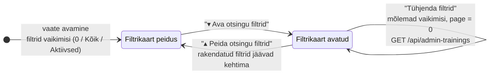
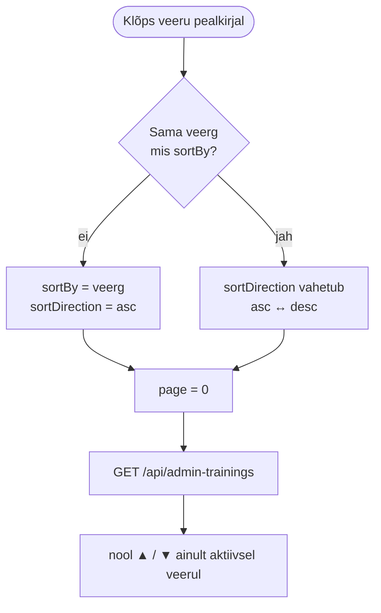
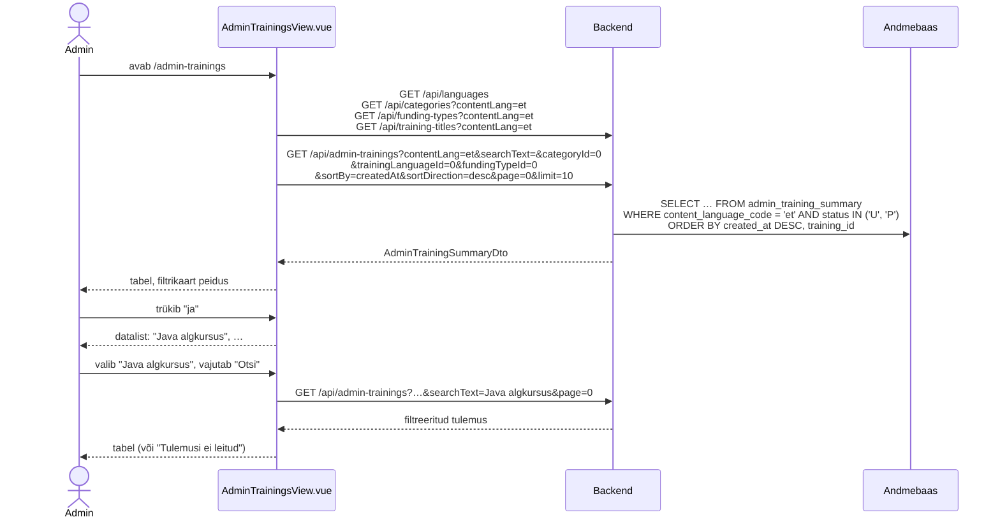
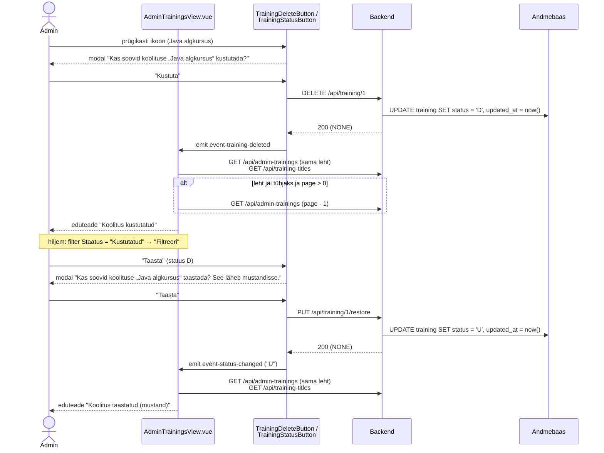

# AdminTrainingsView.vue — skeemid

Selles failis on `AdminTrainingsView.vue` (admini koolituste tabel) otsused, andmebaasi view ettepanek ja andmevood skeemidena (Mermaid). Märkmed: `docs/mock-wireframe/markmed/admin-trainings-view-markmed.md`. Interaktiivne läbimäng: `admin-trainings-view-labimang.html`. Taskid ja nende järjekord: `admin-trainings-view-toode-jarjekord.md`.

Eeskuju: `TrainingsView.vue` (`docs/tasks/frontend/trainings-view.md`) — sama otsingu ja leheküljestuse loogika, aga kaartide asemel tabel ning ainult adminile.

## Otsused

- **Vahelehed** (2026-10-01): admini nimekirjavaadete ülaosas vahelehed kõigi admin-menüü linkidega (`AdminTabs.vue` / `NavTabs.vue`), selle vaate vaheleht aktiivne — vt `docs/tasks/frontend/view-tabs.md`.

- Roll: Admin. Failinimi `AdminTrainingsView.vue`, rada `/admin-trainings`.
- **Menüülink:** navbari menüüs "Admin" (nähtav ainult adminile, `App.vue`) link "Koolitused" → `/admin-trainings` (i18n `navbar.manageTrainings`; algselt "Koolituste haldus"). (Admin-menüü uuendatud 2026-10-01: vt `docs/tasks/frontend/admin-menu.md`.)
- **Päis:** lehe pealkirja "Koolitused" real paremal on nupp "Lisa uus koolitus" → `/training-form` (TrainingFormView, olek `new-training`). Kitsal ekraanil liigub nupp pealkirja alla.
- **Tabeli rida = üks koolitus** (`training`), mitte üks tõlge.
- **Vaikimisi kuvatakse ainult aktiivsed koolitused** (status `U` ja `P`). Kustutatud koolitused (`D`) tulevad nähtavale staatuse filtriga "Kustutatud".
- **Nimi ja kategooria kuvatakse kasutajaliidese keeles** (store'i `contentLang`). Kui koolitusel selles keeles tõlget pole, kuvatakse põhikeele (`language.is_main_language`) pealkiri ja kategooria — nii ei kao ükski koolitus tabelist. Rea "Vaata" ja "Muuda" lingid avavad kuvatud tõlke (`trainingTranslationId`).
- Navbaris keele vahetamisel laaditakse uuesti tabel, kategooriad, rahastustüübid ja pealkirjade ettepanekud. Otsing, filtrid, sorteerimine ja leht jäävad alles.
- **Veerud:** Lisatud | Uuendatud | Koolituse nimi | Kategooria | Keel | Staatus | Tõlked | Sätted | Tegevused (Vaata, Muuda, Kustuta) | staatuse nupp.
  - **Lisatud** = `training.created_at`, **Uuendatud** = `GREATEST(training.updated_at, MAX(training_translation.updated_at))`, et ka tõlke muutmine liigutaks kuupäeva. Backend tagastab ajatempli (`Instant`), frontend kuvab kuupäeva kujul `30/09/2026`.
  - **Keel** = koolituse õppekeele lipp (`FlagIcon.vue`, `trainingLanguageFlagIconCode`).
  - **Staatus** = märgis "Mustand" (`U`) / "Publitseeritud" (`P`) / "Kustutatud" (`D`).
  - **Tõlked** = roheline linnuke, kui koolitusel on tõlge igas keeles, mille `requires_translation = true`; muidu punane rist. Risti tooltip näitab puuduvaid keeli (nt "Puudub: en").
  - **Sätted** = sinise täpiga read: rahastustüüpide nimed (nt "Töötukassa", "EL rahastus"), "Tellitav" (`isOrderable`) ja "Esile tõstetud" (`isPromoted`).
- **Kustutatud rida** on tuhmim. Sellel on ainult nupp "Taasta"; ikoonid Vaata, Muuda ja Kustuta on peidus, sest kustutatud koolitust enne taastamist ei vaadata ega muudeta.
- **Otsinguriba:** otsib ainult koolituse nimest (`title`), mitte lühikirjeldusest. Sõnad eraldatakse tühikute kohalt ja iga sõna peab esinema (contains, tõstutundetu) — sama loogika nagu `GET /api/trainings` teenuse `searchText` parameetril. Otsing käivitub nupu "Otsi" või Enteri peale.
- **Pealkirjade ettepanekud:** eraldi lihtne nimekirjateenus `GET /api/training-titles?contentLang=` tagastab kõigi aktiivsete (`status <> 'D'`) koolituste nimed. Vaade laadib need korra (ja keele vahetusel uuesti) ning `<datalist>` pakub trükkimise ajal sobivaid nimesid. Ettepaneku valimine ainult täidab otsinguvälja; otsing käivitub ikka "Otsi" nupu või Enteriga.
  - Kustutatud koolitusi ettepanekutes **ei ole** (vaikimisi filter "Aktiivsed" ei näitaks neid niikuinii). Et see ei jääks segaseks, on otsingunupu kõrval küsimärgi ikoon (sama muster nagu `TrainingsView`-s), mille tooltip ütleb: "Otsitakse koolituse nimest. Iga sõna peab nimes esinema, käändeid ei kohandata. Nimede valikus on ainult aktiivsed koolitused — kustutatud koolituse leidmiseks vali filtrites Staatus „Kustutatud“."
- **Kaart "Otsingu filtrid"** on vaikimisi peidus. Vaikimisi väärtustega ei filtreerita midagi peale selle, et kustutatud koolitusi ei kuvata. Kaardi kohal on link "▾ Ava otsingu filtrid" / "▴ Peida otsingu filtrid". Kaardi stiil on sama nagu TrainingFormView kaardil "Koolituse andmed".
  - Filtrid: Kategooria, Koolituse keel, Rahastus, Staatus (Aktiivsed / Mustand / Publitseeritud / Kustutatud), Tellitav (Kõik / Jah / Ei), Esile tõstetud (Kõik / Jah / Ei), Tõlked (Kõik / Olemas / Puuduvad). Kuupäevavahemikku ei ole.
  - Kaardi all on nupud "Filtreeri" ja "Tühjenda filtrid". Filtrid rakenduvad alles "Filtreeri" vajutamisel.
  - Rakendatud filtrid jäävad kehtima ka siis, kui kaart peidetakse. Lingi kõrval on märk "2 filtrit aktiivne".
  - "Otsi" nupp saadab päringuga kaasa rakendatud filtrid ja "Filtreeri" nupp rakendatud otsingusõna.
- **Sorteerimine käib backendis ja ühe veeru kaupa.** Sorteeritavad veerud: Lisatud, Uuendatud, Koolituse nimi, Kategooria, Keel, Staatus, Tõlked. Uue veeru esimene klõps sorteerib kasvavalt, sama veeru järgmine klõps vahetab suunda. Nool on nähtav ainult aktiivsel veerul. Vaikimisi järjestus on Lisatud kahanevalt (uuemad üleval). Lisaks sorteeritakse alati `trainingId` järgi, et võrdsete väärtuste järjekord oleks stabiilne.
  - Staatuse kasvav järjekord on töövoo järjekord: Mustand → Publitseeritud → Kustutatud (view veerg `status_order`).
  - Tõlgete kasvav järjekord: puuduvate tõlgetega koolitused eespool (`has_all_translations`: `false` → `true`).
- **Iga uus päring, mille põhjuseks on otsing, filter, sorteerimine või filtrite tühjendamine, alustab lehelt 0.** Lehe vahetus säilitab kõik muu.
- **Leheküljestus:** `limit = 10`, tabeli all on tekst "Kokku N koolitust" ja jagatud komponent `components/common/PaginationNav.vue`. Sama komponenti hakkab kasutama ka `TrainingsView.vue`.
- **Staatuse nupp teeb API kutse ise.** Komponent `components/common/TrainingStatusButton.vue` (propsid `trainingId`, `status`, soovi korral `title` modali teksti jaoks) sisaldab `ConfirmModal`-it, teeb kinnituse järel ise vastava päringu ja emit'ib `event-status-changed` (uus status). Vaade kuulab sündmust, näitab eduteadet ja laadib andmed uuesti. Nupu tekst ja päring sõltuvad staatusest:
  - `U` → "Publitseeri" → `PUT /api/training/{trainingId}/publish`
  - `P` → "Liiguta mustandisse" → `PUT /api/training/{trainingId}/unpublish`
  - `D` → "Taasta" → `PUT /api/training/{trainingId}/restore` (koolitus läheb mustandisse, publitseerimine on eraldi samm)
  - Sama komponent asendab TrainingFormView praeguse nupu (seal `D` olekut ei esine). Vigade korral (nt 404) suunab komponent üldisele veavaatele.
  - `publish` ja `unpublish` keelduvad kustutatud koolituse (`status = 'D'`) korral: `403 TRAINING_DELETED` ("Kustutatud koolituse staatust ei saa muuta, taasta see enne"). Uus väärtus `Error` enumisse; muudatus olemasolevatele teenustele. Frontend neid nuppe kustutatud real ei näita, seega kasutaja seda viga tavaliselt ei näe — kui näeb (nt teises aknas kustutatud), kuvab komponent backendi `message` teksti ja vaade laadib tabeli uuesti.
- **Kustutamine = soft delete.** Samuti komponent, mis teeb API kutse ise: `components/common/TrainingDeleteButton.vue` (prügikasti ikoon, `ConfirmModal`, `DELETE /api/training/{trainingId}`, emit `event-training-deleted`). Modal: "Kas soovid koolituse „Java algkursus“ kustutada?". Kustutada saab ka publitseeritud koolitust; modal hoiatab, et koolitus kaob avalikust nimekirjast.
  - Backendis lisatakse `TrainingStatus` enumisse `DELETED("D")` (kooskõlas `ApiStatus.STATUS_DELETED`).
  - Kustutatud koolitus kaob vaikimisi vaatest (filter "Aktiivsed"). Kui kustutamise järel jääb leht tühjaks, liigutakse eelmisele lehele.
  - Tulevikus võiks backend keelduda (`403`) koolituse kustutamisest, millel on tulevasi toimumiskordi (`course`). **Praegu seda kontrolli ei tehta.**
- **Kustutatud koolitus on teistele teenustele nagu olematu** → `404 PRIMARY_KEY_NOT_FOUND` (sama message nagu olematu ID korral). Muudatus olemasolevatele teenustele:
  - `GET /api/training/{trainingId}`, `GET /api/training/{trainingId}/training-translations`, `GET /api/training-translation/{trainingTranslationId}` (tõlke koolitus kustutatud), `PUT /api/training/{trainingId}`, `POST /api/training/{trainingId}/training-translation`, `GET /api/training/{trainingId}/ai-translation`.
  - Nii annavad `/training` ja `/training-form` kustutatud koolituse korral 404 ja frontend suunab üldisele veavaatele (nagu olematu ID korral).
  - Erandid, mis leiavad ka kustutatud koolituse: `publish` / `unpublish` (→ `403 TRAINING_DELETED`), `restore` (taastab) ja `DELETE` (kustutatud koolituse korral midagi ei muutu).
  - Backendis: `TrainingService`-isse lisaks olemasolevale `getValidTrainingBy` meetod, mis leiab ainult aktiivse koolituse (`status <> 'D'`), ja seda kasutavad ülal loetletud teenused.
- **Avalik `GET /api/trainings` peab edaspidi tagastama ainult `status = 'P'` koolitused.** Praegu staatust ei filtreerita üldse, mistõttu mustandid on `/trainings` lehel juba nähtavad ja pärast soft delete'i oleksid seal ka kustutatud koolitused. See on eraldi backend muudatus (`TrainingSummarySpecifications`-isse tingimus `hasStatus("P")`, `training_summary` view'sse `status` veerg).

---

## 1. Andmebaasi view `admin_training_summary` (ettepanek)

Eeskuju: `training_summary` (`docs/database/2_create.sql`). Erinevus: rida tekib iga koolituse ja iga tõlkekeele (`language.requires_translation = true`) kohta — ka siis, kui selles keeles tõlget pole. Pealkiri ja kategooria võetakse sel juhul põhikeelest. Nii on igas `content_language_code` väärtuses kõik koolitused (ka kustutatud) täpselt üks kord; staatuse filter rakendatakse päringus.

**NB!** SQL on ettepanek ja seda pole veel andmebaasi vastu käivitatud. `2_create.sql` faili lisatakse see backend taski käigus.

```sql
-- Admini koolituste tabel: üks rida koolituse ja tõlkekeele kohta; puuduva tõlke korral põhikeele pealkiri ja kategooria
CREATE VIEW admin_training_summary AS
SELECT row_number() OVER (ORDER BY t.id, cl.id)                    AS id,
       t.id                                                        AS training_id,
       cl.code                                                     AS content_language_code,
       COALESCE(tt.id, mtt.id)                                     AS training_translation_id,
       COALESCE(tt.title, mtt.title)                               AS title,
       t.category_id,
       COALESCE(ct.name, mct.name)                                 AS category_name,
       t.training_language_id,
       trl.code                                                    AS training_language_code,
       trl.flag_icon_code                                          AS training_language_flag_icon_code,
       t.status,
       CASE t.status WHEN 'U' THEN 1 WHEN 'P' THEN 2 ELSE 3 END   AS status_order,
       t.is_orderable,
       t.is_promoted,
       t.created_at,
       GREATEST(t.updated_at, (SELECT MAX(att.updated_at)
                               FROM training_translation att
                               WHERE att.training_id = t.id))     AS updated_at,
       mt.missing_translation_language_codes,
       mt.missing_translation_language_codes IS NULL               AS has_all_translations
FROM training t
         CROSS JOIN language cl
         JOIN language trl ON trl.id = t.training_language_id
         JOIN language ml ON ml.is_main_language
         LEFT JOIN training_translation tt ON tt.training_id = t.id AND tt.language_id = cl.id
         LEFT JOIN training_translation mtt ON mtt.training_id = t.id AND mtt.language_id = ml.id
         LEFT JOIN category_translation ct ON ct.category_id = t.category_id AND ct.language_id = cl.id
         LEFT JOIN category_translation mct ON mct.category_id = t.category_id AND mct.language_id = ml.id
         -- string_agg tühjast hulgast annab NULL, seega NULL = kõik tõlked olemas
         CROSS JOIN LATERAL (SELECT string_agg(rl.code, ',' ORDER BY rl.id) AS missing_translation_language_codes
                             FROM language rl
                             WHERE rl.requires_translation
                               AND NOT EXISTS (SELECT 1
                                               FROM training_translation rtt
                                               WHERE rtt.training_id = t.id
                                                 AND rtt.language_id = rl.id)) mt
WHERE cl.requires_translation;
```

| Veerg | Kasutus |
|---|---|
| `content_language_code` | filter `contentLang` järgi (alati) |
| `training_translation_id`, `title` | kuvatud tõlge; "Vaata"/"Muuda" link, otsing, sorteerimine `title` |
| `category_id`, `category_name` | filter `categoryId`, sorteerimine `categoryName` |
| `training_language_id`, `training_language_code`, `training_language_flag_icon_code` | filter `trainingLanguageId`, sorteerimine `trainingLanguageCode`, lipp |
| `status` | filter `status` (puudub = `U` ja `P`), märgis, staatuse nupp |
| `status_order` | sorteerimine `status` (1 = mustand, 2 = publitseeritud, 3 = kustutatud) |
| `is_orderable`, `is_promoted` | filtrid, "Sätted" |
| `created_at`, `updated_at` | veerud Lisatud/Uuendatud, sorteerimine |
| `missing_translation_language_codes` | nt `"en"`; `NULL` = kõik tõlked olemas. Risti tooltip |
| `has_all_translations` | filter `hasAllTranslations`, sorteerimine `hasAllTranslations`, linnuke/rist |

Rahastustüübid (`fundingTypes`) lisatakse igale reale samamoodi nagu `GET /api/trainings` puhul (`training_funding_type` → `funding_type_translation` `contentLang` keeles). Filter `fundingTypeId` on alampäring nagu `TrainingSummarySpecifications.hasFundingTypeId`.

Sama view annab ka `GET /api/training-titles` vastuse: `SELECT training_id, title FROM admin_training_summary WHERE content_language_code = ? AND status <> 'D' ORDER BY title`.

---

## 2. Vaate olek (frontend)

Otsingusõnal ja filtritel on kaks koopiat: **mustand** (mida kasutaja parasjagu sisestab) ja **rakendatud** (mis läheb päringusse). Nii ei muuda poolikult valitud filter tabelit enne "Filtreeri" vajutamist.



| Muutuja | Vaikimisi | Muutub |
|---|---|---|
| `searchText` / `appliedSearchText` | `""` | sisestus / "Otsi", Enter |
| `filters` / `appliedFilters` | `categoryId: 0`, `trainingLanguageId: 0`, `fundingTypeId: 0`, `status: null` (= aktiivsed), `isOrderable: null`, `isPromoted: null`, `hasAllTranslations: null` | valikud / "Filtreeri", "Tühjenda filtrid" |
| `sortBy`, `sortDirection` | `"createdAt"`, `"desc"` | veeru pealkirja klõps |
| `page` | `0` | leheküljestus; iga muu päringu põhjus → `0` |
| `isFilterCardOpen` | `false` | link "Ava/Peida otsingu filtrid" |

`null` väärtusega parameetreid axios päringusse ei lisa, seega "Kõik" / "Aktiivsed" = parameeter puudub.

---

## 3. Sorteerimine



| Veerg | `sortBy` | View veerg | Kasvav järjekord |
|---|---|---|---|
| Lisatud | `createdAt` | `created_at` | vanemad enne |
| Uuendatud | `updatedAt` | `updated_at` | vanemad enne |
| Koolituse nimi | `title` | `title` | A → Õ |
| Kategooria | `categoryName` | `category_name` | A → Õ |
| Keel | `trainingLanguageCode` | `training_language_code` | keelekoodi järgi (en, et, ru) |
| Staatus | `status` | `status_order` | Mustand → Publitseeritud → Kustutatud |
| Tõlked | `hasAllTranslations` | `has_all_translations` | puuduvad → olemas |

Sätteid ja tegevusi sorteerida ei saa.

---

## 4. Päringud

| Grupp | Päring | Millal / milleks |
|---|---|---|
| Laadimine | `GET /api/admin-trainings?…` | tabel (vaikimisi `sortBy=createdAt&sortDirection=desc&page=0&limit=10`, ilma `status` parameetrita) |
| Laadimine | `GET /api/training-titles?contentLang={UI keel}` | otsinguvälja ettepanekud |
| Laadimine | `GET /api/categories?contentLang={UI keel}` | filter "Kategooria" |
| Laadimine | `GET /api/funding-types?contentLang={UI keel}` | filter "Rahastus" |
| Laadimine | `GET /api/languages` | filter "Koolituse keel" |
| Tegevus | `GET /api/admin-trainings?…` | "Otsi", "Filtreeri", "Tühjenda filtrid", sorteerimine, lehe vahetus |
| Tegevus | `PUT /api/training/{trainingId}/publish` | `TrainingStatusButton` "Publitseeri" (status `U`) → kinnitus → tabel uuesti |
| Tegevus | `PUT /api/training/{trainingId}/unpublish` | `TrainingStatusButton` "Liiguta mustandisse" (status `P`) → kinnitus → tabel uuesti |
| Tegevus | `PUT /api/training/{trainingId}/restore` | `TrainingStatusButton` "Taasta" (status `D`) → kinnitus → tabel uuesti |
| Tegevus | `DELETE /api/training/{trainingId}` | `TrainingDeleteButton` → kinnitus → tabel ja pealkirjad uuesti |
| Navigeerimine | — | päise nupp "Lisa uus koolitus" → `/training-form` |
| Navigeerimine | — | "Vaata" → `/training?trainingId={id}&trainingTranslationId={id}` |
| Navigeerimine | — | "Muuda" → `/training-form?trainingId={id}&trainingTranslationId={id}` |

Keele vahetusel navbaris (`watch: contentLang`) tehakse uuesti kõik laadimise päringud peale `GET /api/languages`. Pärast taastamist laaditakse uuesti ka pealkirjade ettepanekud.

---

## 5. Vaate avamine ja otsing



---

## 6. Kustutamine ja taastamine

API kutse teeb komponent ise; vaade ainult kuulab sündmust ja laadib tabeli uuesti.



Publitseerimine ja mustandisse liigutamine käib sama `TrainingStatusButton` kaudu (vt TrainingFormView skeem 7); vaade laadib pärast sündmust uuesti tabeli.

---

## 7. Komponendid

| Komponent | Uus / olemas | Kirjeldus |
|---|---|---|
| `views/AdminTrainingsView.vue` | uus | vaade, hoiab olekut ja teeb laadimise päringud |
| `App.vue` (navbar) | olemas, muudetakse | menüüsse "Admin" link "Koolitused" |
| `router/index.js` | olemas, muudetakse | rada `/admin-trainings` (nimi nt `adminTrainingsRoute`) |
| `components/common/PaginationNav.vue` | uus, jagatud | propsid `page`, `totalPages`; emit `event-page-changed`. Kasutab ka `TrainingsView.vue` |
| `components/common/TrainingStatusButton.vue` | uus, jagatud | propsid `trainingId`, `status`, `title`; `ConfirmModal` + API kutse (publish / unpublish / restore); emit `event-status-changed`. Kasutab ka `TrainingFormView.vue` |
| `components/common/TrainingDeleteButton.vue` | uus | propsid `trainingId`, `title`; prügikasti ikoon, `ConfirmModal` + `DELETE`; emit `event-training-deleted` |
| `components/common/EditTrainingLink.vue` | olemas | "Muuda" ikoon |
| `components/common/FlagIcon.vue` | olemas | õppekeele lipp |
| `components/modals/ConfirmModal.vue` | olemas | kasutavad staatuse ja kustutamise nupud |
| `components/forms/CategoriesDropdown.vue`, `LanguagesDropdown.vue` | olemas | filtrikaardis (esimene valik "Kõik", väärtus `0`) |
| filtrikaart, sorteeritav veeru pealkiri | arendaja otsustada | nt `AdminTrainingFilters.vue`, `SortableColumnHeader.vue` |

---

## 8. Lahtised küsimused

- Kustutamise keeld tulevaste toimumiskordade korral — lisatakse siis, kui `course` teenused valmivad.

---

## 9. Balsamiq AI käsk

```text
Create a desktop wireframe of an admin page "Koolitused" in a web app.
Top: site navigation bar with logo and links (Koolitused, Teenused, Ettevõttest, Kontakt), an open dropdown "Admin ▾" with items "Koolituste päringud", "Registreerumised", a divider, "Koolitused" (highlighted), "Koolituste kalender", a divider, "Koolitajad" and "Koolitusruumid", and "Logi välja" on the right.
Below the navigation bar: a tab bar "Koolituste päringud | Registreerumised | Koolitused | Koolituste kalender | Koolitajad | Koolitusruumid" with "Koolitused" as the active tab.
Header row: page title "Koolitused" on the left and a primary button "+ Lisa uus koolitus" on the right.
Below the header: a search row with a text input "Otsi koolituse nime järgi…" and a button "Otsi".
Below the search row: a small text link with a down arrow "▾ Ava otsingu filtrid" and a small badge "2 filtrit aktiivne".
Below the link: an expanded card titled "Otsingu filtrid" with dropdowns in a grid: "Kategooria", "Koolituse keel", "Rahastus", "Staatus", "Tellitav", "Esile tõstetud", "Tõlked". At the bottom of the card: primary button "Filtreeri" and secondary button "Tühjenda filtrid".
Main area: a data table with columns "Lisatud ▼", "Uuendatud", "Koolituse nimi", "Kategooria", "Keel", "Staatus", "Tõlked", "Sätted", "Tegevused" and an unlabeled last column.
Show 5 rows, for example: "20/08/2026 | 20/08/2026 | SQL ja andmebaasid | Programmeerimine | Estonian flag | badge Publitseeritud | green check | • Töötukassa • Tellitav | eye icon, pencil icon, trash icon | button Liiguta mustandisse".
One row has status badge "Mustand", a red X in "Tõlked" and button "Publitseeri".
One greyed-out row has status badge "Kustutatud", no icons in "Tegevused" and button "Taasta".
Below the table: text "Kokku 13 koolitust" on the left and pagination "Eelmine 1 2 Järgmine" in the center.
```
