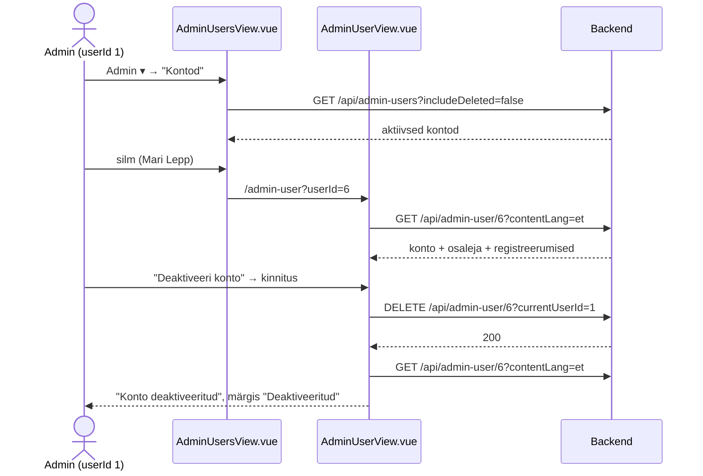
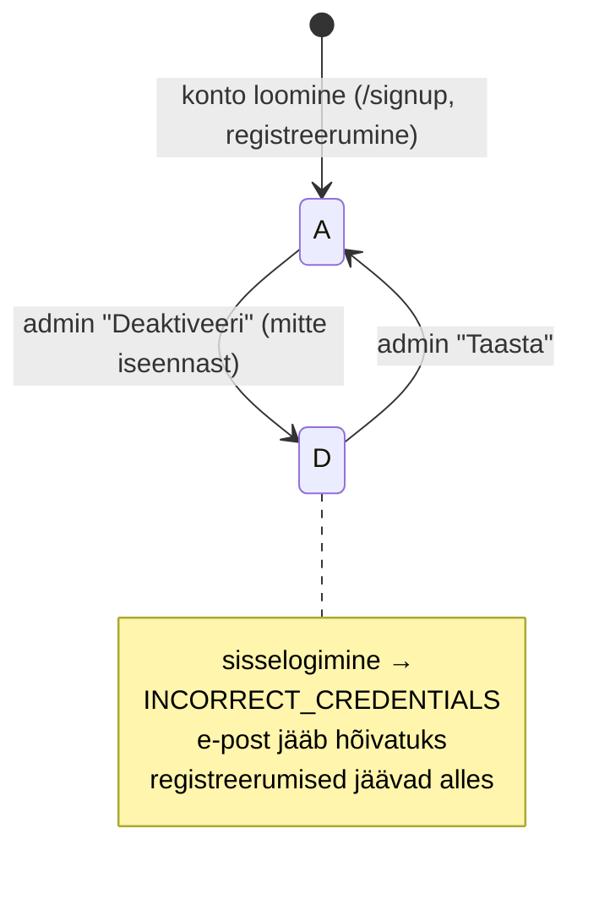

# Kontode haldus (admin) — skeemid

Planeerimisfail uutele vaadetele, mida mockupis pole: kõigi kontode nimekiri ja ühe konto vaade. Seotud epic: osaleja profiilivaated (`../profile-view/profile-view-skeemid.md`).

**Seis:** põhiotsused kasutajaga kokku lepitud ja läbimäng tehtud (2026-10-01). Järgmine samm: märkmed (jaotis 6).

Mõisted: **konto** = `"user"` rida (e-post, parool, roll, staatus). **Osaleja** = `participant` + `profile` (nimi, telefon, kontakt-e-post); kontol on kuni üks osaleja (`participant_user_uq`). Adminikontodel osalejat tavaliselt pole.

---

## Otsused

### Üldine

- Nimed andmebaasi järgi (konto = tabel `"user"`): nimekiri `AdminUsersView.vue` (`/admin-users`), üks konto `AdminUserView.vue` (`/admin-user?userId={id}`). Kasutajaliideses on sõna **"Konto"/"Kontod"**.
- Admin saab: **vaadata** kõiki kontosid ja ühe konto andmeid koos registreerumistega ning **deaktiveerida / taastada** konto.
- Admin **ei** saa (praegu): luua kontot, muuta rolli, muuta konto või osaleja andmeid ega parooli. Kontod tekivad konto loomise (`/signup`) ja registreerumise kaudu.
- Deaktiveerimine on soft delete nagu ruumidel ja koolitajatel: `"user".status = D` (`ApiStatus.STATUS_DELETED`), taastamisel `A`. Andmed, osaleja ja registreerumised jäävad alles.
- Deaktiveeritud konto **ei saa sisse logida**: `POST /api/login` otsib juba praegu ainult staatust `A` ja vastab `INCORRECT_CREDENTIALS`. Konto e-post jääb hõivatuks (`user_email_uq`), nii et sama e-postiga uut kontot luua ei saa.
- Admin **ei saa deaktiveerida iseennast** (`CANNOT_DEACTIVATE_SELF`), et keegi ei lukustaks end kogemata välja. Tegija `userId` antakse päringuga kaasa (`currentUserId`), nagu `created_by` puhul teistes teenustes.
- Teadaolev piirang: päris sessioone projektis pole, seega juba sisseloginud kasutaja jääb sisse kuni väljalogimiseni (`sessionStorage`). Uuesti sisse logida ta ei saa.

### Navbar (`App.vue`)

- Menüüs "Admin ▾" uus, neljas rühm lõpus (eraldaja järel): **"Kontod"** → `/admin-users` (i18n `navbar.manageUsers`, en "Accounts").

### Kontode nimekiri — `AdminUsersView.vue` (`/admin-users`)

- Pealkiri "Kontod".
- Otsing frontendis: e-post, nimi, telefon.
- Rolli filter (frontendis): "Kõik rollid" / "Osalejad" / "Adminid".
- Lüliti **"Näita ka deaktiveeritud"** (vaikimisi väljas → ainult `A`), muutmisel uus päring (nagu ruumidel `includeDeleted`).
- Tabel (sorteerimine frontendis, vaikimisi loomise aeg, uusimad eespool): Loodud | E-post | Nimi | Telefon | Roll (Admin / Osaleja) | Registreerumisi | Staatus (Aktiivne / Deaktiveeritud) | Tegevused.
  - Nimi ja telefon tulevad osalejalt; osaleja puudumisel "—".
  - Registreerumisi = registreerunud (`R`) registreerumiste arv kõigil toimumiskordadel (ka toimunud).
  - Enda rida märgisega "Sina".
- Tegevused: silm → `/admin-user?userId={id}`; aktiivsel kontol "Deaktiveeri" (kinnitusega), deaktiveeritul "Taasta" (kinnitusega). Enda real "Deaktiveeri" puudub.
- Deaktiveeritud rida tuhmim; all "Kokku N kontot".

### Konto — `AdminUserView.vue` (`/admin-user?userId={id}`)

- Ülal tagasilink "← Kõik kontod" (`/admin-users`).
- Pealkiri "Konto", all e-post; deaktiveeritud kontol märgis "Deaktiveeritud".
- Kaart **"Konto"**: E-post, Roll, Staatus, Loodud.
- Kaart **"Osaleja"**: Nimi, E-post (mailto, kui erineb konto e-postist), Telefon (tel). Osaleja puudumisel: "Kontol pole osaleja andmeid".
- Kaart **"Registreerumised"**: tabel Koolitus | Toimumisaeg (+ "Toimunud") | Staatus (Registreerunud / Loobunud) | Tasunud ✓/✗ | silm → `/admin-registration?courseParticipantId={id}&returnTo=/admin-user?userId={id}`. Toimumiskord on link `/admin-course?courseId={id}`. Järjestus alguse järgi, uusimad eespool. Tühi: "Registreerumisi pole".
- Nupp **"Deaktiveeri konto"** / **"Taasta konto"** (kinnitusega, `ConfirmModal`). Enda kontol nupp puudub ja näidatakse vihjet "See on sinu konto". Edu korral teade samas vaates ja andmed laaditakse uuesti.

### Uued teenused (ettepanek)

| Teenus | Kirjeldus |
|---|---|
| `GET /api/admin-users?includeDeleted=` | `AdminUserSummaryDto` list: `userId`, `email`, `roleName`, `participantName` (null), `phone` (null), `registrationCount`, `createdAt`, `status`. Järjestus `created_at` kahanevalt |
| `GET /api/admin-user/{userId}?contentLang=` | `AdminUserDto`: konto väljad + `participantId`, `participantName`, `profileEmail`, `phone` (osaleja puudumisel null) + `registrations` (`AdminUserRegistrationDto` list: `courseParticipantId`, `courseId`, `trainingTitle`, `startDate`, `endDate`, `isPast`, `status`, `hasPaid`) |
| `DELETE /api/admin-user/{userId}?currentUserId=` | Deaktiveerib (`status = D`). Vead: `PRIMARY_KEY_NOT_FOUND`, `CANNOT_DEACTIVATE_SELF` (403) |
| `PUT /api/admin-user/{userId}/restore` | Taastab (`status = A`). Viga: `PRIMARY_KEY_NOT_FOUND` |

Uus `Error` väärtus: `CANNOT_DEACTIVATE_SELF("Enda kontot ei saa deaktiveerida")`.

---

## 1. Andmebaasi muudatus

**Pole vaja.** `"user".status` (`A`/`D`) ja `created_at` on olemas. Nimekirja päring: `"user"` + `role` + `participant` + `profile` (LEFT JOIN) + `course_participant` arv. Kui päring läheb keerukaks, võib lisada view `admin_user_summary` (nagu `admin_room_summary`).

`3_import.sql` sobib: 7 kontot (2 adminit, 5 osalejat), Mari Lepal on ainult loobunud registreerumine (`Registreerumisi = 0`).

---

## 2. Nimekiri, konto ja deaktiveerimine

## 3. Konto staatus

## 4. Komponendid

| Komponent | Olek | Kasutus |
|---|---|---|
| `AdminUsersView.vue`, `AdminUserView.vue` | uus | vaated (+ router, admini kontroll nagu teistel admin-vaadetel) |
| `UserStatusBadge.vue` | uus (väike) | Aktiivne / Deaktiveeritud |
| `SortableColumnHeader`, `SortService`, `CheckMark`, `CourseParticipantStatusBadge`, `ConfirmModal`, `InlineAlerts` | olemas | taaskasutus |
| `App.vue` navbar | muudatus | "Admin ▾" → rühm "Kontod" |

## 5. Hiljem

- Rolli muutmine (osaleja ↔ admin; mitte iseenda oma).
- Admin parandab konto/osaleja andmeid (sama loogika mis `ParticipantDetailsView`).
- Konto loomine admini poolt; parooli lähtestamine.

## 6. Järgmised sammud

1. ~~Põhiotsused~~ — tehtud.
2. ~~Läbimäng `admin-users-view-labimang.html` + prototüübi kest (`../index.html`, vaated "Kontod", "Konto", Admin ▾ → "Kontod")~~ — tehtud.
3. Märkmed `markmed/admin-users-view-markmed.md`, `admin-user-view-markmed.md`.
4. Taskid (`docs/tasks/backend/`, `docs/tasks/frontend/`) ja tööde järjekord.
