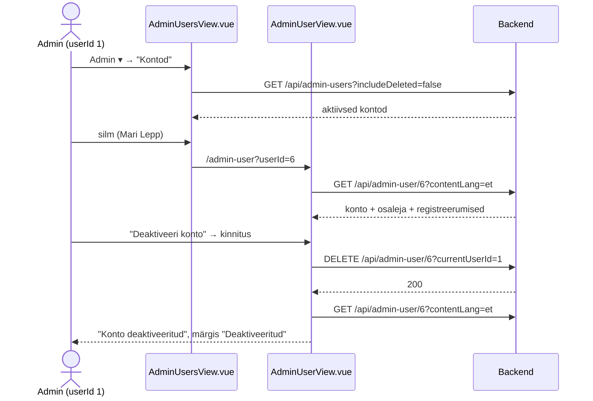
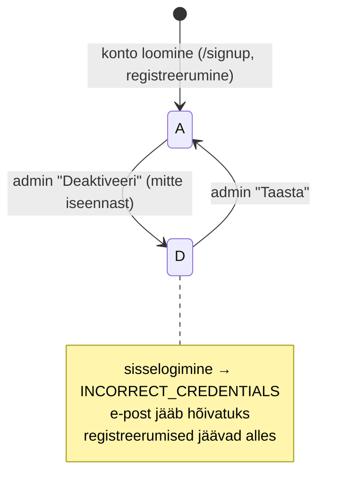

# Kontode haldus (admin) — skeemid

Planeerimisfail uutele vaadetele, mida mockupis pole: kõigi kontode nimekiri ja ühe konto vaade. Seotud epic: osaleja profiilivaated (`../profile-view/profile-view-skeemid.md`).

**Seis:** kood valmis (2026-10-01). Skeemid ja läbimäng `admin-users-view-labimang.html` vastavad koodile; lahknevuse korral on tõde kood. Märkmed ja taskid on tegemata (jaotis 6).

Mõisted: **konto** = `"user"` rida (e-post, parool, roll, staatus). **Osaleja** = `participant` + `profile` (nimi, telefon, kontakt-e-post); kontol on kuni üks osaleja (`participant_user_uq`). Adminikontodel osalejat tavaliselt pole.

---

## Otsused

### Üldine

- Nimed andmebaasi järgi (konto = tabel `"user"`): nimekiri `AdminUsersView.vue` (`/admin-users`, `adminUsersRoute`), üks konto `AdminUserView.vue` (`/admin-user?userId={id}`, `adminUserRoute`). Kasutajaliideses on sõna **"Konto"/"Kontod"**. Mõlemad vaated kontrollivad `beforeMount`-is admini rolli (muidu `/not-authorized`), nagu teised admini vaated.
- Admin saab: **vaadata** kõiki kontosid ja ühe konto andmeid koos registreerumistega ning **deaktiveerida / taastada** konto.
- Admin **ei** saa (praegu): luua kontot, muuta rolli, muuta konto või osaleja andmeid ega parooli. Kontod tekivad konto loomise (`/signup`) ja registreerumise kaudu.
- Deaktiveerimine on soft delete nagu ruumidel ja koolitajatel: `"user".status = D` (`ApiStatus.STATUS_DELETED`), taastamisel `A`. Andmed, osaleja ja registreerumised jäävad alles.
- Deaktiveeritud konto **ei saa sisse logida**: `POST /api/login` otsib juba praegu ainult staatust `A` ja vastab `INCORRECT_CREDENTIALS`. Konto e-post jääb hõivatuks (`user_email_uq`), nii et sama e-postiga uut kontot luua ei saa.
- Admin **ei saa deaktiveerida iseennast** (`CANNOT_DEACTIVATE_SELF`), et keegi ei lukustaks end kogemata välja. Tegija `userId` antakse päringuga kaasa (`currentUserId`), nagu `created_by` puhul teistes teenustes.
- Teadaolev piirang: päris sessioone projektis pole, seega juba sisseloginud kasutaja jääb sisse kuni väljalogimiseni (`sessionStorage`). Uuesti sisse logida ta ei saa.

### Navbar (`App.vue`)

- Menüüs "Admin ▾" neljas rühm lõpus (eraldaja järel): **"Kontod"** → `/admin-users` (i18n `navbar.manageUsers`, en "Accounts").
- Admini vahelehtedes (`AdminTabs.vue`) on sama link viimasena: Koolituste päringud | Registreerumised | Koolitused | Koolituste kalender | Koolitajad | Koolitusruumid | **Kontod**.
- Admini profiiliikooni "👤 ▾" all on ainult "Parool" (`/change-password`), vt `../profile-view/profile-view-skeemid.md`.

### Kontode nimekiri — `AdminUsersView.vue` (`/admin-users`)

- Ülal `AdminTabs`, pealkiri "Kontod".
- Ühel real: otsinguväli "Otsi e-posti, nime või telefoni järgi…" (frontendis: e-post, nimi, telefon), rolli valik "Kõik rollid" / "Osalejad" / "Adminid" (frontendis) ja lüliti **"Näita ka deaktiveeritud"** (vaikimisi väljas → ainult `A`; muutmisel uus päring, nagu ruumidel `includeDeleted`).
- Teated (`InlineAlerts`) filtrite all.
- Tabel: Loodud (`dd/MM/yyyy HH:mm`) | E-post | Nimi | Telefon | Roll (Admin / Osaleja, tekst) | Registreerumisi | Staatus (`UserStatusBadge`: Aktiivne roheline / Deaktiveeritud punane) | Tegevused.
  - Sorteeritavad veerud (`SortableColumnHeader` + `SortService`, frontendis): Loodud, E-post, Nimi, Roll, Registreerumisi, Staatus. 1. klõps kasvav, 2. kahanev, 3. vaikimisi (backendi järjestus: loodud, uusimad eespool). Tühjad väärtused (nt nimi) alati lõpus. Telefon pole sorteeritav.
  - Nimi ja telefon tulevad osalejalt; osaleja puudumisel "—".
  - Registreerumisi = registreerunud (`R`) registreerumiste arv kõigil toimumiskordadel (ka toimunud).
  - Enda rida märgisega "Sina".
- Tegevused: silm "Vaata" → `/admin-user?userId={id}`; `UserStatusButton` — aktiivsel kontol tekstinupp "Deaktiveeri", deaktiveeritul "Taasta" (mõlemad kinnitusega). Enda real deaktiveerimise/taastamise nuppu pole.
- Pärast tegevust laaditakse nimekiri uuesti; teade "Konto deaktiveeritud" / "Konto taastatud" või 403 backendi teade.
- Deaktiveeritud rida tuhmim; leidmata korral "Kontosid ei leitud"; all "Kokku N kontot".

### Konto — `AdminUserView.vue` (`/admin-user?userId={id}`)

- Ülal tagasilink "← Kõik kontod" (`/admin-users`).
- Pealkiri "Konto", all e-post; deaktiveeritud kontol märgis "Deaktiveeritud". Kaardid (`fieldset`) on üksteise all.
- Kaart **"Konto"**: E-post, Roll, Staatus, Loodud.
- Kaart **"Osaleja"**: Nimi, E-post (mailto, kui erineb konto e-postist), Telefon (tel). Osaleja puudumisel: "Kontol pole osaleja andmeid".
- Kaart **"Registreerumised"**: tabel Koolitus | Toimumisaeg (+ "Toimunud") | Staatus (Registreerunud / Loobunud) | Tasunud ✓/✗ (`CheckMark`) | silm "Vaata registreerumist" → `/admin-registration?courseParticipantId={id}&returnTo=/admin-user?userId={id}` (sealne tagasilink viib siia). Toimumisaeg on link `/admin-course?courseId={id}`. Järjestus alguse järgi, uusimad eespool. Koolituse nimi kasutajaliidese keeles, keele vahetusel laaditakse uuesti. Tühi: "Registreerumisi pole".
- Kaartide all nupp **"Deaktiveeri konto"** / **"Taasta konto"** (`UserStatusButton`, kinnitusega `ConfirmModal`) ja teated (`InlineAlerts`). Enda kontol nupp puudub ja näidatakse vihjet "See on sinu konto — enda kontot deaktiveerida ei saa." Edu korral teade samas vaates ja andmed laaditakse uuesti; 403 → backendi teade.
- `userId` puudub või konto olematu → üldine veavaade.

### Kinnitusaken (`UserStatusButton.vue`)

- Deaktiveerimine: pealkiri "Deaktiveeri konto?", tekst "„{nimi (e-post)}“ ei saa enam sisse logida. Andmed ja registreerumised jäävad alles, konto saab hiljem taastada.", nupud "Deaktiveeri" / "Sulge".
- Taastamine: pealkiri "Taasta konto?", tekst "„{nimi (e-post)}“ saab jälle sisse logida.", nupud "Taasta" / "Sulge".
- Osaleja puudumisel on nimeks ainult e-post. Nupp teeb päringu ise (`DELETE …?currentUserId={sessionStorage userId}` / `PUT …/restore`) ja annab vaatele sündmuse `event-user-deactivated`, `event-user-restored` või `event-status-error` (403 teade).

### Teenused (`UserController` → `AdminUserService`)

| Teenus | Kirjeldus |
|---|---|
| `GET /api/admin-users?includeDeleted=` | `AdminUserSummaryDto` list: `userId`, `email`, `roleName`, `participantName` (null), `phone` (null), `registrationCount` (Long), `createdAt`, `status`. JPQL konstruktori päring `UserRepository.findAdminUserSummariesBy` (LEFT JOIN osaleja ja profiil, alampäring registreerumiste arvuks). Järjestus `created_at` kahanevalt |
| `GET /api/admin-user/{userId}?contentLang=` | `AdminUserDto`: konto väljad (`userId`, `email`, `roleName`, `status`, `createdAt`) + `participantId`, `participantName`, `profileEmail`, `phone` (osaleja puudumisel null, `registrations = []`) + `registrations` (`AdminUserRegistrationDto` list: `courseParticipantId`, `courseId`, `trainingTitle`, `startDate`, `endDate`, `isPast`, `status`, `hasPaid`; kustutatud toimumiskorrad välja, `start_date` kahanevalt; nimi `TrainingTranslationService.getTrainingTitle`). Viga: `PRIMARY_KEY_NOT_FOUND` |
| `DELETE /api/admin-user/{userId}?currentUserId=` | Deaktiveerib (`status = D`); juba deaktiveeritud jääb samaks. Vead: `PRIMARY_KEY_NOT_FOUND` (404, kontrollitakse esimesena), `CANNOT_DEACTIVATE_SELF` (403) |
| `PUT /api/admin-user/{userId}/restore` | Taastab (`status = A`); aktiivne jääb samaks. Viga: `PRIMARY_KEY_NOT_FOUND` |

Uus `Error` väärtus: `CANNOT_DEACTIVATE_SELF("Enda kontot ei saa deaktiveerida")`.

---

## 1. Andmebaasi muudatus

**Pole vaja.** `"user".status` (`A`/`D`) ja `created_at` on olemas. Nimekirja päring: `"user"` + `role` + `participant` + `profile` (LEFT JOIN) + `course_participant` arv — tehtud JPQL konstruktori päringuna, view'd (`admin_user_summary`) ei lisatud.

`3_import.sql` sobib: 7 kontot (2 adminit, 5 osalejat), Mari Lepal on ainult loobunud registreerumine (`Registreerumisi = 0`).

---

## 2. Nimekiri, konto ja deaktiveerimine

## 3. Konto staatus

## 4. Komponendid

| Komponent | Olek | Kasutus |
|---|---|---|
| `views/AdminUsersView.vue`, `views/AdminUserView.vue` | uus | vaated (+ `router/index.js`, admini kontroll `beforeMount`-is nagu teistel admin-vaadetel) |
| `components/common/UserStatusBadge.vue` | uus (väike) | Aktiivne / Deaktiveeritud |
| `components/common/UserStatusButton.vue` | uus | "Deaktiveeri" / "Taasta" + kinnitusaken + päring (nimekirjas ja konto vaates) |
| `SortableColumnHeader`, `SortService`, `CheckMark`, `CourseParticipantStatusBadge`, `ConfirmModal`, `InlineAlerts`, `FormatService` | olemas | taaskasutus |
| `App.vue` navbar | muudatus | "Admin ▾" → rühm "Kontod" |
| `components/common/AdminTabs.vue` | muudatus | vaheleht "Kontod" |
| `api-services/UserService.js` | täiendus | `sendGetAdminUsersRequest`, `sendGetAdminUserRequest`, `sendDeleteAdminUserRequest`, `sendPutAdminUserRestoreRequest` |
| `locales/et.json`, `en.json` | täiendus | `navbar.manageUsers`, `userStatus`, `roles`, `userStatusButton`, `adminUsers`, `adminUser` |
| Backend: `AdminUserService`, `AdminUserSummaryDto`, `AdminUserDto`, `AdminUserRegistrationDto` (`controller/user/dto`), `UserMapper.toAdminUserDto`, `CourseParticipantMapper.toAdminUserRegistrationDto`, `Error.CANNOT_DEACTIVATE_SELF` | uus | teenuste tabelis |

## 5. Hiljem

- Rolli muutmine (osaleja ↔ admin; mitte iseenda oma).
- Admin parandab konto/osaleja andmeid (sama loogika mis `ParticipantDetailsView`).
- Konto loomine admini poolt; parooli lähtestamine.

## 6. Järgmised sammud

1. ~~Põhiotsused~~ — tehtud.
2. ~~Läbimäng `admin-users-view-labimang.html` + prototüübi kest (`../index.html`, vaated "Kontod", "Konto", Admin ▾ → "Kontod")~~ — tehtud.
3. Märkmed `markmed/admin-users-view-markmed.md`, `admin-user-view-markmed.md` — tegemata.
4. Taskid (`docs/tasks/backend/`, `docs/tasks/frontend/`) ja tööde järjekord — tegemata.
5. ~~Kood~~ — tehtud (2026-10-01). Lahtine: backendi automaattestid.
