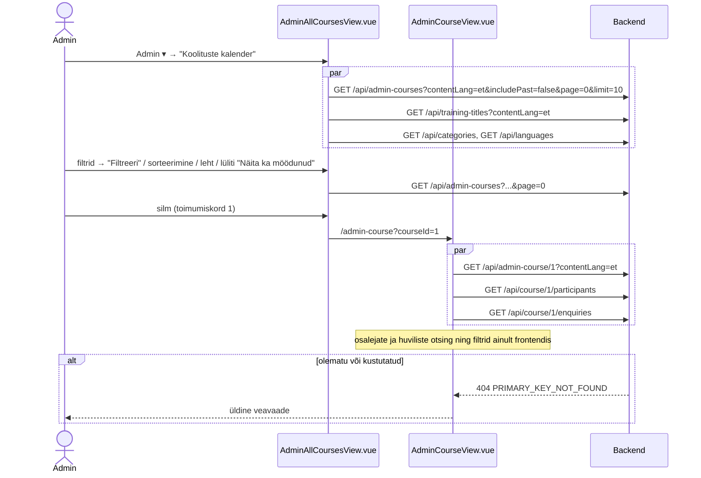
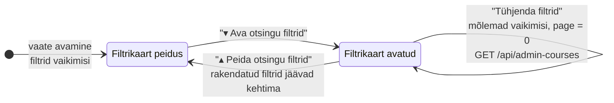
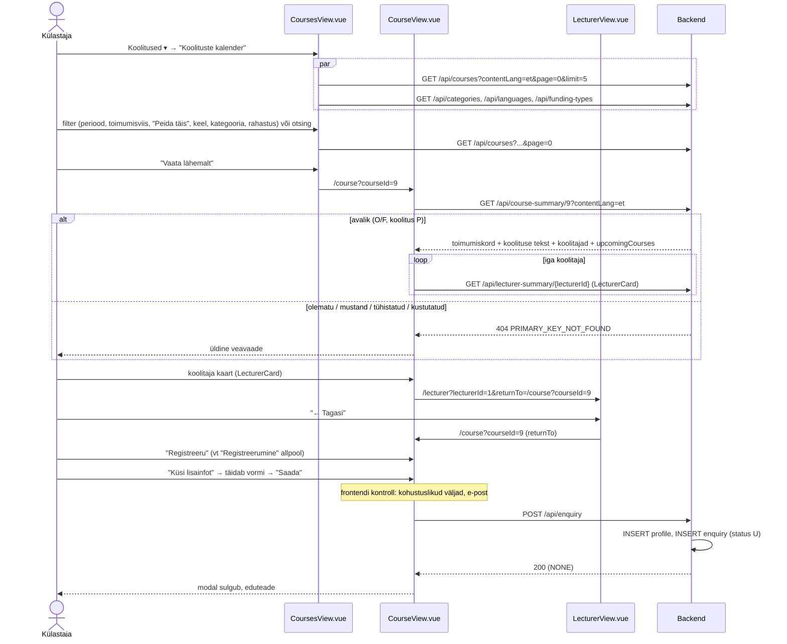
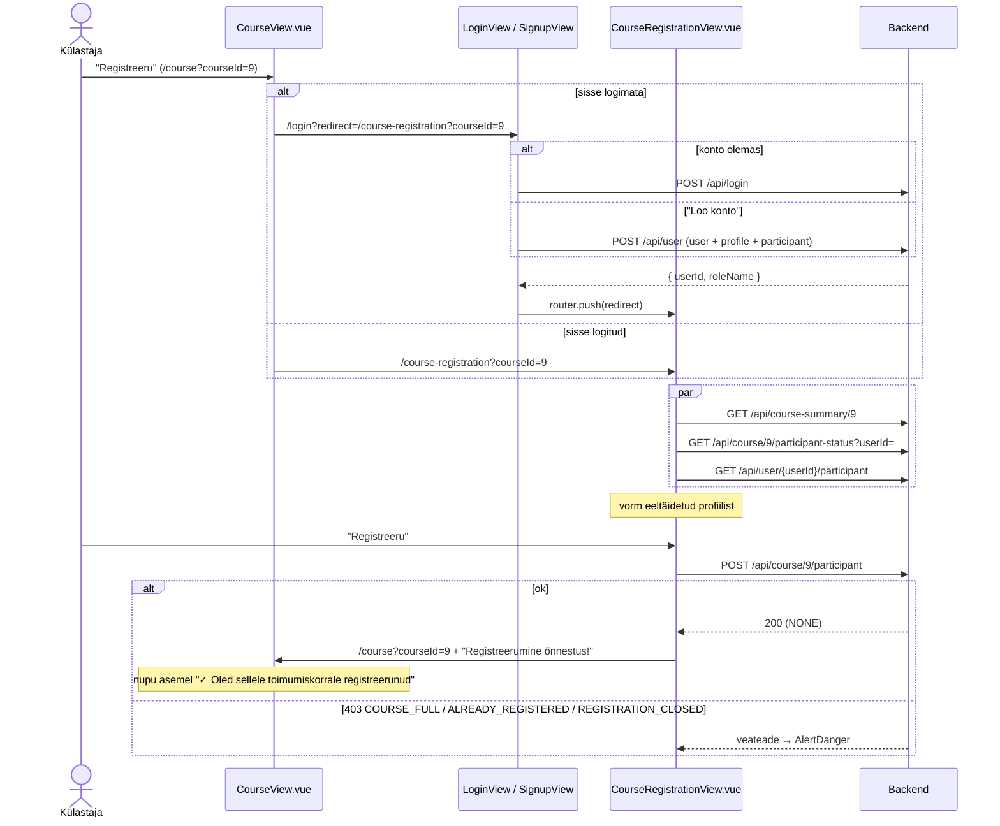

# Toimumiskordade vaated — skeemid

Toimumiskordade vaated (tabel `course`) ning registreerumine:

| Rada | Vaade | Roll | Läbimäng |
|---|---|---|---|
| `/admin-all-courses` | `AdminAllCoursesView.vue` — kõigi koolituste toimumiskorrad tabelis | Admin | `admin-all-courses-view-labimang.html` |
| `/admin-course?courseId={id}` | `AdminCourseView.vue` — ühe toimumiskorra ülevaade, osalejad ja huvilised | Admin | `admin-all-courses-view-labimang.html` |
| `/courses` | `CoursesView.vue` — "Koolituste kalender" (avalik) | kõik | `courses-view-labimang.html` |
| `/course?courseId={id}` | `CourseView.vue` — ühe toimumiskorra avalik leht | kõik | `courses-view-labimang.html` |
| `/course-registration?courseId={id}` | `CourseRegistrationView.vue` — registreerumine | kasutaja | `course-registration-view-labimang.html` |
| `/signup?redirect=` | `SignupView.vue` — konto loomine | kõik | `course-registration-view-labimang.html` |

Selles failis on otsused, andmebaasi ettepanekud ja andmevood skeemidena (Mermaid). Märkmed: `docs/mock-wireframe/markmed/admin-all-courses-view-markmed.md`, `admin-course-view-markmed.md`, `courses-view-markmed.md`, `course-view-markmed.md`, `course-registration-view-markmed.md`, `signup-view-markmed.md`. Katusharu `feature/RAIN-courses`.

Eeskujud: `admin-training-courses-view/` (ühe koolituse kalender, `course_summary`, staatused), `admin-trainings-view/` (filtrite kaart, backendi sorteerimine ja leheküljestus), `admin-enquiries-view/` (päringud), `trainings-view/` (avalik nimekiri ja filtrid).

## Otsused

- **Vahelehed** (2026-10-01): admini nimekirjavaadete ülaosas vahelehed kõigi admin-menüü linkidega (`AdminTabs.vue` / `NavTabs.vue`), selle vaate vaheleht aktiivne — vt `docs/tasks/frontend/view-tabs.md`.
- **Vahelehed** (2026-10-01): `/trainings` ja `/courses` ülaosas vahelehed "Meie koolitused | Koolituste kalender" (`TrainingsTabs.vue` / `NavTabs.vue`) — vt `docs/tasks/frontend/view-tabs.md`.

### Üldine

- **Toimumiskorra staatused** jäävad samaks (`CourseStatus`): `U` mustand, `O` avatud, `F` täis, `X` tühistatud, `D` kustutatud (vt `admin-training-courses-view-skeemid.md`).
- **Avalikult** (`/courses`, `/course`) näidatakse ainult toimumiskordi, mille staatus on `O` või `F` ja mille koolitus on publitseeritud (`training.status = 'P'`). Mustand, tühistatud ja kustutatud toimumiskord on avalikule teenusele nagu olematu (`404`).
- **Esile tõstetud toimumiskord** — uus veerg `course.is_promoted` (nagu `training.is_promoted`). Admin lülitab selle sisse toimumiskorra vormis (`/course-form`, lüliti "Esile tõstetud"). Avalikul `/courses` lehel on esile tõstetud toimumiskorrad eespool ja kaart on esile tõstetud (täht, kollakas taust nagu koolituse kaardil).
- **Osaleja staatus** (`course_participant.status`): ühetähelised koodid **`R` = registreerunud** (`CourseParticipantStatus.REGISTERED`) ja **`C` = loobunud** (`CourseParticipantStatus.CANCELLED`). Veerg muutub `varchar(3)` → `varchar(1)`, seed-andmete `'REG'` → `'R'`. Osalejate ja tasunute arvudes loetakse **ainult `R`** osalejaid.
- **Toimumisviis** tuleneb toimumiskorra andmetest: **kohapeal** = ruum valitud (`room_id IS NOT NULL`), **veebis** = veebilink olemas. Mõlemad korraga = hübriid (sobib mõlema filtriga). Avalik teenus veebilinki ennast **ei** tagasta (link saadetakse registreerunule), ainult tõeväärtuse.
- **Kuvamiskeel:** koolituse nimi, kategooria ja rahastus kasutajaliidese keeles (`contentLang`). Admini vaadetes puuduva tõlke korral põhikeeles (nagu `/admin-trainings`); avalikus nimekirjas ainult selles keeles tõlgitud koolituste toimumiskorrad (nagu `/trainings`); avalikul `/course` lehel puuduva tõlke korral põhikeeles koos märkusega (nagu `/training`).
- Keele vahetusel laaditakse andmed uuesti; otsing, filtrid, sorteerimine ja leht jäävad.
- **Registreerumine** nõuab sisselogimist ja toimub eraldi vaates `/course-registration` (vt allpool); kontot saab luua vaates `/signup`. **"Küsi lisainfot"** avab päringu modali (sisselogimist ei nõua).

### Navbar (`App.vue`)

- Paremal sisse logimata kasutajale **"Logi sisse"** ja **"Loo konto"** → `/signup` (seni kohatäide "Registreeru" nimetatakse ümber, et see ei läheks segi toimumiskorrale registreerumisega).
- **"Koolitused" muutub rippmenüüks** (sama muster nagu "Admin"): "Meie koolitused" → `/trainings`, "Koolituste kalender" → `/courses`. i18n `navbar.trainings` (menüü), `navbar.ourTrainings`, `navbar.coursesCalendar`.
- **Menüü "Admin"**: "Koolitused" alla link **"Koolituste kalender"** → `/admin-all-courses` (i18n `navbar.manageCourses`; en "Course calendar"). Ühe koolituse kalender (`/admin-training-courses`) jääb pealkirjaga "Koolituse kalender". (Admin-menüü uuendatud 2026-10-01: vt `docs/tasks/frontend/admin-menu.md`.)

### Kõigi toimumiskordade tabel — `AdminAllCoursesView.vue`

- Roll: Admin. Rada `/admin-all-courses`. Pealkiri "Koolituste kalender". Lisamise nuppu pole (toimumiskord lisatakse koolituse kalendrist, sest vorm vajab `trainingId`-d).
- **Veerud:** Algus | Päevi | Koolitus | Hind | Staatus | Osalejad | Tasunud | Veebilink | Huvilisi | Tegevused.
  - **Algus** = `start_date` (`05/10/2026`); lõppkuupäeva tabelis pole (vaata detailvaatest).
  - **Koolitus** = koolituse nimi `contentLang` keeles (puudumisel põhikeeles), link koolituse kalendrisse `/admin-training-courses?trainingId={id}`. Esile tõstetud toimumiskorral nime ees täht ☆.
  - **Hind** = `490 €`.
  - **Staatus** = `CourseStatusBadge` (Mustand / Avatud / Täis / Tühistatud); möödunud toimumiskorral lisaks hall märgis "Toimunud" ja rida on tuhmim (nagu koolituse kalendris).
  - **Osalejad** = `R` staatusega osalejate arv.
  - **Tasunud** = `tasunud / osalejad`, nt `2 / 3`. Kui kõik on tasunud, roheline; `0 / 0` → "—".
  - **Veebilink** = ✓/✗ (`hasMeetingLink`).
  - **Huvilisi** = kõik toimumiskorraga seotud päringud (`enquiry.course_id`, nii uued kui käsitletud).
  - **Tegevused** (sama järjekord ja ikoonid nagu `/admin-trainings`): silm "Vaata" → `/admin-course?courseId={id}`, pliiats "Muuda" → `/course-form?courseId={id}`, kalender "Koolituse kalender" (`PhCalendarBlank`) → `/admin-training-courses?trainingId={id}`, prügikast "Kustuta" → `CourseDeleteButton.vue` (olemas; modal, `DELETE /api/course/{courseId}`, soft delete).
- **Vaikimisi ainult tulevased** (`end_date >= täna`); lüliti **"Näita ka möödunud"** (vaikimisi väljas) → `includePast=true`. Kustutatud toimumiskordi ja kustutatud koolituste toimumiskordi ei kuvata kunagi.
- **Otsing:** väli "Otsi koolituse nime järgi…" (sama sõnade loogika nagu `/admin-trainings`: iga sõna peab nimes esinema), käivitub "Otsi" või Enteriga. Pealkirjade ettepanekud `<datalist>`-ist (`GET /api/training-titles`, olemas).
- **Kaart "Otsingu filtrid"** (vaikimisi peidus, sama süsteem nagu `/admin-trainings`: mustand- ja rakendatud filtrid, "Filtreeri" / "Tühjenda filtrid", link "▾ Ava otsingu filtrid" ja märk "N filtrit aktiivne"):
  - **Periood** alates–kuni (`startDateFrom`, `startDateTo`; toimumiskorra algus vahemikus, mõlemad valikulised);
  - **Kategooria**, **Koolituse keel** (olemasolevad rippmenüüd);
  - **Staatus**: Kõik (vaikimisi, v.a kustutatud) / Mustand / Avatud / Täis / Tühistatud;
  - **Toimumisviis**: Kõik / Kohapeal / Veebis;
  - **Esile tõstetud**: Kõik / Jah / Ei.
  - Lüliti "Näita ka möödunud" on filtrikaardist väljas (nagu koolituse kalendris) ja rakendub kohe.
- **Sorteerimine backendis** (ühe veeru kaupa, nagu `/admin-trainings`): Algus, Koolitus, Hind, Staatus, Osalejad, Huvilisi. Vaikimisi järjestus = tulevased lähimast, siis möödunud hiliseimast (`is_past, days_from_today`), nool ei ole nähtav. Staatuse kasvav järjekord: Mustand → Avatud → Täis → Tühistatud. Stabiilsuseks lisaks `courseId`.
- **Leheküljestus:** `limit = 10`, "Kokku N toimumiskorda", `PaginationNav.vue`. Iga otsing, filter, sorteerimine ja lüliti alustab lehelt 0. Kustutamise järel laaditakse leht uuesti (tühjaks jäänud lehelt eelmisele).
- Tühi tulemus: "Toimumiskordi ei leitud".

### Toimumiskorra ülevaade — `AdminCourseView.vue`

- Rada `/admin-course?courseId={id}`. Pealkiri "Toimumiskord", selle all koolituse nimi. Paremal kiirnupud: "Muuda" → `/course-form?courseId={id}`, "Koolituse kalender" → `/admin-training-courses?trainingId={id}`, "Koolituste kalender" → `/admin-all-courses`.
- **Kaart "Toimumiskord"** (sama info mis vormis, ainult lugemiseks): Koolitus (link avalikule koolituse lehele `/training`), Toimumisaeg `05/10/2026 – 09/10/2026`, Päevi, Akad. tunde, Hind, Koolitajad (nimed `sort_order` järjekorras või "—"), Ruum (või "—"), Veebilink (klikitav link või "—"), Staatus (märgis + "Toimunud"), Esile tõstetud (Jah/Ei), Märkmed (reavahetused säilivad; puudumisel "—"). Avaliku `O`/`F` toimumiskorra puhul link "Vaata avalikul lehel" → `/course?courseId={id}`.
- **Tabel "Osalejad"** — ainult lugemiseks, filtreerimine frontendis:
  - pealkirja real paremal lüliti "Näita ka loobunud" (vaikimisi väljas); veerupäiste järgi sorteerimine frontendis (`SortableColumnHeader`, vaikimisi registreerumise järjekorras);
  - veerud: Nimi | E-post | Telefon | Registreerus | Tasunud ✓/✗ | Vajab sülearvutit ✓/✗ | Staatus (Registreerunud / Loobunud) | Märkmed;
  - loobunu rida on tuhmim; tabeli all "Kokku N osalejat, neist M tasunud" (arvud kogu nimekirjast, `R` osalejad);
  - tühi: "Osalejaid pole".
- **Tabel "Huvilised"** — päringud, mille `course_id` on see toimumiskord; ainult lugemiseks, filtreerimine frontendis:
  - filtreid pole; veerupäiste järgi sorteerimine frontendis (vaikimisi uusimad eespool);
  - veerud: Saabunud | Nimi | E-post | Ettevõte | Staatus (`EnquiryStatusBadge`) | silm → `/admin-enquiry?enquiryId={id}`;
  - tühi: "Huvilisi pole".
- Osalejate haldus (lisamine, tasumise märkimine, loobumine) on **hiljem** eraldi töö.
- Kustutatud või olematu toimumiskord → 404 → üldine veavaade.

### Avalik koolituste kalender — `CoursesView.vue`

- Rada `/courses`. Pealkiri "Koolituste kalender". Paigutus nagu `/trainings`: vasakul filtrid, paremal otsing, kaardid ja leheküljestus.
- **Otsing** nagu `/trainings` (koolituse pealkirjast ja lühikirjeldusest, "Otsi"/Enter, × tühjendab, küsimärgi tooltip, tulemuste rida "Otsingu „…“ tulemused: N toimumiskorda · Tühista otsing").
- **Filtrid** (rakenduvad kohe, nagu `/trainings`):
  - **Periood** alates–kuni (`startDateFrom`, `startDateTo`);
  - **Toimumisviis** (raadionupud): Kõik / Kohapeal / Veebis;
  - lüliti **"Peida täis"** (peidab `F` toimumiskorrad);
  - **Koolituse keel**, **Koolituse kategooria**, **Rahastus** (samad mis `/trainings`).
  - Filtrite all link "Tühjenda filtrid" (nähtav ainult siis, kui mõni filter on valitud).
- **Toimumiskorra kaart** (`CourseCard.vue`): vasakul kuupäevaplokk (`05.–09. okt 2026` stiilis: päev + kuu, all "5 päeva · 40 t"); keskel koolituse pealkiri, lühikirjeldus, kategooria märgis, rahastus (€ ikoon), koolitajad nimedena, toimumisviisi märgised "Kohapeal" / "Veebis"; paremal koolituse keele lipp, hind `490 €`, märgis "Täis" (`F`) ja nupp "Vaata lähemalt" → `/course?courseId={id}`. Esile tõstetud kaart: täht ☆ ja kollakas taust.
- **Järjestus:** esile tõstetud eespool, siis alguskuupäeva järgi (lähim üleval), lisaks `courseId`. Kasutaja sorteerida ei saa.
- **Leheküljestus** `limit = 5`, `PaginationNav.vue`; filter või otsing alustab lehelt 0.
- Tühi tulemus: "Valitud filtritele vastavaid toimumiskordi ei leitud." (otsingu korral nagu `/trainings`: "Otsingule „…“ ei leitud…" + "Näita kõiki").
- Admin näeb kaardil pliiatsit → `/course-form?courseId={id}` (nagu koolituse kaardil `EditTrainingLink`).

### Avalik toimumiskorra leht — `CourseView.vue`

- Rada `/course?courseId={id}`. Paigutus nagu `/training`: vasak veerg (8/12) ja parem veerg (4/12).
- **Vasak veerg:** kaart "Koolitus" — pealkiri, alapealkirjana toimumisaeg `05/10/2026 – 09/10/2026`, lühikirjeldus ja pikk kirjeldus (`RichTextContent`); link "Kõik selle koolituse toimumiskorrad" → `/training?trainingId=…&trainingTranslationId=…`. Puuduva tõlke korral põhikeele tekst ja märkus (nagu `/training`).
- **Parem veerg:**
  - kaart **"Toimumiskord"**: Toimumisaeg, Päevi, Akad. tunde, Hind, Toimumisviis (Kohapeal / Veebis / Kohapeal ja veebis), Koolituse keel (lipp), Kategooria, Rahastus, staatuse märgis "Täis" (ainult `F`); nupp **"Registreeru"** (vt "Registreerumine") ja **"Küsi lisainfot"** (avab päringu modali; ka täis toimumiskorral lubatud);
  - kaart **"Koolitajad"**: `LecturerCard` iga toimumiskorra koolitaja kohta (`course_lecturer`, `sort_order`); ilma koolitajateta kaarti ei kuvata. Kogu koolitaja kaart on link → `/lecturer?lecturerId={id}&returnTo={praegune rada}` (samas tabis); `LecturerView` näitab `returnTo` korral nuppu "← Tagasi" (muidu "← Kõik koolitajad"). `returnTo` peab olema sisemine rada (algab `/`-ga, mitte `//`), muidu jäetakse tähelepanuta. Sama kehtib `/training` lehe koolitajate kaartidele.
- **Vasakus veerus kohe kaardi "Koolitus" all kaart "Toimumiskorrad"**: sama koolituse kõik avalikud tulevased toimumiskorrad **üksteise all linkidena** (üks link rea kohta) kujul `12/10/2026 – 15/10/2026 · Kohapeal` (toimumisviis: Kohapeal / Veebis / Kohapeal ja veebis; täis korral lisaks märgis "Täis"), alguse järgi. Frontendis `<router-link>`.
  - Praegune toimumiskord on reas paksus kirjas (▸ ees) ega ole link — nii on näha, kus see teiste seas asub.
  - Teise lingi vajutus avab **sama vaate** teise toimumiskorraga: `router.push('/course?courseId={id}')`; vaade jälgib `$route.query` muutust ja laadib andmed uuesti (sama muster nagu `TrainingView.vue`).
  - Kui peale praeguse teisi tulevasi toimumiskordi pole, sektsiooni ei kuvata. Leheküljestust ega piirangut pole (toimumiskordi on koolitusel vähe).
- Admin näeb pealkirja kõrval pliiatsit → `/course-form?courseId={id}`.
- Olematu, mitteavalik (`U`, `X`, `D`) või mittepublitseeritud koolituse toimumiskord → 404 → üldine veavaade. Möödunud `O`/`F` toimumiskord avaneb (nt vana link), märgisega "Toimunud" ja keelatud nuppudega.

### Päringu modal "Küsi lisainfot" — `EnquiryModal.vue`

- Avaneb `/course` lehe nupust "Küsi lisainfot" (möödunud toimumiskorral nupp keelatud). Komponent `components/modals/EnquiryModal.vue` (`BaseModal` peal), propsid `trainingId`, `courseId` (valikuline — hiljem saab sama modalit kasutada `/training` lehel üldise päringu jaoks), `title`, `startDate`, `endDate`; teeb `POST` päringu ise ja emit'ib `event-enquiry-sent`.
- Pealkiri "Küsi lisainfot", all kontekst: koolituse nimi · `05/10/2026 – 09/10/2026`.
- **Väljad (võimalikult lihtne):** Eesnimi*, Perekonnanimi*, E-post*, Telefon* (`profile.phone` on `NOT NULL`), Ettevõte (valikuline), **Sõnum*** (`enquiry.message varchar(255)` → `maxlength="255"`, loendur "N / 255"). Nuppude kohal väike tekst "Kasutame sinu andmeid ainult päringule vastamiseks."
- **Osalemisvormi ei küsita** — toimumiskord on valitud ja selle toimumisviis (kohapeal/veebis) on juba teada. Osalemisvormi mõiste on süsteemist **eemaldatud** (tabelid `option`, `option_translation`, veerg `enquiry.option_id`, "Vorm" admini päringute vaadetes) — tehtud 2026-10-01 harus `feature/RAIN-courses`.
- **Nõusoleku linnukest ei ole.** Päringule vastamine on isiku enda soovil tehtav toiming (GDPR art 6(1)(b) — lepingueelsed toimingud), mille jaoks nõusolekut vaja pole; piisab teavitusest, mis andmeid ja milleks kasutatakse. Nõusolekut (ja selle salvestamist) oleks vaja nt uudiskirja jaoks — seda siin pole.
- **"Saada":** frontendi kontroll — kohustuslikud väljad ("Täida kõik kohustuslikud väljad") ja e-posti kuju ("Kontrolli e-posti aadressi"); viga kuvatakse modalis (`AlertDanger`). Seejärel `POST /api/enquiry` → modal sulgub, lehel eduteade "Aitäh! Sinu päring on saadetud, võtame peagi ühendust." Backendi viga (400/404) → modalis üldine veateade, modal jääb avatuks.
- "Tühista", × , Esc või taustale klõps sulgeb ilma saatmata (sisestatu kaob).
- **Backend:** avalik teenus (sisselogimist ei nõuta). Iga päring loob **uue `profile` rea** (olemasolevat e-posti järgi ei otsita ega muudeta — võõraid andmeid ei saa üle kirjutada) ja `enquiry` rea staatusega `U`. Koolitus peab olema publitseeritud; `courseId` korral peab toimumiskord olema selle koolituse avalik (`O`/`F`) toimumiskord, muidu `404`. Päring ilmub adminile `/admin-enquiries` ja `/admin-course` "Huvilised" tabelisse.
- Sisselogitud kasutaja andmete eeltäitmine, e-kirja teavitus ja robotikaitse — hiljem.

### Registreerumine — `/course` nupp, `CourseRegistrationView.vue`, `SignupView.vue`, `LoginView.vue`

- **Kasutaja registreerib ainult iseennast.** Igal kasutajal on üks oma osaleja (`participant.user_id`, uus piirang `UNIQUE (user_id)`) koos profiiliga; seda kasutatakse kõigil tema registreerumistel. Kolleegi registreerimine — hiljem.
- **Nupp "Registreeru" `/course` lehel** (olenevalt olekust):
  - sisse logimata → `/login?redirect=/course-registration?courseId={id}`;
  - sisseloginud kasutaja (roll `participant`) → `/course-registration?courseId={id}`;
  - kasutaja on juba registreerunud (`GET /api/course/{courseId}/participant-status?userId=` → `"R"`) → nupu asemel märge **"✓ Oled sellele toimumiskorrale registreerunud"** (tühistamist pole — käib admini kaudu);
  - täis (`F`) → keelatud "Kohad on täis"; möödunud → keelatud.
  - **Admin ei näe nuppe "Registreeru" ega "Küsi lisainfot" üldse** (admin ei registreeru ega saada päringuid; osalejad ja huvilised on `/admin-course` lehel). Adminile jääb pliiats → `/course-form`.
  - Pärast edukat registreerumist tullakse tagasi `/course?courseId={id}` lehele eduteatega "Registreerumine õnnestus! Oled toimumiskorra osalejate nimekirjas." (eduteade router state'i / query kaudu).
- **`/course-registration?courseId={id}` — `CourseRegistrationView.vue`** (ainult sisseloginud kasutajale; sisse logimata → `/login?redirect=…`, admin → `/not-authorized`):
  - pealkiri "Registreerumine"; vasakul kaart **"Toimumiskord"** (koolitus, toimumisaeg, päevi/tunde, hind, toimumisviis, koolitajad — `GET /api/course-summary/{courseId}`) ja link "Tagasi toimumiskorra lehele";
  - paremal kaart **"Osaleja andmed"**: Eesnimi*, Perekonnanimi*, E-post*, Telefon* — **eeltäidetud** kasutaja osaleja profiilist (`GET /api/user/{userId}/participant`); muudatused salvestatakse ka profiili (vihje all). Linnuke **"Vajan koolitusel sülearvutit"** (`requires_laptop`), **"Lisainfo"** (valikuline, `course_participant.notes`, nt arve andmed);
  - "Registreeru" → frontendi kontroll (kohustuslikud väljad, e-post) → `POST /api/course/{courseId}/participant` → `/course?courseId={id}` + eduteade. "Tühista" → tagasi `/course` lehele. Backendi viga → `AlertDanger` (backendi `message`).
  - Juba registreerunud → vormi asemel "Oled sellele toimumiskorrale juba registreerunud."; täis → "Kohad on täis — küsi lisainfot toimumiskorra lehelt."; olematu / mitteavalik → üldine veavaade.
- **`/signup?redirect=` — `SignupView.vue`** (konto loomine): Eesnimi*, Perekonnanimi*, E-post*, Telefon*, Parool* (≥ 8 märki), Parool uuesti*. Frontendi kontroll: kohustuslikud, e-posti kuju, parooli pikkus, paroolid ühtivad. "Loo konto" → `POST /api/user` → vastus nagu sisselogimisel (`userId`, `roleName`) → `sessionStorage` → `redirect` või avaleht. E-post kasutusel → "Selle e-posti aadressiga konto on juba olemas" + link "Logi sisse". All link "Mul on juba konto — logi sisse" (`/login?redirect=`).
- **`/login` muutub** (`LoginView.vue`): toetab `?redirect=` (pärast sisselogimist `router.push(redirect)`, muidu senine käitumine); `redirect` olemasolul info "Registreerumiseks logi sisse või loo konto."; link **"Loo konto"** → `/signup?redirect=…`. Router: `/course-registration` kaitstud (sisse logimata → `/login?redirect=`).
- Paroolid salvestatakse praegu nii nagu olemasolevatel kasutajatel; paroolide räsimine ja e-posti kinnitus on eraldi teema.

### Uued ja muutuvad teenused (ettepanek, URL-ide kokkuleppe järgi)

| Teenus | Põhjendus |
|---|---|
| `GET /api/admin-courses?contentLang=&searchText=&categoryId=&trainingLanguageId=&status=&attendance=&isPromoted=&startDateFrom=&startDateTo=&includePast=&sortBy=&sortDirection=&page=&limit=` | admini nimekiri → mitmus, `admin-` eesliide (nagu `GET /api/admin-trainings`) |
| `GET /api/admin-course/{courseId}?contentLang=` | ühe toimumiskorra admini ülevaade (nagu `GET /api/admin-training/{trainingId}`) |
| `GET /api/course/{courseId}/participants` | ühe objekti alamnimekiri → mitmus |
| `GET /api/course/{courseId}/enquiries` | ühe objekti alamnimekiri → mitmus (tõlgitavaid välju pole → `contentLang`-i pole) |
| `GET /api/courses?contentLang=&searchText=&categoryId=&trainingLanguageId=&fundingTypeId=&attendance=&hideFull=&startDateFrom=&startDateTo=&page=&limit=` | avalik nimekiri → mitmus (nagu `GET /api/trainings`) |
| `GET /api/course-summary/{courseId}?contentLang=` | avaliku lehe andmed ühe päringuga (nagu `GET /api/lecturer-summary/{lecturerId}`) |
| `POST /api/enquiry` | loob päringu (+ profiili); avalik |
| `GET /api/course/{courseId}/participant-status?userId=` | sisseloginud kasutaja registreeringu olek (`{ status: "R" \| "C" \| null }`) |
| `GET /api/user/{userId}/participant` | kasutaja oma osaleja ja profiil (vormi eeltäitmine); osalejat pole → nimed tühjad, `email = user.email` |
| `POST /api/course/{courseId}/participant` | registreerib kasutaja (`userId` body's, nagu `created_by` teenustes) |
| `POST /api/user` | konto loomine: `user` (roll `participant`, status `A`) + `profile` + `participant`; vastus = `LoginResponse` |
| `GET /api/course/{courseId}`, `POST /api/training/{trainingId}/course`, `PUT /api/course/{courseId}` | **olemas, muutub** — lisandub väli `isPromoted` |

- `attendance`: `ONSITE` / `ONLINE`; puudub = kõik. `status` (admin): `U` / `O` / `F` / `X`; puudub = kõik peale `D`. `isPromoted`: puudub = kõik.
- `sortBy` (admin): `startDate`, `trainingTitle`, `price`, `status`, `participantCount`, `enquiryCount`; puudub = vaikimisi järjestus. `sortDirection`: `ASC` / `DESC`.
- Vigu: `404 PRIMARY_KEY_NOT_FOUND ('courseId')` detail- ja alamnimekirja teenustes; avalik `course-summary` annab sama 404 ka mitteavaliku toimumiskorra korral. `POST /api/enquiry`: `400` valideerimise viga (`@NotBlank`, `@Email`, `@Size(max = 255)`), `404 PRIMARY_KEY_NOT_FOUND` (`trainingId`, `courseId`). Uusi `Error` väärtusi pole.
- `POST /api/course/{courseId}/participant` (`CourseRegistrationRequest`: `userId`*, `firstName`*, `lastName`*, `email`*, `phone`*, `requiresLaptop`, `notes`): leiab kasutaja osaleja (puudumisel loob `profile` + `participant`), uuendab profiili ja `participant.name`; loob `course_participant` (`R`, `has_paid = false`) või muudab olemasoleva `C` rea tagasi `R`-iks. Uued `Error` väärtused: `COURSE_FULL` ("Toimumiskord on täis"), `ALREADY_REGISTERED` ("Oled sellele toimumiskorrale juba registreerunud"), `REGISTRATION_CLOSED` ("Registreerumine on lõppenud" — alguskuupäev on möödas) → `403`; mitteavalik toimumiskord → `404`.
- `POST /api/user` (`SignupRequest`: `firstName`*, `lastName`*, `email`*, `phone`*, `password`* ≥ 8): uus `Error` `EMAIL_TAKEN` ("Selle e-posti aadressiga konto on juba olemas") → `403`.
- `EnquiryCreateRequest`: `trainingId`*, `courseId`, `firstName`*, `lastName`*, `email`*, `phone`*, `companyName`, `message`* (tühi `companyName` → `null`).

---

## 1. Andmebaasi muudatused (ettepanek)

**NB!** Ettepanek; `2_create.sql` ja `3_import.sql` muudetakse backend taski käigus, skripte käivitab kasutaja.

### Tabelid

```sql
-- course: uus veerg (esile tõstetud toimumiskord avalikus kalendris)
CREATE TABLE course
(
    ...
    meeting_link             varchar(255)  NULL,
    is_promoted              boolean       NOT NULL DEFAULT false,
    ...
);

-- course_participant: status R = registreerunud, C = loobunud
CREATE TABLE course_participant
(
    ...
    status          varchar(1) NOT NULL,
    ...
);
```

```sql
-- Registreerumine: kasutajal üks oma osaleja, osalejal üks rida toimumiskorra kohta, e-post unikaalne
ALTER TABLE participant ADD CONSTRAINT participant_user_uq UNIQUE (user_id);
ALTER TABLE course_participant ADD CONSTRAINT course_participant_uq UNIQUE (course_id, participant_id);
ALTER TABLE "user" ADD CONSTRAINT user_email_uq UNIQUE (email);
```

(`2_create.sql`-is lisatakse piirangud vastavasse `CREATE TABLE` lausesse.)

Osalemisvorm (`option`, `option_translation`, `enquiry.option_id`) on skriptidest juba eemaldatud (tehtud, vt ülal).

Olemasolev view `course_summary` (koolituse kalender): `participant_count` loeb edaspidi ainult `R` osalejaid (`AND cp.status = 'R'`).

### View `admin_course_summary`

Üks rida toimumiskorra ja tõlkekeele kohta; koolituse nimi `admin_training_summary` kaudu (puudumisel põhikeeles). Kustutatud toimumiskorrad ja kustutatud koolitused välistab päring.

```sql
-- Kõigi koolituste toimumiskorrad (admin): üks rida toimumiskorra ja tõlkekeele kohta
CREATE VIEW admin_course_summary AS
SELECT row_number() OVER (ORDER BY c.id, ats.content_language_code)   AS id,
       c.id                                                            AS course_id,
       ats.content_language_code,
       c.training_id,
       ats.training_translation_id,
       ats.title                                                       AS training_title,
       ats.status                                                      AS training_status,
       ats.category_id,
       ats.training_language_id,
       c.start_date,
       c.end_date,
       c.end_date < current_date                                       AS is_past,
       -- sorteerimiseks: tulevased lähimast, möödunud hiliseimast
       CASE WHEN c.end_date < current_date THEN current_date - c.start_date
            ELSE c.start_date - current_date END                       AS days_from_today,
       c.number_of_days,
       c.price,
       c.status,
       CASE c.status WHEN 'U' THEN 1 WHEN 'O' THEN 2 WHEN 'F' THEN 3 ELSE 4 END AS status_order,
       c.is_promoted,
       c.room_id IS NOT NULL                                           AS is_on_site,
       COALESCE(btrim(c.meeting_link), '') <> ''                       AS has_meeting_link,
       (SELECT count(*) FROM course_participant cp
        WHERE cp.course_id = c.id AND cp.status = 'R')                 AS participant_count,
       (SELECT count(*) FROM course_participant cp
        WHERE cp.course_id = c.id AND cp.status = 'R' AND cp.has_paid) AS paid_count,
       (SELECT count(*) FROM enquiry e WHERE e.course_id = c.id)       AS enquiry_count
FROM course c
         JOIN admin_training_summary ats ON ats.training_id = c.training_id;
```

| Veerg | Kasutus |
|---|---|
| `content_language_code` | filter `contentLang` (alati) |
| `training_title`, `training_translation_id` | veerg Koolitus, otsing, sorteerimine `trainingTitle` |
| `training_status` | alati `<> 'D'` |
| `category_id`, `training_language_id` | filtrid |
| `start_date`, `end_date`, `is_past`, `days_from_today` | veerg Algus, periood, `includePast`, vaikimisi järjestus |
| `status`, `status_order` | filter (alati `<> 'D'`), märgis, sorteerimine |
| `is_on_site`, `has_meeting_link` | filter `attendance` (`ONSITE` → `is_on_site`, `ONLINE` → `has_meeting_link`), veerg Veebilink |
| `participant_count`, `paid_count`, `enquiry_count` | veerud, sorteerimine (`bigint` → `Long`) |

`GET /api/admin-course/{courseId}` loeb sama view rea (`course_id` + `contentLang`) ning lisaks `course` tabelist `number_of_academic_hours`, `notes`, `meeting_link`, ruumi nime ja koolitajad (`course_lecturer`).

### View `public_course_summary`

Avalik kalender: üks rida toimumiskorra ja **olemasoleva** tõlke kohta (nagu `training_summary`), ainult avalikud tulevased toimumiskorrad.

```sql
-- Avalik koolituste kalender: publitseeritud koolituse avatud või täis tulevased toimumiskorrad
CREATE VIEW public_course_summary AS
SELECT row_number() OVER (ORDER BY c.id, tt.id)                        AS id,
       c.id                                                            AS course_id,
       tl.code                                                         AS content_language_code,
       c.training_id,
       tt.id                                                           AS training_translation_id,
       tt.title,
       tt.short_description,
       t.category_id,
       ct.name                                                         AS category_name,
       t.training_language_id,
       trl.flag_icon_code                                              AS training_language_flag_icon_code,
       c.start_date,
       c.end_date,
       c.number_of_days,
       c.number_of_academic_hours,
       c.price,
       c.status,
       c.is_promoted,
       c.room_id IS NOT NULL                                           AS is_on_site,
       COALESCE(btrim(c.meeting_link), '') <> ''                       AS is_online,
       (SELECT string_agg(l.full_name, ', ' ORDER BY crl.sort_order)
        FROM course_lecturer crl
                 JOIN lecturer l ON l.id = crl.lecturer_id
        WHERE crl.course_id = c.id)                                    AS lecturer_names
FROM course c
         JOIN training t ON t.id = c.training_id
         JOIN training_translation tt ON tt.training_id = t.id
         JOIN language tl ON tl.id = tt.language_id
         JOIN language trl ON trl.id = t.training_language_id
         LEFT JOIN category_translation ct ON ct.category_id = t.category_id AND ct.language_id = tt.language_id
WHERE t.status = 'P'
  AND c.status IN ('O', 'F')
  AND c.start_date >= current_date;
```

Rahastustüübid (`fundingTypes`) lisatakse igale reale samamoodi nagu `GET /api/trainings` puhul; filter `fundingTypeId` on alampäring. `GET /api/course-summary/{courseId}` view't ei kasuta (peab leidma ka möödunud `O`/`F` toimumiskorra ja kasutama põhikeele varuvarianti): loeb `course` + `training_translation` (valitud keel või põhikeel) + `course_lecturer` + sama koolituse kõik read `public_course_summary`-st (`upcomingCourses`: `courseId`, `startDate`, `endDate`, `status`, `isOnSite`, `isOnline`; alguse järgi, praegune toimumiskord kaasa arvatud, kui see on tulevane).

### Seed-andmed (`3_import.sql`, ettepanek; täna = 2026-10-01)

Olemasolevad toimumiskorrad 1–8 jäävad (1 saab `is_promoted = true`). Lisanduvad toimumiskorrad 9–13, et kalendris oleks mitu koolitust:

| id | Koolitus | Algus – Lõpp | Päevi / tunde | Hind | Koolitajad | Ruum | Veebilink | Status | Esile | Olukord |
|---|---|---|---|---|---|---|---|---|---|---|
| 9 | 3 Spring Boot veebiarendus | 12/10/2026 – 15/10/2026 | 4 / 32 | 560 | Rain Tüür | Eppingi | — | `O` | ✓ | kohapeal |
| 10 | 4 Vue.js esmaspetsialist | 26/10/2026 – 28/10/2026 | 3 / 24 | 420 | Meelis Teern | — | ✓ | `O` | | veebis, õppekeel en |
| 11 | 5 UX disaini alused | 09/11/2026 – 10/11/2026 | 2 / 16 | 300 | Tarmo Kallas | Hellemanni | ✓ | `O` | ✓ | hübriid |
| 12 | 7 Agiilne meeskonnajuhtimine | 14/10/2026 – 15/10/2026 | 2 / 16 | 280 | Merje Vaide | Landskrone | — | `F` | | täis |
| 13 | 2 Projektijuhtimise põhitõed | 11/01/2027 – 13/01/2027 | 3 / 24 | 350 | — | — | — | `U` | | mustand |

```sql
INSERT INTO profile (id, first_name, last_name, phone, email, created_at, updated_at) VALUES
    ...
    (5, 'Liis', 'Kuusk', '+37255001122', 'liis.kuusk@example.com', '2026-09-12 10:00:00', '2026-09-12 10:00:00'),
    (6, 'Jaan', 'Org', '+37255003344', 'jaan.org@example.com', '2026-09-14 15:30:00', '2026-09-14 15:30:00'),
    (7, 'Mari', 'Lepp', '+37255005566', 'mari.lepp@example.com', '2026-09-18 09:10:00', '2026-09-18 09:10:00'),
    (8, 'Toomas', 'Rebane', '+37255007788', 'toomas.rebane@example.com', '2026-09-22 13:45:00', '2026-09-22 13:45:00');

-- igal osalejal oma kasutaja (participant.user_id on unikaalne); kasutaja 2 (kasutaja@vali-it.ee) = Anna Saar
INSERT INTO "user" (id, role_id, email, password, status, created_at) VALUES
    ...
    (4, 2, 'liis.kuusk@example.com', 'parool123', 'A', '2026-09-12 10:00:00'),
    (5, 2, 'jaan.org@example.com', 'parool123', 'A', '2026-09-14 15:30:00'),
    (6, 2, 'mari.lepp@example.com', 'parool123', 'A', '2026-09-18 09:10:00'),
    (7, 2, 'toomas.rebane@example.com', 'parool123', 'A', '2026-09-22 13:45:00');

INSERT INTO participant (id, user_id, name, profile_id, created_at) VALUES
    (1, 2, 'Anna Saar', 1, '2026-09-05 09:00:00'),
    (2, 4, 'Liis Kuusk', 5, '2026-09-12 10:00:00'),
    (3, 5, 'Jaan Org', 6, '2026-09-14 15:30:00'),
    (4, 6, 'Mari Lepp', 7, '2026-09-18 09:10:00'),
    (5, 7, 'Toomas Rebane', 8, '2026-09-22 13:45:00');

-- course_participant (status: R = registreerunud, C = loobunud)
INSERT INTO course_participant (id, course_id, participant_id, notes, has_paid, requires_laptop, status, created_at, updated_at) VALUES
    (1, 1, 1, 'Registreerus veebilehe kaudu.', true, true, 'R', '2026-09-10 12:00:00', '2026-09-10 12:00:00'),
    (2, 3, 1, 'Osales septembris.', true, true, 'R', '2026-09-01 12:00:00', '2026-09-01 12:00:00'),
    (3, 1, 2, '', false, false, 'R', '2026-09-12 10:05:00', '2026-09-12 10:05:00'),
    (4, 1, 3, 'Arve ettevõttele.', true, true, 'R', '2026-09-14 15:35:00', '2026-09-14 15:35:00'),
    (5, 1, 4, 'Loobus haiguse tõttu.', false, true, 'C', '2026-09-18 09:15:00', '2026-09-25 11:00:00'),
    (6, 12, 2, '', true, false, 'R', '2026-09-20 08:00:00', '2026-09-20 08:00:00'),
    (7, 12, 5, '', false, false, 'R', '2026-09-22 13:50:00', '2026-09-22 13:50:00'),
    (8, 5, 3, '', false, true, 'R', '2026-09-26 17:00:00', '2026-09-26 17:00:00'),
    (9, 9, 5, '', true, true, 'R', '2026-09-28 09:00:00', '2026-09-28 09:00:00');

-- enquiry: lisandub käsitletud päring täis toimumiskorrale 12
    (5, 7, 7, 12, 'Kas järgmisele korrale saab juba registreeruda?', NULL, 'H', '2026-09-24 10:20:00', '2026-09-25 09:00:00');
```

Tulemus `/admin-all-courses` tabelis: toimumiskord 1 → osalejaid 3, tasunud `2 / 3`, huvilisi 1; 12 → `1 / 2`, huvilisi 1; 5 → `0 / 1`, huvilisi 1; 9 → `1 / 1`.

`course_lecturer` lisandub: `(9, 9, 1, 1), (10, 10, 8, 1), (11, 11, 9, 1), (12, 12, 2, 1)`.

---

## 2. Admin: nimekiri ja toimumiskorra avamine



## 3. Admini filtrite olek

Sama mis `/admin-trainings` (mustand ja rakendatud filtrid):



## 4. Avalik kalender ja toimumiskorra leht



### Registreerumine (sisselogimise ja konto loomisega)



---

## 5. Päringud

| Vaade | Grupp | Päring | Millal / milleks |
|---|---|---|---|
| `/admin-all-courses` | Laadimine | `GET /api/admin-courses?...` | tabel (ka keele vahetusel, filtri, sorteerimise, lehe ja lüliti muutmisel) |
| `/admin-all-courses` | Laadimine | `GET /api/training-titles?contentLang=` | otsingu ettepanekud (olemas) |
| `/admin-all-courses` | Laadimine | `GET /api/categories?contentLang=`, `GET /api/languages` | filtrite valikud (olemas) |
| `/admin-all-courses` | Tegevus | `DELETE /api/course/{courseId}` | "Kustuta" (olemas, `CourseDeleteButton`) |
| `/admin-course` | Laadimine | `GET /api/admin-course/{courseId}?contentLang=` | toimumiskorra andmed |
| `/admin-course` | Laadimine | `GET /api/course/{courseId}/participants` | osalejate tabel |
| `/admin-course` | Laadimine | `GET /api/course/{courseId}/enquiries` | huviliste tabel |
| `/courses` | Laadimine | `GET /api/courses?...` | kaardid |
| `/courses` | Laadimine | `GET /api/categories`, `GET /api/languages`, `GET /api/funding-types` | filtrite valikud (olemas) |
| `/course` | Laadimine | `GET /api/course-summary/{courseId}?contentLang=` | leht |
| `/course` | Laadimine | `GET /api/lecturer-summary/{lecturerId}` | `LecturerCard` (olemas) |
| `/course` | Tegevus | `POST /api/enquiry` | modali "Saada" |
| `/course` | Laadimine | `GET /api/course/{courseId}/participant-status?userId=` | ainult sisseloginud kasutajale — "Registreeru" või märge |
| `/course-registration` | Laadimine | `GET /api/course-summary/{courseId}`, `…/participant-status?userId=`, `GET /api/user/{userId}/participant` | kokkuvõte, olek, eeltäitmine |
| `/course-registration` | Tegevus | `POST /api/course/{courseId}/participant` | "Registreeru" |
| `/signup` | Tegevus | `POST /api/user` | "Loo konto" |
| `/login` | Tegevus | `POST /api/login` (olemas) | + `?redirect=` |
| `/course-form` | muutub | `GET/POST/PUT` + `isPromoted` | lüliti "Esile tõstetud" |

## 6. Komponendid

| Komponent | Uus / olemas | Kirjeldus |
|---|---|---|
| `views/AdminAllCoursesView.vue` | uus | tabel, otsing, filtrid, sorteerimine, leheküljestus |
| `components/forms/AdminCourseFilters.vue` | uus | filtrikaart (eeskuju `AdminTrainingFilters.vue`) |
| `views/AdminCourseView.vue` | uus | ülevaade + kaks tabelit |
| `components/course/CourseParticipantsTable.vue` | uus | osalejad, frontendi filtrid |
| `components/course/CourseEnquiriesTable.vue` | uus | huvilised, frontendi filtrid |
| `views/CoursesView.vue` | uus | avalik kalender |
| `components/course/CourseCard.vue` | uus | toimumiskorra kaart |
| `components/forms/CourseFilters.vue` | uus | avaliku kalendri filtrid |
| `views/CourseView.vue` | uus | avalik toimumiskorra leht |
| `components/modals/EnquiryModal.vue` | uus | "Küsi lisainfot" vorm, teeb `POST /api/enquiry` ise |
| `api-services/EnquiryService.js` | muudetakse | `sendPostEnquiryRequest` |
| `views/CourseRegistrationView.vue` | uus | registreerumise vorm |
| `views/SignupView.vue` | uus | konto loomine |
| `views/LoginView.vue` | muudetakse | `?redirect=`, link "Loo konto" |
| `api-services/UserService.js` | uus | `sendPostUserRequest`, `sendGetMyParticipantRequest` |
| `CourseStatusBadge`, `CourseDeleteButton`, `EnquiryStatusBadge`, `LecturerCard`, `PaginationNav`, `SortableColumnHeader`, `CheckMark`, `FlagIcon`, `RichTextContent` | olemas | taaskasutus |
| `views/CourseFormView.vue` | muudetakse | lüliti "Esile tõstetud" (`isPromoted`) |
| `App.vue`, `router/index.js`, `NavigationService.js` | muudetakse | "Koolitused" rippmenüü, admini link, "Loo konto", 6 rada (`/course-registration` kaitstud) |
| `api-services/CourseService.js` | muudetakse | 6 uut kutset |
| `locales/et.json`, `en.json` | muudetakse | `navbar.*`, `adminAllCourses.*`, `adminCourse.*`, `courses.*`, `course.*`, `courseParticipantStatus.*` |

## 7. Lahtised küsimused / hiljem

- Kolleegi registreerimine, registreerumise tühistamine kasutaja poolt, "Minu koolitused" vaade, e-kirja kinnitus.
- Paroolide räsimine ja e-posti kinnitamine konto loomisel.
- Päringu modal `/training` lehel (üldine päring ilma toimumiskorrata) — sama `EnquiryModal`, `courseId = null`.
- Sisselogitud kasutaja andmete eeltäitmine päringu vormis, e-kirja teavitus uuest päringust, robotikaitse.
- Osalejate haldus `/admin-course` vaates (tasumise märkimine, loobumine, lisamine).
- Mahutavus (vabade kohtade arv) — praegu `F` staatus käsitsi.

## 8. Balsamiq AI käsud

### AdminAllCoursesView

```text
Create a desktop wireframe of an admin page "Koolituste kalender" in a web app.
Top: site navigation bar with logo, a dropdown "Koolitused ▾", other links, an open dropdown "Admin ▾" with items "Koolituste päringud", "Registreerumised", a divider, "Koolitused", "Koolituste kalender" (highlighted), a divider, "Koolitajad" and "Koolitusruumid", and "Logi välja" on the right.
Below the navigation bar: a tab bar "Koolituste päringud | Registreerumised | Koolitused | Koolituste kalender | Koolitajad | Koolitusruumid" with "Koolituste kalender" as the active tab.
Header: page title "Koolituste kalender".
Below: a search input "Otsi koolituse nime järgi…" with a button "Otsi", a link "▾ Ava otsingu filtrid" with a small badge "1 filter aktiivne", and a toggle switch "Näita ka möödunud" (off).
Main area: a data table with columns "Algus", "Päevi", "Koolitus", "Hind", "Staatus", "Osalejad", "Tasunud", "Veebilink", "Huvilisi", "Tegevused" (eye, pencil, calendar and trash icons).
Rows: "05/10/2026 | 5 | ☆ Java algkursus (link) | 490 € | badge Avatud | 3 | 2 / 3 | ✗ | 1",
"12/10/2026 | 4 | ☆ Spring Boot veebiarendus | 560 € | badge Avatud | 1 | 1 / 1 (green) | ✗ | 0",
"14/10/2026 | 2 | Agiilne meeskonnajuhtimine | 280 € | badge Täis | 2 | 1 / 2 | ✗ | 1",
"19/10/2026 | 5 | Java algkursus | 490 € | badge Tühistatud | 0 | — | ✗ | 0",
"26/10/2026 | 3 | Vue.js esmaspetsialist | 420 € | badge Avatud | 0 | — | ✓ | 0".
Below the table: text "Kokku 10 toimumiskorda" and a pagination "Eelmine 1 2 Järgmine".
```

### AdminCourseView

```text
Create a desktop wireframe of an admin page "Toimumiskord" in a web app.
Top: site navigation bar with logo, links, a dropdown "Admin ▾" and "Logi välja".
Header row: title "Toimumiskord" with subtitle "Java algkursus", and buttons "Muuda", "Koolituse kalender", "Koolituste kalender" on the right.
Card "Toimumiskord" as a two-column list: Koolitus link "Java algkursus"; Toimumisaeg 05/10/2026 – 09/10/2026; Päevi 5; Akad. tunde 40; Hind 490 €; Koolitajad Rain Tüür, Meelis Teern; Ruum Assauwe; Veebilink —; Staatus badge Avatud; Esile tõstetud Jah; Märkmed "Kaasa sülearvuti."; a link "Vaata avalikul lehel".
Card "Osalejad": on the title row right a toggle "Näita ka loobunud" (off); sortable column headers; a table with columns "Nimi", "E-post", "Telefon", "Registreerus", "Tasunud", "Vajab sülearvutit", "Staatus", "Märkmed"; rows "Anna Saar | anna.saar@example.com | +37256789012 | 10/09/2026 | ✓ | ✓ | Registreerunud | Registreerus veebilehe kaudu.", "Liis Kuusk | … | ✗ | ✗ | Registreerunud", "Jaan Org | … | ✓ | ✓ | Registreerunud | Arve ettevõttele."; below "Kokku 3 osalejat, neist 2 tasunud".
Card "Huvilised": sortable column headers, no filters; a table with columns "Saabunud", "Nimi", "E-post", "Ettevõte", "Staatus", eye icon; row "15/09/2026 08:30 | Anna Saar | anna.saar@example.com | — | Auditoorne | badge Uus | eye".
```

### CoursesView

```text
Create a desktop wireframe of a public page "Koolituste kalender" in a training company web app.
Top: site navigation bar with logo, an open dropdown "Koolitused ▾" with items "Meie koolitused" and "Koolituste kalender" (highlighted), links "Meie koolitajad", "Teenused", "Kontakt", and "Logi sisse" on the right.
Below the navigation bar: a tab bar "Meie koolitused | Koolituste kalender" with "Koolituste kalender" as the active tab.
Left column "Filtrid": date inputs "Alates" and "Kuni"; radio group "Toimumisviis" (Kõik, Kohapeal, Veebis); a toggle "Peida täis"; dropdowns "Koolituse keel" and "Koolituse kategooria"; radio group "Rahastus" (Kõik, Töötukassa, EL rahastus); link "Tühjenda filtrid".
Right column: a search input "Otsi koolitust" with a button "Otsi" and a "?" help icon.
Below: a list of course cards. Each card: on the left a date block "05.–09. OKT 2026" and "5 päeva · 40 t"; in the middle a bold title, a short description, a category tag, a funding line with a € icon, lecturer names and tags "Kohapeal" / "Veebis"; on the right a flag, a price "490 €" and a button "Vaata lähemalt".
First two cards highlighted (star, light yellow): "Java algkursus" 05.–09. okt 2026 and "Spring Boot veebiarendus" 12.–15. okt 2026. Then "Agiilne meeskonnajuhtimine" 14.–15. okt 2026 with a badge "Täis", "Vue.js esmaspetsialist" 26.–28. okt 2026 (tag Veebis), "Projektijuhtimise põhitõed" 02.–04. nov 2026.
Bottom: pagination "Eelmine 1 2 Järgmine".
```

### CourseView

```text
Create a desktop wireframe of a public page for one course date in a training company web app.
Top: site navigation bar with logo, a dropdown "Koolitused ▾", links and "Logi sisse".
Left column (wide) card "Koolitus": title "Spring Boot veebiarendus", subtitle "12/10/2026 – 15/10/2026", a short description paragraph, a long description text block, and a link "Kõik selle koolituse toimumiskorrad".
Right column cards:
Card "Toimumiskord": list Toimumisaeg 12/10/2026 – 15/10/2026; Päevi 4; Akad. tunde 32; Hind 560 €; Toimumisviis Kohapeal; Koolituse keel (Estonian flag); Kategooria Programmeerimine; Rahastus Töötukassa, EL rahastus; primary button "Registreeru" and secondary button "Küsi lisainfot".
Also show an open modal dialog "Küsi lisainfot" over the page: subtitle "Spring Boot veebiarendus · 12/10/2026 – 15/10/2026"; two-column inputs "Eesnimi *", "Perekonnanimi *", "E-post *", "Telefon *"; full-width input "Ettevõte"; textarea "Sõnum *" with counter "0 / 255"; small grey text "Kasutame sinu andmeid ainult päringule vastamiseks."; buttons "Tühista" and primary "Saada".
Card "Koolitajad": one lecturer card with a round photo, name "Rain Tüür", title "Lektor/konsultant" and a short text.
Left column, directly below the card "Koolitus": a card "Toimumiskorrad" with a vertical list of text links: "▸ 05/10/2026 – 09/10/2026 · Kohapeal" (bold, current, not a link), "16/11/2026 – 20/11/2026 · Veebis" (underlined link) with a small badge "Täis".
```

### CourseRegistrationView

```text
Create a desktop wireframe of a page "Registreerumine" in a training company web app; the user is logged in.
Top: site navigation bar with logo, a dropdown "Koolitused ▾", links and "Logi välja" on the right.
Left card "Toimumiskord": title "Spring Boot veebiarendus"; list Toimumisaeg 12/10/2026 – 15/10/2026; Päevi / tunde 4 / 32; Hind 560 €; Toimumisviis Kohapeal; Koolitajad Rain Tüür; link "Tagasi toimumiskorra lehele".
Right card "Osaleja andmed": two-column inputs prefilled "Eesnimi *" Anna, "Perekonnanimi *" Saar, "E-post *" anna.saar@example.com, "Telefon *" +37256789012; small grey text "Andmed on täidetud sinu profiilist; muudatused salvestatakse ka profiili."; checkbox "Vajan koolitusel sülearvutit"; textarea "Lisainfo" with placeholder "Nt arve andmed või erisoovid"; buttons "Tühista" and primary "Registreeru".
```

### SignupView

```text
Create a desktop wireframe of a narrow centered page "Loo konto" in a training company web app.
Top: site navigation bar with "Logi sisse" and "Loo konto" on the right.
A blue info box "Pärast konto loomist jätkad registreerumisega."
Inputs: "Eesnimi *" and "Perekonnanimi *" side by side, "E-post *", "Telefon *", "Parool *" and "Parool uuesti *" side by side; small text "Parool vähemalt 8 märki."; primary button "Loo konto"; link "Mul on juba konto — logi sisse".
```
