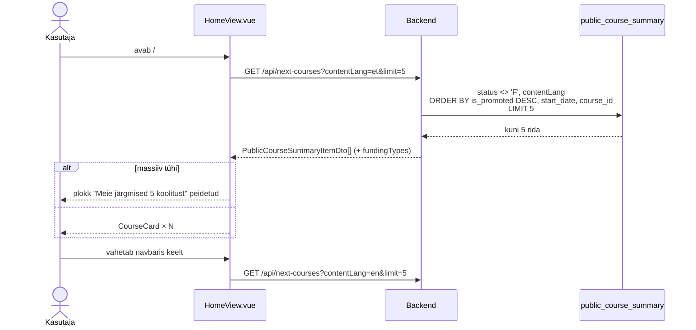
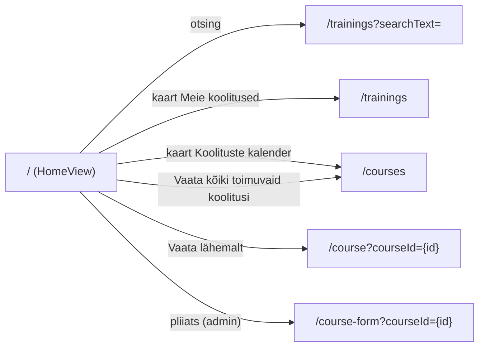

# HomeView.vue — skeemid

Avalehe täiendus: kaks suunavat kaarti ("Meie koolitused", "Koolituste kalender"), plokk "Meie järgmised 5 koolitust" toimumiskordade kaartidega ja lõpus turunduslause koos lingiga kalendrisse. Märkmed: `docs/mock-wireframe/markmed/home-view-markmed.md`. Interaktiivne läbimäng: `home-view-labimang.html` (prototüübi kestas `../index.html`, vaade "Avaleht").

Eeskuju: `courses-view/courses-view-skeemid.md` (avalik kalender, `CourseCard.vue`, view `public_course_summary`).

## Otsused

### Paigutus (ülevalt alla)

1. **Päis, alapealkiri ja otsing** — jäävad nagu praegu (otsing → `/trainings?searchText=`).
2. **Kaks suunavat kaarti** kõrvuti (`col-md-6`, kitsal ekraanil üksteise all). Kogu kaart on link (`RouterLink`, hover'il kerge varju ja äärise esiletõst):
   - **"Meie koolitused"** → `/trainings`. Ikoon `PhBooks`, tekst "Vaata kõiki meie koolitusi ja nende sisu.", nupp-tekst "Vaata koolitusi →".
   - **"Koolituste kalender"** → `/courses`. Ikoon `PhCalendarDots`, tekst "Vali sobiv toimumisaeg ja registreeru.", nupp-tekst "Vaata kalendrit →".
3. **"Meie järgmised 5 koolitust"** (h2) ja selle all kuni 5 kaarti `CourseCard.vue` (sama mis `/courses`; "Vaata lähemalt" → `/course?courseId={id}`, adminile pliiats). Filtreid, otsingut, sorteerimist ega leheküljestust pole.
4. **Turunduslause ja link**: "Leia endale sobiv koolitus — uusi toimumiskordi lisandub pidevalt." ja nupp "Vaata kõiki toimuvaid koolitusi →" → `/courses`.

### Järgmised toimumiskorrad

- Andmed: view `public_course_summary` (publitseeritud koolitus, staatus `O`/`F`, `start_date >= täna`, ainult olemasoleva `contentLang` tõlkega) — sama mis `GET /api/courses`.
- **Täis toimumiskorrad (`F`) jäetakse välja** — avalehel näidatakse ainult neid, kuhu saab registreeruda.
- **Järjestus: esile tõstetud eespool, edasi alguse järgi** (`is_promoted DESC, start_date, course_id`) — sama mis kalendris. Esile tõstetud kaardil täht ja kollakas taust (`CourseCard`).
- **Kui tulevasi toimumiskordi pole** (tühi vastus), peidetakse pealkiri ja kaardid; suunavad kaardid ja lõpu turunduslause jäävad.
- Keele vahetusel laaditakse uuesti (`contentLang`). Päringu viga → plokk jääb peidetuks (avalehte veavaatesse ei suunata).

### Uus teenus

| Teenus | Põhjendus |
|---|---|
| `GET /api/next-courses?contentLang=&limit=` | avalehe "järgmised N" ilma filtrite ja leheküljestuseta; vastus on massiiv (mitte leht) |

- `contentLang` kohustuslik; `limit` 1–20 (vaikimisi 5) — muu väärtus → `400 INCORRECT_INPUT`.
- Vastus: `PublicCourseSummaryItemDto[]` — sama kuju mis `GET /api/courses` `courseSummaries` (kaart `CourseCard.vue` kasutab seda otse), sh `fundingTypes`.
- Nimi `next-courses`, mitte `upcoming-courses`, sest `UpcomingCourseDto` on juba kasutusel (toimumiskorra lehe "Toimumiskorrad" lingid).
- Andmebaasi muudatusi pole.

---

## 1. Andmete laadimine



## 2. Navigeerimine



## 3. Näidisandmed (seed, täna = 01/10/2026)

Avalikud tulevased avatud toimumiskorrad (täis `Agiilne meeskonnajuhtimine` 14.10 ja `Java algkursus` 16.11 jäävad välja):

| # | Koolitus | Algus | Esile tõstetud |
|---|---|---|---|
| 1 | Java algkursus | 05.10.2026 | ☆ |
| 2 | Spring Boot veebiarendus | 12.10.2026 | ☆ |
| 3 | UX disaini alused | 09.11.2026 | ☆ |
| 4 | Vue.js esmaspetsialist | 26.10.2026 | |
| 5 | Projektijuhtimise põhitõed | 02.11.2026 | |

## 4. Balsamiq AI käsk

```text
Create a desktop wireframe of the public home page of a training company web app.
Top: site navigation bar with logo, a dropdown "Koolitused ▾", links "Meie koolitajad", "Teenused", "Kontakt", and "Logi sisse" on the right.
Hero: large centered title "Leia üle 100 koolituse seast endale sobiv!", a subtitle "Praktilised IT-, disaini- ja juhtimiskoolitused oma ala parimatelt", and a large search input "Otsi koolitust" with a button "Otsi".
Below: two equal cards side by side. Left card: a books icon, title "Meie koolitused", text "Vaata kõiki meie koolitusi ja nende sisu." and a link "Vaata koolitusi →". Right card: a calendar icon, title "Koolituste kalender", text "Vali sobiv toimumisaeg ja registreeru." and a link "Vaata kalendrit →".
Below: section title "Meie järgmised 5 koolitust" and a list of 5 course cards. Each card: on the left a date block "05.–09. okt 2026" and "5 päeva · 40 t"; in the middle a bold title, a short description, a category tag, lecturer names and tags "Kohapeal" / "Veebis"; on the right a flag, a price "490 €" and a button "Vaata lähemalt".
First three cards highlighted (star, light yellow): "Java algkursus", "Spring Boot veebiarendus", "UX disaini alused"; then "Vue.js esmaspetsialist" and "Projektijuhtimise põhitõed".
Bottom: centered text "Leia endale sobiv koolitus — uusi toimumiskordi lisandub pidevalt." and a button "Vaata kõiki toimuvaid koolitusi →".
```
