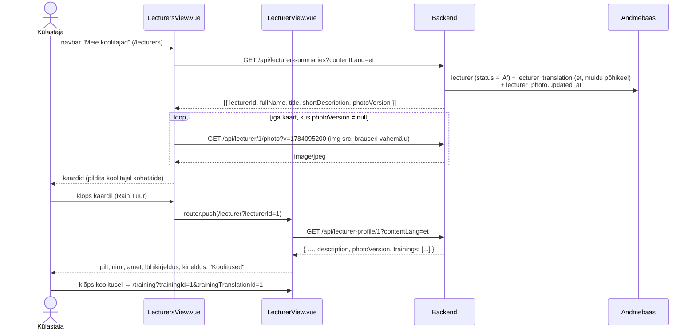
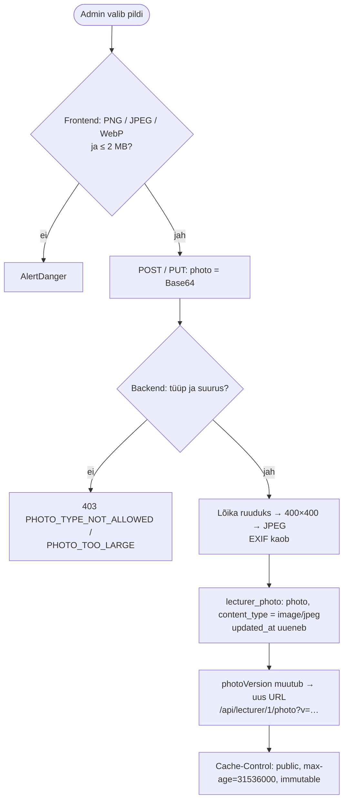

# LecturersView.vue ja LecturerView.vue — skeemid

Avalik koolitajate leht: nimekiri kaartidena (`LecturersView.vue`) ja ühe koolitaja detailvaade (`LecturerView.vue`). Selles failis on otsused, pildilahendus, teenuste ettepanek ja skeemid (Mermaid). Märkmed: `docs/mock-wireframe/markmed/lecturers-view-markmed.md` ja `docs/mock-wireframe/markmed/lecturer-view-markmed.md`. Interaktiivne läbimäng: `lecturers-view-labimang.html`.

Eeldab koolitajate haldust (`docs/mock-wireframe/loo-mock-vaade/admin-lecturers-view/`): `lecturer.status`, `lecturer_translation` väljad `title` / `short_description` / `description`, tabel `lecturer_photo`.

## Otsused

### Navbar

- Põhimenüüsse tuleb link **"Meie koolitajad"** → `/lecturers` (i18n `navbar.ourLecturers`; en "Our trainers"), "Koolitused" järele.
- Menüü "Ettevõttest" all olev tühi link "Lektorid" (`navbar.lecturers`, `href="#"`) **eemaldatakse** — samale lehele ei vii kaks linki. "Ettevõttest" jääb ilma alammenüüta; kuni sisu pole, on see tavaline link `href="#"` (ilma dropdown'ita).

### Nimekiri — `LecturersView.vue`

- Roll: kõik (ka sisse logimata). Rada `/lecturers`.
- Pealkiri "Meie koolitajad", selle all lühike sissejuhatus (i18n tekst, nt "BCS Koolituse lektorid ja konsultandid").
- **Kaardid** ruudustikus (Bootstrap `row-cols-1 row-cols-sm-2 row-cols-lg-3 row-cols-xl-4`): pilt (ruut, ümarate nurkadega), nimi, amet (`title`), lühikirjeldus (`shortDescription`). **Kogu kaart on link** → `/lecturer?lecturerId={id}`.
- Pildi puudumisel **kohatäide**: hall siluett (sama mis `LecturerAvatar.vue`-s), mitte tühi koht — kaardid on ühesuguse kõrgusega.
- Ainult aktiivsed koolitajad (`status = 'A'`), järjestus nime järgi. Otsingut, filtreid ega leheküljestust pole (koolitajaid on vähe).
- Tekstid kasutajaliidese keeles (store'i `contentLang`), puuduva tõlke korral põhikeeles. Keele vahetusel laaditakse uuesti.
- Tühi nimekiri: "Koolitajaid pole veel lisatud."

### Detailvaade — `LecturerView.vue`

- Roll: kõik. Rada `/lecturer?lecturerId={id}`.
- Link "← Kõik koolitajad" → `/lecturers`.
- Vasakul suur pilt (kuni 240 px, kohatäide sama), paremal nimi (h1), amet, lühikirjeldus sissejuhatusena (suurem kiri) ja **kirjeldus rich text'ina** (`RichTextContent.vue`, nagu `/training`).
- Plokk **"Koolitused"**: publitseeritud koolitused (`training.status = 'P'`), mille koolitajate hulgas ta on (`training_lecturer`) — koolituse nimi lingina → `/training?trainingId={id}&trainingTranslationId={id}`. Kui koolitusi pole, plokki ei kuvata.
- Kustutatud või olematu koolitaja → 404 → üldine veavaade.
- Keele vahetusel laaditakse uuesti.

### Pildid — pilditeenus ja normaliseerimine

Päris süsteemides hoitakse pilte objektisalvestuses (S3 jms) ja jagatakse CDN-ist; suurused (variandid) tehakse üleslaadimisel või pildiserveris. **Selles projektis** hoitakse pilti edasi andmebaasis (`lecturer_photo`, üks rida koolitaja kohta), aga:

1. **Normaliseerimine üleslaadimisel (backend):** pilt lõigatakse keskelt ruuduks, vähendatakse **400×400** px-ni ja kodeeritakse uuesti **JPEG**-iks (nt teek Thumbnailator või Java `ImageIO`). Uuesti kodeerimine eemaldab EXIF-metaandmed (nt telefonipildi GPS-asukoht) ja peidetud sisu; kõik pildid on ühesugused (~30–60 KB). `content_type` on siis alati `image/jpeg` (veerg jääb). Sisendi kontroll jääb: PNG / JPEG / WebP, kuni 2 MB. Eraldi thumbnail'i tabelit ega variante ei tehta — brauser vähendab kaardi jaoks ise; vajadusel lisatakse hiljem veerg `variant`.
2. **Pilditeenus `GET /api/lecturer/{lecturerId}/photo`:** tagastab pildi baidid (`Content-Type: image/jpeg`), avalik. Frontend kasutab seda otse ``-is.
3. **Versioonitud URL:** DTO-d tagastavad Base64 asemel välja **`photoVersion`** (`lecturer_photo.updated_at` epoch-sekundites; `null` = pilti pole). Frontend koostab URL-i `{API}/lecturer/{lecturerId}/photo?v={photoVersion}`. Teenus saadab päise `Cache-Control: public, max-age=31536000, immutable` — pildi vahetamisel muutub `photoVersion` ja seega URL, nii et vana pilti ei kuvata.
4. **`LecturerAvatar.vue`** saab propsid `lecturerId`, `photoVersion`, `size`: `photoVersion = null` → kohatäide, muidu `` pilditeenusest.

**Muudatus varasematele (veel implementeerimata) otsustele** — `admin-lecturers-view` ja `admin-training-courses-view` skeemid, märkmed ja läbimängud on uuendatud:

| Teenus | Enne | Nüüd |
|---|---|---|
| `GET /api/lecturer-summary/{lecturerId}` (üksikkirje teenus) | `photo` (Base64), `photoContentType` | `photoVersion` |
| `GET /api/lecturer/{lecturerId}` (vorm) | `photo` (Base64), `photoContentType` | `photoVersion` |
| `POST /api/lecturer` | salvestab pildi nagu on | pilt **normaliseeritakse** (400×400 JPEG) |
| `PUT /api/lecturer/{lecturerId}` | pilt saadetakse alati praegusel kujul, `null` = eemalda | `photo` = **uus** pilt (Base64) või `null` = pilti ei muudeta; eraldi `isPhotoRemoved: true` = eemalda. Nii ei kodeerita sama pilti igal salvestamisel uuesti (kvaliteet ei lange) |

### Uued teenused (ettepanek, URL-ide kokkuleppe järgi)

| Teenus | Põhjendus |
|---|---|
| `GET /api/lecturer-summaries?contentLang=` | koolitajate kaartide nimekiri → mitmus; samad väljad nagu `GET /api/lecturer-summary/{lecturerId}` (sama nimeloogika nagu `training_summary`) |
| `GET /api/lecturer-profile/{lecturerId}?contentLang=` | ühe koolitaja avalik profiil koos kirjelduse ja koolitustega → ainsus; eraldi admini vormi `GET /api/lecturer/{lecturerId}`-st, mis ei tagasta tõlkeid |
| `GET /api/lecturer/{lecturerId}/photo` | ühe objekti alamressurss (pildi baidid) |

---

## 1. Seed-andmed

Rain Tüüri pilt: `docs/mock-wireframe/lecturer-photos/rain-tuur.jpg` (200×200 JPEG, 7,4 KB; kasutamiseks luba antud). Seed'is `decode('<Base64>', 'base64')`, `content_type = 'image/jpeg'` — asendab varasema 32×32 näidis-PNG. Teistel koolitajatel pilti pole (kohatäide). Täielik SQL: `docs/tasks/backend/lecturer-db-changes.md` ja `admin-lecturers-view-skeemid.md`, jaotis 1.

Näidisandmetest (aktiivsed, nime järgi; koolitused `training_lecturer` kaudu, vt `admin-lecturers-view-skeemid.md` jaotis 1):

| Koolitaja | Amet | Pilt | Koolitused (publitseeritud) |
|---|---|---|---|
| Andres Liitmaa | Spetsialisti valdkonna lektor/konsultant | — | — (Docker on mustand) |
| Kersti Laidvee | Lektor/konsultant | — | Figma praktikum |
| Margus Sakk | Lektor/konsultant | — | — (Excel, Python on mustandid) |
| Meelis Teern | Lektor/konsultant | — | Git ja GitHub, Java algkursus, Vue.js esmaspetsialist |
| Merje Vaide | Projektijuht/lektor | — | Projektijuhtimise põhitõed, Agiilne meeskonnajuhtimine |
| Rain Tüür | Lektor/konsultant | ✓ | Git ja GitHub, Java algkursus, SQL ja andmebaasid, Spring Boot veebiarendus |
| Tarmo Kallas | Lektor/konsultant | — | UX disaini alused |
| Tarmo Rosenfeldt | Lektor/konsultant | — | Tehisaru töövahendid arendajale |

Virve Räni (kustutatud) nimekirjas ei ole; `/lecturer?lecturerId=4` → veavaade.

---

## 2. Nimekirja ja detailvaate andmevoog



## 3. Pildi üleslaadimine ja vahemälu (koolitaja vorm)



---

## 4. Päringud

| Vaade | Päring | Millal / milleks |
|---|---|---|
| nimekiri | `GET /api/lecturer-summaries?contentLang={UI keel}` | kaardid (ka keele vahetusel) |
| nimekiri, detail | `GET /api/lecturer/{lecturerId}/photo?v={photoVersion}` | `` (ainult `photoVersion ≠ null`); brauser paneb vahemällu |
| detail | `GET /api/lecturer-profile/{lecturerId}?contentLang={UI keel}` | profiil ja koolitused (ka keele vahetusel) |

---

## 5. Komponendid

| Komponent | Uus / olemas | Kirjeldus |
|---|---|---|
| `views/LecturersView.vue` | uus | nimekiri |
| `views/LecturerView.vue` | uus | detailvaade |
| `components/common/LecturerTile.vue` | uus | nimekirja kaart (pilt, nimi, amet, lühikirjeldus; `RouterLink`) |
| `components/common/LecturerAvatar.vue` | uus (admin-lecturers-view), **muudetakse** | propsid `lecturerId`, `photoVersion`, `size`, `shape` (`circle` / `rounded`); URL pilditeenusest või kohatäide |
| `components/common/LecturerCard.vue` | uus (admin-lecturers-view) | kasutab `photoVersion`-it (vt tabel ülal) |
| `components/common/RichTextContent.vue` | olemas | kirjeldus |
| `App.vue` (navbar) | muudetakse | + "Meie koolitajad"; "Ettevõttest" → "Lektorid" eemaldatakse |
| `router/index.js`, `NavigationService.js` | muudetakse | `/lecturers` (`lecturersRoute`), `/lecturer` (`lecturerRoute`); `navigateToLecturerView(lecturerId)` |
| `api-services/LecturerService.js` | muudetakse | `sendGetLecturerSummariesRequest`, `sendGetLecturerProfileRequest`, abifunktsioon `getLecturerPhotoUrl(lecturerId, photoVersion)` |
| `locales/*.json` | muudetakse | `navbar.ourLecturers`, `lecturers.*`, `lecturer.*`; `navbar.lecturers` eemaldatakse |

---

## 6. Lahtised küsimused

- Kas detailvaates kuvada ka koolitaja **tulevased toimumiskorrad** (kuupäevad)? **Otsus: praegu ei** — ainult koolitused (`training_lecturer`); toimumiskordade avalik kuvamine on kalendri tööde järel.
- Suurem originaalpilt (≥ 400×400) annaks detailvaates teravama tulemuse; praegune on 200×200.

---

## 7. Balsamiq AI käsud

### LecturersView

```text
Create a desktop wireframe of a public page "Meie koolitajad" in a training company web app.
Top: site navigation bar with logo and links "Koolitused", "Meie koolitajad" (highlighted), "Teenused", "Ettevõttest", "Blogi", "Kontakt", "Tagasiside", and "Logi sisse" on the right.
Header: page title "Meie koolitajad" and one line of intro text below it.
Main area: a grid of 8 cards in 4 columns (2 rows). Each card has a square image with rounded corners at the top, then the name in bold, a grey job title line and 2–3 lines of short description.
First card: photo, "Andres Liitmaa", "Spetsialisti valdkonna lektor/konsultant", "Microsofti ametlikud sertifitseerimiskoolitused (MOC), serverid, pilvetehnoloogiad…".
Most cards show a grey person silhouette placeholder instead of a photo; the card "Rain Tüür", "Lektor/konsultant" shows a real photo.
The whole card is clickable.
```

### LecturerView

```text
Create a desktop wireframe of a public page showing one trainer's profile in a training company web app.
Top: site navigation bar with logo and links, "Meie koolitajad" highlighted.
Below: a small text link "← Kõik koolitajad".
Two columns: on the left a large square photo with rounded corners (240 px); on the right the name "Rain Tüür" as the page title, a grey line "Lektor/konsultant", a larger lead paragraph "Tarkvaraarendus, Java, HTML, CSS, JavaScript, SQL, Git, Spring Boot…", and below it several paragraphs of formatted text with a bullet list.
Below the text: a section titled "Koolitused" with four links: "Git ja GitHub", "Java algkursus", "SQL ja andmebaasid", "Spring Boot veebiarendus".
```


## Vaadetevaheline tagasitee

Detailide ja vormide avamisel antakse kaasa lähtevaate täielik URL `returnTo` parameetrina. Ühine „← Tagasi“ link taastab selle URL-i; otselingi korral kasutatakse vaate varusihti. Peamenüü ja vahelehed tagasiteed ei loo. Oleku- ja tõlkevahetus säilitab senise tagasitee. Kõigi avamiskohtade, erandite ja varusihtide [ühine skeem](../return-to-navigation-skeemid.md).
