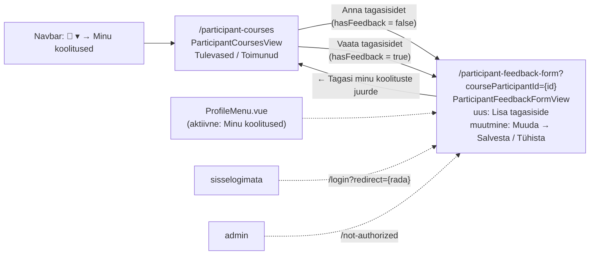
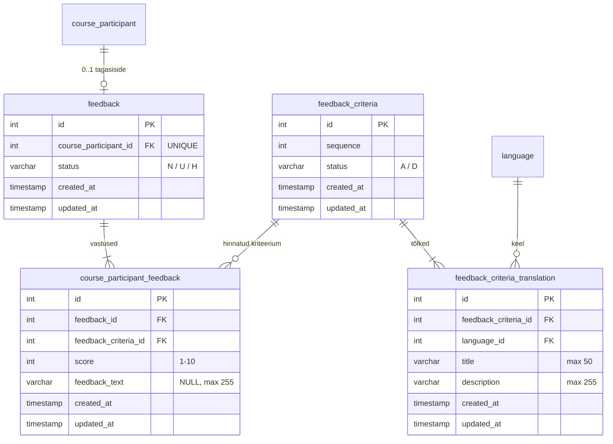
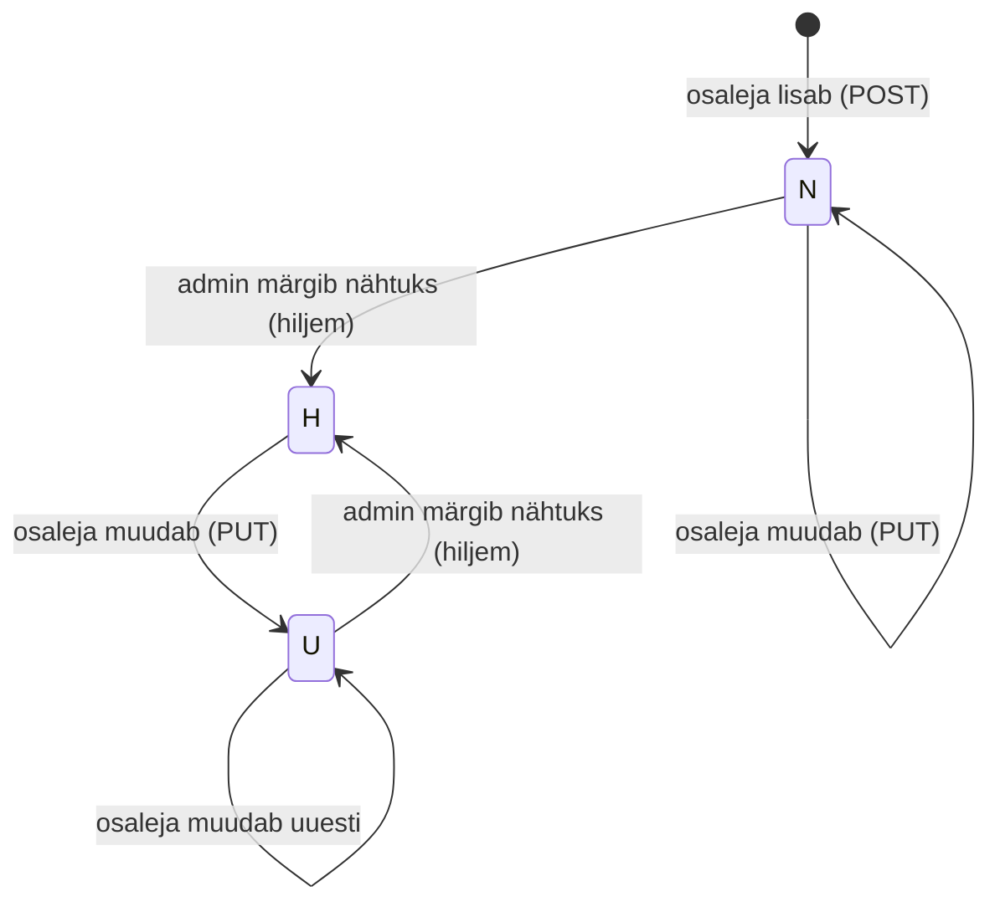
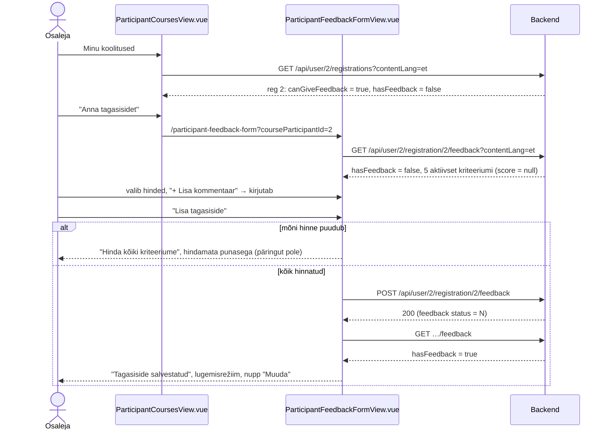
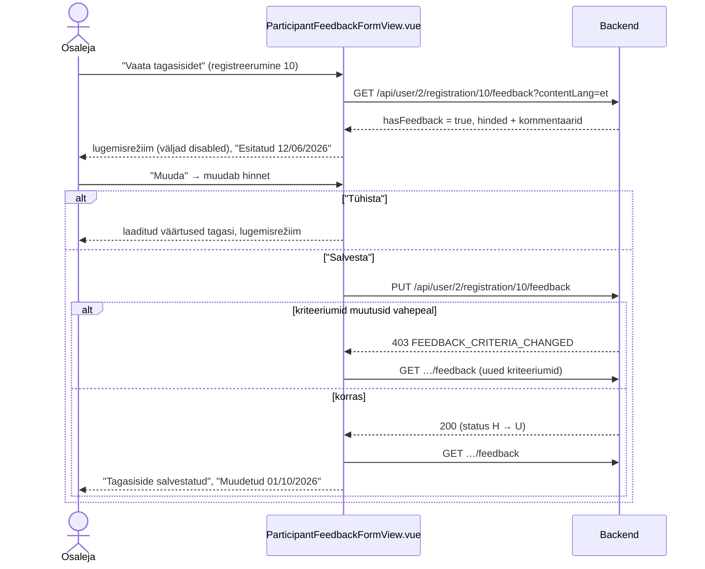
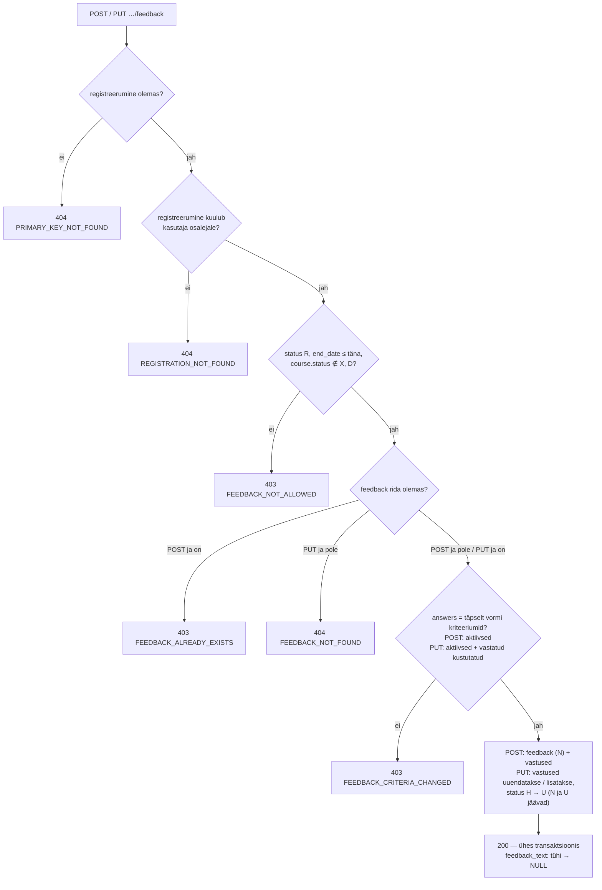

# Koolituse tagasiside — skeemid

Planeerimisfail uuele vaatele **`ParticipantFeedbackFormView.vue`** (`/participant-feedback-form?courseParticipantId={id}`), kus osaleja annab toimunud koolituse kohta tagasisidet: iga kriteeriumi hinne skaalal 1–10 ja soovi korral kommentaar. Vaade avatakse "Minu koolitused" lehelt (`ParticipantCoursesView.vue`). Mockupis vaadet veel pole. See fail kirjeldab vaate, andmemudeli ja teenused ning sisaldab Balsamiq AI käsku, millega vaate saab mockupisse genereerida.

Seotud failid: `participant-feedback-form-view-toode-jarjekord.md` (tööde järjekord), `participant-feedback-form-view-labimang.html` (läbimäng), profiili vaated `../profile-view/profile-view-skeemid.md`.

**Seis (2026-10-01):** otsused, skeemid, läbimäng, märkmed, taskid ja kood tehtud (commit'imata, ootab kasutaja ülevaatust). Kontrollid: `participant-feedback-form-view-toode-jarjekord.md`, jaotis "Seis".

Mõisted: **registreerumine** = `course_participant` rida. **Tagasiside** = ühe registreerumise kohta antud hinnangute kogum (`feedback` rida, "päis"). **Vastus** = ühe kriteeriumi hinne ja kommentaar (`course_participant_feedback` rida). **Kriteerium** = väide, mida osaleja hindab (`feedback_criteria` + tõlked).

---

## Otsused

### Üldine

- **Eraldi vaade** `ParticipantFeedbackFormView.vue`, rada `/participant-feedback-form?courseParticipantId={id}` (nimi ja rada `kokkulepped/mock-wireframe-markmete-struktuur.md` järgi: vorm → `…FormView`; andmed kuuluvad osalejale → `Participant…`).
- Vorm teenindab **kahte olekut** ja olek selgub backendi vastusest (`hasFeedback`), mitte URL-ist — `courseParticipantId` on URL-is alati, sest see määrab, mille kohta tagasisidet antakse:
  - **uus** (`hasFeedback = false`) → väljad kohe täidetavad, nupp **"Lisa tagasiside"** → `POST`;
  - **muutmine** (`hasFeedback = true`) → alguses `GET` ja väljad *disabled* (lugemisrežiim), nupp **"Muuda"** → väljad muudetavaks, nupud **"Salvesta"** (`PUT`) ja **"Tühista"** (taastab laaditud väärtused ja lülitab tagasi lugemisrežiimi, nagu "Minu andmed" vaates).
- **Ainult osalejale** (nagu teised `Participant…View` vaated): admin → `/not-authorized`; sisselogimata → `/login?redirect=/participant-feedback-form?courseParticipantId={id}`. Admin tagasisidet ei anna ega muuda.
- `userId` tuleb `sessionStorage`-ist (`SessionStorageService.getUserId()`). Päris autentimist projektis pole, backend usaldab path'i `userId`-d (teadaolev piirang, sama mis teistel `/api/user/{userId}/…` teenustel).
- **Professionaalne toon**, huumorit ei ole. Pärast salvestamist neutraalne teade "Tagasiside salvestatud".

### Paigutus

- Vasakul `ProfileMenu.vue` (aktiivne "Minu koolitused" — vorm on selle alamvaade), paremal kaart. Kaardi ülaosas link **"← Tagasi minu koolituste juurde"** (`/participant-courses`).
- **Päis:** pealkiri "Tagasiside", selle all koolituse nimi (`contentLang` keeles, puudumisel põhikeeles) ja toimumisaeg `dd/MM/yyyy – dd/MM/yyyy`. Muutmise olekus lisaks **"Esitatud dd/MM/yyyy"** (`createdAt`) ja muudetud tagasisidel **"Muudetud dd/MM/yyyy"** (`updatedAt`, kui selle kuupäev erineb esitamise kuupäevast — kuvatakse ainult kuupäevad ja esimese salvestuse ajatemplid erinevad millisekundite võrra). N/U/H staatust osalejale **ei näidata** — see on admini info.
- **Skaala selgitus** kriteeriumide kohal: "Hinda iga väidet skaalal 1–10 (1 = ei nõustu üldse, 10 = nõustun täielikult)". Kriteeriumid on väited, hinnatakse nõustumist.

### Kriteeriumi rida

```
Koolitus vastas ootustele (?)                 ← title; (?) hover/fookus → tooltip description
( )1 ( )2 ( )3 ( )4 ( )5 ( )6 ( )7 ( )8 ( )9 ( )10    ← kohustuslik
+ Lisa kommentaar                             ← link, kast vaikimisi peidus

  ↓ klikk

− Peida kommentaar
┌───────────────────────────────────────────┐
│ Täpsusta soovi korral oma hinnangut        │  textarea, 3 rida
└───────────────────────────────────────────┘
                                     0 / 255
```

- Kuvatakse ainult **`title`**, selle kõrval **(?)** — hover'il / klaviatuuri fookusel tooltip kriteeriumi **`description`**-iga.
- **Hinne 1–10** raadionuppudena, kohustuslik.
- **Kommentaar** (`feedback_text`) on iga kriteeriumi juures eraldi, valikuline, kuni 255 märki, loendur "0 / 255" kasti all.
- Kommentaari kast on vaikimisi **peidus**, raadionuppude all link **"+ Lisa kommentaar"** / **"− Peida kommentaar"** (en "+ Add a comment" / "− Hide comment"), placeholder "Täpsusta soovi korral oma hinnangut" (en "Feel free to elaborate on your rating").
  - Kui kommentaar on juba olemas (muutmise olek), on kast **kohe lahti**.
  - "Peida kommentaar" ainult peidab — tekst jääb alles ja salvestatakse. Kommentaari eemaldamiseks tühjenda kast.
  - Lugemisrežiimis kast on *disabled*; kriteeriumidel, millel kommentaari pole, linki **ei kuvata**.
  - Tühi või ainult tühikutest kommentaar salvestatakse `NULL`-ina.

### Valideerimine ja teated

- "Lisa tagasiside" / "Salvesta": kui mõni hinne puudub → teade **"Hinda kõiki kriteeriume"** (`InlineAlerts.vue` nuppude kõrval) ja hindamata kriteeriumid märgitakse punasega; päringut ei tehta. Backend kontrollib sama.
- Edu → **"Tagasiside salvestatud"**, vorm laaditakse `GET`-iga uuesti ja jääb **lugemisrežiimi** (POST-i järel on vorm nüüd muutmise olekus ja nupp "Muuda" kohe olemas).
- **Keelatud olukord** (URL-iga avatud registreerumine, millele tagasisidet anda ei saa): `GET` vastab 403 `FEEDBACK_NOT_ALLOWED` või 404 `REGISTRATION_NOT_FOUND` → kaardil punane teade backendi tekstiga, vormi pole, link tagasi. `courseParticipantId` puudub → `ErrorView`.
- `POST` vastab 403 `FEEDBACK_ALREADY_EXISTS` (nt teises vahelehes juba antud) või `PUT` 404 `FEEDBACK_NOT_FOUND` → backendi teade ja vorm laaditakse uuesti.

### Kes ja millal

Tagasisidet saab anda ja muuta, kui **kõik** tingimused on täidetud:

| # | Tingimus | Muidu |
|---|---|---|
| 0 | registreerumine on olemas (`getValidCourseParticipantBy`, nagu loobumisel) | 404 `PRIMARY_KEY_NOT_FOUND` |
| 1 | registreerumine kuulub sisseloginud kasutaja osalejale | 404 `REGISTRATION_NOT_FOUND` |
| 2 | registreerumise staatus `R` (loobunu ei saa) | 403 `FEEDBACK_NOT_ALLOWED` |
| 3 | toimumiskord on lõppenud või lõpeb täna (`end_date <= täna`) — tagasisidet küsitakse tavaliselt viimasel päeval saalis | 403 `FEEDBACK_NOT_ALLOWED` |
| 4 | toimumiskord pole tühistatud ega kustutatud (`course.status` ei ole `X` ega `D`) | 403 `FEEDBACK_NOT_ALLOWED` |

- Tasumine (`has_paid`) ei loe — tasumata osaleja saab tagasisidet anda.
- Muutmisel **tähtaega pole**.

### Avamine — muudatus vaates "Minu koolitused" (`ParticipantCoursesView.vue`)

```
Toimunud
┌──────────────────────────────────────────────────────────────┐
│ Java algkursus          07/09/2026 – 11/09/2026 · Kohapeal   │
│ [Registreerunud] [Tasutud]           [ Anna tagasisidet ]    │  ← tagasisidet pole
├──────────────────────────────────────────────────────────────┤
│ Java algkursus          08/06/2026 – 12/06/2026 · Veebis     │
│ [Registreerunud] [Tasutud]           [ Vaata tagasisidet ]   │  ← tagasiside olemas
└──────────────────────────────────────────────────────────────┘
```

- Real nupp **"Anna tagasisidet"** (`hasFeedback = false`) või **"Vaata tagasisidet"** (`hasFeedback = true`) → `/participant-feedback-form?courseParticipantId={id}`. Nupp kuvatakse ainult, kui `canGiveFeedback = true`.
- Viimasel koolituspäeval (`end_date = täna`) on rida veel plokis "Tulevased", kuid tagasisidet võib juba anda — nupp kuvatakse ka seal. Nupp asub rea paremas servas samas kohas, kus "Loobu" (mõlemat korraga ei esine: "Loobu" eeldab, et toimumiskord pole alanud).
- `MyRegistrationDto` (`GET /api/user/{userId}/registrations`) saab kaks uut välja:
  - `canGiveFeedback` (Boolean) — tingimused 2–4 (backend arvutab, nagu `canCancel`);
  - `hasFeedback` (Boolean) — registreerumisel on `feedback` rida.

### Staatused (N / U / H)

Staatus käib **kogu tagasiside** kohta (`feedback.status`), mitte üksikute vastuste kohta.

| Olukord | Tulemus | Põhjendus |
|---|---|---|
| osaleja lisab tagasiside (`POST`) | **N** (new) | uus |
| osaleja muudab, staatus **N** | jääb **N** | admin pole veel näinud — tema jaoks ikka uus |
| osaleja muudab, staatus **H** | **U** (updated) | admin on näinud, sisu muutus |
| osaleja muudab, staatus **U** | jääb **U** | |
| admin märgib nähtuks (N või U) | **H** (historical) | admini raport — **tehakse hiljem** |

Admini raportis on "vaatamata" = `N` + `U`; `U` juures märge "muudetud".

### Kriteeriumid ajas

- **Uus vorm (`POST`):** kõik aktiivsed (`A`) kriteeriumid.
- **Muutmine (`PUT`):** aktiivsed kriteeriumid **ja** kustutatud (`D`) kriteeriumid, millele osaleja on juba vastanud — need jäävad koos hinde ja kommentaariga nähtavaks ja muudetavaks (ajalugu ei kao).
- **Pärast tagasiside andmist lisatud kriteerium** kuvatakse muutmisel tühjana ja salvestamisel on selle hinne kohustuslik (reegel: kõik vormis olevad kriteeriumid tuleb hinnata).
- **Järjekord:** `sequence`, võrdsuse korral `id` (`sequence` pole unikaalne — järjekorra muutmisel ei keela andmebaas ajutiselt kahte sama numbrit).
- **Tõlked** `feedback_criteria_translation` tabelis (projekti kokkulepe: tõlgitav tekst ei ole baastabelis). Kuvatakse **kasutajaliidese keeles** (`contentLang`), tõlke puudumisel **põhikeeles** (`et`). Põhikeele tõlge on igal kriteeriumil kohustuslik (seed'is olemas; hiljem tagab admini vorm).
- Kriteeriumide **haldus** (lisamine, muutmine, tõlkimine, kustutamine, järjekord) tehakse **hiljem eraldi** — seni tulevad kriteeriumid seed'ist.

### Uued teenused

| Teenus | Kirjeldus |
|---|---|
| `GET /api/user/{userId}/registrations?contentLang=` | **olemas** — `MyRegistrationDto` saab väljad `canGiveFeedback`, `hasFeedback` |
| `GET /api/user/{userId}/registration/{courseParticipantId}/feedback?contentLang=` | `ParticipantFeedbackDto` — vormi päis ja kriteeriumid (koos vastustega, kui on). Üks päring mõlemale olekule |
| `POST /api/user/{userId}/registration/{courseParticipantId}/feedback` | `FeedbackRequestDto { answers[] }` → loob `feedback` (N) + vastused |
| `PUT /api/user/{userId}/registration/{courseParticipantId}/feedback` | sama body → uuendab vastused, lisab puuduvad, staatus H → U |

Tee järgib olemasolevat profiilimustrit (`/api/user/{userId}/registration/{courseParticipantId}/cancel`) ja URL-ide kokkulepet: üks tagasiside → ainsus `feedback`.

**`ParticipantFeedbackDto`** (GET):

```json
{
  "courseParticipantId": 10,
  "trainingTitle": "Java algkursus",
  "startDate": "2026-06-08",
  "endDate": "2026-06-12",
  "hasFeedback": true,
  "createdAt": "2026-06-12T16:40:00",
  "updatedAt": "2026-06-12T16:40:00",
  "criteria": [
    {
      "feedbackCriteriaId": 1,
      "title": "Koolitus vastas ootustele",
      "description": "Koolituse sisu, tase ja maht vastasid koolituse kirjelduse põhjal tekkinud ootustele.",
      "score": 9,
      "feedbackText": null
    },
    ...
  ]
}
```

- `hasFeedback = false` → `createdAt`, `updatedAt` ning iga kriteeriumi `score` ja `feedbackText` on `null`; `criteria` = aktiivsed kriteeriumid.
- `hasFeedback = true` → `criteria` = aktiivsed + kustutatud, millele on vastatud; uue kriteeriumi `score` on `null`.
- `updatedAt` = vastuste viimane muutmise aeg (`MAX(course_participant_feedback.updated_at)`), vt "Tehniline märkus".
- Lihtväljad enne massiivi (`backend/CLAUDE.md` DTO väljade järjekord).

**`FeedbackRequestDto`** (POST ja PUT):

```json
{
  "answers": [
    {
      "feedbackCriteriaId": 1,
      "score": 9,
      "feedbackText": "Praktilisi näiteid oleks võinud olla rohkem"
    },
    ...
  ]
}
```

Väljad: `answers*` (`@NotEmpty`, `@Valid`), `feedbackCriteriaId*`, `score*` (`@Min(1) @Max(10)`), `feedbackText` (`@Size(max = 255)`, valikuline). Response (200): NONE.

**Uued `Error` väärtused:**

| errorCode | HTTP | message |
|---|---|---|
| `FEEDBACK_NOT_ALLOWED` | 403 | "Sellele koolitusele ei saa tagasisidet anda" |
| `FEEDBACK_ALREADY_EXISTS` | 403 | "Tagasiside on juba antud" |
| `FEEDBACK_NOT_FOUND` | 404 | "Tagasisidet ei leitud" |
| `FEEDBACK_CRITERIA_CHANGED` | 403 | "Tagasiside küsimused on vahepeal muutunud, laadi leht uuesti" |

Olemasolevad: `REGISTRATION_NOT_FOUND` (404, võõras registreerumine), `PRIMARY_KEY_NOT_FOUND` (404, olematu `userId` või `courseParticipantId`), `INCORRECT_INPUT` (400, DTO valideerimine: hinne puudub või väljaspool 1–10, kommentaar > 255).

**Tehniline täpsustus (arutelu järel):** arutelus oli "answers ei kata täpselt vormi kriteeriume → 400 `INCORRECT_INPUT`". Koodis tekib `INCORRECT_INPUT` ainult DTO valideerimisest (`RestExceptionHandler`), teenus seda visata ei saa. Seepärast on kriteeriumide komplekti kontroll (puudub mõni vormi kriteerium, üleliigne või tundmatu `feedbackCriteriaId`, sama kriteerium kaks korda) eraldi äriviga **403 `FEEDBACK_CRITERIA_CHANGED`** — praktikas juhtub see siis, kui admin muudab kriteeriume ajal, mil vorm on lahti.

**Tehniline märkus (`updated_at`):** `PUT` muudab vastuste ridu; `feedback` rida muutub ainult siis, kui staatus muutub (H → U). JPA auditeerimine uuendab `updated_at`-i ainult muutunud entiteedil ja käsitsi seda seada ei tohi (`backend/CLAUDE.md`). Seega:
- osalejale näidatav "Muudetud" = `MAX(course_participant_feedback.updated_at)`;
- `feedback.updated_at` = viimane staatuse muutus (admini raport).

---

## 1. Andmebaasi muudatus

### DDL (`2_create.sql`)

```sql
-- Table: feedback_criteria (tagasiside kriteerium; tekst tõlgetes)
CREATE TABLE feedback_criteria
(
    id         serial     NOT NULL,
    sequence   int        NOT NULL,
    -- A = aktiivne, D = kustutatud (soft delete)
    status     varchar(1) NOT NULL,
    created_at timestamp  NOT NULL,
    updated_at timestamp  NOT NULL,
    CONSTRAINT feedback_criteria_pk PRIMARY KEY (id)
);

-- Table: feedback_criteria_translation
CREATE TABLE feedback_criteria_translation
(
    id                   serial       NOT NULL,
    feedback_criteria_id int          NOT NULL,
    language_id          int          NOT NULL,
    title                varchar(50)  NOT NULL,
    description          varchar(255) NOT NULL,
    created_at           timestamp    NOT NULL,
    updated_at           timestamp    NOT NULL,
    CONSTRAINT feedback_criteria_translation_pk PRIMARY KEY (id),
    CONSTRAINT feedback_criteria_translation_uq UNIQUE (feedback_criteria_id, language_id)
);

-- Table: feedback (olemasolev tabel, seni ainult id) — ühe registreerumise tagasiside päis
CREATE TABLE feedback
(
    id                    serial     NOT NULL,
    course_participant_id int        NOT NULL,
    -- N = uus, U = osaleja muutis pärast admini ülevaatust, H = admin on üle vaadanud
    status                varchar(1) NOT NULL,
    created_at            timestamp  NOT NULL,
    updated_at            timestamp  NOT NULL,
    CONSTRAINT feedback_pk PRIMARY KEY (id),
    -- registreerumisel üks tagasiside
    CONSTRAINT feedback_uq UNIQUE (course_participant_id)
);

-- Table: course_participant_feedback (vastus: ühe kriteeriumi hinne ja kommentaar)
CREATE TABLE course_participant_feedback
(
    id                   serial       NOT NULL,
    feedback_id          int          NOT NULL,
    feedback_criteria_id int          NOT NULL,
    score                int          NOT NULL,
    feedback_text        varchar(255) NULL,
    created_at           timestamp    NOT NULL,
    updated_at           timestamp    NOT NULL,
    CONSTRAINT course_participant_feedback_pk PRIMARY KEY (id),
    -- tagasisides üks vastus kriteeriumi kohta
    CONSTRAINT course_participant_feedback_uq UNIQUE (feedback_id, feedback_criteria_id),
    CONSTRAINT course_participant_feedback_score_ck CHECK (score BETWEEN 1 AND 10)
);
```

Viited (faili lõpus, olemasoleva `ALTER TABLE … ADD CONSTRAINT … FOREIGN KEY` mustri järgi):

| Constraint | Tabel.veerg | → |
|---|---|---|
| `feedback_criteria_translation_feedback_criteria` | `feedback_criteria_translation.feedback_criteria_id` | `feedback_criteria.id` |
| `feedback_criteria_translation_language` | `feedback_criteria_translation.language_id` | `language.id` |
| `feedback_course_participant` | `feedback.course_participant_id` | `course_participant.id` |
| `course_participant_feedback_feedback` | `course_participant_feedback.feedback_id` | `feedback.id` |
| `course_participant_feedback_feedback_criteria` | `course_participant_feedback.feedback_criteria_id` | `feedback_criteria.id` |

- **`course_participant` ei muutu.** Seos on `feedback.course_participant_id UNIQUE` (rida puudub = tagasisidet pole antud) — sama 1:1 muster mis `lecturer_photo` → `lecturer` ja `training_translation_curriculum` → `training_translation`.
- `1_reset_database.sql` ei muutu (kustutab kogu skeemi).
- Entity'del `@EntityListeners(AuditingEntityListener.class)`, `@CreatedDate` / `@LastModifiedDate` (`backend/CLAUDE.md`). Uus enum `FeedbackStatus` (N, U, H) ja `FeedbackCriteriaStatus` (A, D) baaspaketis, nagu `RoomStatus`.

### DML (`3_import.sql`)

Olemasolevad read `INSERT INTO feedback DEFAULT VALUES;` (2 tk) **eemaldatakse** — tabelil on nüüd kohustuslikud veerud.

```sql
-- Table: feedback_criteria (status: A = aktiivne, D = kustutatud)
INSERT INTO feedback_criteria (id, sequence, status, created_at, updated_at) VALUES
    (1, 1, 'A', '2026-05-01 09:00:00', '2026-05-01 09:00:00'),
    (2, 2, 'A', '2026-05-01 09:00:00', '2026-05-01 09:00:00'),
    (3, 3, 'A', '2026-05-01 09:00:00', '2026-05-01 09:00:00'),
    (4, 4, 'A', '2026-05-01 09:00:00', '2026-05-01 09:00:00'),
    (5, 5, 'A', '2026-05-01 09:00:00', '2026-05-01 09:00:00');

-- Table: feedback_criteria_translation (language_id: 1 = et, 2 = en)
INSERT INTO feedback_criteria_translation (id, feedback_criteria_id, language_id, title, description, created_at, updated_at) VALUES
    (1, 1, 1, 'Koolitus vastas ootustele', 'Koolituse sisu, tase ja maht vastasid koolituse kirjelduse põhjal tekkinud ootustele.', '2026-05-01 09:00:00', '2026-05-01 09:00:00'),
    (2, 1, 2, 'The training met my expectations', 'The content, level and scope matched the expectations set by the training description.', '2026-05-01 09:00:00', '2026-05-01 09:00:00'),
    (3, 2, 1, 'Koolitaja oli pädev', 'Koolitaja valdas teemat põhjalikult ning selgitas seda arusaadavalt ja näidetega.', '2026-05-01 09:00:00', '2026-05-01 09:00:00'),
    (4, 2, 2, 'The trainer was competent', 'The trainer had a thorough command of the subject and explained it clearly with examples.', '2026-05-01 09:00:00', '2026-05-01 09:00:00'),
    (5, 3, 1, 'Õppematerjalid olid asjakohased', 'Õppematerjalid ja harjutused toetasid teema omandamist ning on kasutatavad ka pärast koolitust.', '2026-05-01 09:00:00', '2026-05-01 09:00:00'),
    (6, 3, 2, 'The materials were relevant', 'The materials and exercises supported learning and remain useful after the training.', '2026-05-01 09:00:00', '2026-05-01 09:00:00'),
    (7, 4, 1, 'Õpikeskkond ja korraldus olid sobivad', 'Koolitusruum või veebikeskkond, ajakava ja info edastamine toetasid õppimist.', '2026-05-01 09:00:00', '2026-05-01 09:00:00'),
    (8, 4, 2, 'Venue and organisation were suitable', 'The training room or online environment, schedule and communication supported learning.', '2026-05-01 09:00:00', '2026-05-01 09:00:00'),
    (9, 5, 1, 'Soovitaksin koolitust kolleegidele', 'Julgeksin seda koolitust soovitada kolleegidele või teistele samade vajadustega inimestele.', '2026-05-01 09:00:00', '2026-05-01 09:00:00'),
    (10, 5, 2, 'I would recommend this training to colleagues', 'I would recommend this training to colleagues or others with similar needs.', '2026-05-01 09:00:00', '2026-05-01 09:00:00');

-- course_participant: Anna Saar (osaleja 1) osales juunis Java algkursusel (toimumiskord 7, veebis) — vt tabeli course_participant INSERT
--     (10, 7, 1, '', NULL, true, false, 'R', '2026-05-20 10:00:00', '2026-05-20 10:00:00')

-- Table: feedback (status: N = uus, U = muudetud pärast ülevaatust, H = üle vaadatud)
INSERT INTO feedback (id, course_participant_id, status, created_at, updated_at) VALUES
    (1, 10, 'H', '2026-06-12 16:40:00', '2026-06-15 09:00:00');

-- Table: course_participant_feedback
INSERT INTO course_participant_feedback (id, feedback_id, feedback_criteria_id, score, feedback_text, created_at, updated_at) VALUES
    (1, 1, 1, 9, NULL, '2026-06-12 16:40:00', '2026-06-12 16:40:00'),
    (2, 1, 2, 10, 'Selged selgitused ja palju praktilisi näiteid.', '2026-06-12 16:40:00', '2026-06-12 16:40:00'),
    (3, 1, 3, 8, NULL, '2026-06-12 16:40:00', '2026-06-12 16:40:00'),
    (4, 1, 4, 7, 'Veebikeskkonnas oli esimesel päeval helikvaliteet kõikuv.', '2026-06-12 16:40:00', '2026-06-12 16:40:00'),
    (5, 1, 5, 9, NULL, '2026-06-12 16:40:00', '2026-06-12 16:40:00');
```

- **Uus `course_participant` rida 10** (Anna Saar, toimumiskord 7 — Java algkursus 08.–12.06.2026, veebis) lisatakse olemasolevasse `course_participant` INSERT-i. Seed'i olukorrad test-kasutajaga `kasutaja@vali-it.ee`:
  - registreerumine **2** (toimumiskord 3, lõppes 11.09) — tagasisidet pole → **"Anna tagasisidet"** (uus vorm, `POST`);
  - registreerumine **10** (toimumiskord 7, lõppes 12.06) — tagasiside olemas, staatus `H` → **"Vaata tagasisidet"** (muutmine, `PUT` → `U`);
  - registreerumine **1** (toimumiskord 1, algab 05.10) — tulevane, nuppu pole.
- Faili lõppu `setval` read: `feedback_criteria`, `feedback_criteria_translation`, `feedback`, `course_participant_feedback`.

---

## 2. Vaadete ülesehitus



## 3. Andmemudel



## 4. Staatused



## 5. Tagasiside lisamine (uus vorm)



## 6. Tagasiside muutmine



## 7. Backendi loogika (POST / PUT)



## 8. Komponendid

| Komponent | Uus / muutub | Kirjeldus |
|---|---|---|
| `views/ParticipantFeedbackFormView.vue` | uus | vorm, kaks olekut, laadimine/salvestamine |
| `components/profile/FeedbackCriteriaItem.vue` | uus | ühe kriteeriumi rida: title + (?) tooltip, raadionupud 1–10, kommentaari link + textarea + loendur; prop `isReadOnly`, `isInvalid` |
| `components/profile/ProfileMenu.vue` | olemas | aktiivne "Minu koolitused" ka `/participant-feedback-form` rajal |
| `components/profile/ParticipantRegistrationItem.vue` | muutub | nupp "Anna tagasisidet" / "Vaata tagasisidet" (`canGiveFeedback`, `hasFeedback`) |
| `components/common/InlineAlerts.vue` | olemas | edu- ja veateade nuppude kõrval |
| `api-services/UserService.js` | muutub | `sendGetFeedbackRequest`, `sendPostFeedbackRequest`, `sendPutFeedbackRequest` |
| `router/index.js` | muutub | rada `/participant-feedback-form` (guard: sisse logimata → login, admin → NotAuthorizedView) |
| `locales/et.json`, `en.json` | muutub | `participantFeedback.*` võtmed; navbari rippmenüüsse uut punkti **ei tule** |

## 9. Balsamiq AI käsud

### ParticipantFeedbackFormView — uus tagasiside

```text
Create a desktop wireframe of a logged-in user's page "Tagasiside" in a training company web app.
Top: site navigation bar with logo and links (Koolitused ▾, Meie koolitajad, Teenused, Ettevõttest, Kontakt) and on the right a user icon dropdown "👤 ▾" and a button "Logi välja".
Left column: a vertical profile menu with items "Minu andmed", "Minu koolitused" (active, highlighted), "Tunnistused", "Parool".
Right: a card. At the top of the card a link "← Tagasi minu koolituste juurde".
Card header: title "Tagasiside", below it the text "Java algkursus · 07/09/2026 – 11/09/2026".
Below the header a hint text "Hinda iga väidet skaalal 1–10 (1 = ei nõustu üldse, 10 = nõustun täielikult)".
Then five criterion blocks stacked vertically, each with: a bold label followed by a small circled question mark icon with a tooltip, a row of ten radio buttons labelled 1 to 10, and below them a small link "+ Lisa kommentaar".
Criterion labels: "Koolitus vastas ootustele", "Koolitaja oli pädev", "Õppematerjalid olid asjakohased", "Õpikeskkond ja korraldus olid sobivad", "Soovitaksin koolitust kolleegidele".
Show the tooltip of the first question mark open with the text "Koolituse sisu, tase ja maht vastasid koolituse kirjelduse põhjal tekkinud ootustele."
In the second criterion the comment is open: the link reads "− Peida kommentaar", below it a three-line text area with placeholder "Täpsusta soovi korral oma hinnangut" and a small counter "0 / 255" under its right corner.
At the bottom of the card a primary button "Lisa tagasiside".
Style: low-fidelity wireframe, black and white with one blue accent, no images.
```

### ParticipantFeedbackFormView — olemasolev tagasiside (lugemisrežiim)

```text
Create a desktop wireframe of the same page "Tagasiside" in read-only mode.
Same navigation bar and left profile menu ("Minu koolitused" active). Card with the link "← Tagasi minu koolituste juurde".
Card header: title "Tagasiside", below it "Java algkursus · 08/06/2026 – 12/06/2026" and a small grey line "Esitatud 12/06/2026".
Hint text "Hinda iga väidet skaalal 1–10 (1 = ei nõustu üldse, 10 = nõustun täielikult)".
Five criterion blocks with the same labels and question mark icons; each row of ten radio buttons is greyed out (disabled) with one selected value: 9, 10, 8, 7, 9.
Under the second criterion a greyed-out text area with the text "Selged selgitused ja palju praktilisi näiteid." and under the fourth "Veebikeskkonnas oli esimesel päeval helikvaliteet kõikuv."; the other criteria have no comment link.
At the bottom of the card a primary button "Muuda". Add a small note next to it: "Muuda → väljad aktiivseks, nupud Salvesta ja Tühista".
Style: low-fidelity wireframe, black and white with one blue accent, no images.
```

### ParticipantCoursesView — tagasiside nupud

```text
Update the existing wireframe "Minu koolitused": in the section "Toimunud" show two registration rows.
Row 1: bold link "Java algkursus", text "07/09/2026 – 11/09/2026 · Kohapeal", badges "Registreerunud" and "Tasutud", and on the right a button "Anna tagasisidet".
Row 2: bold link "Java algkursus", text "08/06/2026 – 12/06/2026 · Veebis", badges "Registreerunud" and "Tasutud", and on the right a button "Vaata tagasisidet".
Style: low-fidelity wireframe, black and white with one blue accent, no images.
```

## 10. Hiljem

- **Kriteeriumide haldus** (admin): lisamine, muutmine, tõlkimine, kustutamine (`D`) ja järjekord (`sequence`). Eraldi plaan.
- **Admini tagasiside raport:** uued ja muudetud (`N`, `U`) tagasisided, "märgi nähtuks" → `H`.
- **Tagasiside kokkuvõte koolituse lehel** `/training` (nt keskmised hinded kriteeriumide kaupa).
- Profiili läbimängu (`../profile-view/profile-view-labimang.html`) "Minu koolitused" nupud "Anna tagasisidet" / "Vaata tagasisidet" — seni näitab neid selle kausta läbimäng.

## 11. Järgmised sammud

1. ~~Otsused (andmemudel, staatused, skaala, reeglid, kriteeriumid ajas, tõlked, kommentaari kast, avamine, vaade, API)~~ — tehtud 2026-10-01.
2. ~~Skeemid, tööde järjekord, läbimäng `participant-feedback-form-view-labimang.html` + prototüübi kest (`../index.html`)~~ — tehtud 2026-10-01 (commit'imata, artifacti pole).
3. ~~Märkmed `markmed/participant-feedback-form-view-markmed.md` (Vaate märkmed + 3 API märget) ja `markmed/participant-courses-view-markmed.md`~~ — tehtud 2026-10-01.
4. ~~Taskid (`docs/tasks/backend/`, `docs/tasks/frontend/`) `participant-feedback-form-view-toode-jarjekord.md` järgi~~ — tehtud 2026-10-01 (5 backend, 2 frontend). Kood tehtud 2026-10-01.
