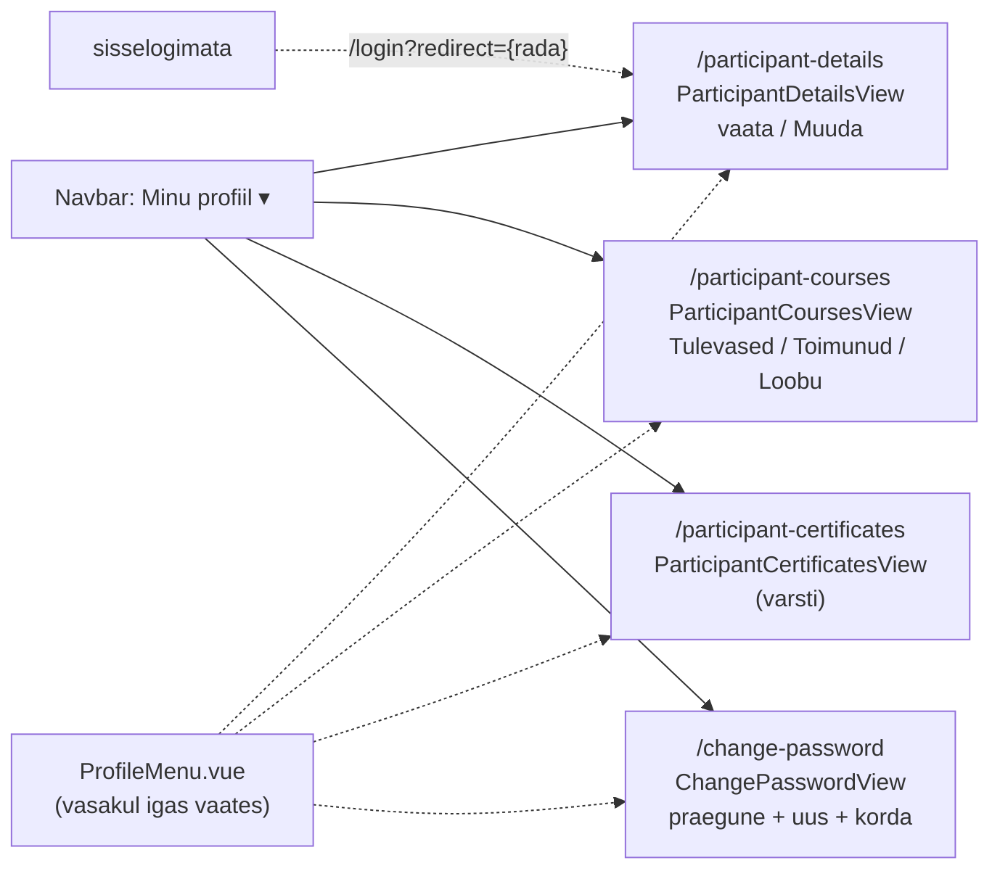
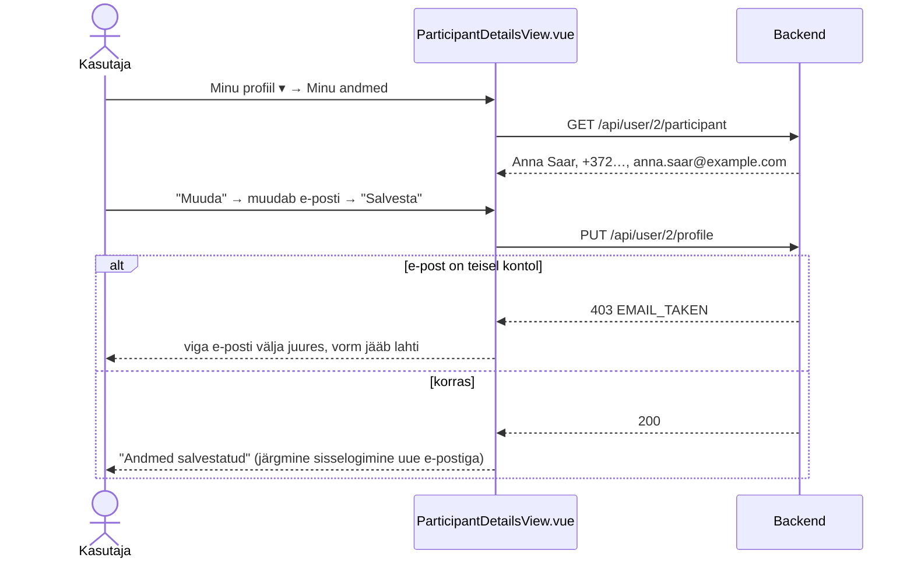
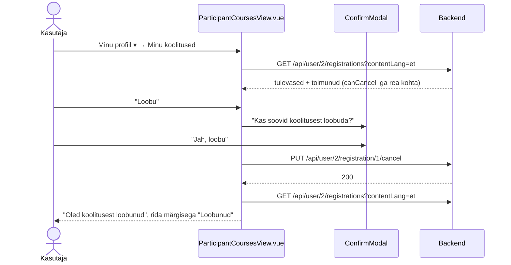
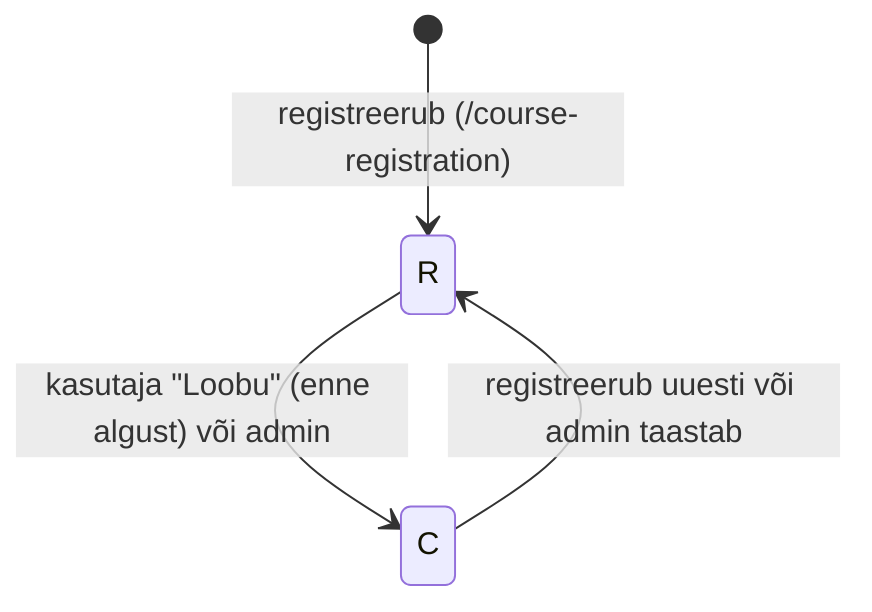
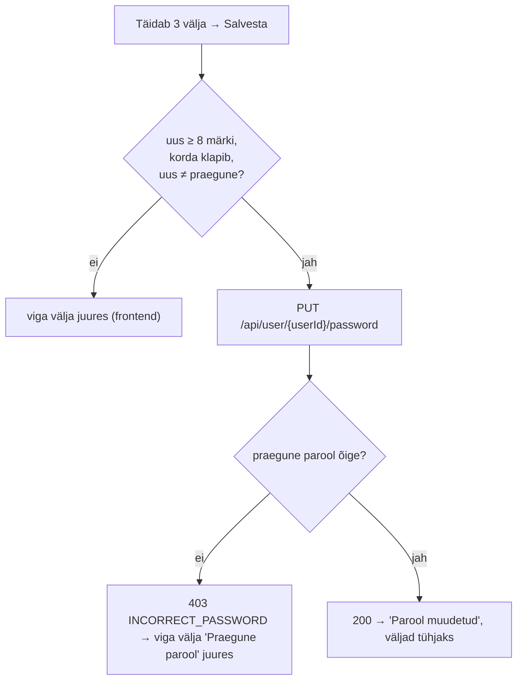

# Minu profiil — skeemid

Planeerimisfail sisseloginud kasutaja profiilivaadetele. Mockupis on profiil ühe vaatena olemas (`docs/mock-wireframe/pdf/BCS.pdf`, leht 14, `ProfileView.vue`): vasakul menüü **Minu andmed / Minu koolitused / Tunnistused / Parool**, avatud "Minu andmed" (Eesnimi, Perekonnanimi, Telefon, E-post, nupp "Muuda"). Otsus: mockupi neli menüüpunkti on **neli eraldi vaadet**, mida avatakse navbari rippmenüüst "Minu profiil ▾". See fail täpsustab mockupi ja lisab puuduvad osad.

**Seis:** põhiotsused kokku lepitud ja läbimäng tehtud (2026-10-01). Järgmine samm: märkmed (jaotis 8).

Mõisted: **konto** = `"user"` rida (sisselogimise e-post ja parool). **Profiil** = `profile` rida (nimi, telefon, kontakt-e-post), mis on kontoga seotud `participant` rea kaudu (`participant.user_id`, `participant.profile_id`). **Registreerumine** = `course_participant` rida.

---

## Otsused

### Üldine

- **Neli eraldi vaadet** (rada tuletatud vaate nimest, vt `kokkulepped/mock-wireframe-markmete-struktuur.md`; mockupi `/profiil` on illustratsioon):

  | Menüüpunkt | Vaade | Rada |
  |---|---|---|
  | Minu andmed | `ParticipantDetailsView.vue` | `/participant-details` |
  | Minu koolitused | `ParticipantCoursesView.vue` | `/participant-courses` |
  | Tunnistused | `ParticipantCertificatesView.vue` | `/participant-certificates` |
  | Parool | `ChangePasswordView.vue` | `/change-password` |

- **Nimed on andmebaasi järgi:** andmed (nimi, telefon, koolitused, tunnistused) kuuluvad osalejale (`participant`), seega `Participant…View`. Parool kuulub kontole (`"user"`), seega `ChangePasswordView`. Hilisem admini vaade ühe osaleja kohta saab projekti tava järgi `Admin` eesliite (nt `AdminParticipantView`), nii et nimed ei kattu.
- Vaated on **kõigile sisseloginud kasutajatele, ka adminile** (admin saab muuta oma andmeid ja parooli). Sisselogimata kasutaja → `/login?redirect={vaate rada}` (nt `/login?redirect=/participant-courses`); pärast sisselogimist jõuab ta samasse vaatesse tagasi.
- `userId` tuleb `sessionStorage`-ist (`SessionStorageService.getUserId()`), nagu teistes kasutaja teenustes. Päris autentimist projektis pole, seega backend usaldab path'i `userId`-d (teadaolev piirang, sama mis `GET /api/user/{userId}/participant` puhul).
- Paigutus mockupi järgi: vasakul profiilimenüü **`ProfileMenu.vue`** (uus ühine komponent, samad neli `RouterLink`-i, aktiivne esile tõstetud; Bootstrap `list-group` / `nav-pills flex-column`), paremal vaate kaart. Kitsal ekraanil on menüü kaardi kohal horisontaalselt. Iga vaade laeb oma andmed ise.

### Navbar (`App.vue`)

- Sisseloginud kasutajale (ka adminile) "Logi välja" kõrvale **rippmenüü "Minu profiil ▾"** (ikoon `PhUserCircle`, i18n `navbar.profile`, en "My profile"; Bootstrap `dropdown`, menüü avaneb paremale joondatult `dropdown-menu-end`):
  - Minu andmed → `/participant-details` (`navbar.participantDetails`, en "My details");
  - Minu koolitused → `/participant-courses` (`navbar.participantCourses`, en "My courses");
  - Tunnistused → `/participant-certificates` (`navbar.participantCertificates`, en "Certificates");
  - Parool → `/change-password` (`navbar.changePassword`, en "Password").
- Kui avatud on mõni neist vaadetest, on "Minu profiil ▾" esile tõstetud (nagu "Koolitused ▾").

### Minu andmed — `ParticipantDetailsView.vue` (`/participant-details`)

- Vaikimisi **ainult lugemiseks**: Eesnimi, Perekonnanimi, Telefon, E-post (mockupi 2×2 paigutus).
- Nupp **"Muuda"** muudab väljad muudetavaks; nupud "Salvesta" ja "Tühista" (taastab laaditud väärtused ja lülitab tagasi lugemisrežiimi).
- Valideerimine nagu konto loomisel (`SignupView`): kõik väljad kohustuslikud, e-post korrektne, telefon kuni 20 märki.
- **E-post on kasutaja jaoks üks:** salvestamisel muutub nii `profile.email` kui ka konto `user.email`. Seega logitakse järgmine kord sisse **uue** e-postiga. Vormis on selle kohta vihje: "Selle e-postiga logid ka sisse".
- Kui e-post on teisel kontol juba kasutusel → `EMAIL_TAKEN` (sama kontroll nagu konto loomisel, enda kontot välja arvates, tõstutundetult).
- **Kui kasutajal osalejat/profiili pole** (nt admin, vt `3_import.sql` kasutajad 1 ja 3): väljad on tühjad ja e-post = konto e-post. Salvestamisel luuakse `profile` + `participant` (sama loogika mis registreerumisel, `ParticipantService.addParticipant`).
- Salvestamisel uuendatakse ka `participant.name` (= eesnimi + perekonnanimi), nagu registreerumisel.
- Edu korral teade "Andmed salvestatud" ja tagasi lugemisrežiimi.

### Minu koolitused — `ParticipantCoursesView.vue` (`/participant-courses`)

- Kasutaja oma osaleja kõik registreerumised kahes plokis:
  - **"Tulevased"**: `course.end_date >= täna`, alguse järgi kasvavalt;
  - **"Toimunud"**: `course.end_date < täna`, uusimad eespool.
- Iga rea/kaardi sisu: koolituse nimi (`contentLang` keeles, puudumisel põhikeeles) lingina `/course?courseId={id}`, toimumisaeg `dd/MM/yyyy – dd/MM/yyyy`, vorm (Kohapeal / Veebis / Kohapeal + veebis — `room_id` ja/või `meeting_link`, veebilinki ennast ei näidata), registreerumise staatus (`CourseParticipantStatusBadge`: Registreerunud / Loobunud), tasumine (Tasutud / Tasumata).
- Tühistatud toimumiskord (`course.status = X`) → lisaks märgis "Tühistatud".
- Nupp **"Loobu"**: ainult kui staatus `R`, toimumiskord pole alanud (`start_date > täna`) ega tühistatud. Enne kinnitus (`ConfirmModal`): "Kas soovid koolitusest loobuda?". Tulemus: `course_participant.status = C`, `updated_at` = nüüd. Edu korral teade "Oled koolitusest loobunud" ja nimekiri laaditakse uuesti.
- Loobumist kasutaja ise tagasi võtta ei saa. Uuesti registreerumine käib tavapärase registreerumise kaudu (`/course-registration`), mis muudab `C` → `R` (olemasolev loogika).
- Tühi nimekiri: "Sa pole veel ühelegi koolitusele registreerunud" + link "Vaata koolitusi" → `/courses`.

### Tunnistused — `ParticipantCertificatesView.vue` (`/participant-certificates`)

- **Sisu jääb hilisemaks.** Vaade ja menüüpunkt on olemas, sisu on "Tunnistused tulevad varsti — siia ilmuvad sinu läbitud koolituste tunnistused".
- Põhjus: `participant_certificate` tabelil pole seost toimumiskorraga ja tunnistusi keegi üles ei laadi. Hilisem ettepanek on jaotises 7.

### Parool — `ChangePasswordView.vue` (`/change-password`)

- Väljad: **Praegune parool***, **Uus parool*** (vähemalt 8 märki, nagu konto loomisel), **Korda uut parooli***. Kõik `type="password"`.
- Frontendi kontroll: uus parool ≥ 8 märki; "Korda" peab klappima; uus ei tohi olla sama mis praegune.
- Vale praegune parool → backend `INCORRECT_PASSWORD` → teade välja juures.
- Edu korral teade "Parool muudetud", väljad tühjendatakse. Sessioon jääb kehtima.
- Paroole hoitakse andmebaasis praegu lihtteksina (projekti olemasolev lahendus). Räsimine on eraldi teema ja seda selles epicus ei tehta.

### Uued teenused (ettepanek)

| Teenus | Kirjeldus |
|---|---|
| `GET /api/user/{userId}/participant` | **olemas** — "Minu andmed" lugemine (`MyParticipantDto`) |
| `PUT /api/user/{userId}/profile` | `ProfileUpdateRequestDto`: `firstName`*, `lastName`*, `email`*, `phone`*. Uuendab `user.email`, `profile` (+ `participant.name`); osaleja puudumisel loob `profile` + `participant`. Vead: `PRIMARY_KEY_NOT_FOUND`, `EMAIL_TAKEN`, `INCORRECT_INPUT` |
| `GET /api/user/{userId}/registrations?contentLang=` | `MyRegistrationDto` list: `courseParticipantId`, `courseId`, `trainingTitle`, `startDate`, `endDate`, `isOnSite`, `isOnline` (hübriid = mõlemad), `courseStatus`, `status` (`R`/`C`), `hasPaid`, `isPast`, `canCancel`. Kustutatud toimumiskorrad välja, järjestus `start_date` kasvavalt. Osaleja puudumisel tühi list |
| `PUT /api/user/{userId}/registration/{courseParticipantId}/cancel` | Staatus `R` → `C`. Vead: `PRIMARY_KEY_NOT_FOUND`; registreerumine pole selle kasutaja oma → `REGISTRATION_NOT_FOUND` (404); juba loobunud, alanud või tühistatud → `CANCEL_NOT_ALLOWED` (403) |
| `PUT /api/user/{userId}/password` | `PasswordChangeRequestDto`: `currentPassword`*, `newPassword`* (min 8). Vale praegune → `INCORRECT_PASSWORD` (403) |

Uued `Error` väärtused: `INCORRECT_PASSWORD("Praegune parool on vale")`, `CANCEL_NOT_ALLOWED("Sellest registreerumisest ei saa enam loobuda")`, `REGISTRATION_NOT_FOUND("Registreerumist ei leitud")`.

---

## 1. Andmebaasi muudatus

**Pole vaja.** Kõik väljad on olemas (`"user"`, `participant`, `profile`, `course_participant`, `course`). Tunnistuste muudatus tuleb hiljem (jaotis 7).

`3_import.sql` (ettepanek): test-kasutaja `kasutaja@vali-it.ee` (Anna Saar, osaleja 1) registreerumised 1 (tulevane) ja 2 (toimunud) on olemas. Lisaks võiks Annale lisada `course_participant` read **10** (toimumiskord 10, Vue.js veebis, `R`, tasumata → saab loobuda) ja **11** (toimumiskord 9, Spring Boot, `C`), et läbimängu olukorrad oleks ka päris andmetes näha.

Seed'is erinevad Anna profiili e-post (`anna.saar@example.com`) ja konto e-post (`kasutaja@vali-it.ee`). Pärast esimest salvestust on need samad.

---

## 2. Vaadete ülesehitus

## 3. Minu andmed — vaatamine ja muutmine

## 4. Minu koolitused — loobumine

## 5. Parooli muutmine

## 6. Komponendid

| Komponent | Olek | Kasutus |
|---|---|---|
| `ParticipantDetailsView.vue`, `ParticipantCoursesView.vue`, `ParticipantCertificatesView.vue`, `ChangePasswordView.vue` | uus | neli vaadet (+ router, `meta` sisselogimise nõudega) |
| `profile/ProfileMenu.vue` | uus | vasak profiilimenüü, kasutavad kõik neli vaadet |
| `App.vue` navbar | muudatus | rippmenüü "Minu profiil ▾" |
| `UserService.js` (api-services) | olemas/täiendus | uued päringud |
| `CourseParticipantStatusBadge`, `ConfirmModal`, `InlineAlerts`, `DateService` (vms) | olemas | taaskasutus |

## 7. Hiljem

- **Tunnistused:** `participant_certificate` saab seose registreerumisega (`course_participant_id`, unikaalne), faili nime ja tüübi. Admin laeb PDF-i üles registreerumise vaates (`/admin-registration`), kasutaja näeb "Tunnistused" all nimekirja (koolitus, kuupäev) ja laeb faili alla (`GET /api/user/{userId}/certificate/{id}`).
- Parooli räsimine (BCrypt) kogu projektis.
- "Unustasid parooli?" (LoginView link on praegu `#`).

## 8. Järgmised sammud

1. ~~Põhiotsused (e-post, loobumine, tunnistused, admin)~~ — tehtud.
2. ~~Läbimäng `profile-view-labimang.html` + prototüübi kest (`../index.html`)~~ — tehtud: uus grupp "Sisseloginud kasutaja" nelja vaatega (`auth`: sisselogimata → `/login?redirect={rada}`), navbaris rippmenüü "Minu profiil ▾". Läbimäng on üks fail, vaade valitakse parameetriga `view=details|courses|certificates|password`.
3. Märkmed `markmed/participant-details-view-markmed.md`, `participant-courses-view-markmed.md`, `participant-certificates-view-markmed.md`, `change-password-view-markmed.md`.
4. Taskid (`docs/tasks/backend/`, `docs/tasks/frontend/`) ja tööde järjekord `profile-view-toode-jarjekord.md`.
