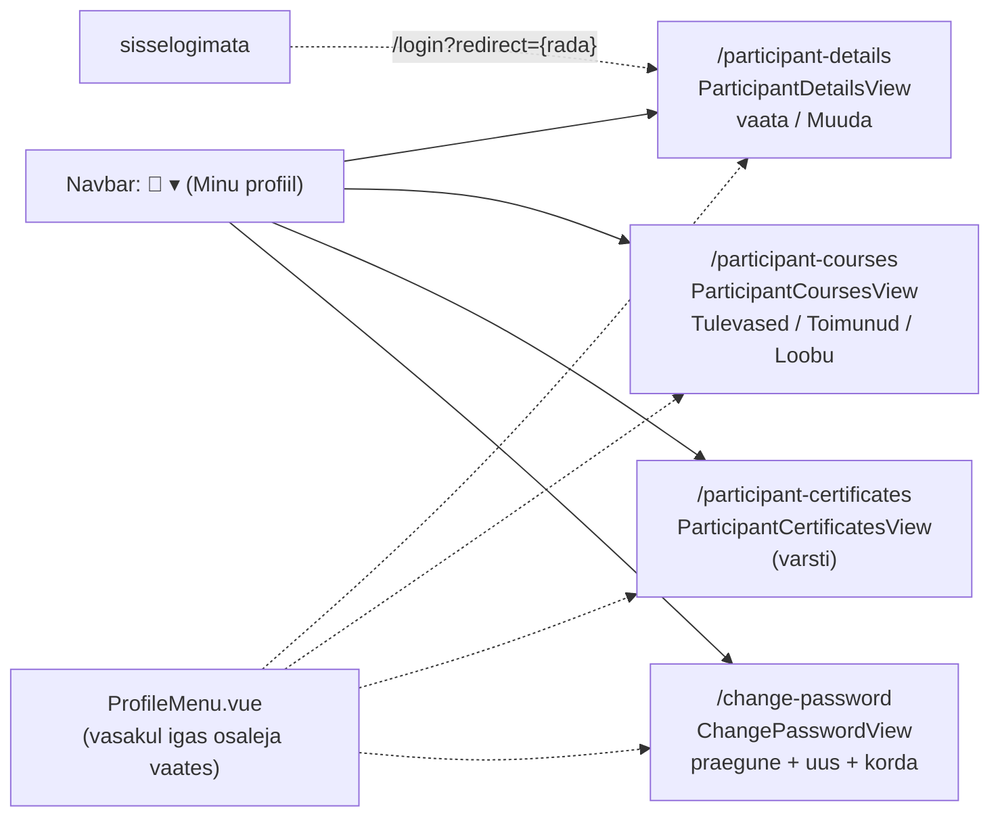
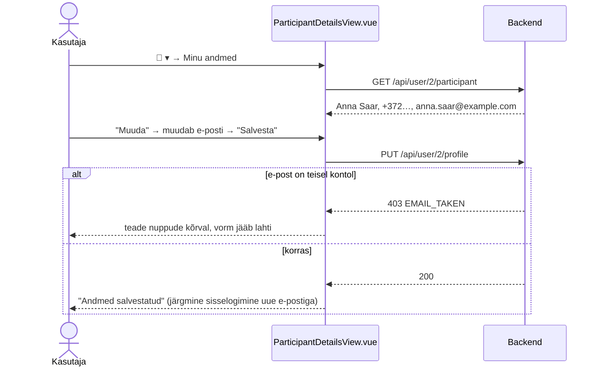
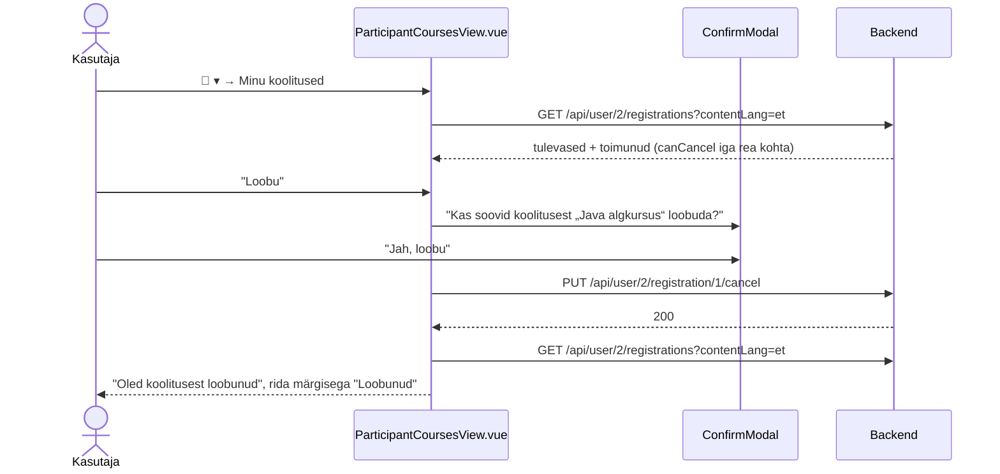
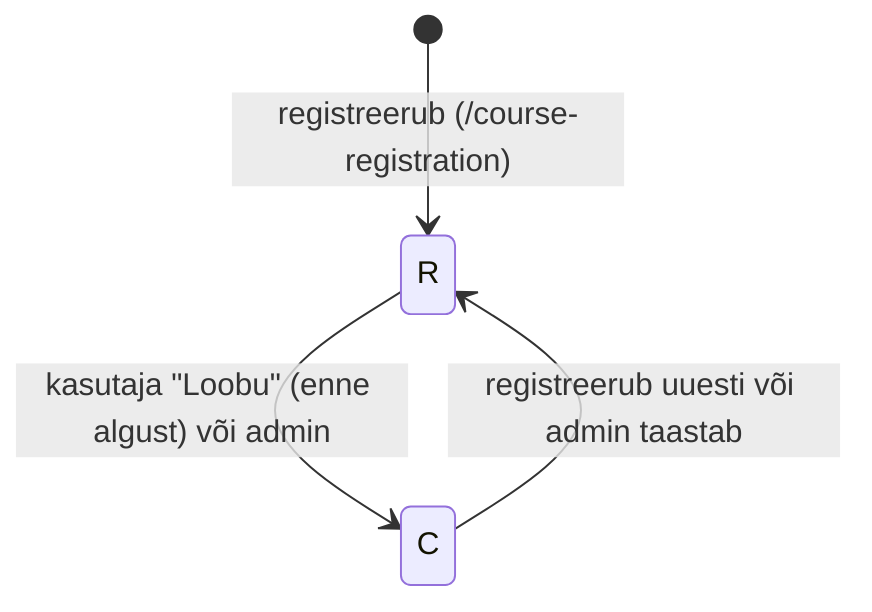
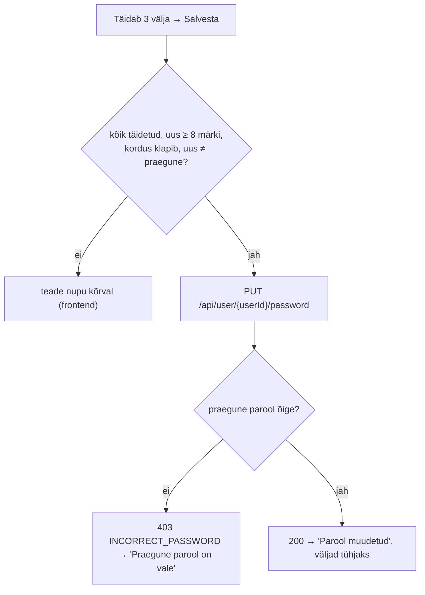

# Minu profiil — skeemid

Planeerimisfail sisseloginud kasutaja profiilivaadetele. Mockupis on profiil ühe vaatena olemas (`docs/mock-wireframe/pdf/BCS.pdf`, leht 14, `ProfileView.vue`): vasakul menüü **Minu andmed / Minu koolitused / Tunnistused / Parool**, avatud "Minu andmed" (Eesnimi, Perekonnanimi, Telefon, E-post, nupp "Muuda"). Otsus: mockupi neli menüüpunkti on **neli eraldi vaadet**, mida avatakse navbari profiiliikooni rippmenüüst "👤 ▾". See fail täpsustab mockupi ja lisab puuduvad osad.

**Seis:** kood valmis (2026-10-01). Skeemid ja läbimäng `profile-view-labimang.html` vastavad koodile; lahknevuse korral on tõde kood. Märkmed ja taskid on tegemata (jaotis 8).

Mõisted: **konto** = `"user"` rida (sisselogimise e-post ja parool). **Profiil** = `profile` rida (nimi, telefon, kontakt-e-post), mis on kontoga seotud `participant` rea kaudu (`participant.user_id`, `participant.profile_id`). **Registreerumine** = `course_participant` rida.

---

## Otsused

### Üldine

- **Neli eraldi vaadet** (rada tuletatud vaate nimest, vt `kokkulepped/mock-wireframe-markmete-struktuur.md`; mockupi `/profiil` on illustratsioon):

  | Menüüpunkt | Vaade | Rada | Route nimi |
  |---|---|---|---|
  | Minu andmed | `ParticipantDetailsView.vue` | `/participant-details` | `participantDetailsRoute` |
  | Minu koolitused | `ParticipantCoursesView.vue` | `/participant-courses` | `participantCoursesRoute` |
  | Tunnistused | `ParticipantCertificatesView.vue` | `/participant-certificates` | `participantCertificatesRoute` |
  | Parool | `ChangePasswordView.vue` | `/change-password` | `changePasswordRoute` |

- **Nimed on andmebaasi järgi:** andmed (nimi, telefon, koolitused, tunnistused) kuuluvad osalejale (`participant`), seega `Participant…View`. Parool kuulub kontole (`"user"`), seega `ChangePasswordView`. Hilisem admini vaade ühe osaleja kohta saab projekti tava järgi `Admin` eesliite (nt `AdminParticipantView`), nii et nimed ei kattu.
- **Ligipääs (router guard, `router/index.js`):** osaleja vaated (`Participant…View`) — `checkParticipantUser` (sisselogimata → `/login?redirect={rada}`, admin → `/not-authorized`, sama mis `/course-registration`). `ChangePasswordView` — `checkLoggedInUser` (kõik sisseloginud, ka admin; sisselogimata → `/login?redirect=/change-password`). Pärast sisselogimist jõuab kasutaja samasse vaatesse tagasi. Adminile piisab kontode haldusest (`../admin-users-view/admin-users-view-skeemid.md`).
- Konto on loomisel kohe aktiivne (`status = A`), osaleja saab kohe sisse logida ja registreeruda — admin kontosid ei kinnita. Kaitse robot-kontode vastu (captcha, e-posti kinnitamine) tuleb hiljem (jaotis 7).
- `userId` tuleb `sessionStorage`-ist (`SessionStorageService.getUserId()`), nagu teistes kasutaja teenustes. Päris autentimist projektis pole, seega backend usaldab path'i `userId`-d (teadaolev piirang, sama mis `GET /api/user/{userId}/participant` puhul).
- **Paigutus:** osalejal vasakul (`col-lg-3`) profiilimenüü **`components/profile/ProfileMenu.vue`** (neli `RouterLink`-i, Bootstrap `nav nav-pills`, aktiivne `active`; kitsal ekraanil `flex-row` — horisontaalselt sisu kohal, laial `flex-lg-column`), paremal (`col-lg-9`) vaate kaart (`fieldset` + `legend` vaate nimega). Adminil on parooli vaates ainult kaart (kitsas veerg keskel), profiilimenüüd pole. Iga vaade laeb oma andmed ise.
- Teated näidatakse komponendiga `InlineAlerts.vue` (eduteade hääbub 4 s pärast, veateade jääb kuni sulgemiseni).

### Navbar (`App.vue`)

- Sisseloginud kasutajale "Logi välja" kõrval **profiiliikoon rippmenüüga "👤 ▾"**: nupp `btn btn-light border btn-sm dropdown-toggle` ainult ikooniga `PhUserCircle` (tekst `navbar.profile` "Minu profiil" / en "My profile" on `title` ja `aria-label`), et navbar ei läheks kitsaks. Menüü avaneb paremale joondatult (`dropdown-menu-end`), ülaosas pealkiri "Minu profiil" (`dropdown-header`). **Osalejal** neli punkti, **adminil ainult "Parool"**:
  - Minu andmed → `/participant-details` (`navbar.participantDetails`, en "My details");
  - Minu koolitused → `/participant-courses` (`navbar.participantCourses`, en "My courses");
  - Tunnistused → `/participant-certificates` (`navbar.participantCertificates`, en "Certificates");
  - Parool → `/change-password` (`navbar.changePassword`, en "Password").
- Kui avatud on mõni neist vaadetest, on ikooninupp sinise äärisega (`border-primary`).
- **Rippmenüüde sulgemine:** kõik navbari rippmenüüd ("Koolitused ▾", "Admin ▾", "👤 ▾") sulguvad menüüpunktile klõpsates (ka siis, kui see on juba avatud leht) ja igal marsruudi muutusel (`closeNavbarDropdowns()` → Bootstrapi `Dropdown.hide()`). Põhjus: Bootstrapi enda sulgemine otsib nupult klassi `show`, mille Vue `:class` sidumine üle kirjutab.

### Minu andmed — `ParticipantDetailsView.vue` (`/participant-details`)

- Kaardi pealkiri "Minu andmed". Andmed: `GET /api/user/{userId}/participant`.
- Vaikimisi **ainult lugemiseks**: Eesnimi, Perekonnanimi, Telefon, E-post (mockupi 2×2 paigutus); tühi väärtus → "—". All nupp **"Muuda"**.
- "Muuda" → väljad muudetavad (tärniga), e-posti all vihje "Selle e-postiga logid ka sisse"; nupud **"Salvesta"** ja **"Tühista"** (sulgeb vormi, laaditud väärtused jäävad).
- Frontendi kontroll (esimene viga teatena nuppude kõrval): kõik väljad täidetud ("Täida kõik kohustuslikud väljad"), e-posti kuju ("Kontrolli e-posti aadressi"); telefoni väli on piiratud 20 märgiga (`maxlength`). Väärtused saadetakse trimmituna.
- **E-post on kasutaja jaoks üks:** salvestamisel muutub nii `profile.email` kui ka konto `user.email`. Seega logitakse järgmine kord sisse **uue** e-postiga.
- Kui e-post on teisel kontol juba kasutusel → `EMAIL_TAKEN` (tõstutundetult, enda kontot välja arvates); backendi teade nuppude kõrval, vorm jääb lahti. 400 → backendi teade.
- **Kui kasutajal osalejat/profiili pole** (erandjuht — konto loomine loob osaleja kohe): nimed ja telefon "—", e-post = konto e-post. Salvestamisel luuakse `profile` + `participant` (`ParticipantService.addParticipant`).
- Salvestamisel uuendatakse ka `participant.name` (= eesnimi + perekonnanimi), nagu registreerumisel.
- Edu korral teade "Andmed salvestatud", vaade võtab salvestatud väärtused (uuesti ei laadita) ja läheb lugemisrežiimi.

### Minu koolitused — `ParticipantCoursesView.vue` (`/participant-courses`)

- Kaardi pealkiri "Minu koolitused". Andmed: `GET /api/user/{userId}/registrations?contentLang=` (keele vahetusel uuesti).
- Kasutaja oma osaleja kõik registreerumised kahes plokis:
  - **"Tulevased"**: `isPast = false` (`end_date >= täna`), alguse järgi kasvavalt; tühjana "Tulevasi koolitusi pole.";
  - **"Toimunud"**: `isPast = true`, uusimad eespool; plokki näidatakse ainult siis, kui toimunuid on.
- Iga rida (`components/profile/ParticipantRegistrationItem.vue`): koolituse nimi (`contentLang` keeles, puudumisel põhikeeles) — **link `/course?courseId={id}` ainult avatud või täis (`O`/`F`) toimumiskorral** (avalik toimumiskorra leht teisi ei näita), muidu tavatekst; toimumisaeg `dd/MM/yyyy – dd/MM/yyyy` · vorm (Kohapeal / Veebis / Kohapeal + Veebis — `room_id` ja/või `meeting_link`, veebilinki ennast ei näidata); märgised: registreerumise staatus (`CourseParticipantStatusBadge`: Registreerunud / Loobunud), "Tühistatud" (kui `courseStatus = X`), Tasutud (roheline) / Tasumata.
- Nupp **"Loobu"** (punane kontuur): ainult kui `canCancel` (staatus `R`, toimumiskord pole alanud — `start_date > täna` — ega tühistatud/kustutatud). Enne kinnitus (`ConfirmModal`): pealkiri "Koolitusest loobumine", tekst "Kas soovid koolitusest „{koolitus}“ loobuda?", nupud "Jah, loobu" / "Sulge". Tulemus: `course_participant.status = C`, `updated_at` uueneb. Edu korral teade "Oled koolitusest loobunud" ja nimekiri laaditakse uuesti; 403 `CANCEL_NOT_ALLOWED` / 404 → backendi teade ja nimekiri laaditakse uuesti. Teated on kaardi ülaosas.
- Loobumist kasutaja ise tagasi võtta ei saa. Uuesti registreerumine käib tavapärase registreerumise kaudu (`/course-registration`), mis muudab `C` → `R` (olemasolev loogika).
- Tühi nimekiri: "Sa pole veel ühelegi koolitusele registreerunud." + link "Vaata koolitusi" → `/courses`.

### Tunnistused — `ParticipantCertificatesView.vue` (`/participant-certificates`)

- **Sisu jääb hilisemaks.** Vaade ja menüüpunkt on olemas: kaardi pealkiri "Tunnistused", ikoon `PhCertificate` ja tekst "Tunnistused tulevad varsti — siia ilmuvad sinu läbitud koolituste tunnistused." Päringut pole.
- Põhjus: `participant_certificate` tabelil pole seost toimumiskorraga ja tunnistusi keegi üles ei laadi. Hilisem ettepanek on jaotises 7.

### Parool — `ChangePasswordView.vue` (`/change-password`)

- Kaardi pealkiri "Parool". Väljad: **Praegune parool***, **Uus parool*** (vihje "Vähemalt 8 märki"), **Korda uut parooli***. Kõik `type="password"`. Nupp **"Salvesta"** (ka Enter viimases väljas).
- Frontendi kontroll järjest (esimene viga teatena nupu kõrval): kõik täidetud ("Täida kõik kohustuslikud väljad") → uus ≥ 8 märki ("Parool peab olema vähemalt 8 märki pikk") → kordus klapib ("Paroolid ei ühti") → uus ≠ praegune ("Uus parool ei tohi olla sama mis praegune").
- Vale praegune parool → backend 403 `INCORRECT_PASSWORD` → teade "Praegune parool on vale"; 400 → backendi teade.
- Edu korral teade "Parool muudetud", väljad tühjendatakse. Sessioon jääb kehtima.
- Paroole hoitakse andmebaasis praegu lihttekstina (projekti olemasolev lahendus). Räsimine on eraldi teema ja seda selles epicus ei tehta.

### Teenused

| Teenus | Kontroller → teenus | Kirjeldus |
|---|---|---|
| `GET /api/user/{userId}/participant` | `UserController` → `UserService.getMyParticipant` | olemas enne — "Minu andmed" lugemine (`MyParticipantDto`) |
| `PUT /api/user/{userId}/profile` | `UserController` → `UserService.updateProfile` | `ProfileUpdateRequestDto`: `firstName`*, `lastName`*, `email`* (`@Email`), `phone`* (max 20). Ühes transaktsioonis: `user.email`, `profile` (+ `participant.name`); osaleja puudumisel luuakse `profile` + `participant`. E-post trimmitakse. Vead: `PRIMARY_KEY_NOT_FOUND` (404), `EMAIL_TAKEN` (403), `INCORRECT_INPUT` (400) |
| `GET /api/user/{userId}/registrations?contentLang=` | `CourseParticipantController` → `CourseParticipantService.findMyRegistrations` | `MyRegistrationDto` list: `courseParticipantId`, `courseId`, `trainingTitle`, `startDate`, `endDate`, `isOnSite`, `isOnline` (hübriid = mõlemad), `courseStatus`, `status` (`R`/`C`), `hasPaid`, `isPast`, `canCancel`. Kustutatud toimumiskorrad (`course.status = D`) välja, järjestus `start_date` kasvavalt. Koolituse nimi `TrainingTranslationService.getTrainingTitle` (contentLang, puudumisel põhikeel). Osaleja puudumisel tühi list. Viga: `PRIMARY_KEY_NOT_FOUND` (404) |
| `PUT /api/user/{userId}/registration/{courseParticipantId}/cancel` | `CourseParticipantController` → `CourseParticipantService.cancelMyRegistration` | Staatus `R` → `C`. Vead: olematu `userId` / `courseParticipantId` → `PRIMARY_KEY_NOT_FOUND` (404); registreerumine pole selle kasutaja oma → `REGISTRATION_NOT_FOUND` (404); juba loobunud, alanud, tühistatud või kustutatud toimumiskord → `CANCEL_NOT_ALLOWED` (403) |
| `PUT /api/user/{userId}/password` | `UserController` → `UserService.updatePassword` | `PasswordChangeRequestDto`: `currentPassword`*, `newPassword`* (8–255). Vale praegune → `INCORRECT_PASSWORD` (403); `PRIMARY_KEY_NOT_FOUND` (404), `INCORRECT_INPUT` (400) |

Uued `Error` väärtused: `INCORRECT_PASSWORD("Praegune parool on vale")`, `CANCEL_NOT_ALLOWED("Sellest registreerumisest ei saa enam loobuda")`, `REGISTRATION_NOT_FOUND("Registreerumist ei leitud")`.

---

## 1. Andmebaasi muudatus

**Pole vaja.** Kõik väljad on olemas (`"user"`, `participant`, `profile`, `course_participant`, `course`). Tunnistuste muudatus tuleb hiljem (jaotis 7).

`3_import.sql`: test-kasutaja `kasutaja@vali-it.ee` / `parool123` (Anna Saar, osaleja 1) registreerumised 1 (Java algkursus 05/10/2026, tulevane — saab loobuda) ja 2 (toimunud). Seed'i ei muudetud. Võimalik lisa (tegemata): Annale `course_participant` read, et näha ka veebikoolitust ja loobunud rida.

Seed'is erinevad Anna profiili e-post (`anna.saar@example.com`) ja konto e-post (`kasutaja@vali-it.ee`). Pärast esimest salvestust on need samad. NB: seed'is kasutavad päringud 1 ja 5 osalejatega sama `profile` rida — osaleja andmete muutmine muudab ka nende päringute kontaktandmeid.

---

## 2. Vaadete ülesehitus

## 3. Minu andmed — vaatamine ja muutmine

## 4. Minu koolitused — loobumine

## 5. Parooli muutmine

## 6. Komponendid ja failid

| Fail | Olek | Kasutus |
|---|---|---|
| `views/ParticipantDetailsView.vue`, `ParticipantCoursesView.vue`, `ParticipantCertificatesView.vue`, `ChangePasswordView.vue` | uus | neli vaadet |
| `components/profile/ProfileMenu.vue` | uus | vasak profiilimenüü (osaleja vaated ja osaleja parooli vaade) |
| `components/profile/ParticipantRegistrationItem.vue` | uus | "Minu koolitused" üks rida (props `registration`, `isSending`; emit `event-cancel-clicked`) |
| `router/index.js` | muudatus | neli marsruuti, guardid `checkParticipantUser` ja `checkLoggedInUser` |
| `App.vue` | muudatus | profiiliikoon "👤 ▾" rippmenüüga; `closeNavbarDropdowns()` |
| `api-services/UserService.js` | täiendus | `sendPutProfileRequest`, `sendGetMyRegistrationsRequest`, `sendPutCancelRegistrationRequest`, `sendPutPasswordRequest` |
| `locales/et.json`, `en.json` | täiendus | `navbar.profile` jt, `participantDetails`, `participantCourses`, `participantCertificates`, `changePassword` |
| `CourseParticipantStatusBadge`, `ConfirmModal`, `InlineAlerts`, `FormatService` | olemas | taaskasutus |
| Backend: `ProfileUpdateRequestDto`, `PasswordChangeRequestDto` (`controller/user/dto`), `MyRegistrationDto` (`controller/courseparticipant/dto`), `UserRepository.existsByEmailIgnoreCaseAndIdNot`, `CourseParticipantRepository.findParticipantCourseParticipantsBy`, `ProfileMapper`/`CourseParticipantMapper` uued meetodid, `TrainingTranslationService.getTrainingTitle` | uus | teenuste tabelis |

## 7. Hiljem

- **Tunnistused:** `participant_certificate` saab seose registreerumisega (`course_participant_id`, unikaalne), faili nime ja tüübi. Admin laeb PDF-i üles registreerumise vaates (`/admin-registration`), kasutaja näeb "Tunnistused" all nimekirja (koolitus, kuupäev) ja laeb faili alla (`GET /api/user/{userId}/certificate/{id}`).
- Kaitse robot-kontode vastu konto loomisel: captcha ja e-posti kinnitamine (konto aktiveerub pärast e-posti lingi avamist).
- Parooli räsimine (BCrypt) kogu projektis.
- "Unustasid parooli?" (LoginView link on praegu `#`).
- Päringute ja osalejate jagatud `profile` read seed'is (jaotis 1).

## 8. Järgmised sammud

1. ~~Põhiotsused (e-post, loobumine, tunnistused, admin)~~ — tehtud.
2. ~~Läbimäng `profile-view-labimang.html` + prototüübi kest (`../index.html`)~~ — tehtud: grupp "Sisseloginud kasutaja" nelja vaatega (`auth`: sisselogimata → `/login?redirect={rada}`), navbaris profiiliikoon "👤 ▾". Läbimäng on üks fail, vaade valitakse parameetriga `view=details|courses|certificates|password`.
3. Märkmed `markmed/participant-details-view-markmed.md`, `participant-courses-view-markmed.md`, `participant-certificates-view-markmed.md`, `change-password-view-markmed.md` — tegemata.
4. Taskid (`docs/tasks/backend/`, `docs/tasks/frontend/`) ja tööde järjekord `profile-view-toode-jarjekord.md` — tegemata.
5. ~~Kood~~ — tehtud (2026-10-01). Lahtine: backendi automaattestid.
