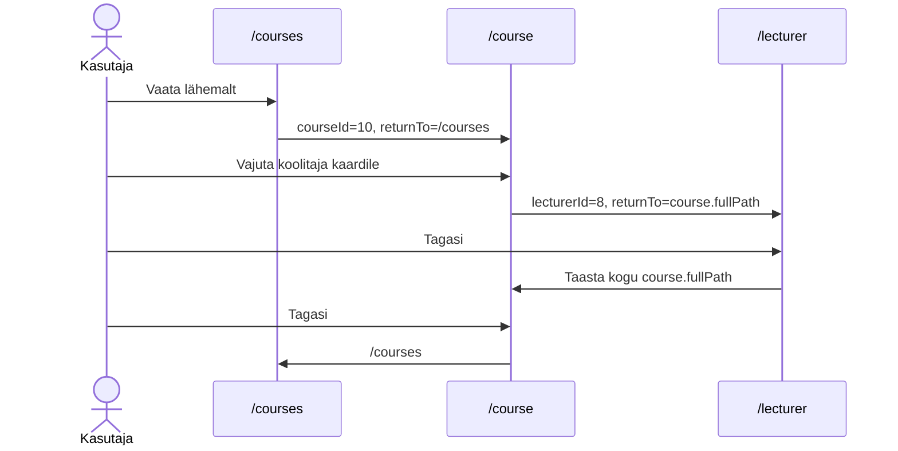
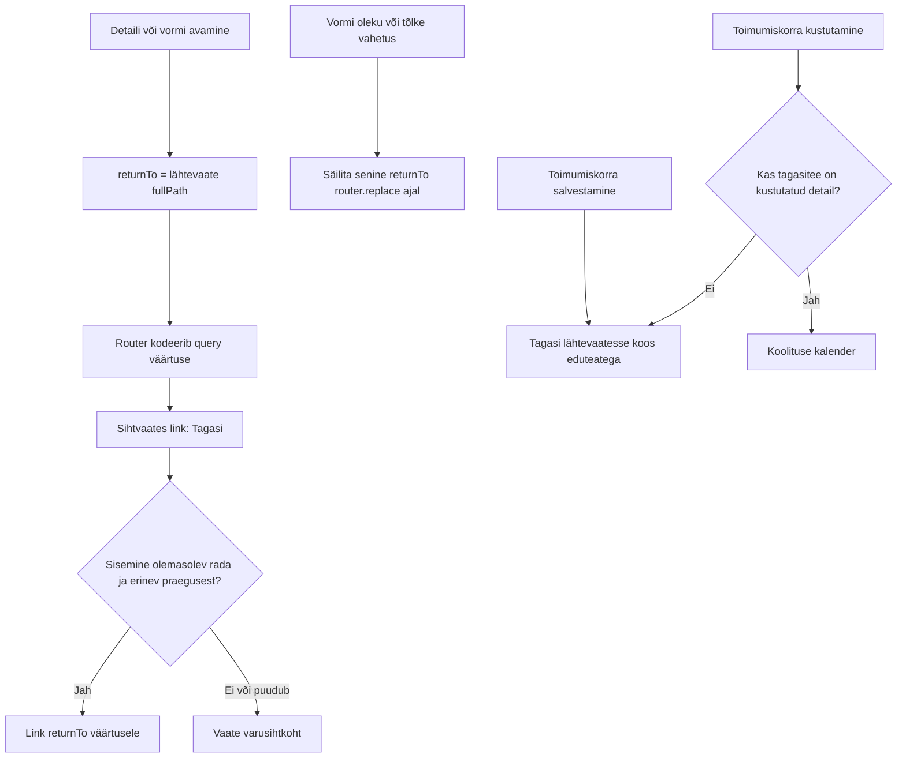
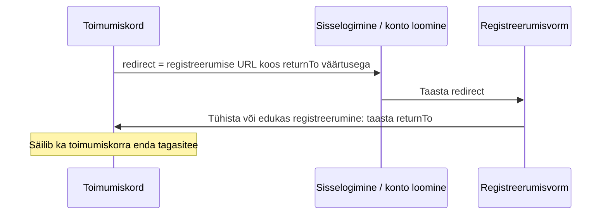

# Tagasitee navigatsioon — skeemid

Kõigi avamiskohtade ja erandite [kaardistus](../../tasks/frontend/return-to-navigation.md).
Ühine frontendi komponent on `BackLink.vue`; läbimängudes sama lepingut kirjeldav
`return-navigation.js`. Peamenüü ja vahelehed ei loo tagasiteed. `/training` vaate „Järgmised koolitused“
kaardi lingid avavad `/course?courseId={id}` ilma `returnTo`-ta; sealne „Tagasi“
kasutab varusihti `/courses`.

Näited avamise kohta:

- `/admin-all-courses` → `/course-form?courseId=10&returnTo=...` → tagasi kõigi toimumiskordade nimekirja.
- `/admin-course?courseId=10` → `/admin-enquiry?enquiryId=4&returnTo=...` → tagasi toimumiskorra juurde.
- `/admin-user?userId=2` → `/admin-registration?courseParticipantId=5&returnTo=...` → tagasi konto juurde.
- `/training-form?...&returnTo=...` → tõlkevahetus → sama tagasitee; „Vaata“ loob tagasitee avatud vormile.

`returnTo` ei salvesta lähtevaate ainult komponendi mälus olevaid filtreid,
lehekülge ega salvestamata vormiteksti. Sihtvaated laevad andmed tavapäraselt.

## Toimumiskorra vahetus samas vaates

`/course` kaardi „Toimumiskorrad“ lingid kasutavad `router.replace` ja annavad
kaasa ainult uue `courseId`. `returnTo` eemaldatakse; URL ei pikene ega teki
uut ajalookirjet. Vaade laadib koondandmed ja vajadusel osalemise oleku uuesti.
„← Tagasi“ kasutab seejärel varusihti `/courses`.
