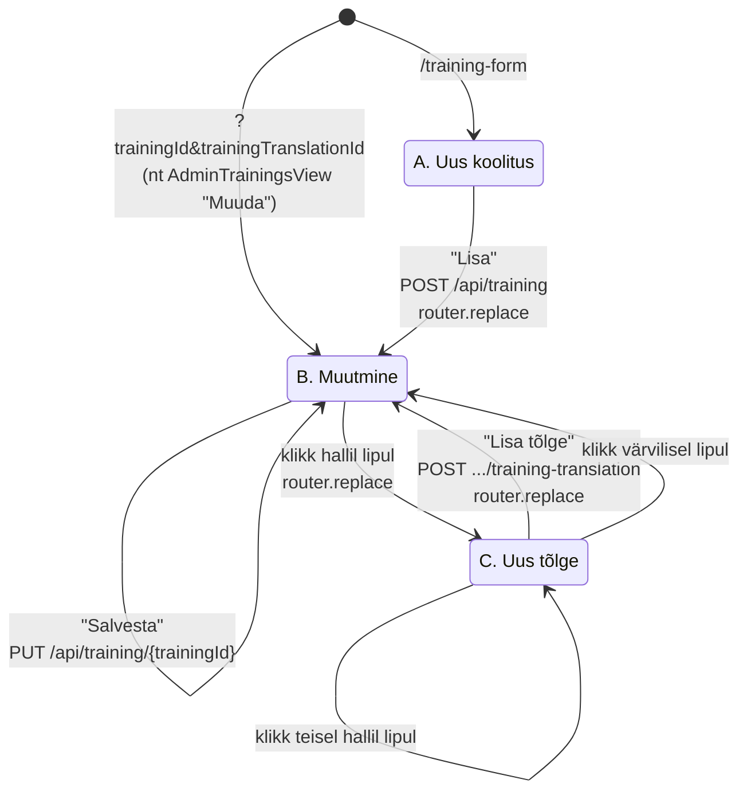
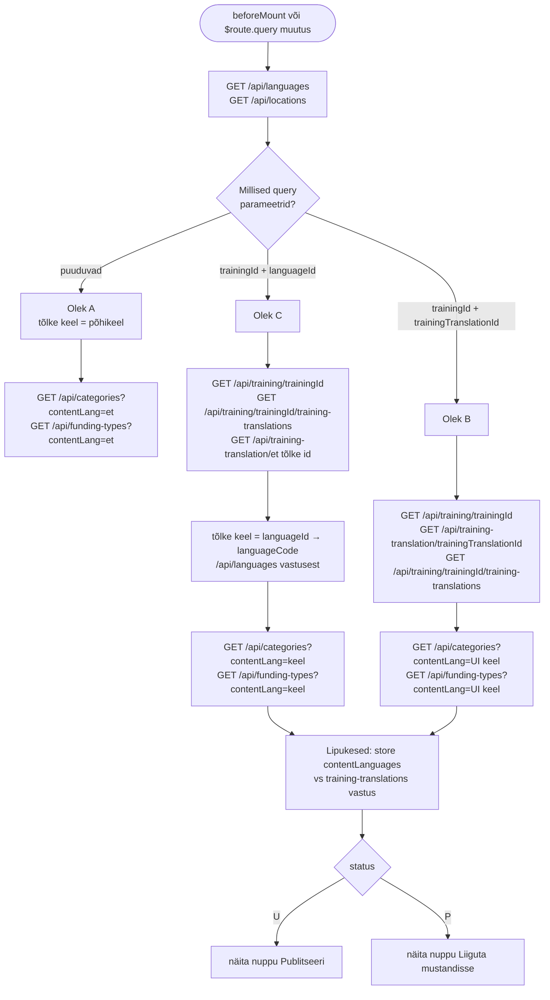
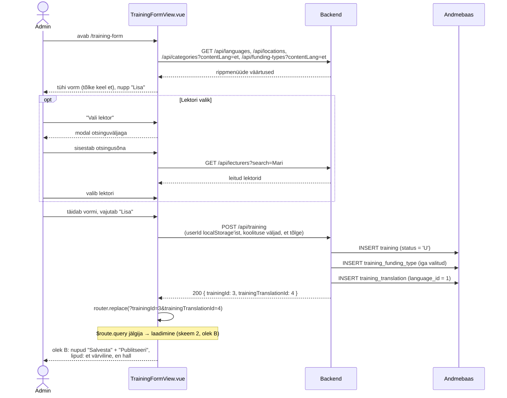
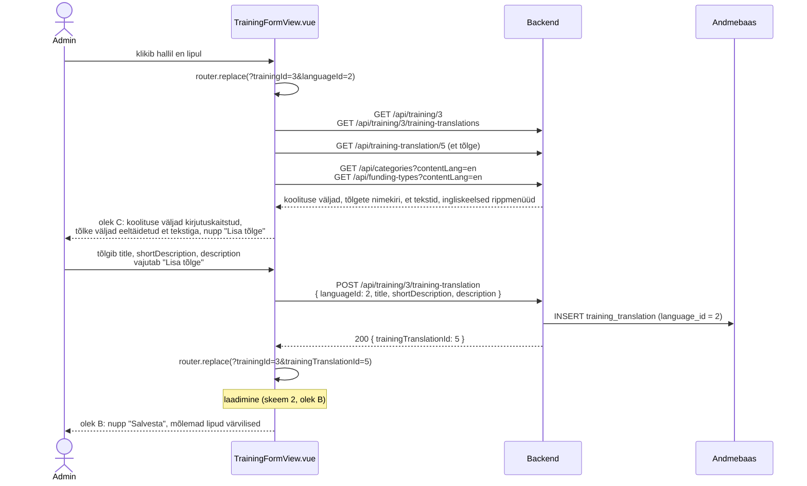
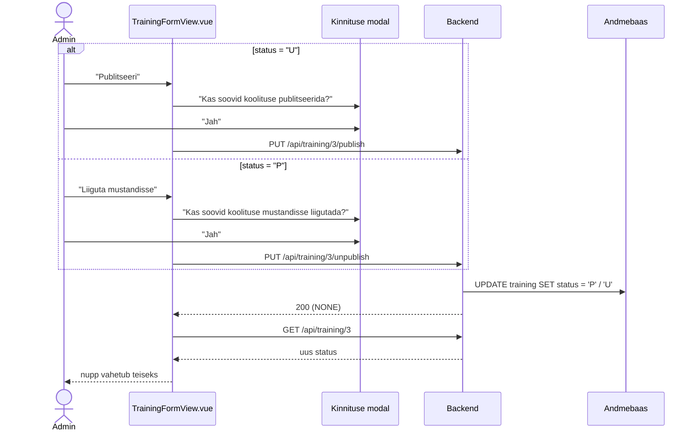
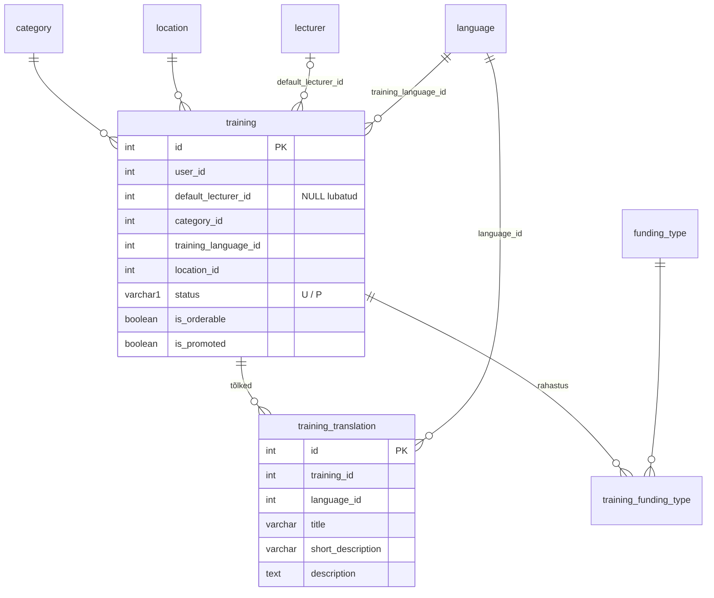

# TrainingFormView.vue — skeemid

Selles failis on `TrainingFormView.vue` olekud ja andmevood skeemidena (Mermaid). Skeemid on plaanifaili (`training-form-view-plaan.md`) eeltöö — kokkulepitud otsused on kirjas jaotises "Otsused".

## Otsused

- Vaade käsitleb ainult `training` tabelit ja selle tõlkeid (`training_translation`). Toimumiskorrad (`course`) on CourseFormView teema.
- Roll: Admin. Rada: `/training-form`.
- Vormi olek tuleneb URL-i query parameetritest (vt "Olekud").
- Uus koolitus luuakse alati koos `et` tõlkega. Teised tõlked lisatakse ükshaaval halli lipu kaudu; uue tõlke vorm eeltäidetakse eestikeelse tõlke tekstidega, mida admin tõlgib.
- Süsteemi keeled: `et`, `en`, `ru`. Lahendus ei tohi olla kahe keele külge kinni — keelte arv tuleb store'ist ja andmebaasist.
  - **NB! Vene keel (`ru`) on ainult mockupis ja plaanis** — andmebaasi (`3_import.sql`: `language`, `*_translation` tabelid) seda teadlikult ei lisata. Mockupi venekeelsed nimed (kategooriad, rahastustüübid) on näidised, mitte päris andmed.
- `status` (`varchar(1)`): `"U"` = mustand (unpublished, süsteem määrab loomisel), `"P"` = publitseeritud. Vormis staatuse välja pole — staatust muudetakse nuppudega "Publitseeri" / "Liiguta mustandisse" (teineteist välistavad, mõlemal kinnituse modal). Staatust muudavad tegevusteenused `PUT /api/training/{trainingId}/publish` ja `/unpublish` (ilma body ja DTO-ta, vt URL-ide kokkuleppe erand). Backendis kasutada eraldi `TrainingStatus` enumit (`UNPUBLISHED("U")`, `PUBLISHED("P")`). Mustandi täht on `"U"`, mitte `"D"`, sest olemasolevas `ApiStatus` enumis tähendab `"D"` kustutatud.
- Pärast iga `router.replace`-i laaditakse vaate andmed uuesti (`$route.query` jälgija) — erandeid pole.
- "Salvesta" teeb ühe `PUT /api/training/{trainingId}` päringu, mis salvestab koolituse väljad ja avatud tõlke ühes transaktsioonis.
- Rippmenüüde väärtused tulevad backendist, `contentLang` = **kasutajaliidese keel** (Pinia `languageStore.contentLang`, valitakse navbaris). Keele vahetamisel laaditakse ainult rippmenüüd uuesti (`watch: contentLang`), vormi sisu jääb alles. Avatud tõlke keel on sellest sõltumatu.
- `userId` võetakse localStorage'ist ja saadetakse `POST /api/training` body's.
- Lektorite ja toimumiskohtade otsing/valik käib backendis (`GET /api/lecturers?search=`, `GET /api/locations`).
- Põhikeel on määratud andmebaasis (`language.is_main_language`, praegu `et`) ja frontendi store'is (`contentLanguages[].isMainLanguage`). Uus koolitus luuakse põhikeele tõlkega ja uue tõlke vorm eeltäidetakse põhikeele tekstiga.
- "Tee AI tõlge" nupp on olekus C ja olekus B, kui avatud tõlge pole põhikeeles. Nupp kutsub `GET /api/training/{trainingId}/ai-translation?languageId={id}`, mis tõlgib alati **salvestatud põhikeele tõlke** (mitte vormi sisu) ja tagastab `AiTranslationDto` (`title`, `shortDescription`, `description`). Tulemus kuvatakse ainult vormis — andmebaasi läheb see alles "Lisa tõlge" / "Salvesta" nupuga. Kui vormis on salvestamata muudatusi, küsitakse enne üle kirjutamist kinnitust. Nupu tooltip selgitab seda kasutajale.
- Olemasolevad tõlked kuvatakse lipukestena: frontendi store'i `contentLanguages` (`et`, `en`, `ru`) võrreldakse `GET /api/training/{trainingId}/training-translations` vastusega — tõlge olemas → värviline lipp, puudub → hall lipp.

---

## 1. Olekud

Vaatel on kolm olekut, mille määravad URL-i query parameetrid.

Vaates hoitakse olekut muutujas `state`, mille väärtus tuletatakse URL-i query parameetritest.

| Olek | `state` | URL | Vormi sisu | Nupud | Lipukesed |
|---|---|---|---|---|---|
| **A. Uus koolitus** | `"new-training"` | `/training-form` | tühi vorm, tõlke keel `et` | "Lisa" | — |
| **B. Muutmine** | `"update"` | `/training-form?trainingId=3&trainingTranslationId=4` | koolituse väljad + tõlge täidetud | "Salvesta", "Publitseeri" / "Liiguta mustandisse" | jah |
| **C. Uus tõlge** | `"new-translation"` | `/training-form?trainingId=3&languageId=2` | koolituse väljad täidetud (kirjutuskaitstud), tõlke väljad eeltäidetud `et` tõlkega | "Lisa tõlge", "Publitseeri" / "Liiguta mustandisse" | jah |



---

## 2. Andmete laadimine (beforeMount ja `$route.query` jälgija)

Sama laadimisloogika käivitub nii vaate avamisel kui iga `router.replace`-i järel.



---

## 3. Päringud olekute kaupa

Iga oleku kõik võimalikud päringud. **Laadimine** käivitub vaate avamisel ja iga `router.replace`-i järel (vt skeem 2), **tegevused** nuppude peale.

### `state: "new-training"` (A. Uus koolitus)

| Grupp | Päring | Millal / milleks |
|---|---|---|
| Laadimine | `GET /api/languages` | "Koolituse keel" rippmenüü |
| Laadimine | `GET /api/locations` | "Toimumiskoht" rippmenüü |
| Laadimine | `GET /api/categories?contentLang={UI keel}` | kategooriad kasutajaliidese keeles (ka keele vahetusel) |
| Laadimine | `GET /api/funding-types?contentLang={UI keel}` | rahastustüübid kasutajaliidese keeles (ka keele vahetusel) |
| Tegevus | `GET /api/lecturers?search={otsingusõna}` | "Vali lektor" modalis otsides |
| Tegevus | `POST /api/training` | "Lisa" → `router.replace` olekusse `update` |

### `state: "update"` (B. Muutmine)

| Grupp | Päring | Millal / milleks |
|---|---|---|
| Laadimine | `GET /api/languages` | "Koolituse keel" rippmenüü |
| Laadimine | `GET /api/locations` | "Toimumiskoht" rippmenüü |
| Laadimine | `GET /api/training/{trainingId}` | koolituse väljad |
| Laadimine | `GET /api/training-translation/{trainingTranslationId}` | avatud tõlge |
| Laadimine | `GET /api/training/{trainingId}/training-translations` | lipukesed |
| Laadimine | `GET /api/categories?contentLang={UI keel}` | kategooriad kasutajaliidese keeles (ka keele vahetusel) |
| Laadimine | `GET /api/funding-types?contentLang={UI keel}` | rahastustüübid kasutajaliidese keeles (ka keele vahetusel) |
| Tegevus | `GET /api/lecturers?search={otsingusõna}` | "Vali lektor" modalis otsides |
| Tegevus | `PUT /api/training/{trainingId}` | "Salvesta" |
| Tegevus | `GET /api/training/{trainingId}/ai-translation?languageId={id}` | "Tee AI tõlge" (ainult mitte-põhikeele tõlkel) |
| Tegevus | `PUT /api/training/{trainingId}/publish` | "Publitseeri" (status `U`) → kinnitus |
| Tegevus | `PUT /api/training/{trainingId}/unpublish` | "Liiguta mustandisse" (status `P`) → kinnitus |

Lipule klikkimine päringut ei tee — see teeb `router.replace`-i ja käivitab laadimise uuesti.

### `state: "new-translation"` (C. Uus tõlge)

| Grupp | Päring | Millal / milleks |
|---|---|---|
| Laadimine | `GET /api/languages` | "Koolituse keel" rippmenüü |
| Laadimine | `GET /api/locations` | "Toimumiskoht" rippmenüü |
| Laadimine | `GET /api/training/{trainingId}` | koolituse väljad (lukus) |
| Laadimine | `GET /api/training/{trainingId}/training-translations` | lipukesed, põhikeele tõlke leidmine |
| Laadimine | `GET /api/training-translation/{põhikeele tõlke id}` | tekstide eeltäitmine põhikeelest |
| Laadimine | `GET /api/categories?contentLang={UI keel}` | kategooriad kasutajaliidese keeles (ka keele vahetusel) |
| Laadimine | `GET /api/funding-types?contentLang={UI keel}` | rahastustüübid kasutajaliidese keeles (ka keele vahetusel) |
| Tegevus | `GET /api/training/{trainingId}/ai-translation?languageId={id}` | "Tee AI tõlge" |
| Tegevus | `POST /api/training/{trainingId}/training-translation` | "Lisa tõlge" → `router.replace` olekusse `update` |
| Tegevus | `PUT /api/training/{trainingId}/publish` | "Publitseeri" (status `U`) → kinnitus |
| Tegevus | `PUT /api/training/{trainingId}/unpublish` | "Liiguta mustandisse" (status `P`) → kinnitus |

---

## 4. Uue koolituse lisamine (olek A → B)



---

## 5. Uue tõlke lisamine (olek B → C → B)



---

## 6. Muutmine ja salvestamine (olek B)

```mermaid
sequenceDiagram
    actor Admin
    participant FE as TrainingFormView.vue
    participant BE as Backend
    participant DB as Andmebaas

    Admin->>FE: avab ?trainingId=3&trainingTranslationId=4
    FE->>BE: GET /api/training/3<br/>GET /api/training-translation/4<br/>GET /api/training/3/training-translations
    BE-->>FE: koolitus, tõlge, tõlgete nimekiri
    FE-->>Admin: täidetud vorm, nupp "Salvesta"

    Admin->>FE: muudab kategooriat ja pealkirja, vajutab "Salvesta"
    FE->>BE: PUT /api/training/3<br/>{ koolituse väljad, trainingTranslation: { trainingTranslationId: 4, ... } }
    Note over BE,DB: üks transaktsioon
    BE->>DB: UPDATE training
    BE->>DB: DELETE + INSERT training_funding_type
    BE->>DB: UPDATE training_translation (id = 4)
    BE-->>FE: 200 (NONE)
    FE-->>Admin: eduteade

    Admin->>FE: klikib värvilisel en lipul
    FE->>FE: router.replace(?trainingId=3&trainingTranslationId=5)
    Note over FE: laadimine (skeem 2, olek B); rippmenüüd jäävad kasutajaliidese keelde
```

---

## 7. Publitseerimine ja mustandisse liigutamine (olekud B ja C)



---

## 8. API teenuste kokkuvõte

| Teenus | Kasutus | Request | Response |
|---|---|---|---|
| `GET /api/languages` | "Koolituse keel" rippmenüü, `languageId` ↔ `languageCode` | — | `SystemLanguageDto[]` |
| `GET /api/categories?contentLang=` | kategooria rippmenüü | — | `CategoryDto[]` |
| `GET /api/funding-types?contentLang=` | rahastustüüpide checkboxid | — | `FundingTypeDto[]` |
| `GET /api/locations` | toimumiskoha rippmenüü | — | täpsustamisel |
| `GET /api/lecturers?search=` | lektori modal | — | täpsustamisel |
| `GET /api/training/{trainingId}` | koolituse väljad (olekud B, C) | — | `TrainingDto` |
| `GET /api/training-translation/{trainingTranslationId}` | avatud tõlge (olek B), `et` tõlge eeltäitmiseks (olek C) | — | `TrainingTranslationDto` |
| `GET /api/training/{trainingId}/training-translations` | lipukesed (olekud B, C), põhikeele leidmine | — | `TrainingTranslationItemDto[]` (sh `isMainLanguage`) |
| `GET /api/training/{trainingId}/ai-translation?languageId=` | "Tee AI tõlge" (olek C, B mitte-põhikeel) | — | `AiTranslationDto` |
| `POST /api/training` | "Lisa" (olek A) | `TrainingCreateRequestDto` | `TrainingCreateResponseDto` |
| `POST /api/training/{trainingId}/training-translation` | "Lisa tõlge" (olek C) | täpsustamisel | täpsustamisel |
| `PUT /api/training/{trainingId}` | "Salvesta" (olek B) | täpsustamisel | NONE |
| `PUT /api/training/{trainingId}/publish` | "Publitseeri" | — | NONE |
| `PUT /api/training/{trainingId}/unpublish` | "Liiguta mustandisse" | — | NONE |

DTO-de väljad täpsustatakse plaanifailis.

---

## 9. Seotud tabelid


