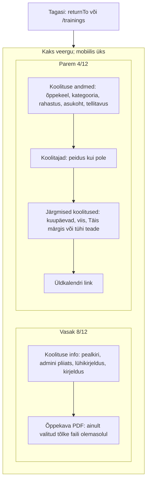
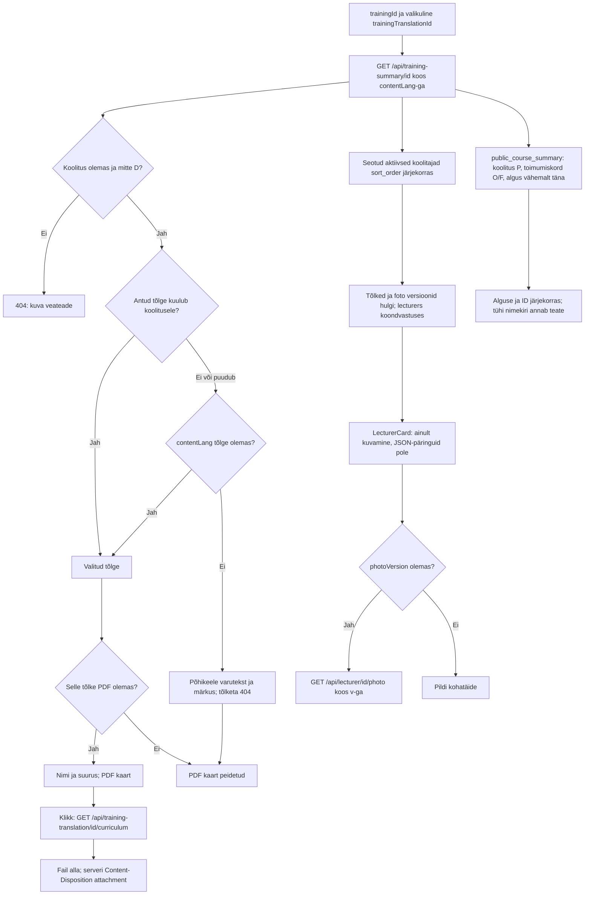
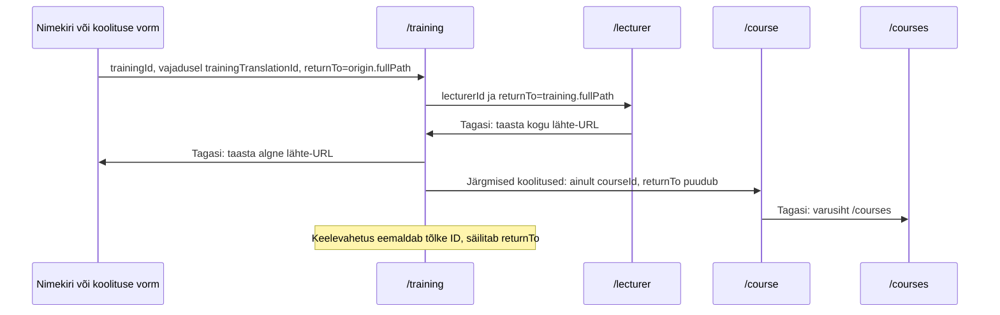

# Koolituse detailvaade — skeemid

[Mock](training-view-labimang.html), [frontend task](../../../tasks/frontend/training-view.md),
[backend task](../../../tasks/backend/GET-api-training-summary-trainingId.md),
[märkmed](../../markmed/training-view-markmed.md).

## Paigutus

## Andmed, tõlke valik ja PDF

## Navigeerimine

Muutmise ikoon asub pealkirja järel ja avaneb ainult adminile.
Koolituse õppekeel ei sõltu teksti kuvamiskeelest. Tõlke puudumisel ei pakuta
teise keele PDF-i. Vormi salvestamata fail ei kuulu avaliku eelvaate sisusse.

Tagasitee [ühine leping ja piirid](../return-to-navigation-skeemid.md).
