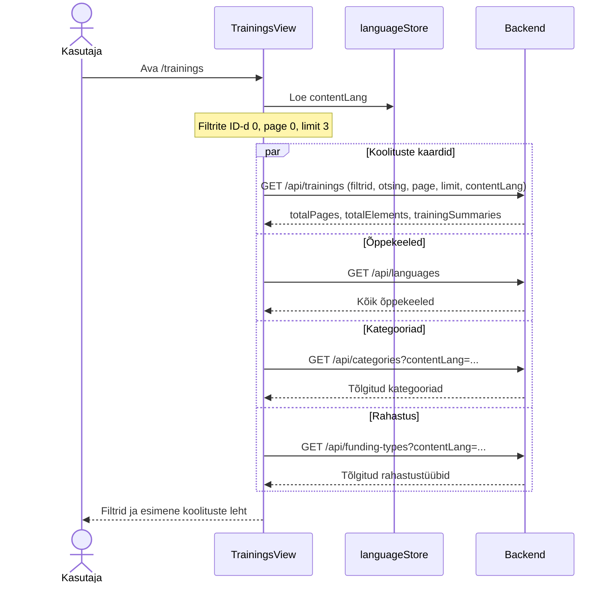
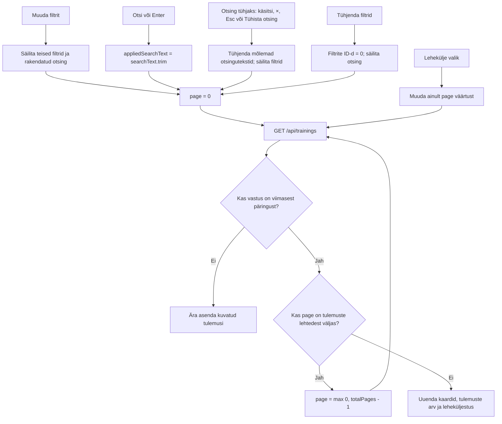

# Avalik koolituste nimekiri — skeemid

Rada `/trainings`, vaade `TrainingsView.vue`, lubatud kõigile rollidele.

Aluseks on [interaktiivne läbimäng](trainings-view-labimang.html),
[vaate märkmed](../../markmed/trainings-view-markmed.md) ja
[frontend task](../../../tasks/frontend/trainings-view.md).

## Paigutus ja eeltäitmised

Ülal on vahelehed „Meie koolitused | Koolituste kalender“, neist esimene aktiivne.
Vasakul asuvad filtrid järgmises järjekorras; paremal otsing, koolituste kaardid ja
leheküljestus. Kitsal ekraanil paiknevad filtrid kaartide kohal.

| Element | Algväärtus | Valikute allikas | Käitumine |
|---|---|---|---|
| Koolituse keel | „Kõik keeled“, `trainingLanguageId=0` | `GET /api/languages` | Üksikvalik; kõik õppekeeled, ka `requiresTranslation=false` |
| Koolituse kategooria | „Kõik kategooriad“, `categoryId=0` | `GET /api/categories?contentLang=...` | Üksikvalik; nimed kasutajaliidese keeles |
| Rahastus | „Kõik“, `fundingTypeId=0`, raadionupp märgitud | `GET /api/funding-types?contentLang=...` | Raadionupud; korraga üks valik |
| Otsing | Tühi; avalehelt tulles query `searchText` | Kasutaja sisestus | „Otsi“ või Enter rakendab kärbitud teksti |
| Lehekülg | `page=0` | Kasutaja valik | Esimene leht kuvatakse numbriga 1 |
| Lehe suurus | `limit=5` | Vaate seadistus | Sama frontendis ja läbimängus |
| Kuvamiskeel | Salvestatud kasutajaliidese keel, vaikimisi `et` | `languageStore.contentLang` | Eraldi õppekeele filtrist |

Valikud ei sisalda tühje näidiskirjeid. Enne API vastust on nähtavad ainult
vaikimisi „Kõik“ valikud. Filter `0` tähendab piirangu puudumist, mitte
kasutajaliidese keelele vastavat õppekeelt. Filtrid rakenduvad kohe ja koos:
keele, kategooria ning rahastuse tingimused peavad kõik sobima. Filtri muutmine
säilitab rakendatud otsingu ja teised filtrid, kuid lähtestab `page=0`.

„Tühjenda filtrid“ link on nähtav ainult siis, kui õppekeele, kategooria või rahastuse filter on aktiivne. Vajutus seab kõik kolm filtri ID-d ja page väärtuse 0-ks ning küsib koolitused ühe päringuga. Sisestatud ja rakendatud otsing säilivad; ainult otsing ei tee filtrite tühjendamise linki nähtavaks.

## Vaate avamine

## Filtrid, otsing ja leheküljestus

Tühi tulemus ei ole viga. Filtritega kuvatakse „Valitud filtritele vastavaid
koolitusi ei leitud“. Rakendatud otsinguga kuvatakse otsingutekstiga teade,
soovitus ning „Näita kõiki koolitusi“ nupp, mis tühjendab otsingu ja säilitab
filtrid. Ootamatu API viga suunab üldisele veavaatele.

## Kasutajaliidese keele vahetus

`contentLang` muutumisel laetakse uuesti koolitused, kategooriad ja rahastus;
õppekeelte loendit uuesti ei küsita, sest `languageName` ei ole tõlgitud.
Filtrite ID-d, rakendatud otsing ja lehekülg säilivad. Kui uues keeles on vähem
lehti, tehakse uus päring viimasele olemasolevale lehele (tühja tulemuse korral
lehele 0). Aegunud päringu vastus ei tohi asendada uuema valiku tulemusi ega
uue kuvamiskeele kategooria- ja rahastusnimesid.

## Kaardid ja navigeerimine

Backend tagastab ainult publitseeritud ja `contentLang` keeles tõlgitud
koolitused. Esile tõstetud koolitused on eespool, seejärel järjestatakse
pealkirja järgi. Kaart kasutab `/courses` kaartidega sama kompaktset kujundust:
pealkiri, lühikirjeldus, kategooria ja rahastus; paremal õppekeele lipp,
„Tellitav“ märgis ning „Vaata lähemalt“. Esile tõstetud kaart on kollakas ja
tähistatud tähega. Admin näeb lisaks muutmise ikooni.

- „Vaata lähemalt“ → `/training?trainingId={id}`.
- Admini muutmise ikoon → `/training-form?trainingId={id}&trainingTranslationId={id}`.
- „Koolituste kalender“ → `/courses`.
