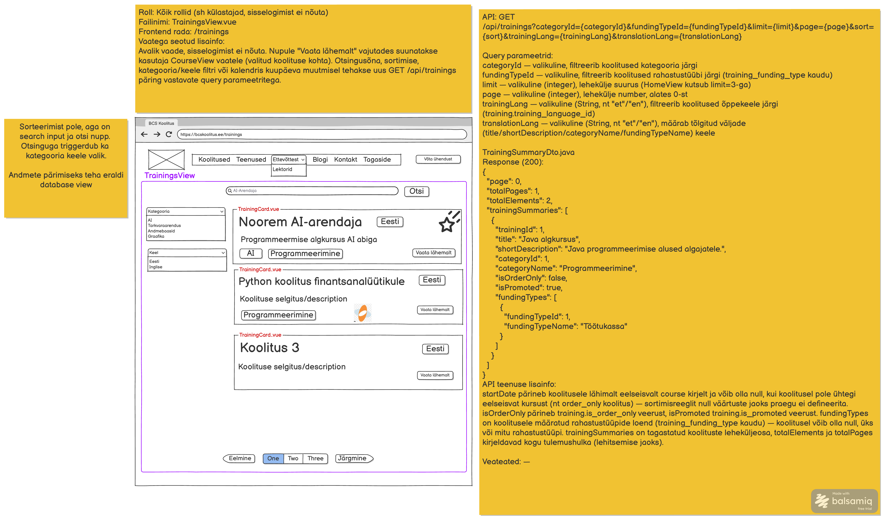

# Süsteemi keelte nimekirja päring

**Teenus:** `GET /api/languages`

**Kasutav vaade:** `TrainingsView.vue` (`/trainings`), mockupis lehekülg 4



## Sisend

Teenusel puuduvad sisendid: pole path variable'eid, query parameetreid ega request body't.

Keele nimi (`language.name`) ei ole tõlgitud, seega erinevalt teenustest `GET /api/categories` ja `GET /api/funding-types` ei ole sellel teenusel `contentLang` parameetrit.

## Väljund

**Response (200 OK):** Kõigi süsteemis olevate keelte nimekiri (`List<SystemLanguageDto>`).

`SystemLanguageDto.java`:

```json
[
  {
    "languageId": 1,
    "languageCode": "et",
    "languageName": "Eesti",
    "isMainLanguage": true,
    "requiresTranslation": true,
    "flagIconCode": "fi-ee"
  },
  {
    "languageId": 2,
    "languageCode": "en",
    "languageName": "English",
    "isMainLanguage": false,
    "requiresTranslation": true,
    "flagIconCode": "fi-gb"
  },
  {
    "languageId": 3,
    "languageCode": "ru",
    "languageName": "Русский",
    "isMainLanguage": false,
    "requiresTranslation": false,
    "flagIconCode": "fi-ru"
  }
]
```

| Väli | Allikas | Kirjeldus |
|---|---|---|
| `languageId` | `language.id` | Keele ID; frontend saadab selle `GET /api/trainings` päringus parameetrina `trainingLanguageId` |
| `languageCode` | `language.code` | Kahetäheline keelekood (`et`/`en`/`ru`) |
| `languageName` | `language.name` | Keele nimi, mida kuvatakse filtri valikuna |
| `isMainLanguage` | `language.is_main_language` | `true` — süsteemi põhikeel (ainult ühel keelel); frontend leiab selle järgi põhikeele |
| `requiresTranslation` | `language.requires_translation` | `true` — keel, millesse koolituste sisu tõlgitakse (tõlkelipud); `false` — ainult õppekeel, tõlget ei vaja (nt `ru`) |
| `flagIconCode` | `language.flag_icon_code` | [flag-icons](https://flagicons.lipis.dev/) CSS klass keele lipu kuvamiseks (nt `fi-ee`) |

Mockupi näidises on üks element ja `...`. Siin on näidisesse kirjutatud kõik `3_import.sql` read.

**Järjestus:** eesti keel on nimekirjas alati esimene. Eesti keel on süsteemi põhikeel (`is_main_language = true`), seega esimesena tuleb põhikeel ja selle järel ülejäänud keeled `id` järgi kasvavas järjekorras. Mockup järjestust ei määranud, see on hiljem kokku lepitud.

**Olemasolev kood:** `SystemLanguageDto` on juba olemas (`controller/common/dto/`), sest seda kasutab ka `LoginResponse`. Olemas on ka `LanguageRepository` ja `LanguageMapper` (meetodid `toSystemLanguageDto` / `toSystemLanguageDtos`). Endpointi `GET /api/languages` koodis veel pole.

## Eesmärk

Teenust kasutab vaade `TrainingsView.vue`: vaate avanemisel tehakse päring ja saadud keeltest moodustatakse filtri "Koolituse keel" valikud. Kui kasutaja valib keele, saadab frontend selle `languageId` väärtuse koolituste päringus parameetrina `trainingLanguageId`. Vaadet kasutavad kõik rollid, sh sisselogimata külastajad, seega ei nõua ka see teenus sisselogimist.

## Seotud andmebaasi tabelid

Vt `docs/database/2_create.sql`.

### language

Süsteemi keeled. Tabelit kasutatakse ka tõlketabelites (`*_translation.language_id`) ja koolituse õppekeelena (`training.training_language_id`).

```sql
CREATE TABLE language
(
    id                   serial      NOT NULL,
    code                 varchar(2)  NOT NULL,
    name                 varchar(50) NOT NULL,
    is_main_language     boolean     NOT NULL,
    requires_translation boolean     NOT NULL,
    flag_icon_code       varchar(10) NOT NULL,
    CONSTRAINT language_pk PRIMARY KEY (id),
    CONSTRAINT language_code_uq UNIQUE (code)
);
```

Näidisandmed (`3_import.sql`):

| id | code | name | is_main_language | requires_translation | flag_icon_code |
|---|---|---|---|---|---|
| 1 | et | Eesti | true | true | fi-ee |
| 2 | en | English | false | true | fi-gb |
| 3 | ru | Русский | false | false | fi-ru |

## Veaolukorrad

| Olukord | Status code | Response body |
|---|---|---|
| Ootamatu serveri viga | 500 Internal Server Error | Standardne vea response body (vastavalt projekti globaalsele error handler'ile) |

Teenusel pole sisendeid ja mockup veateateid ei kirjelda (`Veateated: —`), seega muid veaolukordi pole. Kui tabelis keeli pole, ei ole see viga: tulemuseks on tühi list `[]`.

## Vastuvõtu kriteeriumid

- [ ] Endpoint `GET /api/languages` on olemas
- [ ] Õnnestunud päring tagastab `200 OK` ja `SystemLanguageDto` objektide listi
- [ ] Vastuses on kõik `language` tabeli read ja väljad `languageId`, `languageCode`, `languageName` vastavad veergudele `id`, `code`, `name`
- [ ] Vastuses ei ole välja `is_main_language`
- [ ] Eesti keel (põhikeel, `is_main_language = true`) on nimekirjas alati esimene, ülejäänud keeled tulevad `id` järgi kasvavas järjekorras
- [ ] Endpoint ei nõua sisselogimist
- [ ] Ootamatu vea korral tagastatakse `500` standardse vea response body'ga
- [ ] Teenusel on automaattestid
