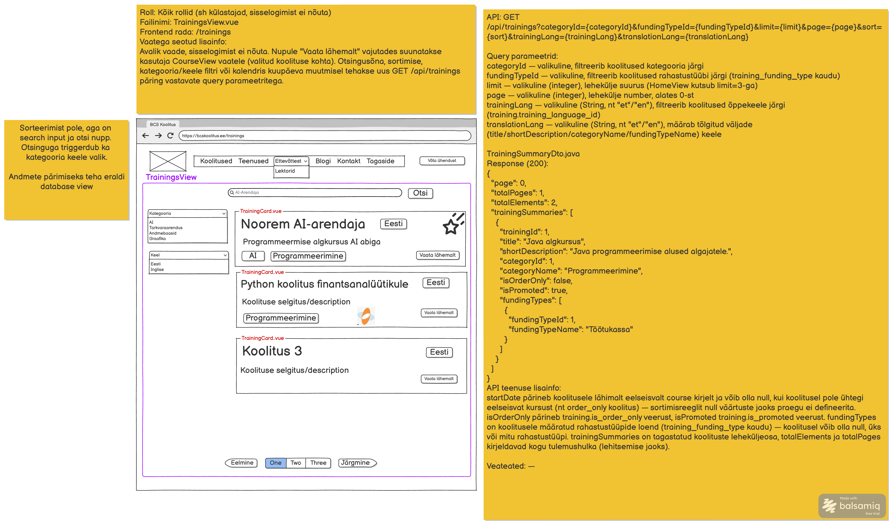

# Koolituste nimekirja päring

**Teenus:** `GET /api/trainings?categoryId={categoryId}&fundingTypeId={fundingTypeId}&limit={limit}&page={page}&trainingLang={trainingLang}&translationLang={translationLang}`

**Vaste balsamic mockupis:** TrainingsView, lehekülg 1/1 (vt lisatud pilt `Koolituste-nimekirja-paring.png`)



## Sisend

Kõik parameetrid on query parameetrid ja valikulised:

| Parameeter | Tüüp | Kirjeldus |
|---|---|---|
| `categoryId` | int, valikuline | Filtreerib koolitused kategooria järgi (`training.category_id`) |
| `fundingTypeId` | int, valikuline | Filtreerib koolitused rahastustüübi järgi (`training_funding_type` kaudu) |
| `limit` | int, valikuline | Lehekülje suurus (nt HomeView kutsub `limit=3`-ga) |
| `page` | int, valikuline | Lehekülje number, loendus algab 0-st |
| `trainingLang` | String (`et`/`en`), valikuline | Filtreerib koolitused õppekeele järgi (`training.training_language_id`) |
| `contentLang` | String (`et`/`en`), valikuline | Määrab tõlgitud väljade (`title`/`shortDescription`/`categoryName`/`fundingTypeName`) keele |

Teenusel puudub request body.

Mockupi API URL-is sisaldus lisaks ka `sort={sort}` parameeter, kuid see on taskist teadlikult välja jäetud — vt "Avatud küsimused".

## Väljund

**Response (200 OK):** Leheküljestatud koolituste nimekiri koos filtreerimiseks vajaliku metainfoga.

`TrainingSummaryDto.java`:

```json
{
  "page": 0,
  "totalPages": 1,
  "totalElements": 2,
  "trainingSummaries": [
    {
      "trainingId": 1,
      "title": "Java algkursus",
      "shortDescription": "Java programmeerimise alused algajatele.",
      "categoryId": 1,
      "categoryName": "Programmeerimine",
      "isOrderOnly": false,
      "isPromoted": true,
      "fundingTypes": [
        {
          "fundingTypeId": 1,
          "fundingTypeName": "Töötukassa"
        }
      ]
    },
    {
      "trainingId": 2,
      "title": "Projektijuhtimise põhitõed",
      "shortDescription": "Sissejuhatus IT-projektijuhtimisse.",
      "categoryId": 3,
      "categoryName": "Juhtimine",
      "isOrderOnly": false,
      "isPromoted": false,
      "fundingTypes": []
    }
  ]
}
```

Väljade selgitused:

- `page`, `totalPages`, `totalElements` — leheküljestamise metaandmed (kogu tulemushulga ja lehitsemise jaoks), mitte ainult tagastatava lehe kohta.
- `isOrderOnly` — pärineb veerust `training.is_order_only`.
- `isPromoted` — pärineb veerust `training.is_promoted`.
- `fundingTypes` — koolitusele määratud rahastustüüpide loend (`training_funding_type` kaudu). Koolitusel võib olla null, üks või mitu rahastustüüpi (näide: koolitusel id=2 pole ühtegi rahastustüüpi, seega tühi list).
- `title`, `shortDescription`, `categoryName`, `fundingTypeName` — tõlgitud väljad, mille keele määrab `contentLang` parameeter.

**Väli `startDate` ei kuulu vastuse hulka** — vt "Avatud küsimused".

## Eesmärk

`TrainingsView` vaates kuvatakse koolituste nimekiri leheküljestatud kaartidena, kus külastaja saab filtreerida kategooria ja õppekeele järgi ning teha vabateksti otsingut. Iga koolituse kaardi "Vaata lähemalt" nupp suunab kasutaja `CourseView` vaatele valitud koolituse kohta. Vaade on avalik ja ei nõua sisselogimist — otsingusõna, kategooria/keele filtri muutmisel tehakse uus päring sellesama teenuse vastavate query parameetritega.

## Seotud andmebaasi tabelid

Vt `docs/database/2_create.sql`.

### training

Koolituse põhikirje — sisaldab kategooria, õppekeele, asukoha ja staatuse viiteid ning `is_order_only`/`is_promoted` lippe.

```sql
CREATE TABLE training (
                          id serial  NOT NULL,
                          user_id int  NOT NULL,
                          default_lecturer_id int  NULL,
                          category_id int  NOT NULL,
                          training_language_id int  NOT NULL,
                          location_id int  NOT NULL,
                          status int  NOT NULL,
                          created_at timestamp  NOT NULL,
                          updated_at timestamp  NOT NULL,
                          is_order_only boolean  NOT NULL,
                          is_promoted boolean  NOT NULL,
                          CONSTRAINT course_pk PRIMARY KEY (id)
);
```

Näidisandmed (`docs/database/3_import.sql`):

| id | category_id | training_language_id | is_order_only | is_promoted |
|---|---|---|---|---|
| 1 | 1 | 1 (et) | false | true |
| 2 | 3 | 1 (et) | false | false |

### training_translation

Koolituse tõlgitud väljad (`title`, `short_description`, `description`) keele kaupa.

```sql
CREATE TABLE training_translation (
                                     id serial  NOT NULL,
                                     training_id int  NOT NULL,
                                     language_id int  NOT NULL,
                                     title varchar(255)  NOT NULL,
                                     short_description varchar(255)  NOT NULL,
                                     description text  NOT NULL,
                                     created_at timestamp  NOT NULL,
                                     updated_at timestamp  NOT NULL,
                                     CONSTRAINT training_translation_pk PRIMARY KEY (id),
                                     CONSTRAINT training_translation_uq UNIQUE (training_id, language_id)
);
```

Näidisandmed: training_id=1, language_id=1 (et) → title "Java algkursus", short_description "Java programmeerimise alused algajatele.".

### category / category_translation

Koolituse kategooria ja selle tõlgitud nimi.

```sql
CREATE TABLE category (
                          id serial  NOT NULL,
                          created_at timestamp  NOT NULL,
                          updated_at timestamp  NOT NULL,
                          created_by int  NOT NULL,
                          CONSTRAINT category_pk PRIMARY KEY (id)
);

CREATE TABLE category_translation (
                                     id serial  NOT NULL,
                                     category_id int  NOT NULL,
                                     language_id int  NOT NULL,
                                     name varchar(255)  NOT NULL,
                                     created_at timestamp  NOT NULL,
                                     updated_at timestamp  NOT NULL,
                                     CONSTRAINT category_translation_pk PRIMARY KEY (id),
                                     CONSTRAINT category_translation_uq UNIQUE (category_id, language_id)
);
```

Näidisandmed: category_id=1, language_id=1 (et) → "Programmeerimine"; category_id=3, language_id=1 (et) → "Juhtimine".

### training_funding_type / funding_type / funding_type_translation

Koolituse ja rahastustüübi vaheline many-to-many liitetabel ning rahastustüübi tõlgitud nimi.

```sql
CREATE TABLE training_funding_type (
                                       id serial  NOT NULL,
                                       training_id int  NOT NULL,
                                       funding_type_id int  NOT NULL,
                                       CONSTRAINT training_funding_type_pk PRIMARY KEY (id),
                                       CONSTRAINT training_funding_type_uq UNIQUE (training_id, funding_type_id)
);

CREATE TABLE funding_type (
                              id serial  NOT NULL,
                              code varchar(50)  NOT NULL,
                              created_at timestamp  NOT NULL,
                              updated_at timestamp  NOT NULL,
                              created_by int  NOT NULL,
                              CONSTRAINT funding_type_pk PRIMARY KEY (id),
                              CONSTRAINT funding_type_code_uq UNIQUE (code)
);

CREATE TABLE funding_type_translation (
                                          id serial  NOT NULL,
                                          funding_type_id int  NOT NULL,
                                          language_id int  NOT NULL,
                                          name varchar(255)  NOT NULL,
                                          created_at timestamp  NOT NULL,
                                          updated_at timestamp  NOT NULL,
                                          CONSTRAINT funding_type_translation_pk PRIMARY KEY (id),
                                          CONSTRAINT funding_type_translation_uq UNIQUE (funding_type_id, language_id)
);
```

Näidisandmed: training_id=1 on seotud ainult funding_type_id=1 kirjega (`training_funding_type`), mille tõlgitud nimi (language_id=1, et) on "Töötukassa". Training id=2-l ei ole ühtegi `training_funding_type` kirjet, seega `fundingTypes` on tühi list.

### language

Koodiga (`et`/`en`) määratud keeled, mida kasutavad nii `trainingLang` kui `contentLang` parameetrid.

```sql
CREATE TABLE language (
                         id serial  NOT NULL,
                         code varchar(2)  NOT NULL,
                         name varchar(50)  NOT NULL,
                         CONSTRAINT language_pk PRIMARY KEY (id),
                         CONSTRAINT language_code_uq UNIQUE (code)
);
```

Näidisandmed: id=1 → code `et`, id=2 → code `en`.

**Tabel `course` ei kuulu selle teenuse skoopi** — mockupi "API teenuse lisainfo" viitas väljale `startDate`, mis tuletatakse `course` kirjetest, kuid see väli JSON näidisesse ei jõudnud (vt "Avatud küsimused").

## Veaolukorrad

| Olukord | Status code | Response body |
|---|---|---|
| Ootamatu serveri viga | 500 Internal Server Error | Standardne `ApiError` vastus |
| Vigane query parameeter (nt `page`/`limit`/`categoryId`/`fundingTypeId` ei ole number) | 400 Bad Request | Standardne `ApiError` vastus |

Olematu `categoryId`/`fundingTypeId`/`trainingLang` väärtuse korral ei ole tegu veaolukorraga — tulemuseks on lihtsalt tühi `trainingSummaries` list.

## Vastuvõtu kriteeriumid

- [ ] Endpoint `GET /api/trainings` on olemas ja tagastab `TrainingSummaryDto` struktuuriga vastuse
- [ ] Kõik loetletud query parameetrid (`categoryId`, `fundingTypeId`, `limit`, `page`, `trainingLang`, `contentLang`) on valikulised ja toimivad kirjeldatud viisil
- [ ] `page`/`totalPages`/`totalElements` kajastavad korrektselt kogu (filtreeritud) tulemushulka, mitte ainult tagastatud lehte
- [ ] `title`, `shortDescription`, `categoryName`, `fundingTypeName` väljad on tõlgitud `contentLang` parameetri järgi
- [ ] Koolitus, millel pole ühtegi rahastustüüpi, tagastab `fundingTypes` väljana tühja listi (mitte `null` ega viga)
- [ ] Filtreerimine `categoryId`, `fundingTypeId` ja `trainingLang` järgi annab korrektse alamhulga andmebaasi näidisandmete põhjal
- [ ] Kirjeldatud veaolukorrad (400 vigase parameetri korral, 500 ootamatu vea korral) on käsitletud
- [ ] Automaattestid katavad õnnestunud päringu, filtreerimise ja tühja tulemuse juhtumid

## Avatud küsimused

1. **`sort` parameeter** — mockupi API URL-is (`&sort={sort}`) esineb sort-parameeter, kuid "Query parameetrid" loetelu ei kirjelda seda üldse ning vasakpoolne kollane kontekstikast ütleb selgelt "Sorteerimist pole". Kasutaja otsusel on see task koostatud **ilma** sorteerimiseta — `sort` parameetrit ei implementeerita. Kui sorteerimine on siiski vajalik, tuleb mockup enne täpsustada (millised väärtused, milline vaikekäitumine).
2. **`startDate` väli** — "API teenuse lisainfo" tekst kirjeldab välja, mis pärineb koolitusele lähimalt eelseisvalt `course` kirjelt ja võib olla `null`, kui eelseisvaid kursuseid pole (nt `is_order_only` koolitusel). See väli aga JSON response näidisesse ei jõudnud. Kasutaja otsusel on `startDate` **jäetud response'ist välja** — vastus järgib täpselt kuvatud JSON näidist. Kui väli on siiski vajalik, tuleb täpsustada ka selle sortimisreegel `null` väärtuste jaoks (lisainfo tekst mainib, et see on hetkel defineerimata).
