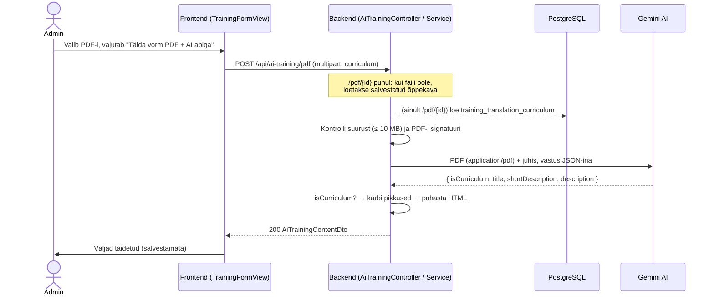

# AI: koolituse vormi täitmine õppekava PDF-ist — ülevaade ja teostusplaan

**Seis:** arutelu ja otsused tehtud, teostus alustamata. Dokument on mõeldud lektoriga ülevaatamiseks.
**Seotud taskid:** [`POST-api-ai-training-pdf.md`](POST-api-ai-training-pdf.md), [`POST-api-ai-training-pdf-trainingTranslationId.md`](POST-api-ai-training-pdf-trainingTranslationId.md), [`training-description-html-sanitize.md`](training-description-html-sanitize.md)

## Eesmärk

Admin lisab koolituse vormis õppekava PDF-i ja vajutab nuppu **„Täida vorm PDF + AI abiga“**. AI loeb PDF-i ja täidab vormis kolm välja:

- **pealkiri** (`title`)
- **lühikirjeldus** (`shortDescription`)
- **kirjeldus** (`description`) — täismahus vormindatud rich text (pealkirjad, loendid, moodulid)

Tulemus täidab **ainult vormi**. Andmebaasi midagi ei salvestata — admin vaatab teksti üle, parandab ja salvestab tavalise „Lisa“ / „Salvesta“ nupuga.

## Põhimõte: inimene otsustab (human in the loop)

AI annab ainult **ettepaneku**, otsuse teeb inimene:

- AI päring **ei kirjuta andmebaasi** — ei loo ega muuda ühtegi rida.
- Admin näeb AI teksti vormis enne salvestamist ning saab seda parandada või kõrvale jätta.
- Andmebaasi jõuab tekst ainult tavalise „Lisa“ / „Salvesta“ nupu kaudu, läbides sama valideerimise ja HTML puhastuse nagu käsitsi kirjutatud tekst.

See vastab kahele olulisele küsimusele: *mis saab, kui AI mõtleb midagi välja?* (admin märkab ja parandab enne salvestamist) ja *kas AI muudab andmeid?* (ei muuda).

## Miks mitte RAG (vektorandmebaas)?

Algne mõte oli kasutada RAG-i. Arutelu käigus jõudsime järeldusele, et see ei sobi siia:

| | RAG | Otse PDF → AI |
|---|---|---|
| Milleks mõeldud | Suurest dokumendikogust **otsimine** (ei mahu AI konteksti) | Ühe dokumendi **teisendamine** |
| Õppekava maht | — | Paar lehekülge, mahub AI konteksti mitu korda ära |
| Ülesande loomus | Tooks AI-le ainult mõned tükid → kirjeldusest jääks moodulid puudu | AI näeb kogu dokumenti → kirjeldus on terviklik |
| Infrastruktuur | pgvector, embedding-mudel, tükeldamine, indeksi sünkroon | Üks AI päring, uut infrastruktuuri pole |

**Järeldus:** PDF saadetakse tervikuna Gemini AI-le. RAG oleks mõistlik alles siis, kui oleks vaja otsida **paljude** õppekavade sisust (nt chatbot: „Mis koolitus käsitleb Dockerit?“) — see ei kuulu selle alamprojekti skoopi.

## Olemasolev alus (scaffolding)

Suur osa on juba valmis:

| Osa | Seis |
|---|---|
| `AiTrainingController` — `POST /api/ai-training/pdf` ja `POST /api/ai-training/pdf/{trainingTranslationId}` | Olemas, tagastab placeholder-väärtused |
| `AiTrainingContentDto` (`title`, `shortDescription`, `description`) | Olemas |
| Frontend: nupp, kinnitusmodaal salvestamata muudatuste korral, laadimise olek, vale järjekorras vastuste kaitse, veateate kuvamine | Olemas (`TrainingFormView.vue`, `AiTrainingService.js`) |
| Spring AI + Gemini seadistus | Olemas (`application.properties`, `gemini-3.1-flash-lite`) |
| HTML puhastus (jsoup safelist, sama mis TipTap editoris) | Olemas (`HtmlSanitizer.sanitizeDescription`) |
| PDF suuruse ja tüübi (`%PDF-`) kontroll | Olemas (`TrainingTranslationCurriculumService`), taaskasutatav |
| Salvestatud õppekava andmebaasis | Olemas (`training_translation_curriculum.file`) |

**Puudu on ainult backend loogika:** Gemini kutse, vastuse töötlemine ja veakäsitlus.

## Andmevoog



## Tehtud otsused

| Teema | Otsus | Põhjendus |
|---|---|---|
| Lähenemine | Ilma RAG-ita, terve PDF otse Geminile | Vt eespool |
| PDF-i edastamine | Gemini loeb PDF-i natiivselt (Spring AI `Media`, `application/pdf`), mitte PDFBox tekstina | Toimib ka skaneeritud PDF-i ja tabelitega; uut sõltuvust pole |
| Väljundi keel | **PDF-i keel** | Lihtsam; keele mittevastavust saab hiljem lahendada olemasoleva AI tõlke teenusega (`/translation`) |
| Kirjelduse sisu | Täismahus rich text: sissejuhatus, `<h3>`/`<h4>` jaotised, moodulid loendina | Admin soovib täielikku kirjeldust, mitte lühikokkuvõtet |
| Lubatud HTML | Ainult editori safelist: `p`, `br`, `strong`, `em`, `u`, `h3`, `h4`, `ul`, `ol`, `li`, `a` | AI vastus läbib `HtmlSanitizer.sanitizeDescription` enne tagastamist |
| Väljamõeldud sisu | Juhis keelab lisada infot, mida PDF-is pole | Kirjeldus peab olema PDF-iga kontrollitav |
| Pikkuspiirangud | Juhises pealkiri ≤ ~100, lühikirjeldus ≤ ~200 märki; backend kärbib turvavõrguna 255-ni sõna piirilt | DB veerud on `varchar(255)`; admin ei tohi AI tõttu valideerimisviga saada |
| AI mudel | **Gemini Flash** (mitte Flash-Lite), seatud **ainult selle päringu** jaoks; täpne mudeli ID kontrollida Google'i mudelite nimekirjast | Pikk struktureeritud HTML vajab tugevamat mudelit; globaalne `gemini-3.1-flash-lite` jääb teistele AI päringutele (nt tõlge) |
| `temperature` | ~0.2, seatud ainult selle päringu jaoks | Ülesanne on PDF-ist info väljavõtmine, mitte loov kirjutamine — madal väärtus vähendab väljamõeldud sisu |
| Väljundi tokenid | ~8192, seatud **ainult selle päringu** jaoks | Globaalne `max-output-tokens=1024` lõikaks täismahus HTML-i katki |
| Multipart faili suurus | `application.properties`: `spring.servlet.multipart.max-file-size=10MB`, `max-request-size=11MB` | Springi vaikimisi piirang on **1 MB** — ilma selleta saaks iga üle 1 MB PDF vea 413, kuigi frontend lubab 10 MB. Seni pole see välja tulnud, sest õppekava salvestamine saadab faili Base64 JSON-ina, mitte multipart-ina |
| Mitte-õppekava PDF | AI tagastab `isCurriculum: false` → viga `PDF_NOT_CURRICULUM`, vorm jääb puutumata | AI ei pea koolitust välja mõtlema |
| Ajapiirang | ~60 s, seejärel 503 `AI_SERVICE_UNAVAILABLE`, kordust pole | Swaggeris juba kirjeldatud leping |
| Kuritarvitus | Lihtne mälupõhine piirang (nt 10 päringut/min IP kohta) + 10 MB piirang ka backendis | Backendil pole autentimist — keegi võiks otse API-t kutsudes Gemini kvooti kulutada |
| Skoop | Mõlemad PDF teenused; `/translation` jääb välja | Sama teenus ja juhis, erineb ainult PDF-i allikas |

## AI vastuse kuju (JSON)

```json
{
  "isCurriculum": true,
  "title": "Java arendaja algkursus",
  "shortDescription": "Praktiline sissejuhatus Java ja Spring Booti veebiarendusse algajatele.",
  "description": "<p>Koolitus annab ...</p><h3>Sihtrühm</h3><p>...</p><h3>Moodulid</h3><ul><li><p>Java põhitõed</p></li></ul>"
}
```

`isCurriculum` on ainult backendi sisemine väli — frontendile tagastatakse olemasolev `AiTrainingContentDto` muutmata kujul.

## Veaolukorrad

| Olukord | Status | Veakood |
|---|---|---|
| Fail puudub / ei ole PDF | 400 *(vt küsimus 1)* | `CURRICULUM_TYPE_NOT_ALLOWED` |
| Fail > 10 MB | 413 *(vt küsimus 1)* | `CURRICULUM_TOO_LARGE` |
| `/pdf/{id}`: tõlget või salvestatud õppekava ei leitud | 404 | — |
| PDF ei ole õppekava | 422 *(vt küsimus 1)* | `PDF_NOT_CURRICULUM` |
| Liiga palju päringuid | 429 | `AI_RATE_LIMITED` |
| Gemini ei vasta / ajapiirang / vigane JSON | 503 | `AI_SERVICE_UNAVAILABLE` |

Kõigil vigadel jääb frontendis vorm ja valitud PDF alles; kuvatakse olemasolev veateade.

## Teostusplaan

| Aeg | Samm | Tulemus |
|---|---|---|
| **1. päev** | Multipart piirangu tõstmine 10 MB-ni (muidu ei saa üle 1 MB PDF-iga katsetada); `AiTrainingService` + Gemini kutse (Flash mudel, madal `temperature`) teenusele `/pdf`; juhise (prompti) kirjutamine ja katsetamine päris PDF-idega, kuni HTML näeb TipTap editoris hea välja | Töötav otsast lõpuni voog |
| **2. päev, I pool** | `isCurriculum` → viga, pikkuste kärpimine, HTML puhastus, ajapiirang → 503, 10 MB piirang backendis | Veaolukorrad kaetud |
| **2. päev, II pool** | `/pdf/{trainingTranslationId}`: PDF päringust või andmebaasist, sama teenus | Mõlemad vormi olekud töötavad |
| **3. päev (pool)** | Päringute piirang, mõned unit testid, Swaggeri uuendus (eemaldada `TO BE IMPLEMENTED`, lisada uued veakoodid), showcase'i läbimäng | Valmis esitluseks |

**Kui aeg jääb väheks:** esimesena jääb ära päringute piirang (lokaalse showcase'i puhul väikseim risk).

## Testimine

Testid ei tohi kutsuda päris AI API-t.

- **Unit testid (mockitud `ChatClient`):** vigane JSON → 503, `isCurriculum: false` → viga, liiga pika pealkirja kärpimine, keelatud HTML-i eemaldamine.
- **Käsitsi:** 2–3 päris õppekava PDF-i + üks mitte-õppekava PDF (nt arve). Kontrollida, et kirjeldus vastab PDF-ile ja midagi pole välja mõeldud.

## Riskid

| Risk | Leevendus |
|---|---|
| AI mõtleb sisu juurde (hallutsinatsioon) | Juhises keeld; madal `temperature`; admin vaatab enne salvestamist üle — AI annab ainult ettepaneku |
| Ingliskeelne PDF täidab eestikeelse vormi inglise keeles | Teadlik otsus; admin märkab ja kasutab vajadusel AI tõlget |
| Pikk ooteaeg (10–40 s) | Frontendis on laadimise olek juba olemas; 60 s ajapiirang |
| Gemini kvoot / kulu | Päringute piirang, 10 MB piirang |
| Juhise häälestamine võtab oodatust kauem | Planeeritud terve 1. päev; ülejäänud sammud on mehaanilised |

## Tuleviku võimalus: AI ettepanekute salvestamine

**Ei kuulu praegusesse skoopi.** Kui hiljem tekib vajadus, saab iga AI päringu tulemuse salvestada eraldi tabelisse **ettepanekuna** — mitte otse `training_translation` tabelisse, et inimese ülevaatus säiliks.

```sql
CREATE TABLE ai_training_suggestion
(
    id                      serial       NOT NULL,
    training_translation_id int,                   -- uue koolituse puhul veel puudub
    curriculum_hash         char(64)     NOT NULL, -- PDF-i SHA-256
    model                   varchar(100) NOT NULL,
    prompt_version          int          NOT NULL,
    title                   varchar(255) NOT NULL,
    short_description       varchar(255) NOT NULL,
    description             text         NOT NULL,
    tokens_used             int,
    created_at              timestamp    NOT NULL,
    CONSTRAINT ai_training_suggestion_pk PRIMARY KEY (id)
);
```

**Toimimine:** backend arvutab PDF-i räsi. Kui sama räsi, mudeli ja `prompt_version`-iga rida on olemas, tagastatakse see kohe ilma Geminit kutsumata; muidu kutsutakse Geminit ja tulemus salvestatakse. Frontendi jaoks ei muutu midagi.

| Kasu | Selgitus |
|---|---|
| Vahemälu | Sama PDF uuesti → vastus kohe, ilma ooteaja ja Gemini kuluta |
| Audit | Näha, mida AI pakkus vs mida admin lõpuks salvestas |
| Prompti võrdlemine | `prompt_version` järgi saab võrrelda juhiste versioone |
| Statistika | Tokenid ja kulu päringu kohta |

**Mida teha juba praegu, et võimalus jääks lahti (lisatööta):**

- Gemini kutse eraldi teenuse meetodis (nt `AiTrainingService.createContentFromPdf(byte[] pdf)`) — hiljem saab salvestuse lisada selle ümber, controller ja frontend ei muutu.
- Konstant `PROMPT_VERSION = 1` koodis.
- Mudeli nimi ja tokenite arv logisse (mitte PDF-i sisu).

Hinnanguline lisatöö hiljem: ~pool päeva (SQL, entity, repository, räsi kontroll).

## Küsimused lektorile

1. **HTTP staatuskoodid:** projektis visatakse ärivead praegu `ForbiddenException`-iga (403), nt `CURRICULUM_TOO_LARGE`. Swagger lubab AI teenustele aga 400 / 413 ning plaan lisab 422 ja 429. Kas jääda projekti 403 kokkuleppe juurde või kasutada täpsemaid koode?
2. **Väljundi keel:** kas PDF-i keel on piisav või peaks AI kirjutama vormi keeles (vajaks `languageId` parameetrit teenusele `/pdf`)?
3. **Päringute piirang:** kas showcase'i jaoks on see vajalik või piisab Gemini tasuta kvoodi piirangust?
4. **Chatbot:** plaan on see showcase'iks eemaldada — kas see on kooskõlas kursuse ootustega?
