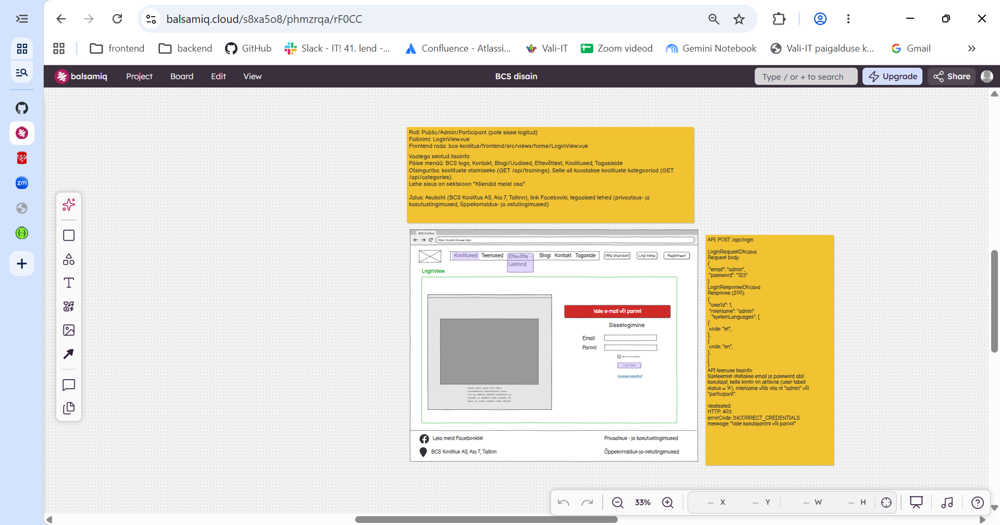

# Kasutaja sisselogimine

**Vaade:** `LoginView.vue`, route `/login`

**Roll:** Public/Admin/Participant (pole sisse logitud)

**Vaste mockupis:** "BCS disain" (Balsamiq Cloud), vaade "LoginView", lehekülg 1/1 (vt pilt `LoginView.png`)



> **Märkus:** mockupi "Vaate märkmete" väljal `Frontend rada` on kirjas failitee `bcs-koolitus/frontend/src/views/home/LoginView.vue`, mitte Vue router'i rada. Route `/login` on tuletatud wireframe'i brauseri aadressiribalt (`https://bcskoolitus.ee/login`). Faili asukoht (`views/home/` alamkaust) on toodud jaotises "Komponendid ja failistruktuur".

## Kasutajavoog

Kasutaja, kes pole sisse logitud, avab päises nupu "Logi sisse" kaudu sisselogimise vaate `/login`. Vaate vasakus pooles on pilt koos tutvustava tekstiga ja paremas pooles sisselogimisvorm. Kasutaja sisestab e-maili ja parooli ning vajutab nuppu "Logi sisse", mille peale saadetakse backendile `POST /api/login` päring. Kui andmed on õiged, salvestatakse vastuse andmed (`userId`, `roleName`, `systemLanguages`) ja kasutaja suunatakse avalehele (HomeView sisselogitud olekus). Kui andmed on valed, kuvatakse vormi kohal punane veateade.

Selle taski skoobist jäävad välja:
- **Päis ja jalus** (menüü: BCS logo, Koolitused, Teenused, Ettevõtte → Lektorid, Blogi, Kontakt, Tagaside; nupud "Võta ühendust", "Logi sisse", "Registreeri"; jaluses Facebooki link, aadress "BCS Koolitus AS, Aia 7, Tallinn" ja lingid õiguslikele lehtedele). Need on kogu rakenduse ühised elemendid (`App.vue`/`navigation/`), mitte LoginView osa.
- **Otsinguriba koos kategooriatega ja sektsioon "Kliendid meist osa"**. Need on nimetatud mockupi "Vaatega seotud lisainfos", kuid neid pole LoginView wireframe'il ning selle lehe API märkmetes pole `GET /api/trainings` ega `GET /api/categories` posti. Tõenäoliselt on see tekst kopeeritud HomeView märkmetest (vt `docs/mock-wireframe/markmed/home-view-markmed.md`). **Täpsusta mockupis.**
- **"Jäta mind meelde" ja "Unustasid salasõna?"**. Mockupil on need olemas, aga neil pole API märget ega käitumise kirjeldust (vt allpool).

## Kasutajaliidese elemendid

| Element | Tüüp | Kirjeldus/käitumine |
|---|---|---|
| Veateade (nt "Vale e-mail või parool") | Alert (punane, `alert-danger`) | Kuvatakse vormi kohal ainult siis, kui on viga (frontendi valideerimine või backendi 403). Muul ajal peidetud. |
| Pilt + tutvustav tekst | Staatiline pilt ja tekst (vasak veerg) | Dekoratiivne sisu. Mockup ei täpsusta pilti ega teksti, **täpsusta enne implementeerimist** (nt kasuta ajutist platsihoidjat). |
| "Sisselogimine" | Pealkiri | Vormi pealkiri. |
| Email | Tekstiväli (`type="email"`) | Kohustuslik. Seotakse väljaga `email`. |
| Parool | Paroolikast (`type="password"`) | Kohustuslik. Seotakse väljaga `password`. |
| "Jäta mind meelde" | Märkeruut | Valikuline. Mockup ei kirjelda käitumist ja backend seda välja ei võta. **Täpsusta enne implementeerimist:** kas lisada ainult visuaalselt, jätta praegu ära või salvestada andmed `sessionStorage` asemel `localStorage`'isse. |
| "Logi sisse" | Nupp (primaarne) | Käivitab valideerimise ja sisselogimise päringu. |
| "Unustasid salasõna?" | Link | Parooli taastamise vaadet ega API-t ei ole veel defineeritud. **Täpsusta enne implementeerimist** lingi sihtkoht (praegu võib jääda mitteaktiivseks lingiks). |

## Käitumine ja valideerimine

1. Vaate avanemisel on vorm tühi ja veateade peidetud. Vaade ei tee avanemisel ühtegi API kutset.
2. Kasutaja vajutab nuppu "Logi sisse":
   1. Kõigepealt peidetakse eelmine veateade (`errorMessage = ''`).
   2. **Frontendi valideerimine:** kui Email või Parool on tühi, kuvatakse veateade "Täida kõik väljad" ja API kutset ei tehta. Backend tühje välju eraldi ei valideeri (`LoginRequest`-il pole `@NotNull`/`@NotBlank` annotatsioone), seega peab kontroll olema frontendis.
   3. Kui väljad on täidetud, saadetakse `POST /api/login` päring body'ga `{ email, password }`.
3. **Edukas vastus (200):**
   1. `userId`, `roleName` ja `systemLanguages` salvestatakse `sessionStorage`'isse. Sama muster on projekti märkmete näites (`docs/mock-wireframe/kokkulepped/mock-wireframe-markmete-struktuur.md`). `systemLanguages` on massiiv, seega salvesta see `JSON.stringify` abil.
   2. Kasutaja suunatakse avalehele `HomeView` (`/`, `homeRoute`), mis kuvatakse sisselogitud olekus. Suunamine on kõigi rollide jaoks sama.
   3. Päises peaks pärast sisselogimist nuppude "Logi sisse" ja "Registreeri" asemel olema sisselogitud kasutaja olek. See on päise/navigatsiooni teema ega kuulu selle taski skoopi (vt HomeView märkmed: "sisselogitud kasutajale peidetud").
4. **Veavastus 403 `INCORRECT_CREDENTIALS`:** vormi kohal kuvatakse backendi vastuse `message` väli ("Vale email või parool"). Sisestatud e-mail jääb väljale alles.
5. **Muu viga** (nt backend ei vasta, 500): kuvatakse üldine veateade või suunatakse vealehele. Projektis pole veel `NavigationService.navigateToErrorView()` ega vealehte, seega **täpsusta enne implementeerimist**. Lihtsaim lahendus on kuvada samas alertis üldine tekst.

## API kutsed

### `POST /api/login`

**Backend task:** backend taski dokumenti pole (`docs/tasks/backend` kaust puudub). Kontrakt on tuletatud olemasolevast backend koodist.

**Backend allikas:** `LoginController.java`, `LoginService.java`, `controller/login/dto/LoginRequest.java`, `controller/login/dto/LoginResponse.java`, `controller/common/dto/SystemLanguageDto.java`, `Error.java`, `infrastructure/RestExceptionHandler.java`

`LoginRequest.java` — request body:
```json
{
  "email": "admin",
  "password": "123"
}
```

`LoginResponse.java` — response (200):
```json
{
  "userId": 1,
  "roleName": "admin",
  "systemLanguages": [
    {
      "code": "et"
    }
  ]
}
```

**API teenuse lisainfo:** süsteemist otsitakse e-maili ja parooli järgi kasutajat, kelle konto on aktiivne (`user.status = 'A'`). `roleName` võib olla nt `"admin"` või `"participant"`. `systemLanguages` on kasutaja süsteemikeelte loend (nt `"et"`, `"en"`).

**Veateated:**

Veavastuse kuju (`ApiError.java`):
```json
{
  "message": "Vale email või parool",
  "errorCode": "INCORRECT_CREDENTIALS"
}
```

| Status code | errorCode | message | Frontend käitumine |
|---|---|---|---|
| 403 | `INCORRECT_CREDENTIALS` | "Vale email või parool" | Kuva `message` punases alertis vormi kohal ja jää vaatesse. |
| muu (nt 500, võrguviga) | — | — | Kuva üldine veateade (täpsusta, vt "Käitumine ja valideerimine" p 5). |

> **Lahknevused koodi ja mockupi vahel** (tõeks on võetud kood):
> - Veateate tekst: koodis (`Error.java`) on `"Vale email või parool"`, mockupi API märkmetes `"Vale kasutajanimi või parool"` ja wireframe'i alertis "Vale e-mail või parool". Frontend kuvab backendi `message` välja, seega kehtib koodi tekst.
> - DTO nimed: mockupil on `LoginRequestDto.java`/`LoginResponseDto.java`, koodis `LoginRequest.java`/`LoginResponse.java`.
> - **`systemLanguages` ei ole backendis veel täidetud.** `UserMapper.toLoginResponse` ei mapi seda välja (`unmappedTargetPolicy = IGNORE`), seega tuleb see praegu vastuses tõenäoliselt `null`. Frontend peab sellega arvestama (nt `response.data.systemLanguages ?? []`).
> - `LoginController.java` `@ApiResponses` annotatsioon on praegu süntaktiliselt katki (sulud ja jutumärgid on puudu), mistõttu backend ei pruugi kompileeruda. Enne frontendi testimist tuleb see backendis parandada.

## Komponendid ja failistruktuur

Järgib `docs/structure/frontend-projekti-struktuur.md` ja `docs/structure/frontend-vue-komponendi-struktuur.md` konventsioone (Options API, `.then()/.catch()/.finally()` muster, `handle`-meetodid).

| Fail | Staatus | Kirjeldus |
|---|---|---|
| `frontend/src/views/home/LoginView.vue` | **Puudub**, luua | Vaate komponent. Asukoht `views/home/` tuleb mockupist. Praegu on kõik vaated otse `views/` all (`HomeView.vue`, `TestView.vue`), seega **täpsusta**, kas kasutada alamkausta. |
| `frontend/src/api-services/LoginService.js` | **Puudub**, luua (kaust `api-services/` samuti) | Meetod `sendPostLoginRequest(email, password)`, mis teeb `axios.post('/api/login', { email, password })`. Vite proxy suunab `/api` päringud `localhost:8080` peale. |
| `frontend/src/components/common/AlertDanger.vue` | **Puudub**, luua | Korduvkasutatav punane alert, prop `errorMessage` (ei renderda midagi, kui see on tühi). |
| `frontend/src/router/index.js` | Rada **puudub** | Lisa rada `{ path: '/login', name: 'loginRoute', component: LoginView }`. |
| `frontend/src/navigation/NavigationService.js` | **Puudub**, valikuline | Suunamiste abimeetodid (nt `navigateToHomeView()`), kui soovitakse projekti mustrit järgida. |

Päise "Logi sisse" nupp, mis viib `/login` rajale, kuulub päise/navigatsiooni taski juurde. Praegu on `App.vue`-s toorik-navbar ("Home", "Test").

## Vastuvõtu kriteeriumid

- [ ] Rada `/login` avab `LoginView.vue` vaate.
- [ ] Vaates on pealkiri "Sisselogimine", väljad Email ja Parool (parool on peidetud tähemärkidega), märkeruut "Jäta mind meelde", nupp "Logi sisse" ja link "Unustasid salasõna?" ning vasakul pilt koos tekstiga.
- [ ] Veateade on vaate avanemisel peidetud.
- [ ] Kui Email või Parool on tühi, kuvatakse "Logi sisse" vajutamisel veateade "Täida kõik väljad" ja API päringut ei tehta.
- [ ] Täidetud väljadega saadetakse `POST /api/login` päring body'ga `{ "email": ..., "password": ... }`.
- [ ] Eduka vastuse korral salvestatakse `userId`, `roleName` ja `systemLanguages` `sessionStorage`'isse ning kasutaja suunatakse avalehele `/` (HomeView sisselogitud olekus).
- [ ] Kui `systemLanguages` on vastuses `null`, ei teki frontendis viga.
- [ ] Vastuse 403 `INCORRECT_CREDENTIALS` korral kuvatakse vormi kohal punases alertis backendi `message` ("Vale email või parool") ja kasutaja jääb vaatesse.
- [ ] Uuel "Logi sisse" vajutusel eelmine veateade kaob.
- [ ] Ootamatu vea (nt backend maas) korral kuvatakse kasutajale arusaadav veateade ja rakendus ei jookse kokku.
- [ ] Kood järgib Options API struktuuri (`name`, `components`, `data`, `methods`) ja API päringu `.then()/.catch()/.finally()` mustrit.
