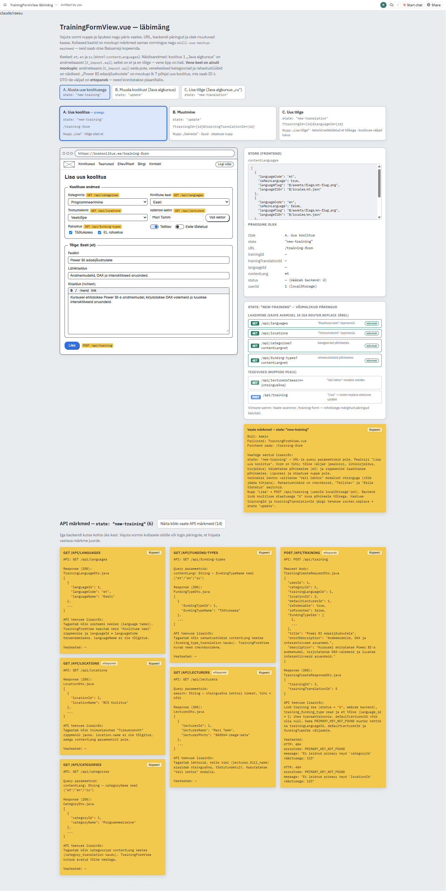
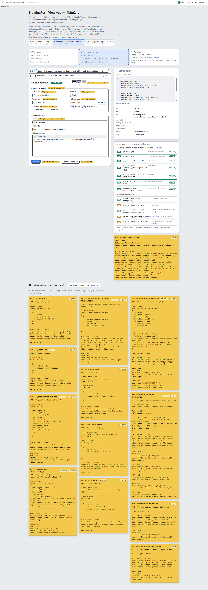
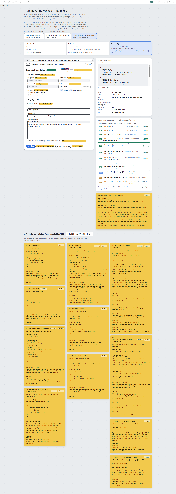

# Koolituse lisamise, muutmise ja tõlkimise vorm

**Vaade:** `TrainingFormView.vue`, route `/training-form` (nimi `trainingFormRoute`)

**Roll:** Admin

**Vaste mockupis:** interaktiivne läbimäng `docs/mock-wireframe/loo-mock-vaade/training-form-view-labimang.html` — kolm olekut, iga oleku kohta eraldi pilt ja märkmete fail:

| Olek (`state`) | URL | Pilt | Märkmed |
|---|---|---|---|
| `new-training` | `/training-form` | `TrainingFormView-state-new-training.png` | `training-form-view-state-new-training-markmed.md` |
| `update` | `/training-form?trainingId={id}&trainingTranslationId={id}` | `TrainingFormView-state-update.png` | `training-form-view-state-update-markmed.md` |
| `new-translation` | `/training-form?trainingId={id}&languageId={id}` | `TrainingFormView-state-new-translation.png` | `training-form-view-state-new-translation-markmed.md` |







Taustaks: skeemid ja otsused `docs/mock-wireframe/loo-mock-vaade/training-form-view-skeemid.md`, tööde järjekord `training-form-view-toode-jarjekord.md` (see task on **2. etapp**).

## Kasutajavoog

Admin avab `/training-form` ja täidab uue koolituse andmed koos põhikeele (et) tekstidega. Nupp "Lisa" loob koolituse mustandina ja vaade liigub `router.replace`-iga olekusse `update`, kus on näha staatuse märgis ja tõlgete lipukesed. Värvilisele lipule klikkides avaneb olemasolev tõlge, hallile lipule klikkides olek `new-translation`, kus põhikeele tekst on eeltäidetud ja admin tõlgib selle (käsitsi või "Tee AI tõlge" nupuga) ning salvestab "Lisa tõlge" nupuga. Salvestatud koolitust saab publitseerida või mustandisse tagasi liigutada (kinnituse modal).

Toimumiskorrad (`course` tabel, kuupäevad, hind) ei kuulu selle vaate skoopi — need on `CoursesView` / `CourseFormView` teema.

## Kasutajaliidese elemendid

| Element | Tüüp | Kirjeldus/käitumine |
|---|---|---|
| Pealkiri | Tekst | `new-training`: "Lisa uus koolitus"; `update`: "Muuda koolitust"; `new-translation`: "Lisa koolituse tõlge" |
| Staatuse märgis | Badge | "Mustand" (`status = "U"`) või "Publitseeritud" (`"P"`); ainult `update` ja `new-translation` |
| Tõlgete lipukesed | Nupud (`TranslationFlags`) | Store'i `contentLanguages` iga keele kohta lipp (`flag-icons`); tõlge olemas → värviline, puudub → hall; avatud tõlke lipp raamiga. Ainult `update` ja `new-translation` |
| Kategooria | Rippmenüü | `GET /api/categories`, kasutajaliidese keeles; kohustuslik |
| Koolituse keel | Rippmenüü | `GET /api/languages`; õppekeel (`trainingLanguageId`), mitte tõlke keel; kohustuslik |
| Toimumiskoht | Rippmenüü | `GET /api/locations`; kohustuslik |
| Vaikimisi lektor | Tekst + nupp "Vali lektor" | Avab lektori modali; võib jääda tühjaks ("— lektor puudub —") |
| Rahastus | Checkboxid | `GET /api/funding-types`, kasutajaliidese keeles; võib jääda tühjaks |
| Tellitav / Esile tõstetud | Switchid | `isOrderable` / `isPromoted` |
| "Tee AI tõlge" | Nupp + tooltip (`title`) | `new-translation` ja mitte-põhikeele `update`; tooltip: tõlge tehakse salvestatud põhikeele tekstist, mitte vormist, ja tulemus salvestub alles salvestusnupuga |
| Pealkiri, Lühikirjeldus | Tekstiväljad (max 255) | Kohustuslikud |
| Kirjeldus | Textarea | Kohustuslik; hiljem richtext editor (vt märkus) |
| "Lisa" / "Salvesta" / "Lisa tõlge" | Nupp | Vastavalt olekule (`new-training` / `update` / `new-translation`) |
| "Publitseeri" / "Liiguta mustandisse" | Nupp | Teineteist välistavad (status `U` / `P`); ainult `update` ja `new-translation`; avab kinnituse modali |
| Lektori modal | Modal (`LecturerSelectModal`) | Otsinguväli + "Otsi" (ka Enter), lektorite nimekiri, "Lektor puudub", "Sulge" |
| Kinnituse modalid | Modal (`ConfirmModal`) | Staatuse muutmine; AI tõlge salvestamata muudatuste korral |
| Teated | `AlertSuccess` / `AlertDanger` | Eduteated ja valideerimisvead |

Koolituse andmete sektsioon on tõlke sektsiooni kohal (vertikaalne paigutus), olekus `new-translation` on koolituse andmed kirjutuskaitstud.

## Käitumine ja valideerimine

0. **Rollikontroll.** Kui kasutaja pole admin (`sessionStorage` `roleName`), suunatakse ta `NotAuthorizedView`-le ja andmeid ei laadita.
1. **Oleku tuvastamine.** `beforeMount` ja `$route.query` jälgija (`watch`) kutsuvad `loadView()`, mis loeb query parameetrid ja määrab `state`: `trainingId` puudub → `new-training`; `trainingTranslationId` olemas → `update`; muidu → `new-translation`. Iga `router.replace` laadib andmed uuesti — erandeid pole.
2. **Laadimine.** Alati `GET /api/locations` ja `GET /api/languages`; pärast keelte saabumist oleku andmed (keelte nimekirja on vaja `languageId` ↔ `languageCode` teisenduseks):
   - Kõigis olekutes: kategooriad ja rahastustüübid kasutajaliidese keeles (`languageStore.contentLang`); keele vahetamisel navbaris laaditakse ainult need uuesti (`watch: contentLang`), vormi sisu jääb alles.
   - `new-training`: tühi vorm, tõlke keel = põhikeel (`mainLanguageCode`).
   - `update`: koolitus, tõlgete nimekiri, avatud tõlge.
   - `new-translation`: koolitus, tõlgete nimekiri → põhikeele tõlge (`isMainLanguage`) eeltäitmiseks.
3. **Valideerimine enne salvestust** (esimene viga kuvatakse `AlertDanger`-is, API kutset ei tehta): "Vali kategooria", "Vali koolituse keel", "Vali toimumiskoht" (mitte olekus `new-translation`), "Lisa pealkiri", "Lisa lühikirjeldus", "Lisa kirjeldus".
4. **"Lisa"** → `POST /api/training` (`userId` sessionStorage'ist) → eduteade → `router.replace({ trainingId, trainingTranslationId })` → olek `update`.
5. **"Salvesta"** → `PUT /api/training/{trainingId}` (koolituse väljad + avatud tõlge) → eduteade.
6. **Lipule klikk** → olemasolev tõlge: `router.replace({ trainingId, trainingTranslationId })`; puuduv: `router.replace({ trainingId, languageId })`. Kui store'i keelt pole `/api/languages` vastuses, kuvatakse viga.
7. **"Lisa tõlge"** → `POST /api/training/{trainingId}/training-translation` → eduteade → `router.replace` olekusse `update`.
8. **Staatus** → kinnituse modal → `PUT .../publish` või `.../unpublish` → `GET /api/training/{trainingId}` (uus staatus) → nupp vahetub.
9. **"Tee AI tõlge"** → kui vormi tekst erineb viimati laaditust/salvestatust, küsitakse kinnitust → `GET .../ai-translation?languageId=` (nupp on laadimise ajal keelatud, "Tõlgin…") → tulemus ainult vormi, andmebaasi ei salvestata.
10. **Vead.** AI tõlke teadaolevad vead (`503 AI_SERVICE_UNAVAILABLE`, `403 MAIN_LANGUAGE_NOT_TRANSLATABLE`, `404 MAIN_TRANSLATION_NOT_FOUND`) kuvatakse vormis `AlertDanger`-iga (backendi `message`), vormi sisu jääb alles. Muud API vead suunavad `ErrorView`-le; ülejäänud backendi veakoodide eraldi kuvamine lisatakse koos päris teenustega.

## API kutsed

Kõik kutsed on failides `frontend/src/api-services/`. **Mock-vastuseid kasutavad kõik uued kutsed, välja arvatud need, mille backend on valmis** (vt "Mock-vastused" allpool). Päris kutsele vahetatud: `GET /api/locations`, `GET /api/lecturers`.

| Teenus | Meetod `api-services`-is | Backend task | Etapp |
|---|---|---|---|
| `GET /api/languages` | `LanguageService.sendGetLanguagesRequest()` | `docs/tasks/backend/GET-api-languages.md` | 1 |
| `GET /api/categories?contentLang=` | `CategoryService.sendGetCategoriesRequest(contentLang)` | `GET-api-categories.md` | 1 |
| `GET /api/funding-types?contentLang=` | `FundingTypeService.sendGetFundingTypesRequest(contentLang)` | `GET-api-funding-types.md` | 1 |
| `GET /api/locations` | `LocationService.sendGetLocationsRequest()` | `GET-api-locations.md` | 1 |
| `GET /api/lecturers?search=` | `LecturerService.sendGetLecturersRequest(search)` | `GET-api-lecturers.md` | 1 |
| `POST /api/training` | `TrainingService.sendPostTrainingRequest(request)` | `POST-api-training.md` | 1 |
| `GET /api/training/{trainingId}` | `TrainingService.sendGetTrainingRequest(trainingId)` | `GET-api-training-trainingId.md` | 3 |
| `GET /api/training/{trainingId}/training-translations` | `TrainingService.sendGetTrainingTranslationsRequest(trainingId)` | `GET-api-training-trainingId-training-translations.md` | 3 |
| `GET /api/training-translation/{trainingTranslationId}` | `TrainingTranslationService.sendGetTrainingTranslationRequest(id)` | `GET-api-training-translation-trainingTranslationId.md` | 3 |
| `PUT /api/training/{trainingId}` | `TrainingService.sendPutTrainingRequest(trainingId, request)` | `PUT-api-training-trainingId.md` | 3 |
| `PUT /api/training/{trainingId}/publish` | `TrainingService.sendPutTrainingPublishRequest(trainingId)` | `PUT-api-training-trainingId-publish.md` | 3 |
| `PUT /api/training/{trainingId}/unpublish` | `TrainingService.sendPutTrainingUnpublishRequest(trainingId)` | `PUT-api-training-trainingId-unpublish.md` | 3 |
| `POST /api/training/{trainingId}/training-translation` | `TrainingService.sendPostTrainingTranslationRequest(trainingId, request)` | `POST-api-training-trainingId-training-translation.md` | 3 |
| `GET /api/training/{trainingId}/ai-translation?languageId=` | `TrainingService.sendGetAiTranslationRequest(trainingId, languageId)` | `GET-api-training-trainingId-ai-translation.md` | 3 |

Täpsed request/response JSON näidised ja DTO nimed on märkmete failides (vt tabel taski alguses) ja 1. etapi backend taskides — neid siin ei dubleerita. Olulisemad kujud:

### `POST /api/training`

`TrainingCreateRequestDto.java` — request body:
```json
{
  "userId": 1,
  "categoryId": 1,
  "trainingLanguageId": 1,
  "locationId": 2,
  "defaultLecturerId": 1,
  "isOrderable": true,
  "isPromoted": false,
  "fundingTypeIds": [1, 2],
  "title": "Power BI edasijõudnutele",
  "shortDescription": "Andmemudelid, DAX ja interaktiivsed aruanded.",
  "description": "Kursusel ehitatakse Power BI-s andmemudel, kirjutatakse DAX-valemeid ja luuakse interaktiivseid aruandeid."
}
```

`TrainingCreateResponseDto.java` — response (200):
```json
{
  "trainingId": 3,
  "trainingTranslationId": 5
}
```

### `GET /api/training/{trainingId}`

`TrainingDto.java` — response (200):
```json
{
  "trainingId": 1,
  "categoryId": 1,
  "trainingLanguageId": 1,
  "locationId": 1,
  "defaultLecturerId": 1,
  "defaultLecturerName": "Mari Tamm",
  "isOrderable": true,
  "isPromoted": true,
  "status": "P",
  "fundingTypeIds": [1]
}
```

### `PUT /api/training/{trainingId}`

`TrainingUpdateRequestDto.java` — request body: koolituse väljad nagu `POST` puhul (ilma `userId`-ta) + `trainingTranslationId` ja avatud tõlke `title`, `shortDescription`, `description`. Response (200): NONE.

### `GET /api/training/{trainingId}/training-translations`

`TrainingTranslationItemDto.java` — response (200):
```json
[
  {
    "trainingTranslationId": 1,
    "languageId": 1,
    "languageCode": "et",
    "isMainLanguage": true
  },
  ...
]
```

**Veateated:** frontend kuvab praegu kõigi vigade korral `ErrorView`. Backendi veakoodid (nt `PRIMARY_KEY_NOT_FOUND`, AI teenuse 403/404/503) on kirjas märkmetes ja backend taskides; nende eraldi kuvamine lisatakse koos päris teenustega.

## Mock-vastused

Et frontendi saaks testida enne backendi valmimist, on iga uue teenuse meetodis **päris axios-kutse välja kommenteeritud** ja selle all tagastatakse mock-vastus:

```js
sendGetCategoriesRequest(contentLang) {
  // MOCK — vaheta päris kutse vastu, kui teenus on valmis:
  // return axios.get('/api/categories', {
  //   params: {
  //     contentLang: contentLang,
  //   },
  // })
  return mockResponse(MockDatabase.getCategories(contentLang))
},
```

- `api-services/mock/mockResponse.js` — tagastab Promise'i samal kujul nagu axios (`{ data }`), seega vaate kood ei muutu, kui mock asendatakse.
- `api-services/mock/MockDatabase.js` — mälupõhine andmebaas (`3_import.sql` algandmed). POST/PUT mockid muudavad seda, nii et kogu voog (lisa → muuda → lisa tõlge → publitseeri) töötab. F5 taastab algandmed.

**Päris teenusele üleminek (iga teenuse kohta eraldi):**
1. Võta päris kutse kommentaarist välja ja kustuta `mockResponse` rida.
2. Kui failis pole enam ühtegi mocki: võta `import axios` kommentaarist välja ja eemalda `mockResponse` / `MockDatabase` impordid.
3. Kui ükski teenus mocki ei kasuta: kustuta kaust `api-services/mock/`.

## Komponendid ja failistruktuur

Kood on loodud (mustri eeskuju: Options API, `handle`-meetodid, props/emits `event-` eesliitega — vt `docs/structure/frontend-vue-komponendi-struktuur.md`):

| Fail | Sisu |
|---|---|
| `views/TrainingFormView.vue` | Vaade, olekud, API kutsed, valideerimine |
| `components/forms/TrainingDataForm.vue` | Koolituse andmete sektsioon |
| `components/forms/TrainingTranslationForm.vue` | Tõlke sektsioon + AI nupp |
| `components/forms/CategoriesDropdown.vue`, `LanguagesDropdown.vue`, `LocationsDropdown.vue` | Rippmenüüd (korduvkasutatavad, nt TrainingsView filtrites) |
| `components/forms/FundingTypesCheckbox.vue` | Rahastustüüpide checkboxid |
| `components/common/TranslationFlags.vue` | Tõlgete lipukesed |
| `components/common/AlertDanger.vue`, `AlertSuccess.vue` | Teated |
| `components/modals/BaseModal.vue`, `ConfirmModal.vue`, `LecturerSelectModal.vue` | Modalid |
| `stores/languageStore.js` | Pinia store: `contentLanguages` (`languageCode`, `isMainLanguage`, `languageFlag`), getter `mainLanguageCode` |
| `services/SessionStorageService.js` | `getUserId()`, `userIsAdmin()` |
| `services/NavigationService.js` | + `replaceTrainingFormView(query)`, `navigateToLoginView()`, `navigateToNotAuthorizedView()` |
| `router/index.js` | + rajad `/training-form` (`trainingFormRoute`) ja `/not-authorized` (`notAuthorizedRoute`) |
| `views/NotAuthorizedView.vue` | "Ligipääs keelatud" vaade (nupud "Logi sisse", "Avalehele") |
| `api-services/*Service.js`, `api-services/mock/` | API kutsed ja mockid (vt ülal) |

**Märkused (täpsusta enne lõplikku valmimist):**
- **Keeled store'is:** `et` ja `en` — samad mis andmebaasis. Vene keel on ainult mockupis ega ole store'is.
- **`userId`** loetakse `sessionStorage`'ist, sest `LoginView` salvestab selle sinna (plaanis oli mainitud localStorage).
- **Rollikontroll:** `beforeMount` kontrollib `SessionStorageService.userIsAdmin()`; mitte-admin suunatakse `NotAuthorizedView`-le (`/not-authorized`). Testimiseks on andmebaasis konto `admin` / `123`.
- **Kirjeldus** on tavaline `textarea`; richtext editor lisatakse eraldi.
- **Tooltip** on brauseri `title` atribuut (Bootstrapi tooltip vajaks JS initsialiseerimist).
- **Navigeerimismenüüs** linki vormile veel pole — ava otse `/training-form`.

## Vastuvõtu kriteeriumid

- [ ] Mitte-admin suunatakse `/not-authorized` vaatele
- [ ] `/training-form` avab oleku `new-training`, `?trainingId&trainingTranslationId` oleku `update`, `?trainingId&languageId` oleku `new-translation`
- [ ] Pealkiri, nupud, staatuse märgis ja lipukesed vastavad olekule (vt elementide tabel)
- [ ] Iga `router.replace` järel laaditakse andmed uuesti; brauseri "Tagasi" ei vii tagasi tühja lisamise vormi juurde
- [ ] Rippmenüüd laaditakse kasutajaliidese keeles ja uuenevad navbari keelevahetusel ilma vormi sisu kaotamata
- [ ] Valideerimine takistab puudulikku salvestust ja kuvab esimese vea
- [ ] "Lisa" loob koolituse ja liigub olekusse `update`; "Salvesta" salvestab koolituse ja avatud tõlke
- [ ] Hall lipp avab `new-translation` põhikeele tekstiga eeltäidetult; "Lisa tõlge" salvestab ja liigub olekusse `update`, lipp muutub värviliseks
- [ ] Olekus `new-translation` on koolituse andmed kirjutuskaitstud
- [ ] "Publitseeri" / "Liiguta mustandisse" küsib kinnitust ja vahetab staatuse
- [ ] Lektori modal otsib nime järgi ja lubab valida "Lektor puudub"
- [ ] "Tee AI tõlge" on nähtav ainult `new-translation` ja mitte-põhikeele `update` olekus, tooltip selgitab käitumist, salvestamata muudatuste korral küsitakse kinnitust, tulemus ei salvestu automaatselt
- [ ] AI teenuse 503/403/404 teadaolev viga kuvatakse vormis, sisestatud tekst ei kao
- [ ] Kogu voog töötab mock-vastustega; iga teenuse saab eraldi päris kutse vastu vahetada ilma vaate koodi muutmata
